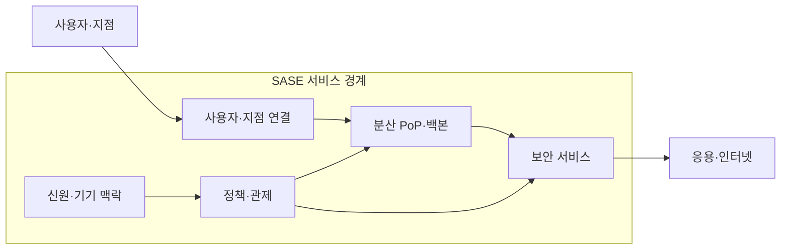
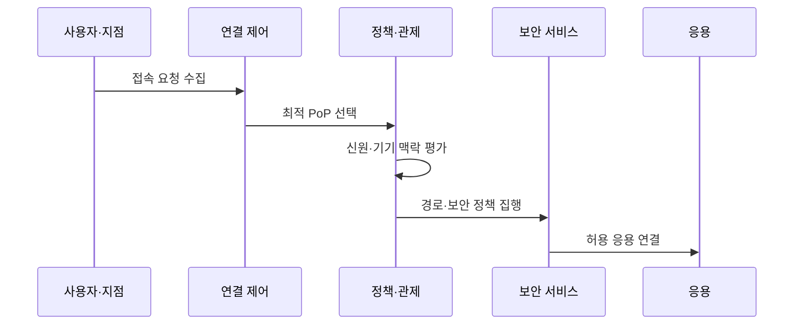

---
sidebar:
  order: 141
  label: "141. 보안 접근 서비스 경계(Secure Access Service Edge, SASE) 아키텍처"
  badge:
    text: "기출 · 70%"
    variant: note
title: 보안 접근 서비스 경계(Secure Access Service Edge, SASE) 아키텍처
date: "2026-07-27T23:59:59+09:00"
tags:
  - notes-security
weight: 141
extra:
  question_no: "141"
  source_status: "기출"
  source_history: "135회"
  priority: 70
  priority_note: "135회 기출이며 광역망·보안 통합 설계성이 큼"
---

## 미리 알고가기

- **보안 접근 서비스 경계(Secure Access Service Edge, SASE, 새시)**: 머리글자를 한 단어처럼 읽으며, 광역망 연결과 보안을 가까운 PoP에서 공통 정책으로 제공
- **소프트웨어 정의 광역망(Software-Defined Wide Area Network, SD-WAN)**: 애플리케이션 정책과 회선 상태에 따라 광역망의 통신 경로를 동적으로 선택하는 기술이다.
- **보안 서비스 경계(Security Service Edge, SSE)**: 웹·클라우드·애플리케이션 접근 보안을 클라우드 접속 거점에서 통합 제공하는 보안 서비스 구조이다.
- **보안 웹 게이트웨이(Secure Web Gateway, SWG)**: 웹 주소·콘텐츠·악성 행위를 검사하여 사용자 웹 접근을 통제하는 보안 서비스이다.
- **클라우드 접근 보안 중개(Cloud Access Security Broker, CASB)**: 사용자와 클라우드 서비스 사이에서 접근·데이터·위협·준수 정책을 집행하는 통제 지점이다.
- **제로 트러스트 네트워크 접근(Zero Trust Network Access, ZTNA)**: 신원과 기기 상태를 검증한 뒤 승인된 애플리케이션에만 연결하는 접근 기술이다.
- **서비스형 방화벽(Firewall as a Service, FWaaS)**: 네트워크 방화벽 기능을 분산된 클라우드 서비스로 제공하는 방식이다.
- **접속 거점(Point of Presence, PoP)**: 사용자와 가까운 위치에서 네트워크 연결과 보안 검사를 처리하는 공급자 거점이다.
- **신원 제공자(Identity Provider, IdP)**: 사용자를 인증하고 정책 판단에 필요한 신원·인증 정보를 서비스에 제공하는 주체이다.
- **백홀(Backhaul)**: 지점과 원격 사용자의 트래픽을 중앙 데이터센터로 우회시켜 처리하는 통신 경로이다.
- **백본(Backbone)**: 여러 접속 거점을 고속으로 연결하는 공급자의 핵심 네트워크이다.
- **공급자 종속(Vendor Lock-in)**: 정책·로그·구성이 특정 공급자 기술에 의존하여 다른 서비스로 이전하기 어려운 위험이다.

## Ⅰ. 개요

- 정의/개념: PoP에서 SD-WAN·SSE를 통합 제공
- 기존 한계: 중앙 경계 백홀은 지연·병목·정책 불일치 유발
- **배경/필요성**: 분산 사용자와 클라우드 트래픽을 중앙 데이터센터로 우회시키면 지연이 커지고 위치별 보안 정책이 불일치함

### 쉽게 이해하기 (학습용)

- 가까운 거점에서 사용자·기기 검증 후 응용 연결함

## Ⅱ. 특징

- SD-WAN 연결과 SSE 보안 기능을 클라우드에서 통합한다.
- 신원·기기·응용·데이터 문맥으로 접근 정책을 집행한다.
- 가까운 PoP에서 검사해 중앙 백홀 지연을 줄인다.

### 쉽게 이해하기 (학습용)

- 분산 거점이 같은 신원·데이터 기준 연결 검사함

## Ⅲ. 아키텍처 및 구성요소

| 설계 요소 | 설명 |
|:---|:---|
| 사용자·지점 연결 | 에이전트·SD-WAN으로 거점 접속 |
| 신원·기기 맥락 | 상태·위험을 정책 입력으로 제공 |
| 정책·관제 | 공통 정책·로그를 중앙 관리 |
| 보안 서비스 | SWG·CASB·ZTNA·FWaaS 검사 |
| 분산 PoP·백본 | 가까운 거점과 핵심망을 제공 |

### 쉽게 이해하기 (학습용)

- 가까운 거점에서 경로 선택과 보안 동시 적용함

## Ⅳ. 원리 및 절차 흐름도

| 절차 | 설명 |
|:---|:---|
| 접속 요청 수집 | 사용자·기기·응용 요청 확인 |
| 최적 PoP 선택 | 지연·가용성으로 접속 거점 결정 |
| 신원·기기 맥락 평가 | 신원·상태·데이터 위험 판정 |
| 경로·보안 정책 집행 | SD-WAN 경로와 SSE 검사 적용 |
| 허용 응용 연결 | 승인된 응용에 세션 생성 |

### 쉽게 이해하기 (학습용)

- 가까운 거점에서 맥락 평가 후 응용 연결함

## Ⅴ. 종류 및 비교

| 판단 기준 | SASE | SSE | 전통 경계형 |
|:---|:---|:---|:---|
| 적용 기준 | 분산 접속망·보안 동시 통합 | 연결망을 두고 보안만 통합 | 사용자·응용이 중앙망에 집중 |
| 핵심 특징 | SD-WAN 경로와 SSE 통합 | SWG·CASB·ZTNA 통합 | 데이터센터 경계 검사 |
| 한계 | PoP 장애·공급자 종속 | 회선 품질·경로 제어 공백 | 백홀 지연·정책 불일치 |

> 요약: 경로와 보안을 거점에 통합함
### 쉽게 이해하기 (학습용)

- SSE는 보안, SASE는 광역망 통합 구조임

## Ⅵ. 실무 사례

1. 재택 사용자의 **가까운 PoP에서 신원·기기 기반 앱 접근**
### 쉽게 이해하기 (학습용)

- 재택 사용자는 가까운 SASE PoP로 연결되고 사용자 신원·기기 상태·앱 정책을 통과한 트래픽만 업무 SaaS와 데이터센터로 전달된다.

## Ⅶ. 결론

- 분산 사용자와 클라우드의 경계 보안 한계를 극복하기 위해 위치·PoP 지연·신원·기기·앱·장애 우회를 검토하여, SD-WAN 경로와 SSE 정책을 SASE로 통합해야 한다.

### 쉽게 이해하기 (학습용)

- 사용 위치가 달라도 같은 신원·기기 기준으로 허용된 응용에만 연결함
