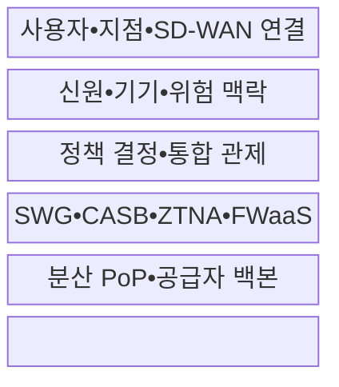
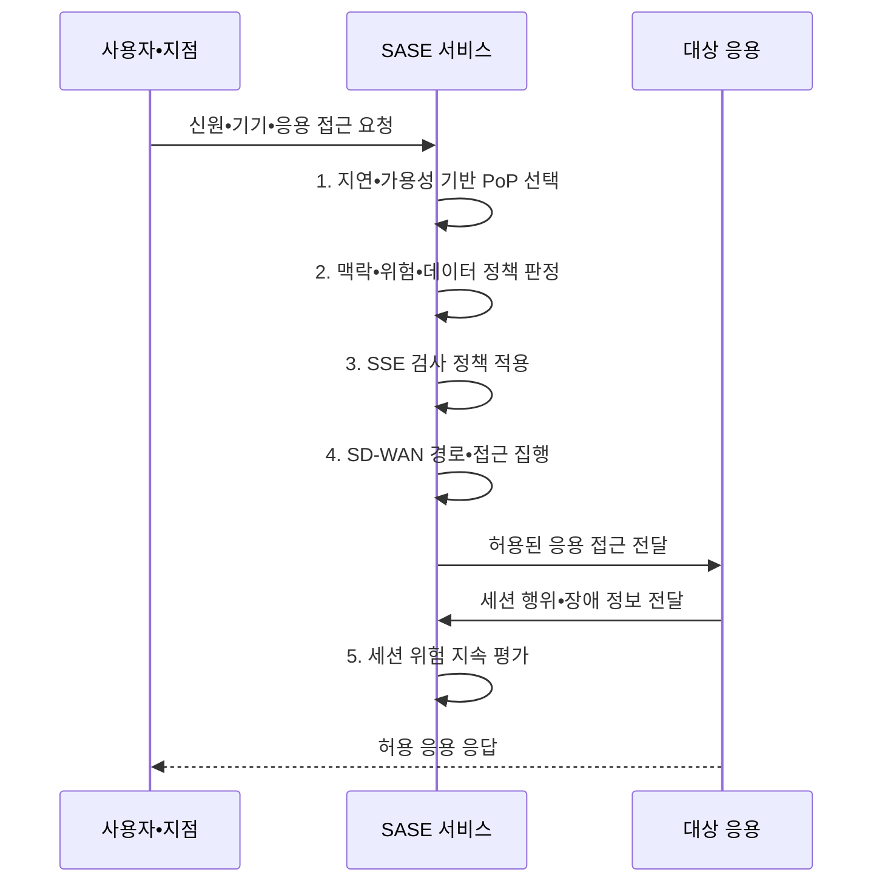

---
sidebar:
  order: 141
  label: "141. 보안 접근 서비스 경계(Secure Access Service Edge, SASE) 아키텍처"
  badge:
    text: "기출 • 70%"
    variant: note
title: 보안 접근 서비스 경계(Secure Access Service Edge, SASE) 아키텍처
date: "2026-08-04T14:32:30+09:00"
tags:
  - notes-security
weight: 141
extra:
  question_no: "141"
  source_status: "기출"
  source_history: "135회"
  priority: 70
  priority_note: "135회 기출이며 광역망•보안 통합 설계성이 큼"
---

## Ⅰ. 개요

핵심 용어

- **SASE(Secure Access Service Edge)**: 광역망 연결과 보안을 근접 거점에서 제공하는 구조이다.
- **PoP(Point of Presence)**: 사용자 가까이에서 연결•보안을 처리하는 접속 거점이다.
- **SD-WAN(Software-Defined Wide Area Network)**: 응용 정책으로 광역망 경로를 선택하는 기술이다.
- **SSE(Security Service Edge)**: 클라우드 접근 보안을 통합 제공하는 구조이다.

- 정의/개념: 분산 PoP에서 **SD-WAN 연결•SSE 보안** 을 통합 제공하는 구조
- 배경/필요성: 분산 사용자•클라우드 트래픽의 중앙 백홀로 **지연•회선 병목•정책 불일치 발생**

#### 한줄 요약

- 사용자 가까운 거점에서 신원•기기를 검증하고 허용 응용으로 바로 연결함

## Ⅱ. 특징

핵심 용어

- SD-WAN•SSE의 **클라우드 통합 제공**
- 신원•기기•응용•데이터의 **맥락 정책**
- 분산 PoP•백본의 **저지연•고가용 접속**

#### 한줄 요약

- 위치가 달라도 같은 신원•기기•데이터 기준으로 경로 선택과 보안 검사를 수행함

## Ⅲ. 구조 및 구성요소

핵심 용어

- **SWG(Secure Web Gateway)**: 웹 트래픽을 검사•통제하는 게이트웨이이다.
- **CASB(Cloud Access Security Broker)**: 클라우드 접근 보안 중개 기능이다.
- **ZTNA(Zero Trust Network Access)**: 신원•맥락 기반 응용 접근 기능이다.
- **FWaaS(Firewall as a Service)**: 클라우드형 방화벽 서비스이다.
- **IdP(Identity Provider)**: 사용자 신원을 인증•제공하는 체계이다.

| 구성요소 | 책임 |
|:---|:---|
| **사용자•지점•SD-WAN 연결** | 에이전트•터널•**경로 선택** |
| **신원•기기•위험 맥락** | IdP•상태•행위•**데이터 입력** |
| **정책 결정•통합 관제** | 공통 정책•로그•**위험 판정** |
| **SWG•CASB•ZTNA•FWaaS** | 웹•클라우드•앱•망 **검사** |
| **분산 PoP•공급자 백본** | 근접 처리•**거점 간 전송** |

#### 한줄 요약

- 가까운 거점에서 경로와 보안을 동시에 적용하고 정책•로그는 일관되게 관리함

## Ⅳ. 흐름도

핵심 용어

- **지속 위험 평가**: 세션 중 행위•기기 상태•장애 정보를 반영해 접근 결정을 계속 갱신하는 활동이다.
- **접근•검사•경로 흐름**: SASE가 PoP•SSE•SD-WAN을 연계하는 흐름이다.

**동작 원리**

- **1. 지연•가용성 기반 PoP 선택**: PoP 상태•부하를 반영한 대체 경로 계산
- **2. 맥락•위험•데이터 정책 판정**: 최소 응용•행위 허용
- **3. SSE 검사 정책 적용**: 웹•클라우드•응용•데이터 통제
- **4. SD-WAN 경로•접근 집행**: 정책 기반 경로와 세션 연결
- **5. 세션 위험 지속 평가**: 행위•장애•로그를 정책에 환류

#### 한줄 요약

- 가까운 거점을 고른 뒤 맥락에 맞는 응용만 연결하고 세션 중 위험도 계속 평가함

## Ⅴ. 종류 및 비교

핵심 용어

- **SASE 통합 범위**: SD-WAN 경로와 SSE 보안을 함께 통합한다.
- **SSE 통합 범위**: 기존 연결망 위에서 보안 기능만 통합한다.

| 접근 보안 구조 | SASE | SSE | 전통 경계형 |
|:---|:---|:---|:---|
| **적용 기준** | 분산 망•보안 **동시 통합** | 연결망 유지•**보안 통합** | 사용자•응용 **중앙 집중** |
| **핵심 특징** | **SD-WAN 경로•SSE 통합** | **SWG•CASB•ZTNA 통합** | **데이터센터 경계 검사** |
| **한계** | **PoP 장애•공급자 종속** | **회선•경로 제어 공백** | **백홀 지연•정책 불일치** |

> 요약: 연결과 보안의 통합 범위가 서로 다름

#### 한줄 요약

- SSE는 보안 기능, SASE는 광역망 경로까지 함께 통합한 구조임

## Ⅵ. 실무 고려사항 및 대책

핵심 용어

- **MEF(Metro Ethernet Forum)**: 네트워크 서비스 표준을 개발하는 산업 포럼이다.
- **MEF 117**: SASE 서비스 속성 표준이다.
- **MEF 118.1**: 제로 트러스트 서비스 프레임워크이다.
- **NIST(National Institute of Standards and Technology)**: 미국 국립표준기술연구소이다.
- **SP(Special Publication)**: NIST가 발행하는 특별간행물이다.
- **NIST SP 800-207**: 제로 트러스트 아키텍처 지침이다.
- **SLA(Service Level Agreement)**: 가용성•성능•책임 수준의 계약 기준이다.

| 문제 | 대책 | 효과 |
|:---|:---|:---|
| **SASE 서비스 속성** | **MEF 117 적용** | 기능•정책•연결 **SLA 명확화** |
| **제로 트러스트 서비스** | **MEF 118.1 적용** | 신원•**정책 집행점 정렬** |
| **자원 중심 접근** | **NIST SP 800-207 연계** | 위치 기반 **암묵 신뢰 제거** |

#### 한줄 요약

- 재택 사용자는 가까운 PoP로 연결되고 신원•기기 상태•앱 정책을 통과한 트래픽만 업무 자원에 전달된다.

## Ⅶ. 결론

핵심 용어

- **대체 PoP**: 거점 장애 시 세션을 이어가기 위한 다른 공급자 거점이다.
- **WAN(Wide Area Network)**: 넓은 지역을 연결하는 광역망이다.

- 분산 응용•저지연 필요 시 **SASE**, 기존 WAN 유지 시 **SSE** 선택

#### 한줄 요약

- 사용 위치가 달라도 같은 맥락 기준으로 허용 응용에만 연결하고 장애 시 대체 PoP로 전환해야 함
