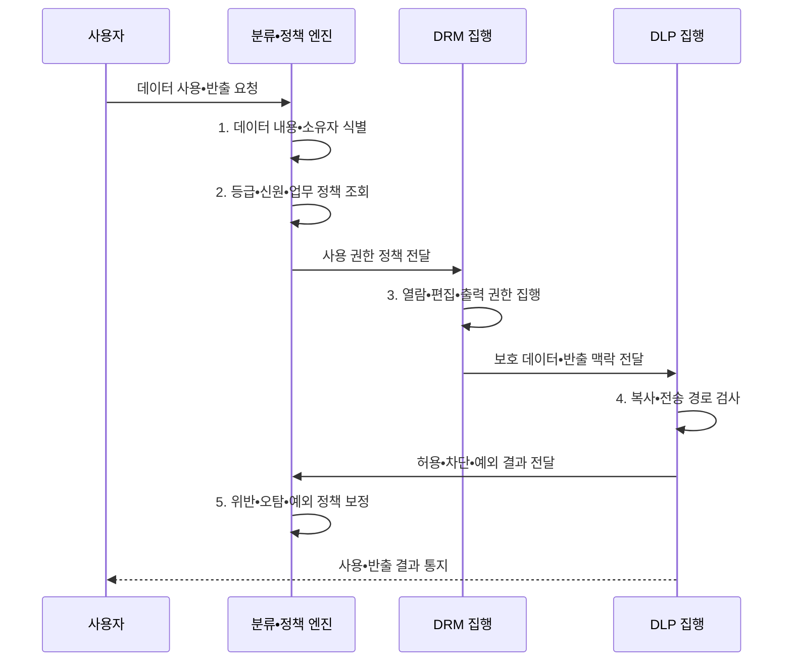

---
sidebar:
  order: 142
  label: "142. 데이터 보안 — DRM•DLP 비교 (DRM DLP)"
  badge:
    text: "기출 • 50%"
    variant: note
title: 데이터 보안 — DRM•DLP 비교 (DRM DLP)
date: "2026-08-05T01:50:48+09:00"
tags:
  - notes-security
weight: 142
extra:
  question_no: "142"
  source_status: "기출"
  source_history: "128회"
  priority: 50
  priority_note: "128회 기출이며 데이터 사용•이동 통제 비교가 명확함"
---

## Ⅰ. 개요

<details>
<summary>핵심 용어</summary>

- **DRM(Digital Rights Management)**: 배포 후 파일 사용 권한을 통제하는 기술이다.
- **DLP(Data Loss Prevention)**: 민감정보의 비인가 이동을 차단하는 통제이다.

</details>

- 정의/개념: DRM은 **사용 권한**, DLP는 **이동 경로** 통제
- 배경/필요성: 암호화만으로는 복호화가 허용된 이후의 **오용과 비인가 반출을 통제하기 어려움**

#### 한줄 요약

- DRM은 받은 문서의 사용법을 정하고 DLP는 문서가 이동하는 길을 검사함

## Ⅱ. 특징

<details>
<summary>핵심 용어</summary>

- **데이터 분류**: 업무 가치•민감도•법적 요구에 따라 보호 등급과 취급 규칙을 정하는 활동이다.
- **콘텐츠 검사**: 패턴•지문•등급•맥락을 분석해 데이터 민감 여부를 판정하는 기능이다.
- **사용•이동 정책**: DRM 권한과 DLP 경로를 공통 분류로 연결한다.

</details>

- DRM의 배포 후 **파일별 지속 사용 통제**
- DLP의 저장•사용•전송 **콘텐츠 기반 검사**
- 공통 분류•신원의 **권리•반출 정책 연계**

#### 한줄 요약

- 먼저 민감 데이터를 알아야 같은 등급과 업무 기준으로 사용•이동 정책을 적용할 수 있음

## Ⅲ. 구조 및 구성요소

<details>
<summary>핵심 용어</summary>

- **라이선스 서버**: DRM 문서의 권한과 키 사용을 결정하는 서버이다.
- **USB(Universal Serial Bus)**: 단말과 주변장치를 연결하는 범용 직렬 버스이다.
- **Endpoint DLP**: USB•인쇄•업로드 등 단말 이동을 통제한다.
- **API(Application Programming Interface) 검사**: 서비스 간 전송 데이터를 검사하는 통제이다.

</details>

```text
[데이터 발견•분류•표시]---[신원•정책•예외 관리]
             |                         |
[DRM 암호화•권리 집행]---[DLP 이동 경로 집행]---[감사•사고•정책 환류]
```

선의 의미: 공통 데이터 분류와 신원•정책을 기반으로 DRM 권리 집행, DLP 이동 통제, 감사•사고 관리가 결합되는 데이터 보안 구조를 나타낸다.

| 구성요소 | 책임 |
|:---|:---|
| **데이터 발견•분류•표시** | 내용•소유자•**등급 식별** |
| **신원•정책•예외 관리** | 주체•행위•기간•**업무 판정** |
| **DRM 암호화•권리 집행** | 라이선스 서버의 **사용 권한 제한** |
| **DLP 이동 경로 집행** | USB•메일•웹•API **검사** |
| **감사•사고•정책 환류** | 위반•예외•**오탐 개선** |

#### 한줄 요약

- 공통 분류•신원 정책에서 DRM 사용 권한과 DLP 반출 조건을 함께 도출함

## Ⅳ. 흐름도

<details>
<summary>핵심 용어</summary>

- **데이터 지문**: 내용 특징값을 대조해 같거나 유사한 민감정보를 찾는 기술이다.
- **사용•반출 집행**: DRM으로 사용을 제한하고 DLP로 이동을 검사한다.

</details>



**동작 원리**

- **1. 데이터 내용•소유자 식별**: 패턴•지문•메타정보 분석
- **2. 등급•신원•업무 정책 조회**: 주체•목적•기간•예외 판정
- **3. 열람•편집•출력 권한 집행**: 암호화•라이선스 적용
- **4. 복사•전송 경로 검사**: USB•메일•웹•API 통제
- **5. 위반•오탐•예외 정책 보정**: 집행 결과를 반영해 정책 개선

#### 한줄 요약

- 차단 건수보다 중요한 데이터가 어디서 어떤 업무로 이동했고 예외가 적절했는지 확인함

## Ⅴ. 종류 및 비교

<details>
<summary>핵심 용어</summary>

- **IRM(Information Rights Management)**: 기업 정보에 세분화된 권한을 적용하는 체계이다.
- **저장•전송 암호화(Data-at-rest/In-transit Encryption)**: 저장소와 통신 구간의 데이터를 암호문으로 보호해 탈취•도청 시 평문 노출을 막는다.

</details>

| 보호 구간 | 대표 통제 | 보호 범위•잔여 위험 |
|:---|:---|:---|
| **보관•전송** | **저장•전송 암호화** | 저장소 탈취•도청의 평문 노출을 막되 승인 사용자 오용은 별도 통제 |
| **배포 후 사용** | **DRM•IRM** | 열람•편집•복사 권한을 지속하되 촬영•라이선스 장애 대비 필요 |
| **이동•반출** | **DLP** | 메일•웹•USB 반출을 검사하되 오탐•암호화 가시성 관리 필요 |

> 요약: 사용•이동•보관 구간의 역할이 서로 다름

#### 한줄 요약

- 암호화는 운반 상자, DRM은 사용법, DLP는 이동 경로를 보호함

## Ⅵ. 실무 고려사항 및 대책

<details>
<summary>핵심 용어</summary>

- **W3C(World Wide Web Consortium)**: 웹 표준을 개발하는 국제 컨소시엄이다.
- **ODRL(Open Digital Rights Language)**: 디지털 권리 정책 표현 언어이다.
- **ISO(International Organization for Standardization)**: 국제표준화기구이다.
- **IEC(International Electrotechnical Commission)**: 국제전기기술위원회이다.
- **분류 기반 적용**: 디지털 권리관리(DRM), 데이터 유출방지(DLP), 응용 프로그래밍 인터페이스(Application Programming Interface, API) 전송 통제를 공통 분류 기준으로 운영한다.

</details>

| 문제 | 대책 | 효과 |
|:---|:---|:---|
| **권리 정책 상호운용** | **W3C ODRL 2.2 적용** | **허용•금지•의무** 표현 |
| **정보 등급 기준** | **ISO/IEC 27002 통제 5.12 적용** | DRM•DLP **공통 분류** |
| **데이터 유출 방지** | **ISO/IEC 27002 통제 8.12 적용** | **저장•사용•전송** 통제 |

#### 한줄 요약

- 기밀 문서는 DRM으로 사용을 제한하고 DLP가 메일•웹•API의 비인가 반출을 차단하되 업무 예외를 추적한다.

## Ⅶ. 결론

<details>
<summary>핵심 용어</summary>

- **사용•이동 통합 통제**: 파일 사용 권한과 조직 안팎의 전송 경로를 같은 분류•신원 기준으로 관리하는 원칙이다.
- **보호 방식 선택**: DRM은 사용 제한, DLP는 반출 차단에 적용한다.

</details>

- 배포 후 사용 제한은 **DRM**, 경로 반출 차단은 **DLP**, 둘 다면 병행

#### 한줄 요약

- 문서를 받은 뒤의 사용법과 조직 밖으로 나가는 경로를 함께 통제해야 함
