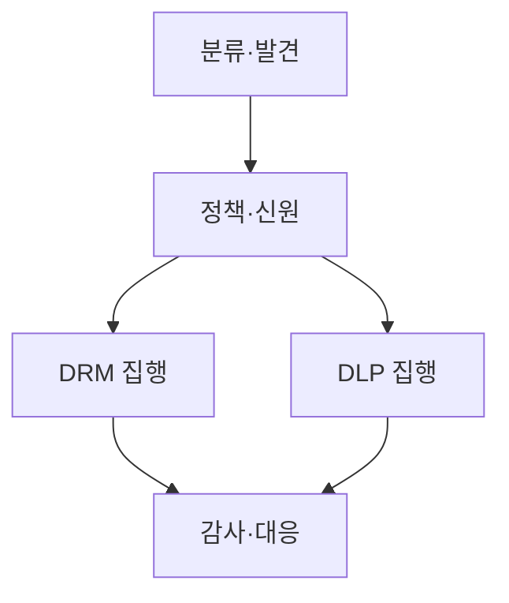
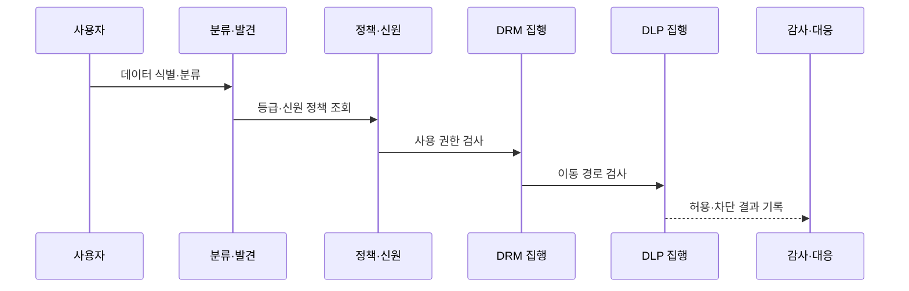

---
sidebar:
  order: 142
  label: "142. 데이터 보안 — DRM·DLP 비교 (DRM DLP)"
  badge:
    text: "기출 · 50%"
    variant: note
title: 데이터 보안 — DRM·DLP 비교 (DRM DLP)
date: "2026-07-27T23:59:59+09:00"
tags:
  - notes-security
weight: 142
extra:
  question_no: "142"
  source_status: "기출"
  source_history: "128회"
  priority: 50
  priority_note: "128회 기출이며 데이터 사용·이동 통제 비교가 명확함"
---

## 미리 알고가기

- **디지털 권리 관리(Digital Rights Management, DRM, 디알엠)**: 영문 머리글자를 딴 명칭으로, 암호화·라이선스로 파일의 열람·편집·출력 권한을 지속 통제
- **정보 권리 관리(Information Rights Management, IRM)**: 인포메이션 라이츠 매니지먼트, 아이알엠으로 읽으며, 각 영단어의 머리글자를 딴 표기이고 본문에서는 기업 문서에 DRM 방식의 사용 권한을 적용합니다.
- **데이터 유출 방지(Data Loss Prevention, DLP, 디엘피)**: 영문 머리글자를 딴 명칭으로, 민감정보를 식별해 저장·사용·전송 경로의 비인가 이동을 제한
- **데이터 분류(Data Classification)**: 데이터 클래시피케이션으로 읽으며, 정보의 부류를 나눈다는 영문 표기를 쓰고 본문에서는 업무 가치·민감도·법적 요구에 따라 보호 등급과 취급 규칙을 정합니다.
- **콘텐츠 검사(Content Inspection)**: 콘텐츠 인스펙션으로 읽으며, 내용물을 조사한다는 영문 표기를 쓰고 본문에서는 패턴·지문·등급·문맥으로 데이터의 민감 여부를 판정합니다.
- **라이선스 서버(License Server)**: 라이선스 서버로 읽으며, 사용 허가를 제공하는 서버라는 영문 표기를 쓰고 본문에서는 DRM 문서의 사용자·기기·행위·기간별 권한과 암호 키 사용을 결정합니다.
- **엔드포인트 DLP(Endpoint DLP)**: 엔드포인트 디엘피로 읽으며, 단말을 뜻하는 Endpoint와 DLP를 결합한 표기이고 본문에서는 이동식 저장장치·인쇄·클립보드·업로드를 통제합니다.
- **신원 제공자(Identity Provider, IdP)**: 아이덴티티 프로바이더, 아이디피로 읽으며, Identity의 Id와 Provider의 P를 결합한 표기이고 본문에서는 사용자를 인증해 DRM·DLP 정책에 신원 정보를 제공합니다.
- **범용 직렬 버스(Universal Serial Bus, USB)**: 유니버설 시리얼 버스, 유에스비로 읽으며, 각 영단어의 머리글자를 딴 표기이고 본문에서는 엔드포인트 DLP가 파일 복사를 통제하는 이동식 장치 경로입니다.
- **데이터 지문(Data Fingerprinting)**: 데이터 핑거프린팅으로 읽으며, 사람을 식별하는 지문에 빗댄 영문 표기를 쓰고 본문에서는 내용의 특징값으로 같거나 유사한 민감정보를 찾습니다.
- **응용 프로그램 인터페이스(Application Programming Interface, API)**: 애플리케이션 프로그래밍 인터페이스, 에이피아이로 읽으며, 각 영단어의 머리글자를 딴 표기이고 본문에서는 응용 사이의 대량 조회·반출 경로를 가리킵니다.
- **오탐(False Positive)**: 폴스 포지티브로 읽으며, 정상 행위를 잘못 양성으로 판정한다는 영문 표기를 쓰고 본문에서는 정상 업무를 유출로 잘못 차단한 결과를 뜻합니다.
- **평문(Plaintext)**: 플레인텍스트로 읽으며, 암호화되지 않은 원문이라는 영문 표기를 쓰고 본문에서는 저장·전송 중 노출을 방지해야 할 데이터 상태를 뜻합니다.

## Ⅰ. 개요

- 정의/개념: DRM은 사용, DLP는 이동을 통제
- 기존 한계: 저장·전송 암호화만으로 승인 후 사용·반출 통제 불가
- **배경/필요성**: 데이터 사용 권한과 이동 경로의 지속 통제

### 쉽게 이해하기 (학습용)

- DRM은 문서 사용을, DLP는 이동을 감시함

## Ⅱ. 특징

- DRM은 배포 후에도 파일별 사용 권한을 지속 집행한다.
- DLP는 민감정보를 식별해 비인가 이동 경로를 차단한다.
- 공통 데이터 분류가 DRM 권한과 DLP 반출 정책을 연결한다.

### 쉽게 이해하기 (학습용)

- 사용자 재작성 등 행위는 막기 어려움

## Ⅲ. 아키텍처 및 구성요소

| 설계 요소 | 설명 |
|:---|:---|
| 분류·발견 | 민감정보를 식별해 등급 표시 |
| 정책·신원 | 등급·신원별 보호 규칙 결정 |
| DRM 집행 | 파일 암호화·사용 권한 적용 |
| DLP 집행 | 데이터 이동 검사·차단 |
| 감사·대응 | 정책 위반 조사·예외 처리 |

### 쉽게 이해하기 (학습용)

- 먼저 민감 데이터를 알아야 문서 권한과 이동 차단을 같은 등급·업무 기준으로 적용할 수 있음

## Ⅳ. 원리 및 절차 흐름도

| 절차 | 설명 |
|:---|:---|
| 데이터 식별·분류 | 내용·위치로 민감 등급 결정 |
| 등급·신원 정책 조회 | 등급·사용자별 규칙 확인 |
| 사용 권한 검사 | DRM이 열람·편집·출력 판정 |
| 이동 경로 검사 | DLP가 복사·전송 경로 판정 |
| 허용·차단 결과 기록 | 두 집행 결과와 예외 보관 |
### 쉽게 이해하기 (학습용)

- 차단 건수보다 실제 중요 데이터가 어디서 어떤 업무로 움직이는지와 예외가 적절한지 봐야 함

## Ⅴ. 종류 및 비교

| 판단 기준 | DRM·IRM | DLP | 저장·전송 암호화 |
|:---|:---|:---|:---|
| 적용 기준 | 배포 후 열람·편집·출력 제한 | USB·메일·웹 반출 통제 | 저장소 탈취·통신 도청 대응 |
| 핵심 특징 | 파일 사용 권한 지속 통제 | 민감정보 이동 경로 검사 | 저장·전송 중 평문 노출 방지 |
| 한계 | 화면 촬영·라이선스 장애 | 암호화 데이터 누락·오탐 | 승인 사용자의 유출 행위 |

> 요약: 데이터 중심 보안을 상호 보완함
### 쉽게 이해하기 (학습용)

- 암호화는 운반 상자, DRM은 사용법, DLP는 경로 통제함

## Ⅵ. 실무 사례

1. 압축 파일에 송신자·목적지 정책 적용
2. 라이선스 장애용 복구 권한 운영
3. 지문·사용자 맥락으로 오탐 감소
4. API 대량 조회·반출 행위 감시

### 쉽게 이해하기 (학습용)

- 압축·암호화 파일은 송신자·목적지·업무 승인까지 확인함
- 라이선스 서버 장애 때 필요한 문서만 제한적으로 여는 복구 권한을 운영함
- 데이터 지문과 사용자·목적지 맥락을 결합해 정상 업무 오탐을 줄임
- 화면과 메일뿐 아니라 API로 대량 조회·반출하는 행위도 감시함

## Ⅶ. 결론

- 공통 분류로 DRM 사용·DLP 이동 통제

### 쉽게 이해하기 (학습용)

- 문서를 받은 뒤의 사용법과 문서가 밖으로 나가는 경로를 함께 통제해야 함
