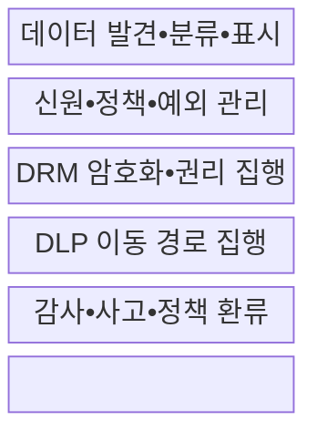
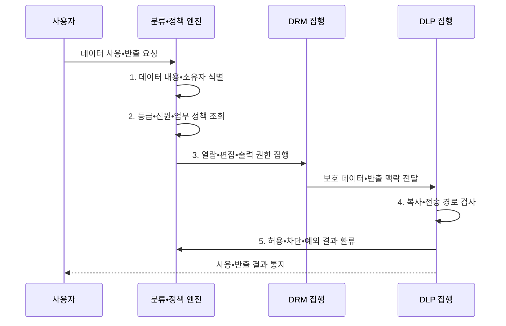

---
sidebar:
  order: 142
  label: "142. 데이터 보안 — DRM•DLP 비교 (DRM DLP)"
  badge:
    text: "기출 • 50%"
    variant: note
title: 데이터 보안 — DRM•DLP 비교 (DRM DLP)
date: "2026-08-03T08:48:47+09:00"
tags:
  - notes-security
weight: 142
extra:
  question_no: "142"
  source_status: "기출"
  source_history: "128회"
  priority: 50
  priority_note: "128회 기출이며 데이터 사용•이동 통제 비교가 명확함"
---

## Ⅰ. 개요

핵심 용어

- **디지털 권리관리(Digital Rights Management, DRM)•데이터 유출방지(Data Loss Prevention, DLP)**: 배포 후 파일 사용 권한을 통제하는 기술과 민감정보의 비인가 이동을 차단하는 통제이다.

- 정의/개념: DRM은 **사용 권한**, DLP는 **이동 경로** 통제
- 배경/필요성: 암호화만으로는 복호화가 허용된 이후의 **오용과 비인가 반출을 통제하기 어려움**

#### 한줄 요약

- DRM은 받은 문서의 사용법을 정하고 DLP는 문서가 이동하는 길을 검사함

## Ⅱ. 특징

핵심 용어

- **데이터 분류**: 업무 가치•민감도•법적 요구에 따라 보호 등급과 취급 규칙을 정하는 활동이다.
- **콘텐츠 검사**: 패턴•지문•등급•맥락을 분석해 데이터 민감 여부를 판정하는 기능이다.
- **사용•이동 정책**: 디지털 권리관리(Digital Rights Management, DRM)의 사용 권한과 데이터 유출방지(Data Loss Prevention, DLP)의 이동 경로를 공통 분류•신원 기준으로 연결한다.

- DRM의 배포 후 **파일별 지속 사용 통제**
- DLP의 저장•사용•전송 **콘텐츠 기반 검사**
- 공통 분류•신원의 **권리•반출 정책 연계**

#### 한줄 요약

- 먼저 민감 데이터를 알아야 같은 등급과 업무 기준으로 사용•이동 정책을 적용할 수 있음

## Ⅲ. 구조 및 구성요소

핵심 용어

- **라이선스 서버**: 디지털 권리관리(Digital Rights Management, DRM) 문서의 주체•기기•행위•기간별 권한과 키 사용을 결정하는 서버이다.
- **엔드포인트 데이터 유출방지(Endpoint Data Loss Prevention, Endpoint DLP)**: 범용 직렬 버스(Universal Serial Bus, USB)•인쇄•클립보드•업로드 등 단말의 민감정보 이동을 통제하는 기능이다.
- **응용 프로그래밍 인터페이스(Application Programming Interface, API) 검사**: 서비스 간 데이터 전송에서 민감정보와 목적•수신자를 확인하는 통제이다.

| 구성요소 | 책임 |
|:---|:---|
| **데이터 발견•분류•표시** | 내용•소유자•**등급 식별** |
| **신원•정책•예외 관리** | 주체•행위•기간•**업무 판정** |
| **DRM 암호화•권리 집행** | 라이선스 서버의 **사용 권한 제한** |
| **DLP 이동 경로 집행** | USB•메일•웹•API **검사** |
| **감사•사고•정책 환류** | 위반•예외•**오탐 개선** |

#### 한줄 요약

- 공통 분류•신원 정책에서 DRM 사용 권한과 DLP 반출 조건을 함께 도출함

## Ⅳ. 흐름도

핵심 용어

- **데이터 지문**: 내용 특징값을 대조해 같거나 유사한 민감정보를 찾는 기술이다.
- **사용•반출 집행**: 디지털 권리관리(Digital Rights Management, DRM)로 사용 권한을 제한하고 데이터 유출방지(Data Loss Prevention, DLP)로 이동 경로를 검사한다.
- **이동식 매체•서비스 경로**: 범용 직렬 버스(Universal Serial Bus, USB)와 응용 프로그래밍 인터페이스(Application Programming Interface, API)를 통한 복사•전송 경로이다.

**동작 원리**

- **1. 데이터 내용•소유자 식별**: 패턴•지문•메타정보 분석
- **2. 등급•신원•업무 정책 조회**: 주체•목적•기간•예외 판정
- **3. 열람•편집•출력 권한 집행**: 암호화•라이선스 적용
- **4. 복사•전송 경로 검사**: USB•메일•웹•API 통제
- **5. 허용•차단•예외 결과 환류**: 위반•오탐•정책 개선

#### 한줄 요약

- 차단 건수보다 중요한 데이터가 어디서 어떤 업무로 이동했고 예외가 적절했는지 확인함

## Ⅴ. 종류 및 비교

핵심 용어

- **정보 권리관리(Information Rights Management, IRM)**: 기업 정보에 사용자•기기•행위•기간별 권한을 적용하는 체계이다.
- **디지털 권리관리(Digital Rights Management, DRM)**: 배포한 파일의 열람•편집•복사•인쇄 권한을 지속 통제한다.
- **데이터 유출방지(Data Loss Prevention, DLP)**: 저장•사용•이동 중인 민감정보를 식별해 반출을 탐지•차단한다.
- **저장•전송 암호화(Data-at-rest/In-transit Encryption)**: 저장소와 통신 구간의 데이터를 암호문으로 보호해 탈취•도청 시 평문 노출을 막는다.

| 보호 구간 | 대표 통제 | 보호 범위•잔여 위험 |
|:---|:---|:---|
| **보관•전송** | **저장•전송 암호화** | 저장소 탈취•도청의 평문 노출을 막되 승인 사용자 오용은 별도 통제 |
| **배포 후 사용** | **디지털 권리관리(Digital Rights Management, DRM)•정보 권리관리(Information Rights Management, IRM)** | 열람•편집•복사 권한을 지속하되 촬영•라이선스 장애 대비 필요 |
| **이동•반출** | **데이터 유출방지(Data Loss Prevention, DLP)** | 메일•웹•범용 직렬 버스 반출을 검사하되 오탐•암호화 가시성 관리 필요 |

> 요약: 사용•이동•보관 구간의 역할이 서로 다름

#### 한줄 요약

- 암호화는 운반 상자, DRM은 사용법, DLP는 이동 경로를 보호함

## Ⅵ. 실무 고려사항 및 대책

핵심 용어

- **월드 와이드 웹 컨소시엄 개방형 디지털 권리 언어(World Wide Web Consortium Open Digital Rights Language, W3C ODRL) 2.2**: 디지털 자산의 허용•금지•의무•제약을 표현하는 권리 정책 정보 모델이다.
- **국제표준화기구•국제전기기술위원회(International Organization for Standardization/International Electrotechnical Commission, ISO/IEC) 27002 5.12•8.12**: 정보 분류와 데이터 유출 방지를 다루는 통제이다.
- **분류 기반 적용**: 디지털 권리관리(DRM), 데이터 유출방지(DLP), 응용 프로그래밍 인터페이스(Application Programming Interface, API) 전송 통제를 공통 분류 기준으로 운영한다.

| 문제 | 대책 | 효과 |
|:---|:---|:---|
| **권리 정책 상호운용** | **W3C ODRL 2.2 적용** | **허용•금지•의무** 표현 |
| **정보 등급 기준** | **ISO/IEC 27002 통제 5.12 적용** | DRM•DLP **공통 분류** |
| **데이터 유출 방지** | **ISO/IEC 27002 통제 8.12 적용** | **저장•사용•전송** 통제 |

#### 한줄 요약

- 기밀 문서는 DRM으로 사용을 제한하고 DLP가 메일•웹•API의 비인가 반출을 차단하되 업무 예외를 추적한다.

## Ⅶ. 결론

핵심 용어

- **사용•이동 통합 통제**: 파일 사용 권한과 조직 안팎의 전송 경로를 같은 분류•신원 기준으로 관리하는 원칙이다.
- **보호 방식 선택**: 디지털 권리관리(Digital Rights Management, DRM)는 사용 제한, 데이터 유출방지(Data Loss Prevention, DLP)는 반출 경로 차단에 적용한다.

- 배포 후 사용 제한은 **DRM**, 경로 반출 차단은 **DLP**, 둘 다면 병행

#### 한줄 요약

- 문서를 받은 뒤의 사용법과 조직 밖으로 나가는 경로를 함께 통제해야 함
