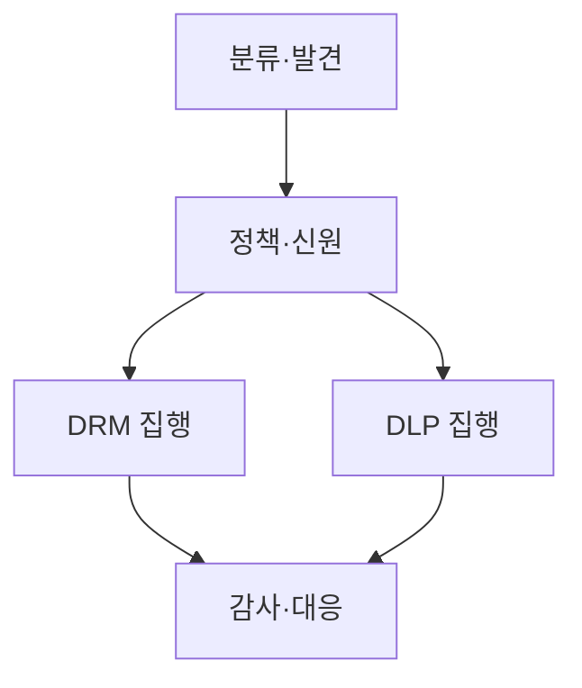
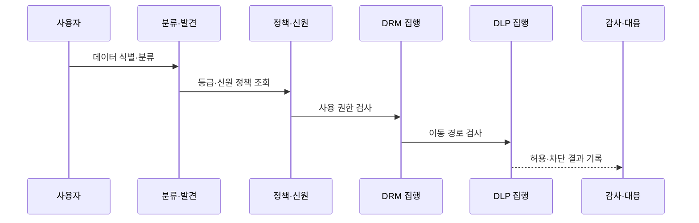

---
sidebar:
  order: 142
  label: "142. 데이터 보안 — DRM·DLP 비교 (DRM DLP)"
  badge:
    text: "기출 · 50%"
    variant: note
title: 데이터 보안 — DRM·DLP 비교 (DRM DLP)
date: "2026-07-27T23:59:59+09:00"
tags:
  - notes-security
weight: 142
extra:
  question_no: "142"
  source_status: "기출"
  source_history: "128회"
  priority: 50
  priority_note: "128회 기출이며 데이터 사용·이동 통제 비교가 명확함"
---

## 미리 알고가기

- **디지털 권리 관리(Digital Rights Management, DRM)**: 암호화와 라이선스를 이용하여 파일의 열람·편집·출력·사용기간 권한을 유통 후에도 통제하는 기술이다.
- **정보 권리 관리(Information Rights Management, IRM)**: 기업 문서와 정보에 사용자·기기·행위·기간별 사용 권한을 적용하는 권리 관리 체계이다.
- **데이터 유출 방지(Data Loss Prevention, DLP)**: 민감정보를 식별하여 저장·사용·전송 경로의 비인가 이동을 탐지하고 차단하는 통제이다.
- **데이터 분류(Data Classification)**: 업무 가치·민감도·법적 요구에 따라 데이터의 보호 등급과 취급 규칙을 정하는 활동이다.
- **콘텐츠 검사(Content Inspection)**: 패턴·지문·등급·업무 문맥을 분석하여 데이터의 민감 여부를 판정하는 기능이다.
- **라이선스 서버(License Server)**: DRM 문서의 사용자·기기·행위·기간별 권한과 복호화 키 사용을 결정하는 서버이다.
- **엔드포인트 DLP(Endpoint DLP)**: 단말에서 이동식 저장장치·인쇄·클립보드·업로드를 통한 민감정보 이동을 통제하는 기능이다.
- **신원 제공자(Identity Provider, IdP)**: 사용자를 인증하고 DRM·DLP 정책 판단에 필요한 신원 정보를 제공하는 주체이다.
- **범용 직렬 버스(Universal Serial Bus, USB)**: 주변장치 연결 규격이며 엔드포인트 DLP가 이동식 저장장치의 파일 복사를 통제하는 경로이다.
- **데이터 지문(Data Fingerprinting)**: 데이터 내용의 특징값을 생성·대조하여 같거나 유사한 민감정보를 찾는 기술이다.
- **응용 프로그램 인터페이스(Application Programming Interface, API)**: 애플리케이션 사이의 대량 데이터 조회·전송을 정해진 요청과 응답 형식으로 연결하는 접점이다.
- **오탐(False Positive)**: 정상 업무 행위를 정보 유출로 잘못 판정하여 경보하거나 차단한 결과이다.
- **평문(Plaintext)**: 암호화되지 않아 저장·전송 중 내용이 그대로 노출될 수 있는 데이터 상태이다.

## Ⅰ. 개요

- 정의/개념: DRM은 사용, DLP는 이동을 통제
- 기존 한계: 저장·전송 암호화만으로 승인 후 사용·반출 통제 불가
- **배경/필요성**: DLP만으로는 전달된 문서의 이후 사용을 통제하기 어렵고 DRM만으로는 암호화 전후의 비인가 이동 경로를 탐지하기 어려움

### 쉽게 이해하기 (학습용)

- DRM은 문서 사용을, DLP는 이동을 감시함

## Ⅱ. 특징

- DRM은 배포 후에도 파일별 사용 권한을 지속 집행한다.
- DLP는 민감정보를 식별해 비인가 이동 경로를 차단한다.
- 공통 데이터 분류가 DRM 권한과 DLP 반출 정책을 연결한다.

### 쉽게 이해하기 (학습용)

- 사용자 재작성 등 행위는 막기 어려움

## Ⅲ. 아키텍처 및 구성요소

| 설계 요소 | 설명 |
|:---|:---|
| 분류·발견 | 민감정보를 식별해 등급 표시 |
| 정책·신원 | 등급·신원별 보호 규칙 결정 |
| DRM 집행 | 파일 암호화·사용 권한 적용 |
| DLP 집행 | 데이터 이동 검사·차단 |
| 감사·대응 | 정책 위반 조사·예외 처리 |

### 쉽게 이해하기 (학습용)

- 먼저 민감 데이터를 알아야 문서 권한과 이동 차단을 같은 등급·업무 기준으로 적용할 수 있음

## Ⅳ. 원리 및 절차 흐름도

| 절차 | 설명 |
|:---|:---|
| 데이터 식별·분류 | 내용·위치로 민감 등급 결정 |
| 등급·신원 정책 조회 | 등급·사용자별 규칙 확인 |
| 사용 권한 검사 | DRM이 열람·편집·출력 판정 |
| 이동 경로 검사 | DLP가 복사·전송 경로 판정 |
| 허용·차단 결과 기록 | 두 집행 결과와 예외 보관 |
### 쉽게 이해하기 (학습용)

- 차단 건수보다 실제 중요 데이터가 어디서 어떤 업무로 움직이는지와 예외가 적절한지 봐야 함

## Ⅴ. 종류 및 비교

| 판단 기준 | DRM·IRM | DLP | 저장·전송 암호화 |
|:---|:---|:---|:---|
| 적용 기준 | 배포 후 열람·편집·출력 제한 | USB·메일·웹 반출 통제 | 저장소 탈취·통신 도청 대응 |
| 핵심 특징 | 파일 사용 권한 지속 통제 | 민감정보 이동 경로 검사 | 저장·전송 중 평문 노출 방지 |
| 한계 | 화면 촬영·라이선스 장애 | 암호화 데이터 누락·오탐 | 승인 사용자의 유출 행위 |

> 요약: 데이터 중심 보안을 상호 보완함
### 쉽게 이해하기 (학습용)

- 암호화는 운반 상자, DRM은 사용법, DLP는 경로 통제함

## Ⅵ. 실무 사례

1. 기밀 문서의 **DRM 사용 통제와 DLP 외부 전송 차단**

### 쉽게 이해하기 (학습용)

- 기밀 문서는 DRM으로 열람·편집·출력 권한을 제한하고 DLP가 메일·웹·API를 통한 승인되지 않은 외부 반출을 차단한다.

## Ⅶ. 결론

- 문서 전달 후 오용과 조직 밖 유출을 함께 막기 위해 데이터 분류·사용 권한·이동 경로·사용자 맥락·복구 절차를 검토하여, DRM과 DLP를 공통 정책으로 연계해야 한다.

### 쉽게 이해하기 (학습용)

- 문서를 받은 뒤의 사용법과 문서가 밖으로 나가는 경로를 함께 통제해야 함
