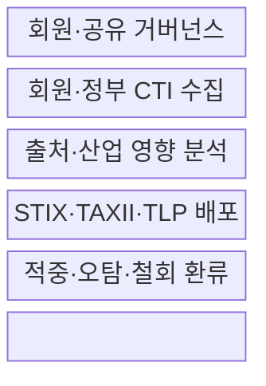
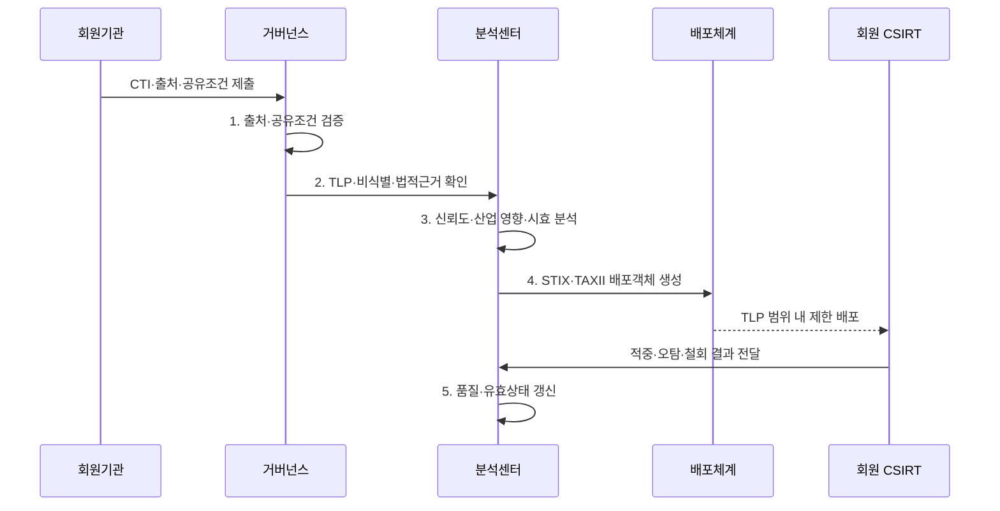

---
sidebar:
  order: 143
  label: "143. 보안 정보 공유 플랫폼 — ISAC (ISAC)"
  badge:
    text: "기출 · 50%"
    variant: note
title: 보안 정보 공유 플랫폼 — ISAC (ISAC)
date: "2026-07-31T11:24:58+09:00"
tags:
  - notes-security
weight: 143
extra:
  question_no: "143"
  source_status: "기출"
  source_history: "129회"
  priority: 50
  priority_note: "129회 기출이며 산업별 위협공유 운영이 독립적임"
---

## Ⅰ. 개요

핵심 용어

- **ISAC**: 특정 산업의 위협·취약점·사고 정보를 공동 분석해 회원에 공유하는 조직이다.
- **CTI**: 공격 주체·의도·행위·지표를 분석한 의사결정 정보이다.

- 정의/개념: 산업 위협정보를 **공동 수집·분석·제한 공유**하는 조직
- 배경/필요성: 단일 기관 관측 한계를 넘어 **공통 공격 조기경보**

### 쉽게 이해하기 (학습용)

- 한 기관의 공격 흔적을 산업 전체가 더 빨리 탐지·대응할 수 있는 지식으로 만듦

## Ⅱ. 특징

핵심 용어

- **회원 신뢰 모델**: 참여 자격·공유 범위·비밀 보호·책임을 회원 간 합의한 신뢰 구조이다.
- **TLP·비식별 공유**: 수신·재공유 범위를 표시하고 식별 요소를 제거해 정보 노출을 줄이는 방식이다.

- 회원 자격·책임·보호를 합의한 **회원 신뢰 모델**
- 비식별·맥락 보강을 통한 **정보 노출 방지·활용성 확보**
- TLP·필요 기반의 **수신자·재공유 제한**

### 쉽게 이해하기 (학습용)

- 많이 공유하기보다 신뢰할 수 있는 회원에게 필요한 범위와 책임을 붙여 공유함

## Ⅲ. 구조 및 구성요소

핵심 용어

- **IoC·TTP**: 침해 흔적을 식별하는 관측 증거와 위협 행위자의 목표·공격 방식·수행 절차이다.

| 구성요소 | 책임 |
|:---|:---|
| **회원·공유 거버넌스** | 가입·책임·기밀·**제재 규칙** |
| **회원·정부 CTI 수집** | 인증 채널·**표준 양식 접수** |
| **출처·산업 영향 분석** | 신뢰도·시효·**자산 맥락** |
| **STIX·TAXII·TLP 배포** | 구조·API·**재공유 범위** |
| **적중·오탐·철회 환류** | 정보 상태·**유효성 갱신** |

### 쉽게 이해하기 (학습용)

- 분석 허브가 회원 정보를 산업 맥락으로 보강해 제한 배포하고 현장 결과를 다시 반영함

## Ⅳ. 흐름도

핵심 용어

- **STIX·TAXII**: 위협 객체·관계를 표현하는 표준과 CTI를 RESTful API로 교환하는 프로토콜이다.

**동작 원리**

- **1. 출처·공유조건 검증**: 제공기관·근거·시점 확인
- **2. TLP·비식별·법적근거 확인**: 수신자·재공유·개인정보 검증
- **3. 신뢰도·산업 영향·시효 분석**: IoC·TTP·영향 자산 연결
- **4. STIX·TAXII 배포객체 생성**: 위협 객체와 관계를 표준화
- **5. 품질·유효상태 갱신**: 적중·오탐·철회로 점수·만료 반영

### 쉽게 이해하기 (학습용)

- 공유 후 적중·오탐·철회 결과까지 되돌려 정보의 신뢰도와 유효기간을 갱신함

## Ⅴ. 종류 및 비교

핵심 용어

- **CSIRT**: 조직 내부 사고를 분석·대응·복구하는 전담 조직이다.

| 위협정보 조직 | ISAC | 조직 CSIRT | 상용 CTI |
|:---|:---|:---|:---|
| **적용 기준** | 산업 공통 **공격·공급망** | 내부 사고 **격리·복구** | 외부 **정보·분석 보완** |
| **핵심 특징** | 회원 **공동 분석·경보** | 조직 내부 **직접 대응** | 사업자 **위협정보 제공** |
| **한계** | **참여 부족·정보 노출** | **산업 관측 범위 부족** | **자산 맥락·공급자 의존** |

> 요약: 공동체 분석, 내부 실행, 외부 정보의 역할이 다름

### 쉽게 이해하기 (학습용)

- ISAC은 산업 공동체이고 CSIRT는 조직 안에서 실제 사고를 처리하는 팀임

## Ⅵ. 실무 고려사항 및 대책

핵심 용어

- **정보통신기반 보호법 제16조**: 분야별 정보공유·분석센터의 구축·운영과 수행 업무 근거이다.
- **FIRST TLP 2.0**: 정보 수신자와 추가 공유 범위를 표시하는 규칙이다.

| 문제 | 대책 | 효과 |
|:---|:---|:---|
| **국내 ISAC 운영 근거** | **정보통신기반 보호법 제16조 준수** | 경보·분석·정보 제공의 **정당성** |
| **CTI 표현·자동 교환** | **OASIS STIX·TAXII 2.1 적용** | 의미·전송 **상호운용** |
| **공유 대상·재공유 범위** | **FIRST TLP 2.0 적용** | **민감정보 오용** 방지 |

### 쉽게 이해하기 (학습용)

- 랜섬웨어 해시·도메인·TTP를 비식별화해 제한 공유하고 회원의 탐지 결과로 정보 품질을 갱신한다.

## Ⅶ. 결론

핵심 용어

- **품질 환류**: 회원의 적중·오탐·철회 결과로 공유 정보의 신뢰도와 유효기간을 갱신하는 활동이다.

- 신뢰도·시효 충족 **CTI**만 TLP 범위에 배포, 식별 위험은 **비식별**

### 쉽게 이해하기 (학습용)

- 회원 신뢰와 정보 보호가 있어야 민감한 관측을 산업 공동 방어에 실제로 활용할 수 있음
