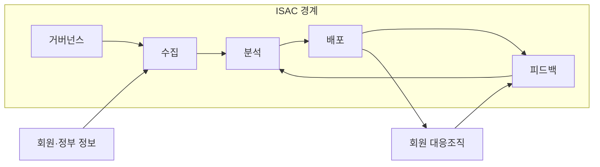
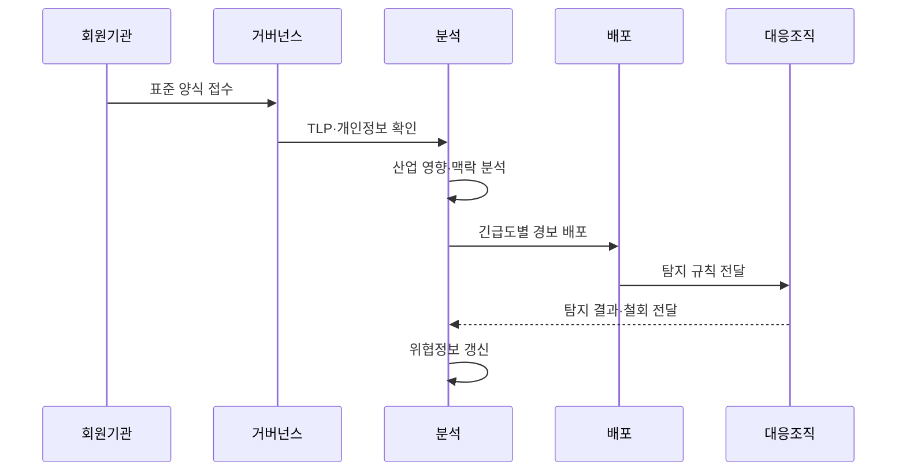

---
sidebar:
  order: 143
  label: "143. 보안 정보 공유 플랫폼 — ISAC (ISAC)"
  badge:
    text: "기출 · 50%"
    variant: note
title: 보안 정보 공유 플랫폼 — ISAC (ISAC)
date: "2026-07-27T23:59:59+09:00"
tags:
  - notes-security
weight: 143
extra:
  question_no: "143"
  source_status: "기출"
  source_history: "129회"
  priority: 50
  priority_note: "129회 기출이며 산업별 위협공유 운영이 독립적임"
---

## 미리 알고가기

- **정보공유분석센터(Information Sharing and Analysis Center, ISAC, 아이색)**: 머리글자를 한 단어처럼 읽으며, 특정 산업의 위협·취약점·사고 정보를 공동 분석해 회원에게 공유
- **회원 신뢰 모델(Member Trust Model)**: 참여 자격·공유 범위·비밀 보호·책임을 회원 간에 합의하여 민감한 위협정보 공유를 촉진하는 신뢰 구조이다.
- **트래픽 라이트 프로토콜(Traffic Light Protocol, TLP)**: 색상 등급으로 정보 수신자와 추가 공유 가능 범위를 제한하는 정보 취급 규칙이다.
- **침해 지표(Indicator of Compromise, IoC)**: 악성 IP 주소·도메인·파일 해시처럼 침해 탐지와 조사에 사용하는 관측 가능한 증거이다.
- **인터넷 프로토콜 주소(Internet Protocol Address, IP Address)**: 네트워크 통신의 출발지와 목적지를 식별하며 악성 통신 추적에 사용하는 주소이다.
- **전술·기법·절차(Tactics, Techniques and Procedures, TTP)**: 위협 행위자의 목표·공격 방식·수행 절차를 구조화한 행동 정보이다.
- **구조화된 위협정보 표현(Structured Threat Information Expression, STIX)**: 침해 지표·위협 행위자·공격 기법과 관계를 기계가 처리할 수 있게 표현하는 표준이다.
- **신뢰 자동화 위협정보 교환(Trusted Automated Exchange of Intelligence Information, TAXII)**: STIX 형식의 위협정보를 HTTPS 기반으로 자동 교환하는 프로토콜이다.
- **보안 하이퍼텍스트 전송 프로토콜(Hypertext Transfer Protocol Secure, HTTPS)**: HTTP 통신에 암호화와 서버 인증을 적용하여 TAXII 교환 구간을 보호하는 프로토콜이다.
- **구조화 정보표준 발전기구(Organization for the Advancement of Structured Information Standards, OASIS)**: STIX·TAXII를 포함한 정보 교환 표준을 개발·관리하는 국제 표준화 기구이다.
- **컴퓨터 보안 사고대응팀(Computer Security Incident Response Team, CSIRT)**: 조직 내부의 보안 사고를 분석·대응·복구하고 관련 정보를 공유하는 전담 조직이다.
- **사이버 위협 인텔리전스(Cyber Threat Intelligence, CTI)**: 공격 주체·의도·행위·지표를 분석하여 탐지와 대응 의사결정을 지원하는 정보이다.
- **익명·비식별 공유(Anonymous and De-identified Sharing)**: 제공기관·피해자·개인정보를 식별할 수 있는 요소를 제거하거나 대체하여 노출 위험을 줄이는 공유 방식이다.

## Ⅰ. 개요

- 정의/개념: 산업 위협정보를 공동 분석·공유
- 기존 한계: 단일 기관 관측만으로 산업 공통 공격 식별 곤란
- **배경/필요성**: 개별 기관의 제한된 관측 정보만으로는 산업 전반에 확산되는 공격 징후를 조기에 식별하기 어려움

### 쉽게 이해하기 (학습용)

- 공격 정보를 분석해 공동 방어에 활용함

## Ⅱ. 특징

- 회원 신뢰 모델이 참여 자격·책임·보호 범위를 정한다.
- 비식별·맥락 보강으로 공유 정보의 안전성과 활용도를 높인다.
- TLP가 정보별 수신자와 재공유 범위를 제한한다.

### 쉽게 이해하기 (학습용)

- 출처·신뢰도·제한 사항을 명확히 함

## Ⅲ. 아키텍처 및 구성요소

| 설계 요소 | 설명 |
|:---|:---|
| 거버넌스 | 가입·책임·공유 규칙 정의 |
| 수집 | 회원·정부 정보를 안전하게 접수 |
| 분석 | 출처·산업 영향·맥락 보강 |
| 배포 | TLP에 맞춰 경보 전달 |
| 피드백 | 탐지 결과·철회를 재분석 |

### 쉽게 이해하기 (학습용)

- 회원이 보낸 공격 정보를 분석 허브가 산업 맥락으로 보강해 제한된 대상에게 배포하고, 현장 탐지 결과를 다시 반영함

## Ⅳ. 원리 및 절차 흐름도

| 절차 | 설명 |
|:---|:---|
| 표준 양식 접수 | STIX 형식으로 위협정보 수집 |
| TLP·개인정보 확인 | 재공유 범위·비식별 여부 검증 |
| 산업 영향·맥락 분석 | IoC·TTP와 영향 자산 연결 |
| 긴급도별 경보 배포 | TAXII로 대상 회원에게 전달 |
| 탐지 규칙 전달 | IoC를 회원 탐지 체계에 적용 |
| 탐지 결과·철회 전달 | 오탐·만료 정보를 분석에 환류 |
| 위협정보 갱신 | 탐지 결과로 유효성·만료 상태 갱신 |
### 쉽게 이해하기 (학습용)

- 유효성·철회 정보를 공유에 반영함

## Ⅴ. 종류 및 비교

| 판단 기준 | ISAC | 조직 CSIRT | 상용 CTI |
|:---|:---|:---|:---|
| 적용 기준 | 산업 공통 공격·공급망 공유 | 내부 시스템 격리·복구 | 외부 정보·분석 인력 보완 |
| 핵심 특징 | 산업 회원의 공동 분석 | 조직 내부 사고 직접 대응 | 사업자가 위협정보 제공 |
| 한계 | 참여 부족·민감정보 노출 | 산업 공격정보 부족 | 자산 맥락 부족·공급자 의존 |

> 요약: 신뢰 기반 집단 보안 체계임
### 쉽게 이해하기 (학습용)

- ISAC은 공동체, CSIRT는 실행 조직임

## Ⅵ. 실무 사례

1. 금융권 랜섬웨어 **IoC·TTP 조기 공유**
### 쉽게 이해하기 (학습용)

- 한 금융기관은 랜섬웨어의 해시·도메인·공격 시점·TTP를 비식별화해 ISAC에 공유하고 회원사는 자사 로그에서 같은 공격을 조기 탐지한다.

## Ⅶ. 결론

- 개별 기관의 제한된 관측 범위를 극복하기 위해 정보 품질·피해 비식별·TLP·회원 신뢰·탐지 효과를 검토하여, 산업 공동 조기경보에 ISAC을 활용해야 한다.

### 쉽게 이해하기 (학습용)

- 한 기관의 관측을 산업 전체가 더 빨리 탐지하고 대응할 수 있는 집단 지식으로 만드는 조직임
