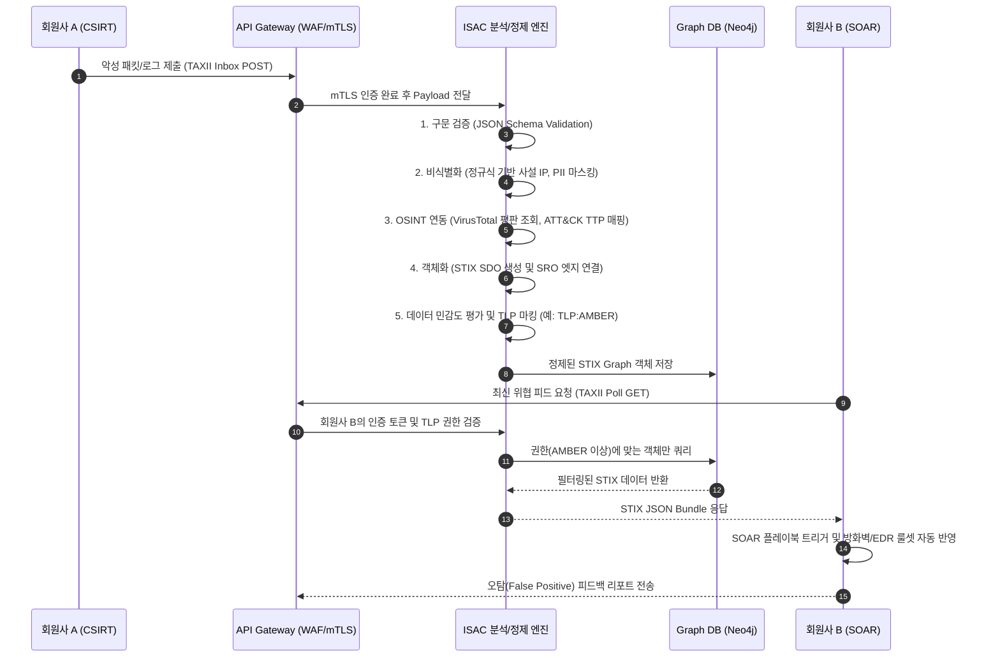

---
sidebar:
  order: 143
  label: "143. 보안 정보 공유 플랫폼 — ISAC (ISAC)"
  badge:
    text: "기출 • 50%"
    variant: note
title: 보안 정보 공유 플랫폼 — ISAC (ISAC)
date: "2026-08-13T22:48:00+09:00"
tags:
  - notes-security
weight: 143
extra:
  question_no: "143"
  source_status: "기출"
  source_history: "129회"
  priority: 50
  priority_note: "129회 기출이며 산업별 위협공유 운영이 독립적임"
---

## Ⅰ. 개요

- 정의: **ISAC(Information Sharing and Analysis Center, 정보공유분석센터)**는 특정 산업군(금융, 의료, 통신, 에너지 등) 내의 소속 기관들이 사이버 위협 인텔리전스(CTI), 침해 지표(IoC), 취약점 정보 및 전술·기술·절차(TTP)를 안전하고 신속하게 수집, 분석, 교환하도록 지원하는 산업 특화형 보안 협력 및 정보 공유 플랫폼이다.
- 배경 및 필요성:
  - **단일 조직 방어의 한계**: 고도화된 APT(Advanced Persistent Threat) 및 다단계 공급망 공격(Supply Chain Attack)은 개별 기업의 보안 관제 인프라(SIEM, EDR)만으로는 선제적 탐지와 방어가 불가능함.
  - **산업군 타겟형 공격의 증가**: 특정 산업군을 노리는 맞춤형 랜섬웨어(예: 의료망 랜섬웨어, 금융 SW 취약점 악용)와 국가 배후 해킹 그룹(State-sponsored Actor)의 등장으로 동일 산업 내 신속한 수평적 위협 전파 체계가 요구됨.
  - **프라이버시 및 신뢰성 보장**: 기업의 침해사고 정보가 외부로 무분별하게 유출될 경우 기업 신뢰도 하락과 주가 폭락, 2차 공격의 타겟이 될 수 있으므로, 익명성과 기밀성이 철저히 보장된 폐쇄형(Closed-trust) 정보 공유 네트워크가 필수적임.
- ISAC의 진화:
  - 1세대: 이메일, 문서 기반의 수동적 보안 권고문 공유.
  - 2세대: 중앙 집중형 DB 구축 및 웹 포털을 통한 위협 정보 조회.
  - 3세대: STIX/TAXII 등 국제 표준 기반의 기계 가독형(Machine-Readable) 인텔리전스 자동 교환 체계(SOAR 연동).

## Ⅱ. 특징

- **국제 표준 기반 자동화 연동 체계 (STIX/TAXII)**: 이기종 보안 장비 및 플랫폼 간에 위협 인텔리전스를 사람의 개입 없이 기계가 직접 파싱하고 공유할 수 있도록, OASIS 국제 표준인 STIX(Structured Threat Information eXpression) 데이터 모델과 TAXII(Trusted Automated eXchange of Intelligence Information) 전송 프로토콜을 전면 채택.
- **기밀성 제어 및 정보 유통 통제 (TLP 프로토콜)**: 미국 국토안보부(DHS) 산하 CISA 및 FIRST(Forum of Incident Response and Security Teams)에서 정의한 **신호등 프로토콜(TLP, Traffic Light Protocol)**을 데이터 객체 단위로 적용하여, 정보의 민감도에 따른 수신자 제한 및 재공유(Redistribution) 범위를 암호학적, 논리적으로 통제.
- **실전적 침해 지표(IoC) 및 TTP 중심의 분석**: 단순한 악성 IP나 해시값(Hash)의 공유를 넘어, 공격자의 의도와 방법론을 서술하는 MITRE ATT&CK 프레임워크 기반의 TTP(Tactics, Techniques, and Procedures)를 컨텍스트화하여 제공.
- **철저한 비식별화(De-identification) 및 데이터 정제**: 침해 사고 발생 기관을 유추할 수 있는 내부 IP 대역(RFC 1918), 임직원 이메일, 내부 호스트명, 민감한 비즈니스 데이터 등을 데이터 수집 단계에서 자동 마스킹(Data Sanitization)하여 익명성을 보장.
- **위협 정보 생명주기(Lifecycle) 및 평판 관리**: 수집된 IoC가 시간이 지남에 따라 오탐(False Positive)을 유발하거나 유효성을 잃는 것을 방지하기 위해 시간 기반의 만료 속성(Valid_Until)과 노후화 모델(Decay Model)을 적용. 적중/오탐 피드백 루프를 통한 신뢰도 점수(Confidence Score) 자동 보정.

## Ⅲ. 구조 및 구성요소

ISAC의 정보 공유 아키텍처는 데이터의 원천 수집부터 분석, 연관 관계 도출, 안전한 배포 및 연동에 이르기까지 MSA(Microservices Architecture) 기반의 다계층(Multi-tier)으로 구성된다.

### 1. 위협 인텔리전스 공유 아키텍처 (CTI Sharing Architecture)

| 계층 (Layer) | 주요 구성요소 및 기술스택 | 상세 기능 및 역할 |
|:---|:---|:---|
| **Data Collection Layer** | TAXII 2.1 Inbox Service, MISP REST API, Syslog/Webhook | 회원사 CSIRT, 유관기관(KISA, 경찰청), 상용 CTI 벤더로부터 침해 로그, 악성코드 샌드박스 결과, PCAP 트래픽, 스피어피싱 이메일 원문 수집 |
| **Processing & Enrichment Layer** | Data Sanitizer (Regex 기반), OSINT Integration, MITRE ATT&CK Mapper | 유입 데이터의 정규화 및 비식별화 수행. VirusTotal, Shodan, WHOIS 등 외부 API 연동을 통한 위협 컨텍스트(Context) 자동 보강 및 공격 그룹 매핑 |
| **Storage Layer** | Graph Database (Neo4j), NoSQL (MongoDB), STIX Repository | 수많은 인텔리전스 객체 간의 N:M 연관 관계를 직관적으로 검색하고 순회하기 위해 그래프 데이터베이스 활용 |
| **Distribution Layer** | TAXII 2.1 Collection Service, SOAR Integration API, TLP Enforcer | 수신 클라이언트의 인증 수준 및 인가된 TLP 권한에 따라 STIX 패키지를 동적 생성 및 필터링. 실시간 CTI 피드 구독(Pub/Sub) 및 Polling 지원 |

### 2. 핵심 표준 및 프로토콜 상세 (STIX / TAXII / TLP)

#### 가. STIX 2.1 (Structured Threat Information eXpression)
STIX는 위협의 식별, 분석, 대응에 필요한 정보를 구조화된 JSON 형태로 정의하는 언어이다. STIX 2.1은 노드에 해당하는 **SDO (STIX Domain Objects)**와 노드 간의 엣지에 해당하는 **SRO (STIX Relationship Objects)**로 구성된 그래프 데이터 모델이다.
- **주요 SDO**: `indicator` (침해 지표), `malware` (악성코드), `threat-actor` (위협 행위자), `campaign` (공격 캠페인), `vulnerability` (취약점)
- **주요 SRO**: `uses` (사용함), `indicates` (나타냄), `targets` (공격 대상)

**STIX 2.1 JSON 구조 예시 (Indicator 객체)**
```json
{
  "type": "indicator",
  "spec_version": "2.1",
  "id": "indicator--8e2e2d2b-17d4-4cbf-938f-98ee46b3cd3f",
  "created": "2026-08-17T00:00:00.000Z",
  "modified": "2026-08-17T00:00:00.000Z",
  "name": "Malicious C2 IP for Ransomware X",
  "description": "이 IP는 최근 금융권을 타겟으로 하는 랜섬웨어 X의 C2 서버로 확인됨.",
  "indicator_types": ["malicious-activity"],
  "pattern": "[ipv4-addr:value = '198.51.100.22']",
  "pattern_type": "stix",
  "valid_from": "2026-08-17T00:00:00Z",
  "valid_until": "2026-09-17T00:00:00Z",
  "object_marking_refs": ["marking-definition--34098fce-860f-48ae-8e50-ebd3cc5e41da"]
}
```
*(참고: `object_marking_refs` 필드를 통해 TLP 등급이나 Data Privacy 설정을 바인딩함)*

#### 나. TAXII 2.1 (Trusted Automated eXchange of Intelligence Information)
TAXII는 HTTPS 기반의 RESTful API를 사용하여 STIX 데이터를 안전하게 교환하는 애플리케이션 계층 프로토콜이다.
- **Discovery Service**: 클라이언트가 네트워크 내에서 통신 가능한 TAXII 서버 API Root URL을 탐색 (`GET /taxii2/`).
- **Collection Service**: 특정 주제(예: 금융권_랜섬웨어_지표)별 위협 정보 저장소. 클라이언트는 특정 컬렉션에 대해 데이터를 가져오거나(Poll, `GET /api1/collections/{id}/objects/`), 새로운 정보를 제출(Inbox, `POST /api1/collections/{id}/objects/`)할 수 있음.

#### 다. TLP (Traffic Light Protocol) v2.0
정보 공유 생태계에서 수신자가 해당 정보를 누구와 재공유할 수 있는지 직관적으로 명시하는 규칙.
- **TLP:RED**: [가장 제한적] 수신한 특정 개인이나 세션 참가자 외에는 절대 공유 불가 (예: 패치 전 제로데이 취약점, 진행 중인 심각한 침해사고).
- **TLP:AMBER**: [제한적 공유] 수신 조직 내부 및 보안 대응을 위해 필수적인 외부 파트너(예: 위탁 관제업체)까지만 공유 가능. (`TLP:AMBER+STRICT`는 조직 내부로만 제한)
- **TLP:GREEN**: [커뮤니티 내 공유] ISAC 회원사 등 제한된 커뮤니티 내부의 모든 참여자에게 공유 가능. 단, 퍼블릭 인터넷 노출 금지.
- **TLP:CLEAR**: [공개 가능] 누구나 접근 가능한 퍼블릭 웹, SNS 등에 공개 가능한 일반 정보 (구 TLP:WHITE).

## Ⅳ. 흐름도 및 동작 원리

ISAC 시스템 내에서 미가공 위협 데이터(Raw Data)가 수집되어 정제, 컨텍스트화 된 후 회원사의 EDR/SIEM에 연동되기까지의 엔드투엔드 파이프라인(End-to-End Pipeline)이다.



### 구체적 IoC 및 TTP 처리 로직 (Concrete Handling Logic)
1. **데이터 위생(Data Hygiene) 및 정규화**: `192.168.x.x` 등 내부 통신 IP가 오탐 피드로 삽입되는 것을 막기 위해 BGP Bogon List, RFC 1918 대역을 제외 필터링. 도메인명은 Punycode 디코딩 및 정규화 수행.
2. **연관성 분석 (Correlation)**: 새롭게 수집된 악성코드 해시값(SHA-256)이 기존 데이터베이스에 존재하는 APT38 해킹 그룹의 C2 인프라와 연결됨을 발견 시, 즉시 `Threat Actor(APT38) -[uses]-> Malware -[communicates-with]-> Indicator(C2)` 구조의 그래프 경로를 생성.
3. **TLP Enforcer 로직**: 회원사 B가 TAXII Poll 요청 시, ISAC 백엔드는 해당 기관의 인증 스코프(Role)를 확인. 객체의 `object_marking_refs`가 `TLP:RED`를 가리키고 있으나 요청자가 승인된 보안 관리자가 아닐 경우, 응답 Bundle에서 해당 객체를 조용히 제외(Silent Drop)하여 정보 유출 방지.

## Ⅴ. 종류 및 비교

정보 공유의 주체와 목적, 신뢰 경계(Trust Boundary)에 따라 다음과 같이 구분된다.

| 구분 | ISAC (산업별 정보공유분석센터) | CSIRT / CERT (침해사고대응팀) | Commercial CTI (상용 위협 인텔리전스) |
|:---|:---|:---|:---|
| **설립 목적 및 역할** | 특정 산업 섹터 전체의 공동 방어 및 보안 수준 상향 평준화, 양방향 공유 | 개별 조직 내부망 방어, 국가/공공 인프라 사고 조사 및 직접적인 사고 대응/복구 | 글로벌 규모의 텔레메트리 기반 위협 데이터 수집 및 유료 피드 판매 |
| **운영 주체 예시** | 금융보안원(금융ISAC), KISA(민간ISAC), 보건복지부(의료ISAC) | KrCERT/CC(국가), 기업 내부 보안팀 | Mandiant, CrowdStrike, Recorded Future |
| **공유 데이터 특징** | 회원사 간 발생한 **실제 산업 타겟팅 공격 지표**, 비식별화 처리된 침해 로그 | 자사 내부망에서 탐지된 Raw 로그 및 대응 내역 (공유 목적보다는 분석 목적) | 전 세계 허니팟, 봇넷, 다크웹 모니터링을 통한 범용적이고 광범위한 위협 데이터 |
| **신뢰 모델 및 거버넌스** | 엄격한 가입 심사(Vetting) 기반 폐쇄적 신뢰 그룹, 강력한 NDA(비밀유지협약) | 조직 내부의 상하 계층적 기밀 유지 정책 적용 | 서비스 수준 협약(SLA) 및 구매 계약 기반의 상업적 신뢰 |
| **주요 배포 방식** | TAXII 기반 Push/Pull, 월간 동향 보고서 | 내부 SOAR 및 티켓팅 시스템(Jira, ServiceNow) | API 기반 실시간 Data Stream 전송 |

## Ⅵ. 실무 고려사항 및 대책 (장애 대응 및 보안 대책)

ISAC 인프라는 대규모 위협 데이터가 실시간 교차하는 허브이므로, 가용성 보장과 데이터 기밀성 확보가 최우선 고려되어야 한다.

### 1. Alert Fatigue (경보 피로) 및 오탐(False Positive) 확산 방지
- **이슈**: 검증되지 않은 자동 공유 피드에 정상 서비스 IP(예: Google DNS, 클라우드 CDN, Windows Update 서버)가 포함될 경우, ISAC 회원사 전역에 걸쳐 정상 트래픽이 동시다발적으로 차단되는 장애(Blackout) 유발.
- **대응 아키텍처**: 
  - **화이트리스트 검증(Whitelist Checking)**: Alexa Top 1M, AWS/Azure IP 대역 등의 메타데이터와 대조하여 자동 제거.
  - **Decay Model(반감기 모델)** 적용: `Valid_From` 및 `Valid_Until`을 강제화하여, 동적 IP(DHCP) 등으로 할당된 C2 서버 지표가 7일 후에는 신뢰도 점수가 낮아져 방화벽 룰에서 자동 해제되도록 구성.
  - **Feedback Loop API**: 회원사의 오탐 리포팅이 특정 임계치를 초과하면, TAXII 서버가 해당 객체에 대해 자동으로 폐기(Revoke) 상태 업데이트를 Broadcast.

### 2. TAXII Server API 엔드포인트 보안
- **이슈**: API 엔드포인트 노출에 따른 크리덴셜 스터핑(Credential Stuffing), 분산 서비스 거부(DDoS), 또는 인가되지 않은 TLP 객체 무단 수집.
- **대응 아키텍처**:
  - 클라이언트-서버 간 강력한 **mTLS(Mutual TLS)** 인증을 통한 API 접근 통제. 일반적인 Bearer Token에 더해 클라이언트 인증서를 양방향으로 검증.
  - OAuth 2.0 및 OIDC 기반의 인증과 결합된 속성 기반 접근 제어(ABAC).
  - API Gateway 레벨에서의 엄격한 Rate Limiting (IP당, 기관당 초당 요청 수 제한) 적용으로 리소스 고갈 공격 방어.

### 3. STIX JSON Parsing 취약점 공격 방어
- **이슈**: 악의적인 공격자가 ISAC 시스템을 타겟으로, 심층적으로 중첩(Deeply Nested)된 STIX 객체나 비정상 크기의 JSON 페이로드를 TAXII Inbox로 제출하여 파서의 OOM(Out of Memory)이나 역직렬화(Deserialization) 취약점을 트리거.
- **대응 아키텍처**:
  - 수집 API 앞단에 **JSON Schema Validator**를 배치하여 규격에 맞지 않는 페이로드를 엣지에서 즉시 Drop (Fast Fail).
  - 파싱 시 최대 중첩 깊이(Max Depth) 제한 및 페이로드 크기 제한(예: Max 5MB).
  - 메모리 오버플로우를 방지하기 위해 컨테이너 샌드박스 환경 내에서 데이터 정제 워커(Worker)를 분리하여 비동기 메시지 큐(Kafka/RabbitMQ) 기반으로 처리.

### 4. 법적 컴플라이언스 및 개인정보 보호 (Privacy Compliance)
- **이슈**: 회원사가 제출한 패킷 덤프나 로그 내에 고객 주민등록번호, 계좌번호, 평문 패스워드 등 PII(Personally Identifiable Information)가 포함되어 타 회원사로 공유될 경우, 개인정보보호법(PIPL, GDPR 등) 중대 위반.
- **대응 아키텍처**:
  - 데이터 전송 전 송신 측 에이전트에서 1차 로컬 필터링(DLP 연동) 강제.
  - ISAC 수집단에서 NLP 및 정규표현식 기반의 PII 탐지 엔진을 통과시켜, 매칭되는 문자열을 자동 마스킹(Redaction, 예: `***-***-****`) 혹은 해시 처리 후 저장.

## Ⅶ. 결론

ISAC은 단순한 보안 정보 게시판이나 위협 데이터의 저장소가 아니라, 산업 생태계 전체의 집단 사이버 복원력(Collective Cyber Resilience)을 극대화하기 위한 **협력적 위협 인텔리전스 공유의 핵심 신경망**이다. 고도화된 타겟팅 공격에 선제 대응하기 위해서는 STIX/TAXII와 같은 국제 표준 기반의 기계 가독형 인텔리전스 교환과, TLP 프로토콜을 통한 정밀한 기밀성 통제가 필수적이다. 향후 ISAC 플랫폼은 단순 지표(IoC) 공유를 넘어, AI/ML 기술을 접목한 공격 그룹 TTP 자동 매핑, SOAR 플랫폼과의 원활한 실시간 양방향 연동(Auto-Remediation), 그리고 제로 트러스트(Zero Trust) 아키텍처와의 융합을 통해 선제적이고 능동적인 산업 보안 협력 체계로 발전해 나갈 것이다.
