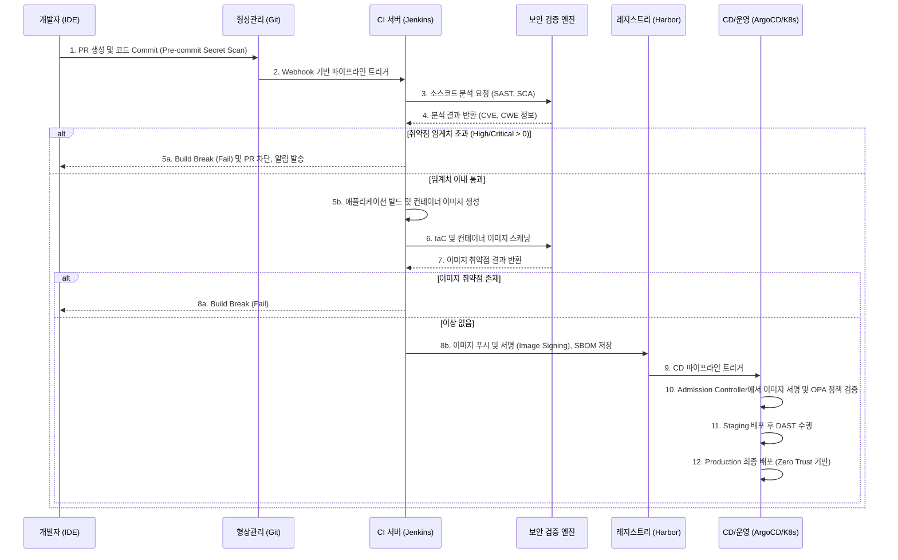

---
sidebar:
  order: 144
  label: "144. DevSecOps 보안 시프트 레프트 (DevSecOps Shift-Left)"
  badge:
    text: "기출 • 85%"
    variant: note
title: DevSecOps 보안 시프트 레프트 (DevSecOps Shift-Left)
date: "2026-08-13T22:50:00+09:00"
tags:
  - notes-security
weight: 144
extra:
  question_no: "144"
  source_status: "기출"
  source_history: "128회, 134회, 135회"
  priority: 85
  priority_note: "128•134•135회 반복된 개발보안 최우선 주제임"
---

## Ⅰ. 개요

- 정의: **DevSecOps 보안 시프트 레프트(Shift-Left)** 는 소프트웨어 개발 수명 주기(SDLC)의 초기 단계(좌측)부터 보안 통제, 테스트 및 정책 검증을 CI/CD 파이프라인에 내재화하여 결함 수정 비용을 최소화하고 배포 속도와 보안성을 동시에 달성하는 보안 자동화 아키텍처이다.
- 배경 및 필요성: 
  - **결함 수정 비용의 기하급수적 증가**: 운영(Production) 단계에서 발견된 취약점을 수정하는 비용은 설계 단계 대비 최대 100배 이상 소요된다.
  - **기존 후행 보안 검사의 한계**: 릴리스 직전에 수행되는 전통적인 모의해킹 및 보안 감사는 병목(Bottleneck) 현상을 유발하여 애자일(Agile) 및 지속적 배포(CD) 사상과 충돌한다.
  - **마이크로서비스 및 클라우드 네이티브 환경 확산**: 컨테이너, 쿠버네티스(K8s), Serverless 아키텍처의 도입으로 인프라가 코드로 관리(IaC)됨에 따라, 보안 정책 역시 코드 기반의 자동화된 검증이 필수적으로 요구된다.

## Ⅱ. 특징

1. **파이프라인 내재화 및 보안 자동화 (Security as Code)**
   - SAST(정적 분석), DAST(동적 분석), SCA(소프트웨어 구성 분석) 등의 보안 도구를 Jenkins, GitLab CI, GitHub Actions 등의 CI/CD 파이프라인에 Action/Step 단위로 통합하여 사람의 개입 없이 자동 실행한다.
2. **정책 기반의 코드형 보안 (Policy as Code, PaC)**
   - OPA(Open Policy Agent), Kyverno 등을 활용하여 인프라 및 애플리케이션의 보안 준수 여부를 선언적 코드(Rego 등)로 정의하고, 파이프라인 상에서 위반 시 빌드를 차단(Build Breaking)한다.
3. **지속적 피드백 루프 (Fast Feedback Loop)**
   - 개발자가 코드를 커밋(Commit)하거나 PR(Pull Request)을 생성하는 즉시 보안 취약점 여부를 알림(Slack, Jira 티켓 등)받아 컨텍스트 전환 없이 즉각적으로 조치할 수 있다.
4. **Shift-Left와 Shift-Right의 양립**
   - 개발 초기의 예방(Shift-Left)뿐만 아니라, 운영 환경에서의 위협 탐지 및 사고 대응(Shift-Right) 결과를 다시 개발 백로그로 환류하는 폐쇄 루프(Closed-Loop) 구조를 지향한다.

## Ⅲ. 구조 및 구성요소

DevSecOps 아키텍처는 코드 작성부터 운영 단계까지 단계별 통제 포인트를 갖는다.

| 구분 | 주요 구성요소 | 기술적 기능 및 메커니즘 | 관련 도구 및 표준 |
| :--- | :--- | :--- | :--- |
| **코드 단계** | Pre-commit Hook, IDE Plugin | 개발자 PC 환경에서 git commit 발생 전 코드 린팅(Linting) 및 하드코딩된 크레덴셜(Secret) 탐지 (ex. `trufflehog`, `git-secrets`). | SonarLint, Git Hooks |
| **빌드/통합 단계** | SAST, SCA | 형상관리 서버(Git)에 코드 푸시 시, 소스코드의 시큐어코딩 위반 여부(SAST) 및 오픈소스 라이브러리의 CVE 취약점(SCA)을 정적 분석. | SonarQube, Checkmarx, Snyk |
| **인프라/컨테이너 단계** | Container Scanning, IaC Scanning | Dockerfile의 베이스 이미지 취약점, K8s 매니페스트 및 Terraform 코드의 구성 오류(Misconfiguration) 스캐닝. | Trivy, Checkov, KICS |
| **테스트 단계** | DAST, IAST | 스테이징(Staging) 환경에 배포된 애플리케이션을 대상으로 HTTP/S 프로토콜 기반의 퍼징(Fuzzing) 및 페이로드 삽입(SQLi, XSS 등) 공격 모의. | OWASP ZAP, Burp Suite Enterprise |
| **배포 단계** | SBOM, Image Signing | 무결성 검증을 위해 SPDX/CycloneDX 포맷의 SBOM(소프트웨어 자재명세서)을 생성하고, 컨테이너 이미지에 서명(Cosign 등)을 수행하여 Admission Controller에서 검증. | Syft, Sigstore(Cosign), OPA |

## Ⅳ. 흐름도

CI/CD 파이프라인에서 보안 게이트(Security Gate)를 통과하지 못하면 Fail-Fast 원칙에 따라 파이프라인이 중단된다.

### 상세 에러 핸들링 및 빌드 통제 로직
- **Quality Gate (품질 게이트)**: CI 파이프라인 스크립트(`Jenkinsfile` 또는 `.gitlab-ci.yml`) 내부에 보안 스캐너의 API를 호출하여, 반환된 JSON 결과에서 `severity == 'CRITICAL'`인 항목의 개수가 설정된 허용치(Threshold)를 초과하면 `exit 1`을 발생시켜 Job을 강제 종료시킨다.
- **예외 처리(Exception Handling)**: 오탐(False Positive)으로 판명된 경우, 개발자는 `.snyk` 또는 `sonar-project.properties` 등 설정 파일에 명시적인 `ignore` 룰을 추가하거나 보안팀의 승인을 통해 예외(Waiver) 처리를 적용하여 파이프라인을 재개할 수 있다.

## Ⅴ. 종류 및 비교

DevSecOps의 보안 접근법은 적용 시점과 대상에 따라 세 가지로 분류할 수 있다.

| 비교 항목 | Shift-Left | Shift-Right | Shield-Right (Runtime Security) |
| :--- | :--- | :--- | :--- |
| **주요 목적** | 결함의 조기 발견 및 수정, 취약점 유입 원천 차단 | 운영 환경의 실사용 데이터 기반 위협 탐지 및 피드백 | 실행 환경의 제로데이 공격 및 이상행위 즉각 차단 |
| **수행 시점** | Plan, Code, Build, Test (CI 단계) | Release, Deploy, Operate (CD 및 운영 단계) | Operate 단계 (런타임) |
| **주요 도구/기법** | SAST, SCA, IDE Plugin, IaC Scan, Pre-commit Hook | DAST, Chaos Engineering, Pen-Testing, Observability | RASP, WAF, EDR/XDR, CWP (Cloud Workload Protection) |
| **담당/주체** | 개발자(Dev), 빌드 엔지니어 | QA, 보안팀(Sec), SRE | 보안 운영팀(SecOps), 관제 센터(SOC) |
| **한계점** | 런타임 환경의 복잡한 비즈니스 로직 연계 취약점(Privilege Escalation 등) 탐지 불가 | 취약점 발견 시점에는 이미 배포가 완료되어 롤백 및 수정 비용 높음 | 애플리케이션 성능 저하 가능성, 에이전트 관리의 오버헤드 |

## Ⅵ. 실무 고려사항 및 대책

1. **오탐(False Positive)으로 인한 피로도 및 배포 지연**
   - **문제점**: 무분별한 보안 도구 도입은 방대한 양의 오탐을 발생시켜, 개발팀의 "알람 피로(Alert Fatigue)"를 유발하고 CI/CD 파이프라인의 핵심인 '속도'를 저해한다.
   - **대책**: 초기 도입 시에는 **Audit Mode(모니터링 전용)** 로 운영하여 데이터를 수집하고, 이후 베이스라인을 설정하여 신규 유입되는 크리티컬(Critical/High) 취약점에 대해서만 Build Breaker를 활성화(Enforcing Mode)하는 점진적 튜닝(Tuning)이 필수적이다.
2. **시크릿(Secret) 하드코딩 방지 누락**
   - **문제점**: 소스코드나 IaC 파일에 AWS Access Key, DB 패스워드 등이 하드코딩되어 Git Repository에 푸시되면, 즉각적인 정보 유출 사고로 이어진다.
   - **대책**: 개발 환경에서 `git-secrets` 또는 `trufflehog`를 Pre-commit Hook으로 강제화하고, CI 파이프라인 최상단에 Secret Scanning 단계를 배치한다. 근본적으로는 HashiCorp Vault, AWS Secrets Manager 등의 외부 키 관리 시스템(KMS)으로 시크릿을 분리해야 한다.
3. **소프트웨어 공급망 보안 (Supply Chain Security)**
   - **문제점**: Log4j 사태와 같이 신뢰할 수 없는 외부 오픈소스 패키지의 취약점이 내부 시스템으로 전이될 위험성이 커지고 있다.
   - **대책**: 빌드 파이프라인에서 생성된 **SBOM(CycloneDX 등)** 을 중앙 형상관리 시스템(Dependency-Track 등)에 연동하여 자산의 가시성을 확보하고, 서명되지 않은 이미지의 K8s 클러스터 내부 배포를 차단하는 OPA Gatekeeper(또는 Kyverno) 정책을 적용해야 한다. (SLSA Level 3 이상 준수 목표)

## Ⅶ. 결론

- DevSecOps 보안 시프트 레프트는 단순한 도구의 도입이 아닌, 개발(Dev), 보안(Sec), 운영(Ops) 조직 간의 단절(Silo)을 허물고 **보안을 공통의 책임(Shared Responsibility)** 으로 인식하는 문화적 혁신이다.
- 성공적인 정착을 위해서는 CI/CD 파이프라인에 보안 도구를 API 형태로 심리스(Seamless)하게 통합하는 **자동화(Automation)** 와 함께, 불필요한 마찰을 줄이는 **정책 기반 통제(Policy as Code)** 가 병행되어야 한다. 궁극적으로 Shift-Left의 예방적 통제와 Shift-Right의 런타임 가시성 확보가 유기적으로 연결될 때 강력한 클라우드 네이티브 보안을 실현할 수 있다.
