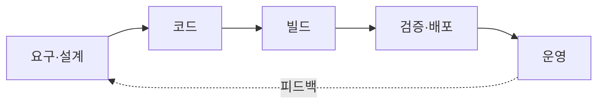
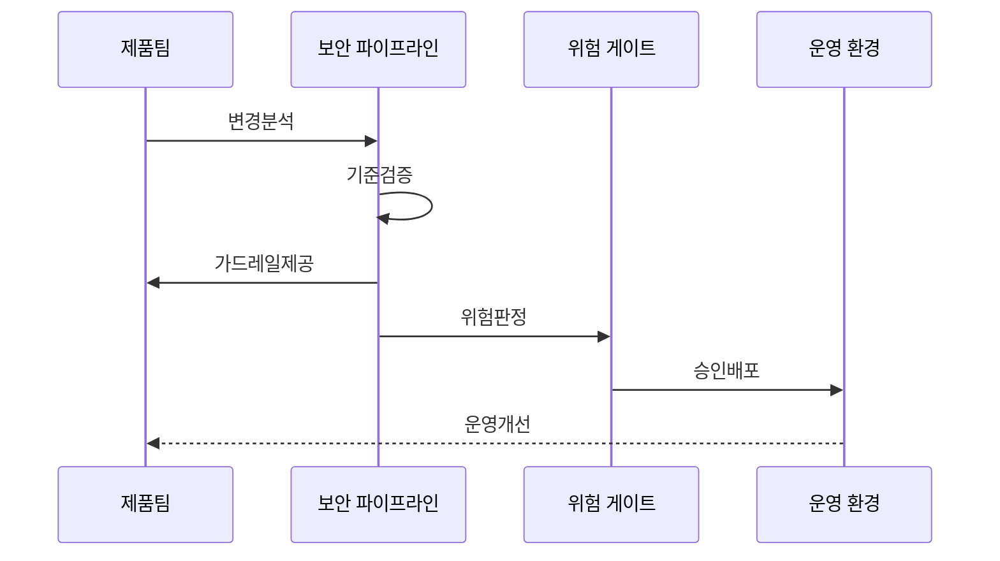

---
sidebar:
  order: 144
  label: "144. DevSecOps 보안 시프트 레프트 (DevSecOps Shift-Left)"
  badge:
    text: "기출 · 85%"
    variant: note
title: DevSecOps 보안 시프트 레프트 (DevSecOps Shift-Left)
date: "2026-07-27T23:59:59+09:00"
tags:
  - notes-security
weight: 144
extra:
  question_no: "144"
  source_status: "기출"
  source_history: "128회, 134회, 135회"
  priority: 85
  priority_note: "128·134·135회 반복된 개발보안 최우선 주제임"
---

## 미리 알고가기

- **개발·보안·운영(Development, Security, and Operations, DevSecOps, 데브섹옵스)**: 세 역할 이름을 결합한 표기로, 보안 책임·자동화·피드백의 공동 운영을 의미
- **시프트 레프트(Shift Left)**: '왼쪽 이동'으로 읽고 수명주기 도식의 앞단을 왼쪽에 놓는 관례에서 요구·설계·코딩 단계의 예방을 표시
- **시프트 라이트(Shift Right)**: '오른쪽 이동'으로 읽고 배포 뒤 운영 단계를 오른쪽에 놓는 관례에서 관측·공격 검증·사고 피드백을 표시
- **코드형 보안(Security as Code)**: 정책·검사·구성·증거를 코드와 버전관리로 반복 실행하는 방식
- **지속 통합·지속 전달(Continuous Integration/Continuous Delivery, CI/CD)**: '시아이 슬래시 시디'로 읽고 슬래시로 통합·전달 자동화를 연결한 파이프라인
- **소프트웨어 자재명세서(Software Bill of Materials, SBOM)**: '에스봄'으로 읽고 영문 머리글자로 구성요소·버전·의존성 명세를 표시
- **보안 게이트**: 위험·환경·예외 기준에 따라 빌드·배포의 진행 여부를 결정하는 통제점임
- **정적 응용 보안 시험(Static Application Security Testing, SAST)**: '새스트'로 읽고 영문 머리글자로 실행 전 소스·데이터 흐름 검사를 표시
- **소프트웨어 구성 분석(Software Composition Analysis, SCA)**: '에스시에이'로 읽고 영문 머리글자로 오픈소스·제3자 구성요소 검사를 표시
- **동적 응용 보안 시험(Dynamic Application Security Testing, DAST)**: '대스트'로 읽고 영문 머리글자로 실행 중 외부 요청 검사를 표시
- **코드형 인프라(Infrastructure as Code, IaC)**: '아이에이시'로 읽고 영문 머리글자로 인프라 구성을 코드로 정의하는 방식을 표시
- **가드레일**: 안전한 기본 설정과 허용 범위를 자동 제공하는 정책
- **백로그**: 제품팀이 우선순위와 담당자를 정해 처리할 작업 목록

## Ⅰ. 개요

- 정의/개념: 개발·배포에 보안 책임·피드백 통합
- 기존 한계: 출시 직전 보안 검사는 수정 비용·배포 지연 증가
- **배경/필요성**: 전 수명주기 공동 책임과 지속 피드백

### 쉽게 이해하기 (학습용)

- 요구부터 운영까지 보안 책임을 팀이 함께함

## Ⅱ. 특징

- 제품팀·보안팀·운영팀이 보안 위험과 예외를 공동 관리한다.
- 코드·의존성·IaC·컨테이너 검사를 파이프라인에 자동화한다.
- 운영 사고·관측 결과를 요구·정책·백로그에 환류한다.
### 쉽게 이해하기 (학습용)

- 운영 문제를 설계·테스트에 되돌리는 순환이 핵심임

## Ⅲ. 아키텍처 및 구성요소

| 설계 요소 | 설명 |
|:---|:---|
| 요구·설계 | 악용사례·위협모델 정의함 |
| 코드 | 리뷰·SAST·SCA 검사함 |
| 빌드 | SBOM·이미지 검증함 |
| 검증·배포 | DAST·IaC 정책 적용함 |
| 운영 | 관측·사고 피드백함 |

> 요약: 개발 단계와 운영 피드백을 순환 연결

### 쉽게 이해하기 (학습용)

- 코드부터 운영 상태까지 이력으로 연결함

## Ⅳ. 원리 및 절차 흐름도

| 절차 | 설명 |
|:---|:---|
| 변경분석 | 변경 흐름과 위험을 파악함 |
| 기준검증 | 중요도별 정책·검사를 실행함 |
| 가드레일제공 | 안전한 자동화 기본값을 제공함 |
| 위험판정 | 위험 기준과 예외 승인을 확인함 |
| 승인배포 | 기준을 통과한 변경을 배포함 |
| 운영개선 | 사고 결과를 정책에 반영함 |

> 요약: 변경 위험을 검증하고 운영 결과로 개선
### 쉽게 이해하기 (학습용)

- 위험 변경만 멈추고 저위험은 관리함

## Ⅴ. 종류 및 비교

| 판단 기준 | DevSecOps | Shift Left | 전통 후행 검사 |
|:---|:---|:---|:---|
| 적용 기준 | 빠른 배포·지속 보안 운영 | 초기 결함 비용 절감 | 독립 승인·최종 검토 |
| 핵심 특징 | 전 수명주기 공동 책임·피드백 | 앞 단계 결함 예방 | 출시 직전 일괄 평가 |
| 한계 | 도구·오탐·예외로 흐름 마비 | 운영 변화·공격 누락 | 늦은 발견·출시 지연 |

> 요약: 개발 전반에 보안 내재화함
### 쉽게 이해하기 (학습용)

- 운영 결과를 왼쪽으로 다시 보내야 함

## Ⅵ. 실무 사례

- 빌드·승인 권한을 분리함
- 중복·오탐 분석해 위험 관리함
- 예외는 만료일 두고 재평가함
- 결함 유입·통제 우회 측정함
- 고위험은 사람이 추적함
### 쉽게 이해하기 (학습용)

- 빌드와 배포 승인을 분리해 한 계정이 검사를 우회하지 못하게 함
- 중복 경고와 오탐을 정리해 실제 위험 결함에 집중함
- 예외에는 소유자·만료일을 두고 자동 재평가함
- 결함 수보다 취약점 유입·통제 우회·재발이 줄었는지 측정함
- 고위험 판단과 예외 승인은 사람이 근거를 확인함

## Ⅶ. 결론

- 제품팀 책임·가드레일·운영 피드백 통합

### 쉽게 이해하기 (학습용)

- 모든 변경을 막지 않고 위험한 변경만 중단해 빠르게 고칠 수 있어야 함
