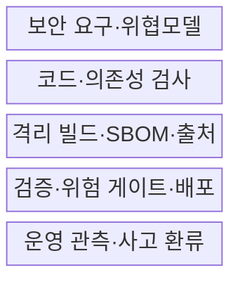
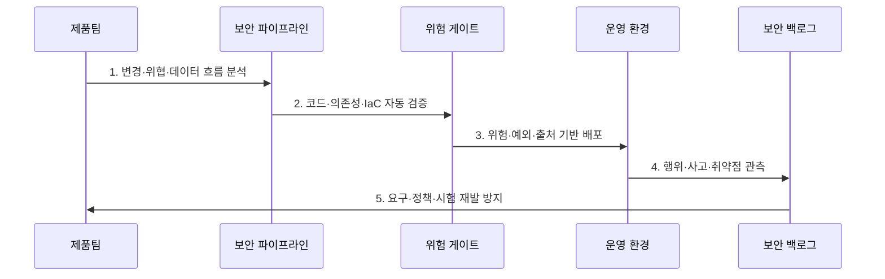

---
sidebar:
  order: 144
  label: "144. DevSecOps 보안 시프트 레프트 (DevSecOps Shift-Left)"
  badge:
    text: "기출 · 85%"
    variant: note
title: DevSecOps 보안 시프트 레프트 (DevSecOps Shift-Left)
date: "2026-07-27T23:59:59+09:00"
tags:
  - notes-security
weight: 144
extra:
  question_no: "144"
  source_status: "기출"
  source_history: "128회, 134회, 135회"
  priority: 85
  priority_note: "128·134·135회 반복된 개발보안 최우선 주제임"
---

## 미리 알고가기

- **개발·보안·운영(Development, Security, and Operations, DevSecOps)**: 개발·보안·운영이 보안 책임·자동화·피드백을 공동 운영하는 방식이다.
- **시프트 레프트(Shift Left)**: 보안 활동을 요구·설계·코딩 단계로 앞당겨 결함을 조기 예방·탐지하는 접근이다.
- **시프트 라이트(Shift Right)**: 배포 후 관측·공격·사고 결과를 개발 개선으로 되돌리는 접근이다.
- **코드형 보안(Security as Code)**: 정책·검사·구성·증거를 코드와 버전관리로 반복 실행하는 방식이다.
- **지속 통합·지속 전달(Continuous Integration/Continuous Delivery, CI/CD)**: 코드 통합·시험·배포 준비를 자동화하는 파이프라인이다.
- **소프트웨어 자재명세서(Software Bill of Materials, SBOM)**: 구성요소의 버전·출처·의존성을 기록한 명세서이다.
- **보안 게이트(Security Gate)**: 위험·환경·예외 기준으로 빌드·배포 진행 여부를 결정하는 통제점이다.
- **코드형 인프라(Infrastructure as Code, IaC)**: 인프라 구성을 코드로 정의해 형상관리·자동 배포하는 방식이다.
- **NIST SP 800-218 SSDF v1.1**: 안전한 소프트웨어 개발의 준비·보호·생산·취약점 대응 관행이다.
- **SLSA Specification v1.2**: 소스·빌드의 공급망 보증 수준과 출처 증명을 정의한 사양이다.
- **OWASP SAMM v2**: 소프트웨어 보안 관행의 현재 역량을 평가·개선하는 성숙도 모델이다.

## Ⅰ. 개요

- 정의: 개발·배포·운영에 **보안 책임·자동화·피드백 통합**
- 목적: 후행 검사의 **수정 비용·배포 지연·재발 감소**

### 쉽게 이해하기 (학습)

- 요구부터 운영까지 팀이 보안을 함께 책임하고 운영 문제를 설계·시험으로 되돌림

## Ⅱ. 특징

- 제품·보안·운영팀의 **공동 위험 책임**
- 코드·의존성·IaC·이미지의 **자동 검사**
- 운영 사건·관측의 **개발 백로그 환류**

### 쉽게 이해하기 (학습)

- 도구를 많이 붙이는 것보다 위험 기준·예외 책임·운영 피드백을 같은 흐름으로 만드는 것이 중요함

## Ⅲ. 구조 및 구성요소

| 설계 요소 | 설명 |
|:---|:---|
| 보안 요구·위협모델 | 악용사례·위험·완료 기준 |
| 코드·의존성 검사 | 리뷰·SAST·SCA·비밀 탐지 |
| 격리 빌드·SBOM·출처 | 아티팩트·서명·provenance |
| 검증·위험 게이트·배포 | DAST·IaC·예외·승인 |
| 운영 관측·사고 환류 | 행위·사고·재발 방지 |

### 쉽게 이해하기 (학습)

- 소스 변경부터 배포 아티팩트와 운영 결과까지 증거를 연결해 원인과 책임을 추적함

## Ⅳ. 흐름도

| 절차 | 설명 |
|:---|:---|
| 1. 변경·위협·데이터 흐름 분석 | 영향 자산·악용경로 식별 |
| 2. 코드·의존성·IaC 자동 검증 | 위험별 검사·가드레일 실행 |
| 3. 위험·예외·출처 기반 배포 | 소유자·보상통제·만료 확인 |
| 4. 행위·사고·취약점 관측 | 운영 위험·재현 증거 수집 |
| 5. 요구·정책·시험 재발 방지 | 근본원인·백로그·검사 갱신 |

### 쉽게 이해하기 (학습)

- 모든 변경을 막지 않고 실제 노출·영향이 큰 변경을 멈춰 빠르게 고치게 함

## Ⅴ. 종류 및 비교

| 개발보안 접근 | DevSecOps | Shift Left | 전통 후행 검사 |
|:---|:---|:---|:---|
| 적용 기준 | 빠른 배포·지속 운영 | 초기 결함 비용 절감 | 독립 최종 승인 |
| 핵심 특징 | 전 수명 공동 책임·환류 | 앞 단계 예방·탐지 | 출시 직전 일괄 평가 |
| 한계 | 오탐·예외로 흐름 마비 | 운영 변화·공격 누락 | 늦은 발견·출시 지연 |

> 요약: 시프트 레프트와 라이트를 지속 순환시킴

### 쉽게 이해하기 (학습)

- 왼쪽에서 예방하고 오른쪽에서 배운 결과를 다시 왼쪽으로 보내야 DevSecOps가 완성됨

## Ⅵ. 실무 고려사항 및 대책

| 고려사항 | 대책 | 효과 |
|:---|:---|:---|
| 안전 개발 기본 관행 | **NIST SP 800-218 SSDF v1.1 적용** | 준비·보호·생산·대응 정렬 |
| 소스·빌드 공급망 | **SLSA v1.2 출처 증명 적용** | 변조 방지·원천 추적 |
| 조직별 역량 개선 | **OWASP SAMM v2 평가** | 목표 수준·로드맵 수립 |

### 쉽게 이해하기 (학습)

- 고위험 결함은 배포를 막고 예외에는 소유자·보상통제·만료일을 두며 운영 결과로 게이트를 조정한다.

## Ⅶ. 결론

- **노출·영향·수정성·재발성**으로 게이트 수준을 결정한다.

### 쉽게 이해하기 (학습)

- 위험한 변경만 중단하고 개발자가 빠르게 원인을 고치며 같은 결함이 다시 나오지 않게 해야 함
