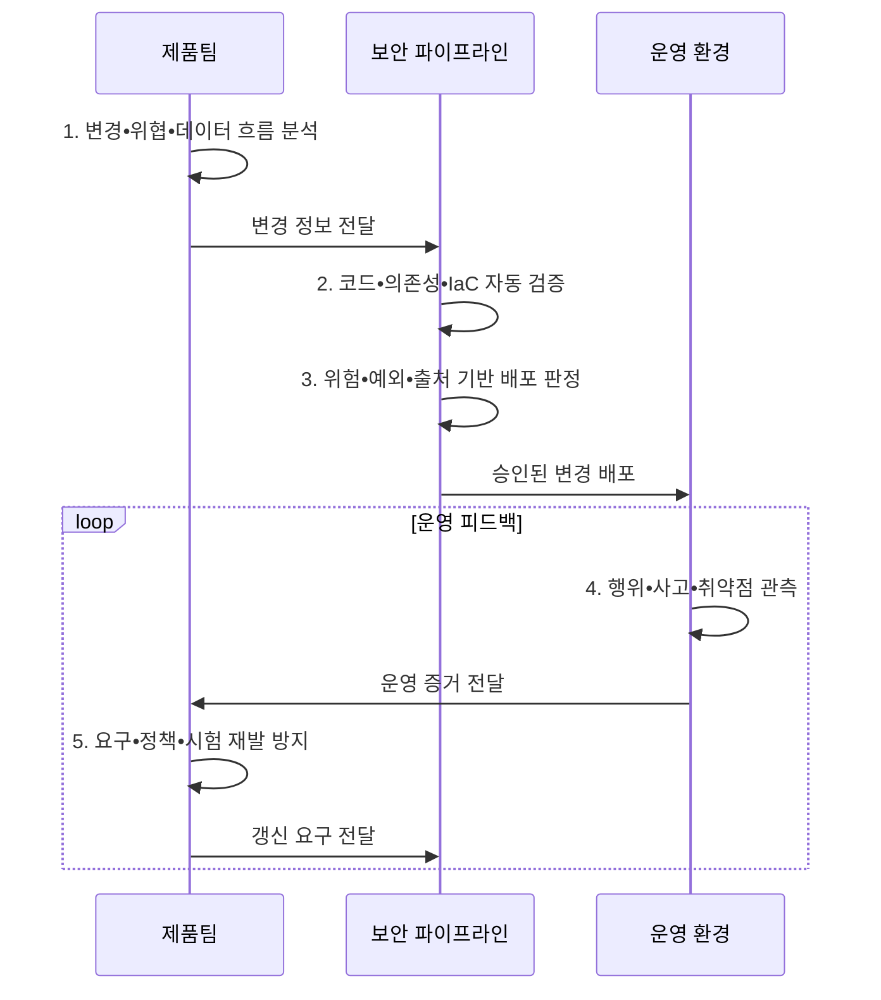

---
sidebar:
  order: 144
  label: "144. DevSecOps 보안 시프트 레프트 (DevSecOps Shift-Left)"
  badge:
    text: "기출 • 85%"
    variant: note
title: DevSecOps 보안 시프트 레프트 (DevSecOps Shift-Left)
date: "2026-08-05T13:00:00+09:00"
tags:
  - notes-security
weight: 144
extra:
  question_no: "144"
  source_status: "기출"
  source_history: "128회, 134회, 135회"
  priority: 85
  priority_note: "128•134•135회 반복된 개발보안 최우선 주제임"
---

## Ⅰ. 개요

<details>
<summary>핵심 용어</summary>

- **DevSecOps(Development, Security, and Operations)**: 개발•보안•운영팀이 보안을 공동 운영하는 방식이다.

</details>

- 정의/개념: 개발•배포•운영에 **보안 책임•자동화•피드백** 을 통합하는 방식
- 배경/필요성: 출시 직전 후행 검사는 **수정 비용•배포 지연•결함 재발 증가**

#### 한줄 요약

- 요구부터 운영까지 팀이 보안을 함께 책임하고 운영 문제를 설계•시험으로 되돌림

## Ⅱ. 특징

<details>
<summary>핵심 용어</summary>

- **Shift Left•Right**: 보안을 개발 초기로 앞당기고 운영 관측•사고 결과를 다시 개발로 돌리는 접근이다.
- **코드형 보안**: 정책•검사•구성•증거를 코드와 버전관리로 반복 실행하는 방식이다.
- **IaC(Infrastructure as Code)**: 인프라 구성과 정책을 코드로 정의하는 방식이다.

</details>

- 제품•보안•운영팀의 **공동 위험 책임**
- 코드•의존성•IaC•이미지의 **자동 검사**
- 운영 사건•관측의 **개발 백로그 환류**
- **코드형 보안** 으로 정책 자동화, **시프트 라이트** 로 운영 환류

#### 한줄 요약

- 도구를 많이 붙이는 것보다 위험 기준•예외 책임•운영 피드백을 같은 흐름으로 만드는 것이 중요함

## Ⅲ. 구조 및 구성요소

<details>
<summary>핵심 용어</summary>

- **SBOM(Software Bill of Materials)**: 구성요소의 출처•의존성을 기록한 명세서이다.
- **SAST(Static Application Security Testing)**: 소스 코드를 정적으로 검사하는 시험이다.
- **SCA(Software Composition Analysis)**: 오픈소스 구성요소를 분석하는 시험이다.
- **DAST(Dynamic Application Security Testing)**: 실행 중인 응용을 동적으로 검사하는 시험이다.

</details>

```text
                       [검증•위험 게이트•배포]
                    /          |          |          \
       [보안 요구•위협모델] [코드•의존성 검사] [격리 빌드•SBOM•출처] [운영 관측•사고 환류]
```

선의 의미: 검증•위험 게이트가 보안 요구, 코드•의존성 검사, 격리 빌드•출처 증명, 운영 관측 증거를 공통 판단 근거로 결합하는 정적 DevSecOps 통제 구조

| 구성요소 | 책임 |
|:---|:---|
| **보안 요구•위협모델** | 악용사례•위험•**완료 기준** |
| **코드•의존성 검사** | 리뷰•SAST•SCA•**비밀 탐지** |
| **격리 빌드•SBOM•출처** | 아티팩트•서명•**출처 증명** |
| **검증•위험 게이트•배포** | DAST•IaC•**예외•승인** |
| **운영 관측•사고 환류** | 행위•사고•**재발 방지** |

#### 한줄 요약

- 소스 변경부터 배포 아티팩트와 운영 결과까지 증거를 연결해 원인과 책임을 추적함

## Ⅳ. 흐름도

<details>
<summary>핵심 용어</summary>

- **CI/CD(Continuous Integration/Continuous Delivery)**: 통합•시험•배포를 자동화하는 파이프라인이다.
- **보안 게이트**: 위험 기준으로 파이프라인 진행 여부를 결정하는 통제점이다.
- **IaC 검증**: 인프라 변경을 배포 전 자동 검사하는 활동이다.

</details>



**동작 원리**

- **1. 변경•위협•데이터 흐름 분석**: 영향 자산•악용경로 식별
- **2. 코드•의존성•IaC 자동 검증**: 위험별 검사•가드레일 실행
- **3. 위험•예외•출처 기반 배포 판정**: 소유자•보상통제•만료 확인
- **4. 행위•사고•취약점 관측**: 운영 위험•재현 증거 수집
- **5. 요구•정책•시험 재발 방지**: 근본원인•백로그•검사 갱신

#### 한줄 요약

- 모든 변경을 막지 않고 실제 노출•영향이 큰 변경을 멈춰 빠르게 고치게 함

## Ⅴ. 종류 및 비교

<details>
<summary>핵심 용어</summary>

- **공동 책임**: 제품•보안•운영팀이 수명주기 전반의 보안 결과를 함께 소유하는 원칙이다.
- **시프트 레프트(Shift Left)**: 설계•개발•빌드 단계에서 결함을 예방•탐지하는 접근이다.
- **시프트 라이트(Shift Right)**: 운영 단계에서 공격•오탐•사고 증거를 관측하고 앞 단계의 요구•시험으로 환류하는 접근이다.

</details>

| 접근 요소 | 역할 | 수명주기 관계 |
|:---|:---|:---|
| **Shift Left** | **설계•개발•빌드 단계의 예방•조기 탐지** | 초기 결함 비용을 줄이는 앞단 활동 |
| **Shift Right** | **운영 위험•공격•오탐 결과 수집** | 운영 증거를 요구사항•시험에 환류 |
| **DevSecOps** | **전 수명주기 공동 책임과 자동화** | 앞단 예방과 운영 피드백을 지속 순환 |

> 요약: 시프트 레프트와 라이트를 지속 순환시킴

#### 한줄 요약

- 왼쪽에서 예방하고 오른쪽에서 배운 결과를 다시 왼쪽으로 보내야 DevSecOps가 완성됨

## Ⅵ. 실무 고려사항 및 대책

<details>
<summary>핵심 용어</summary>

- **NIST(National Institute of Standards and Technology)**: 미국 국립표준기술연구소이다.
- **SSDF(Secure Software Development Framework)**: 안전한 소프트웨어 개발 관행 프레임워크이다.
- **SLSA(Supply-chain Levels for Software Artifacts)**: 소프트웨어 공급망 보증 수준 체계이다.
- **OWASP(Open Worldwide Application Security Project)**: 웹 응용 보안 공개 프로젝트이다.
- **SAMM(Software Assurance Maturity Model)**: 소프트웨어 보증 성숙도 모델이다.
- **SP(Special Publication)**: NIST가 발행하는 특별간행물이다.

</details>

| 문제 | 대책 | 효과 |
|:---|:---|:---|
| **안전 개발 기본 관행** | **NIST SP 800-218 SSDF v1.1 적용** | 준비•보호•생산•**대응 정렬** |
| **소스•빌드 공급망** | **SLSA v1.2 출처 증명 적용** | **변조 방지•빌드 출처 추적** |
| **조직별 역량 개선** | **OWASP SAMM v2 평가** | **목표 수준•로드맵** 수립 |

#### 한줄 요약

- 고위험 결함은 배포를 막고 예외에는 소유자•보상통제•만료일을 두며 운영 결과로 게이트를 조정한다.

## Ⅶ. 결론

<details>
<summary>핵심 용어</summary>

- **위험 기반 배포**: 노출•영향이 큰 변경은 차단하고 낮은 위험은 자동화해 흐름과 안전을 함께 확보하는 방식이다.

</details>

- 노출•영향 큰 변경은 **게이트 차단**, 낮은 위험은 **자동 배포**

#### 한줄 요약

- 위험한 변경만 중단하고 개발자가 빠르게 원인을 고치며 같은 결함이 다시 나오지 않게 해야 함
