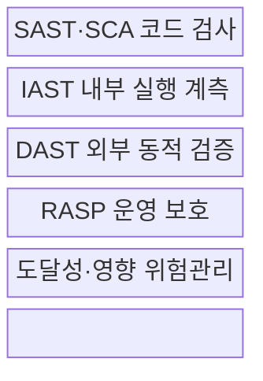
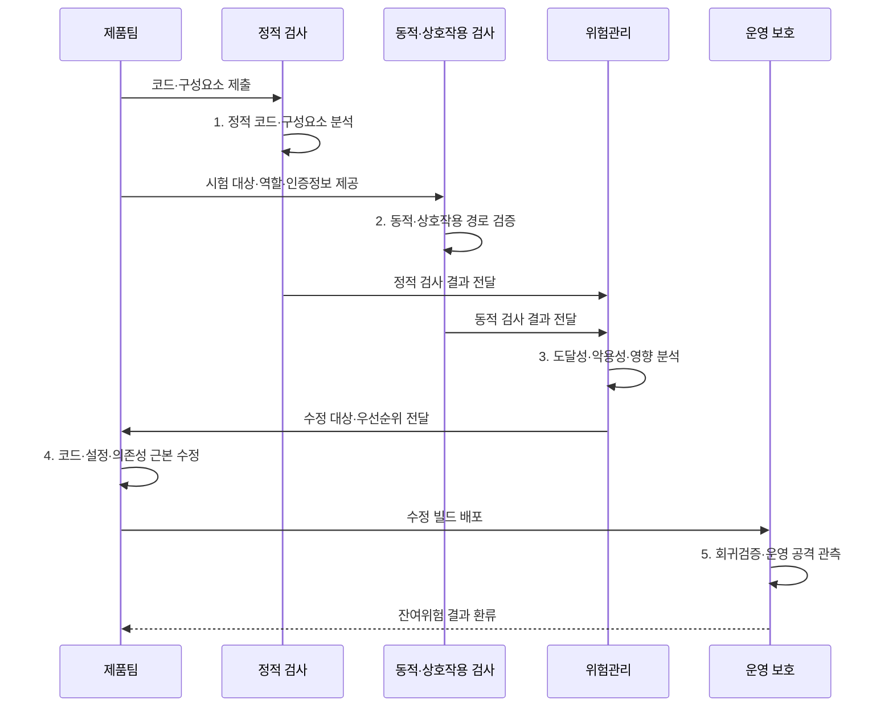

---
sidebar:
  order: 145
  label: "145. SAST·DAST·IAST·RASP"
  badge:
    text: "기출 · 70%"
    variant: note
title: SAST·DAST·IAST·RASP
date: 2026-07-31T02:16:30+09:00
tags:
  - notes-security
weight: 145
extra:
  question_no: "145"
  source_status: "기출"
  source_history: "128회, 135회"
  priority: 70
  priority_note: "반복 출제된 응용 보안 검증 기법"
---

## 미리 알고가기

- **정적 응용 보안 시험(Static Application Security Testing, SAST)**: 실행 없이 소스·바이트코드의 취약 패턴·데이터 흐름을 분석하는 시험이다.
- **동적 응용 보안 시험(Dynamic Application Security Testing, DAST)**: 실행 응용에 외부 요청을 보내 실제 취약 동작을 확인하는 시험이다.
- **상호작용 응용 보안 시험(Interactive Application Security Testing, IAST)**: 시험 중 내부 에이전트가 코드 실행과 요청 흐름을 함께 관찰하는 시험이다.
- **런타임 응용 자기보호(Runtime Application Self-Protection, RASP)**: 운영 응용 내부에서 실행 맥락으로 공격을 탐지·차단하는 기술이다.
- **소프트웨어 구성 분석(Software Composition Analysis, SCA)**: 제3자 구성요소의 버전·라이선스·취약점을 분석하는 시험이다.
- **도달 가능성(Reachability)**: 취약 코드가 실제 입력·실행 경로에서 호출되는지를 나타내는 속성이다.
- **보안 회귀검증(Security Regression Testing)**: 수정한 취약점과 공격 경로가 다시 나타나지 않는지 확인하는 활동이다.
- **OWASP ASVS 5.0.0**: 웹 응용의 보안 요구·검증 수준을 정의한 응용 보안 검증 표준이다.
- **OWASP WSTG v4.2**: 웹 응용·서비스의 보안 시험 시나리오와 방법을 제공하는 안정판 지침이다.
- **NIST SP 800-218 SSDF v1.1**: 개발 수명주기에 안전한 소프트웨어 관행을 통합하는 지침이다.

## Ⅰ. 개요

- 정의/개념: 코드·실행·운영의 **단계별 응용 보안 검증**
- 배경/필요성: 단일 시험의 **가시성·경로·시점 사각 감소**

### 쉽게 이해하기 (학습용)

- 설계도 검사·외부 동작 검사·내부 센서·현장 방어를 함께 써 사각을 줄임

## Ⅱ. 특징

- SAST·DAST의 **내부 코드·외부 공격면 보완**
- IAST의 **요청·코드 실행 경로 연결**
- RASP의 **운영 맥락 기반 탐지·완화**

### 쉽게 이해하기 (학습용)

- 같은 결함도 보는 위치와 시점이 달라 여러 결과를 실제 경로와 영향 기준으로 합쳐야 함

## Ⅲ. 구조 및 구성요소

| 구성요소 | 책임 |
|:---|:---|
| **SAST·SCA 코드 검사** | 코드 흐름·구성요소 **후보 탐지** |
| **IAST 내부 실행 계측** | 요청·함수·**데이터 흐름 연결** |
| **DAST 외부 동적 검증** | 실제 요청·응답의 **악용 확인** |
| **RASP 운영 보호** | 실행 맥락의 **공격 탐지·완화** |
| **도달성·영향 위험관리** | 노출·업무 영향·**오탐 판정** |

### 쉽게 이해하기 (학습용)

- 결과를 한곳에 모아 실제로 닿고 악용되며 중요한 결함부터 고침

## Ⅳ. 흐름도

**동작 원리**

- **1. 정적 코드·구성요소 분석**: 코드 흐름·의존성 후보 탐지
- **2. 동적·상호작용 경로 검증**: 요청·실행 경로·악용성 확인
- **3. 도달성·악용성·영향 분석**: 중복·오탐·우선순위 판정
- **4. 코드·설정·의존성 근본 수정**: 원인 제거·보상통제 설정
- **5. 회귀검증·운영 공격 관측**: 수정 재현·잔여위험 환류

### 쉽게 이해하기 (학습용)

- 취약점 찾기에서 끝내지 않고 원인을 수정하고 같은 공격이 막혔는지 다시 확인함

## Ⅴ. 종류 및 비교

| 응용 보안 기법 | SAST | DAST | IAST | RASP |
|:---|:---|:---|:---|:---|
| **적용 기준** | 개발 초기 **코드** | 외부 **악용 확인** | **위치·경로 연결** | 운영 **즉시 완화** |
| **핵심 특징** | 실행 전 **흐름 분석** | 외부 요청 **실행 검사** | 내부 **실행정보 결합** | 운영 맥락 **공격 차단** |
| **한계** | **오탐·환경 차이** | **인증·원인 추적 누락** | **호환·성능 영향** | **오차단·수정 지연** |

> 요약: 가시성·시점·목적에 맞춰 상호 보완함

### 쉽게 이해하기 (학습용)

- 각 기법은 보는 시점과 위치가 달라 하나의 도구로 모두 대체할 수 없음

## Ⅵ. 실무 고려사항 및 대책

| 고려사항 | 대책 | 효과 |
|:---|:---|:---|
| **보안 요구·검증 수준** | **OWASP ASVS 5.0.0 적용** | 검사 범위·**완료 기준 명확화** |
| **웹 동적 시험 시나리오** | **OWASP WSTG v4.2 적용** | 역할·경로·**증거 표준화** |
| **개발 수명주기 통합** | **NIST SP 800-218 연계** | 수정·**재발 방지 환류** |

### 쉽게 이해하기 (학습용)

- SAST 후보를 DAST·IAST로 실제 노출 경로와 연결하고 수정 후 회귀시험과 운영 관측으로 재검증한다.

## Ⅶ. 결론

- 초기 코드는 **SAST**, 경로 검증은 DAST·IAST, 운영 완화는 **RASP**

### 쉽게 이해하기 (학습용)

- 여러 검사를 많이 돌리는 것보다 결과를 실제 경로·수정·재검증으로 연결해야 함
