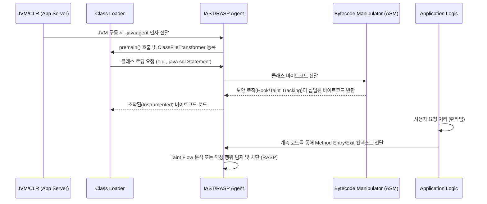

---
sidebar:
  order: 145
  label: "145. SAST•DAST•IAST•RASP"
  badge:
    text: "기출 • 70%"
    variant: note
title: SAST•DAST•IAST•RASP
date: "2026-08-13T22:52:00+09:00"
tags:
  - notes-security
weight: 145
extra:
  question_no: "145"
  source_status: "기출"
  source_history: "128회, 135회"
  priority: 70
  priority_note: "반복 출제된 응용 보안 검증 기법"
---

## Ⅰ. 개요

- 정의: **SAST, DAST, IAST, RASP**는 소프트웨어 개발 생명주기(SDLC) 전반에 걸쳐 코드, 빌드 환경, 런타임 환경에 대한 정적·동적 분석 및 실시간 방어 기법을 결합하여 애플리케이션의 취약점을 탐지하고 악의적 공격을 차단하는 **응용 보안 검증 기술**이다.
- 등장 배경 및 필요성:
  - 단일 검증 기술의 한계: SAST의 높은 오탐률(False Positive), DAST의 낮은 코드 커버리지 및 위치 추적 불가.
  - 현대적 애플리케이션 아키텍처의 복잡성: 마이크로서비스 아키텍처(MSA) 및 서드파티 오픈소스 라이브러리 의존도 심화로 런타임 검증 필수.
  - DevSecOps 패러다임: CI/CD 파이프라인 통합과 실시간 방어가 요구됨.

## Ⅱ. 특징

### 1. 기술적 관점의 차이와 상호 보완성
- **가시성(Visibility)**:
  - SAST: 소스 코드 레벨의 White-box 가시성 (AST, CFG/DFG 기반).
  - DAST: 외부 HTTP/API 응답 기반의 Black-box 가시성 (Payload Injection).
  - IAST: JVM, CLR 레벨의 Glass-box 가시성 (Bytecode Instrumentation API 활용).
  - RASP: 애플리케이션 실행 맥락의 Deep In-App 가시성 (Method Hooking).

### 2. 구동 환경 및 적용 시점 (Shift-Left & Shift-Right)
- **Shift-Left**: SAST(IDE 플러그인, PR 검사)는 코드 작성 시점에 위치하여 개발자 피드백 루프를 최적화.
- **Continuous Integration/Testing**: IAST 및 DAST는 QA 자동화 및 통합 테스트 환경에 통합.
- **Shift-Right**: RASP는 프로덕션(Production) 런타임 내에 배포되어 Zero-day 취약점 방어 수행.

## Ⅲ. 구조 및 구성요소

### 1. SAST (Static Application Security Testing) 구성요소
소스코드 컴파일 이전 혹은 컴파일 단계에서 문법을 파싱하여 논리적 보안 결함을 탐지.
- **Lexer & Parser**: 소스 코드를 토큰(Token)화하고, Abstract Syntax Tree(AST)로 변환.
- **CFG/DFG 생성기**:
  - **CFG (Control Flow Graph)**: 프로그램의 실행 분기 및 루프 흐름 모델링.
  - **DFG (Data Flow Graph)**: 변수의 선언, 할당, 참조 등 데이터 생명주기 모델링.
- **Taint Analyzer (오염 분석기)**:
  - Source(사용자 입력점: `HttpServletRequest.getParameter`)에서 Sink(취약한 함수: `Statement.executeQuery`)까지 데이터 흐름 추적.
  - Sanitizer(검증/필터링 함수)를 거치는지 여부 판별 알고리즘 적용.

### 2. DAST (Dynamic Application Security Testing) 구성요소
실행 중인 웹 애플리케이션을 외부에서 크롤링하고 공격 페이로드를 전송하여 취약점을 동적 탐지.
- **Crawler/Spider**: 타겟 애플리케이션의 URL, 폼 파라미터, API 엔드포인트 수집 (DOM 트리 해석).
- **Fuzzer / Payload Generator**: SQLi, XSS, SSRF 등을 유발하기 위한 동적 Payload(`' OR 1=1--`, `<script>alert(1)</script>`) 주입.
- **Response Analyzer**: HTTP 응답 코드, 렌더링된 DOM, 지연 시간(Time-based SQLi)을 분석하여 취약점 증명.

### 3. IAST (Interactive Application Security Testing) 구성요소
애플리케이션 서버(WAS) 내부에 Agent 형태로 동작하여 DAST/수동 테스트가 유발한 실행 경로를 계측.
- **Instrumentation Engine**:
  - Java의 경우 `java.lang.instrument` 패키지와 ASM, ByteBuddy, Javassist를 통해 Byte-code 조작.
  - 클래스 로딩 시점에 `ClassFileTransformer`를 등록하여 타겟 메서드의 Entry/Exit 지점에 모니터링 코드 삽입 (Weaving).
- **Runtime Taint Tracker**:
  - `String`, `StringBuilder` 등 메모리 상의 객체 단위로 Taint Tag를 부여하여 데이터의 이동을 런타임 메모리 레벨에서 추적.
- **Vulnerability Controller**: Sink 함수 도달 시점에 인자 값을 검사하고 오염된 데이터일 경우 취약점으로 보고 (파일 라인 넘버, 콜 스택 정보 포함).

### 4. RASP (Runtime Application Self-Protection) 구성요소
운영 환경에서 애플리케이션 프로세스 내에 상주하며, 행위 기반 분석을 통해 실시간 공격 차단.
- **Runtime Hooking Manager**:
  - 주요 시스템 콜 및 민감 API (`java.lang.Runtime.exec`, `java.net.Socket`, `java.io.FileInputStream`) 후킹.
- **Context Analyzer**:
  - 단순히 쿼리에 `' OR`이 있다고 차단하지 않고, 실제 실행될 SQL Syntax Tree를 파싱하여 원본 쿼리 구조가 변조되었는지(Query Tokenization) 확인.
- **Action Engine**:
  - 악의적 행위 탐지 시 세션 종료, 스레드 Exception 발생, 경고 로깅, 혹은 페이로드 무력화 조치 수행.

## Ⅳ. 동작 원리 (흐름도)

### 1. IAST/RASP의 Byte-code Instrumentation 동작 흐름



### 2. 응용 보안 검증 기술 간 파이프라인 연계 흐름도

```text
[ SDLC Phase ]        [ 보안 검증 기법 ]           [ 핵심 동작 원리 ]
Coding / Build  ───► SAST / SCA           ───► AST 파싱 ➔ CFG/DFG 생성 ➔ Taint Analysis (오탐 발생 가능성 존재)
       │
Testing / QA    ───► IAST                 ───► Byte-code Instrumentation ➔ DAST/QA 트래픽과 연계하여 런타임 오염 추적
       │             DAST                 ───► Crawling ➔ Payload Injection ➔ HTTP 응답 패턴 분석
       │
Production      ───► RASP                 ───► Runtime API Hooking ➔ 쿼리/명령어 실행 맥락 분석 ➔ 실시간 차단
```

## Ⅴ. 종류 및 비교

| 구분 | SAST (정적) | DAST (동적) | IAST (상호작용) | RASP (런타임 자가방어) |
| :--- | :--- | :--- | :--- | :--- |
| **분석 대상** | 소스 코드, 바이트 코드 | 실행 중인 웹 애플리케이션 | 런타임 앱 내부 흐름 + 트래픽 | 프로덕션 환경의 앱 런타임 맥락 |
| **접근 방식** | White-box (AST, DFG 분석) | Black-box (Payload Fuzzing) | Glass-box (Bytecode Instrumentation) | In-App Protection (Method Hooking) |
| **적용 시점** | 개발(IDE), 빌드(CI) | 테스트(QA), 스테이징 | 테스트(QA, 자동화 연동) | 운영(Production) |
| **취약점 식별** | 정확한 소스코드 위치 제공 | URL 및 파라미터 수준 (코드 위치 모름) | 정확한 소스코드 위치 및 런타임 데이터 제공 | 실제 공격 발생 지점 및 스택트레이스 |
| **오탐률(FP)** | 매우 높음 (실행 컨텍스트 부재) | 낮음 (실제 결과 확인) | 매우 낮음 (실행 경로 확인) | 낮음 (컨텍스트 기반 방어) |
| **언어 종속성** | 종속적 (언어별 Parser 필요) | 독립적 (HTTP/Web 인터페이스 기반) | 종속적 (JVM, CLR 등 에이전트 필요) | 종속적 (플랫폼 레벨 API 후킹 필요) |

## Ⅵ. 실무 고려사항 및 대책

### 1. IAST 및 RASP 도입 시 성능 저하(Overhead) 문제
- **문제**: Byte-code 계측 및 런타임 Taint Tracking은 CPU 및 메모리 오버헤드를 유발하여 트랜잭션 지연 발생.
- **대책**:
  - IAST는 가급적 운영 환경이 아닌 QA/Staging 환경에서만 활성화.
  - RASP의 경우 정규표현식 기반의 탐지 룰을 지양하고, AST 기반의 쿼리 변조 검증과 같이 가벼운 판단 로직 적용 (성능 오버헤드 3% 이내 튜닝).
  - 샘플링(Sampling) 기법 적용 및 핵심 비즈니스 로직(Sink API)에만 부분적 Hooking 적용.

### 2. SAST의 높은 오탐률에 의한 개발 생산성 저하
- **문제**: 수많은 오탐(False Positive)으로 인해 개발자가 보안 경고를 무시하는 Alert Fatigue 발생.
- **대책**:
  - DAST 및 IAST 결과를 SAST 결과와 **상호 연관 분석(Correlation Analysis)** 하여, 실제 도달 가능성(Reachability)이 증명된 취약점 우선순위 상향 조정.
  - 커스텀 Sanitizer(사내 공통 필터링 모듈)를 SAST 엔진의 룰셋에 매핑하여 정상 필터링 로직을 통과한 흐름은 안전으로 판단하도록 설정.

### 3. 클라우드 네이티브 환경(MSA, Serverless) 호환성
- **문제**: RASP 및 IAST는 JVM/CLR 등 전통적인 런타임 환경의 Agent 방식이므로 Serverless(AWS Lambda) 환경 등에 적용 불가.
- **대책**:
  - 컨테이너 기반 환경의 경우 eBPF(Extended Berkeley Packet Filter)를 활용하여 커널 레벨에서 시스템 콜을 후킹하는 방식의 차세대 RASP(Cloud Workload Protection) 도입 고려.
  - 마이크로서비스 간 인증 및 데이터 흐름은 API Gateway 및 서비스 메시(Service Mesh) 수준에서의 분산 트레이싱(Distributed Tracing) 보안 솔루션 연동.

## Ⅶ. 결론

- **최적의 보안 파이프라인 통합(DevSecOps)**: 완벽한 단일 보안 검증 도구는 존재하지 않는다. 초기 코드 작성 단계에서는 **SAST**로 빠른 피드백을 제공하고, 빌드 및 테스트 단계에서는 **DAST**의 동적 페이로드 주입과 **IAST**의 내부 코드 계측을 결합하여 가시성과 정확도를 극대화해야 한다.
- **운영 환경의 최후 방어선**: 최종적으로 프로덕션 환경에서는 런타임 맥락을 인지하는 **RASP**를 배치하여 제로데이 공격 및 미처 발견하지 못한 잔여 취약점(Residual Risk)에 대한 방어 체계를 확립함으로써, 다층적 방어(Defense in Depth) 전략을 완성해야 한다.
