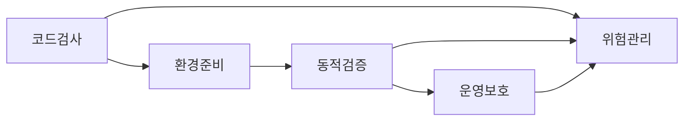
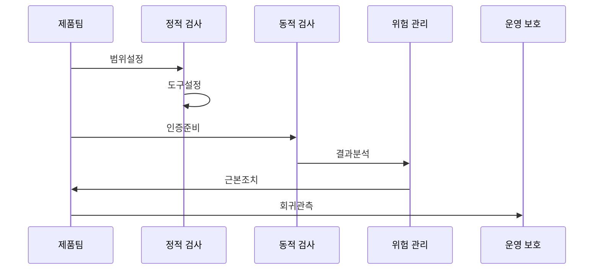

---
sidebar:
  order: 145
  label: "145. SAST·DAST·IAST·RASP"
  badge:
    text: "기출 · 70%"
    variant: note
title: SAST·DAST·IAST·RASP
date: "2026-07-25T01:00:00+09:00"
tags:
  - notes-security
weight: 145
extra:
  question_no: "145"
  source_status: "기출"
  source_history: "128회, 135회"
  priority: 70
  priority_note: "반복 출제된 응용 보안 검증 기법"
---

## 미리 알고가기

- **정적 응용 보안 시험(Static Application Security Testing, SAST)**: '새스트'로 읽고 영문 머리글자로 실행 전 소스·바이트코드의 데이터 흐름 검사를 표시
- **동적 응용 보안 시험(Dynamic Application Security Testing, DAST)**: '대스트'로 읽고 영문 머리글자로 실행 응용에 외부 요청을 보내는 취약점 검사를 표시
- **상호작용 응용 보안 시험(Interactive Application Security Testing, IAST)**: '아이애스트'로 읽고 영문 머리글자로 테스트 중 내부 에이전트의 코드·요청 관찰을 표시
- **런타임 응용 자기 보호(Runtime Application Self-Protection, RASP)**: '라스프'로 읽고 영문 머리글자로 운영 응용 내부의 공격 탐지·차단을 표시
- **소프트웨어 구성 분석(Software Composition Analysis, SCA)**: '에스시에이'로 읽고 영문 머리글자로 오픈소스·제3자 구성요소 검사를 표시
- **도달 가능성(Reachability)**: 취약 코드가 실제 실행 경로에서 호출되는지를 나타내는 속성
- **보안 회귀 검증**: 수정한 취약점과 관련 공격 경로가 다시 나타나지 않는지 반복 확인하는 활동
- **오탐(False Positive)**: 실제 취약점이 아닌 대상을 취약하다고 잘못 보고한 결과

## Ⅰ. 개요

- **정의/개념**: 코드·요청·실행·운영 단계별 보안 검증
- **배경/필요성**: 단일 검사의 경로·환경·운영 사각 보완

### 쉽게 이해하기 (학습용)

- 건강검진처럼 서로 다른 검사로 보안 사각을 줄인다.

## Ⅱ. 특징

- SAST는 실행 전 코드의 흐름과 규칙 위반을 찾는다.
- DAST는 실행 중인 응용의 외부 노출면을 시험한다.
- IAST는 내부 실행 정보로 취약 경로를 연결한다.
- RASP는 운영 문맥에서 공격을 탐지하고 차단한다.

### 쉽게 이해하기 (학습용)

- 설계도, 완성품, 내부 센서, 현장 경비를 함께 쓴다.

## Ⅲ. 아키텍처 및 구성요소

| 설계 요소 | 설명 |
|:---|:---|
| 코드검사 | SAST와 SCA로 코드·구성요소를 분석 |
| 환경준비 | 인증·시험 데이터와 경로를 구성 |
| 동적검증 | DAST와 IAST로 실행 경로를 검증 |
| 운영보호 | RASP로 공격을 탐지·완화 |
| 위험관리 | 도달 경로·업무 영향으로 순서를 정함 |

> 요약: 단계별 검사 결과를 위험관리로 통합

### 쉽게 이해하기 (학습용)

- 검사 결과를 한곳에 모아 고칠 순서를 정한다.

## Ⅳ. 원리 및 절차 흐름도

| 절차 | 설명 |
|:---|:---|
| 범위설정 | 자산·위험·검사 단계를 정함 |
| 도구설정 | 규칙·정책·제외 기준을 구성 |
| 인증준비 | 역할별 계정과 시험 경로를 준비 |
| 결과분석 | 오탐·도달 가능성·영향을 판정 |
| 근본조치 | 코드·설정·의존성을 수정 |
| 회귀관측 | 재검증하고 운영 공격을 관찰 |

> 요약: 정적·동적 결과를 수정·운영 관측으로 연결

### 쉽게 이해하기 (학습용)

- 찾기에서 끝내지 않고 수정과 재확인까지 이어 간다.

## Ⅴ. 종류 및 비교

| 비교축 | SAST | DAST | IAST | RASP |
|:---|:---|:---|:---|:---|
| 핵심 | 실행 전 코드 흐름 분석 | 외부 요청으로 실행 검사 | 내부 에이전트로 경로 연결 | 운영 문맥에서 공격 차단 |
| 적용 | 개발 초기의 넓은 코드 경로 | 외부 악용 가능성 확인 | 취약 위치·실행 경로 연결 | 운영 공격의 즉시 완화 |
| 위험 | 오탐·빌드 환경 차이 | 인증 경로·원인 추적 누락 | 호환성·성능 저하 | 오차단·근본 수정 지연 |

> 요약: 개발부터 운영까지 상호 보완하는 검증 체계

### 쉽게 이해하기 (학습용)

- 각 기법은 보는 시점과 위치가 달라 함께 써야 한다.

## Ⅵ. 실무 사례

- 개발 초기에는 SAST와 SCA로 넓게 후보를 찾는다.
- 시험 환경에서는 DAST로 실제 노출 경로를 확인한다.
- IAST로 취약 코드와 실행 요청의 관계를 추적한다.
- 운영에서는 RASP를 관찰 모드부터 점진 적용한다.

### 쉽게 이해하기 (학습용)

- **개발 초기 검사**: 넓은 후보를 조기에 줄인다.
- **외부 경로 시험**: 실제 공격 가능성을 확인한다.
- **내부 경로 추적**: 원인 코드의 수정을 돕는다.
- **운영 보호 적용**: 오차단을 살피며 범위를 넓힌다.

## Ⅶ. 결론

- 코드·테스트·운영 관측을 네 기법으로 보완한다.

### 쉽게 이해하기 (학습용)

- 여러 층의 검증을 연결해야 보안 사각이 줄어든다.
