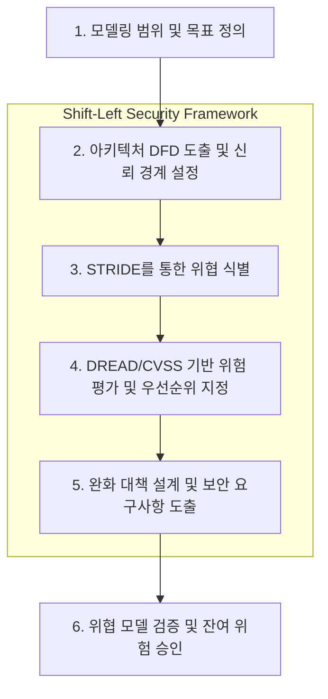

---
sidebar:
  order: 146
  label: "146. 위협 모델링 — STRIDE•DREAD (Threat Modeling STRIDE)"
  badge:
    text: "미출 • 70%"
    variant: note
title: 위협 모델링 — STRIDE•DREAD (Threat Modeling STRIDE)
date: "2026-08-13T22:54:00+09:00"
tags:
  - notes-security
weight: 146
extra:
  question_no: "146"
  source_status: "미출제"
  source_history: ""
  priority: 70
  priority_note: "STRIDE 기반 설계 위협도출은 독립 방법론 가치가 큼"
---

## Ⅰ. 개요

- 정의: **위협 모델링(Threat Modeling)** 은 소프트웨어 및 시스템 아키텍처 설계 단계에서 데이터 흐름과 신뢰 경계를 분석하여 잠재적 보안 위협을 식별하고, 이에 대한 체계적인 완화(Mitigation) 전략을 수립하는 사전 예방적 보안 엔지니어링 프로세스이다.

위협 모델링의 핵심은 시스템의 구조적 취약점을 구현 이전에 발견함으로써, 소프트웨어 개발 수명주기(SDLC) 초기(Shift-Left)에 보안 통제를 통합하여 재설계 비용을 최소화하고 아키텍처 수준의 방어력을 확보하는 데 있다.

## Ⅱ. 특징

- **자산 및 흐름 중심의 시각화**: 데이터 흐름도(DFD, Data Flow Diagram)를 사용하여 시스템의 구성 요소, 데이터의 흐름, 권한이 변경되는 신뢰 경계(Trust Boundary)를 시각적으로 분해한다.
- **구조화된 위협 도출 (STRIDE)**: Microsoft에서 고안한 STRIDE 방법론을 적용하여 각 DFD 컴포넌트(프로세스, 데이터 저장소, 데이터 흐름, 외부 엔티티)에 존재할 수 있는 위협 범주를 체계적으로 매핑한다.
- **정량적/정성적 위험 평가 (DREAD/CVSS)**: 식별된 위협에 대해 피해 수준, 악용 가능성 등을 평가하여 보안 통제 구현의 우선순위를 결정한다.
- **보안 통제 추적성 (Traceability)**: 도출된 위협 시나리오는 아키텍처 보안 요구사항, 방어 코드 구현, 그리고 종단간 침투 테스트 항목으로 1:1 양방향 추적이 가능해야 한다.

## Ⅲ. 구조 및 구성요소

위협 모델링을 구성하는 핵심 프레임워크는 시스템 분해(DFD), 위협 식별(STRIDE), 위협 평가(DREAD)로 구성된다.

### 1. DFD (Data Flow Diagram) 및 신뢰 경계(Trust Boundary)

시스템을 구성하는 컴포넌트를 4가지 요소로 추상화하며, 보안 컨텍스트가 전환되는 지점을 신뢰 경계로 정의한다.

| 구성요소 (Element) | 기호 / 설명 | STRIDE 적용 대상 |
|:---|:---|:---|
| **External Entity (외부 엔티티)** | 사각형 (사용자, 외부 API 등) | S, R |
| **Process (프로세스)** | 원 또는 둥근 사각형 (웹 서버, 비즈니스 로직) | S, T, R, I, D, E |
| **Data Flow (데이터 흐름)** | 화살표 (네트워크 통신, IPC 흐름) | T, I, D |
| **Data Store (데이터 저장소)** | 평행선 (RDBMS, 파일 시스템, 캐시) | T, I, D |
| **Trust Boundary (신뢰 경계)** | 점선 (인터넷-DMZ 경계, 커널-유저스페이스 경계) | (분석의 기준점) |

### 2. STRIDE 위협 분류 모델

각 컴포넌트에서 발생 가능한 위협을 6가지 범주로 분류하고, 역으로 방어(Mitigation) 속성을 매핑한다.

| 위협 범주 (STRIDE) | 설명 (공격자 관점) | 침해되는 보안 속성 | 완화 설계 패턴 (Mitigation Pattern) |
|:---|:---|:---|:---|
| **S**poofing (위장) | 다른 사용자나 시스템 구성 요소로 신분을 위조함 | 인증 (Authentication) | 상호 TLS(mTLS), OAuth 2.0 / OIDC, 강력한 세션 관리 |
| **T**ampering (변조) | 데이터 흐름 중이거나 저장소의 데이터를 불법적으로 수정함 | 무결성 (Integrity) | HMAC 서명, 디지털 서명(RSA/ECC), 데이터베이스 암호화 |
| **R**epudiation (부인) | 악의적 행위를 수행한 후 자신의 행위임을 부인함 | 부인 방지 (Non-repudiation) | 디지털 서명 기반 트랜잭션, WORM(Write-Once-Read-Many) 로그 스토리지, 해시 체인 링 |
| **I**nformation Disclosure (정보 노출) | 인가되지 않은 대상에게 민감한 정보가 유출됨 | 기밀성 (Confidentiality) | AES-256-GCM 기반 저장소 암호화, TLS 1.3 통신, 메모리 내 민감 정보 초기화 |
| **D**enial of Service (서비스 거부) | 시스템 자원을 고갈시켜 정상적인 서비스 제공을 방해함 | 가용성 (Availability) | Rate Limiting (Token Bucket 알고리즘), WAF, 리소스 할당 제한(Cgroups) |
| **E**levation of Privilege (권한 상승) | 인가되지 않은 사용자가 관리자 등 더 높은 권한을 획득함 | 인가 (Authorization) | RBAC/ABAC 기반 최소 권한 원칙(PoLP), Input Validation(Sanitization) |

### 3. DREAD 위험 평가 모델

식별된 위협의 심각도를 정량화하여 우선순위를 산정한다 (점수: 1~10).

- **D**amage (피해 규모): 공격 성공 시 비즈니스 및 자산에 미치는 손실 정도
- **R**eproducibility (재현성): 공격을 반복적으로 성공시킬 수 있는 가능성
- **E**xploitability (악용 가능성): 공격을 수행하는 데 필요한 기술 수준 및 노력
- **A**ffected Users (영향받는 사용자): 공격으로 인해 영향을 받는 사용자의 비율
- **D**iscoverability (발견 용이성): 취약점을 찾아내고 공격 벡터를 식별하기 쉬운 정도

*※ 최근 실무에서는 DREAD의 주관성을 보완하기 위해 CVSS(Common Vulnerability Scoring System)를 함께 활용하는 추세이다.*

## Ⅳ. 흐름도

위협 모델링은 다음의 구조화된 파이프라인을 거친다.

**상세 동작 원리**:
1. **아키텍처 분해**: 애플리케이션의 엔드포인트부터 데이터베이스까지의 데이터 흐름을 DFD로 맵핑하고, 외부망과 내부망, 사용자 권한 분리 지점에 신뢰 경계(Trust Boundary)를 긋는다.
2. **위협 도출 (STRIDE 매핑)**: 신뢰 경계를 넘나드는 모든 데이터 흐름과 프로세스에 대해 STRIDE 범주를 대입하여 공격 시나리오를 식별한다. (예: "API 게이트웨이와 백엔드 서비스 사이의 트래픽이 Tampering될 수 있는가?")
3. **위험 정량화 (DREAD)**: 도출된 위협 시나리오에 대해 DREAD 점수를 합산하여 우선순위를 산출하고, 조치가 시급한 고위험 항목을 선별한다.
4. **보안 아키텍처 설계**: 식별된 위협을 상쇄하기 위해 방어 메커니즘(예: 서킷 브레이커, JWT 서명 검증, mTLS 등)을 아키텍처에 반영하고 이를 요구사항으로 추적한다.
5. **승인 및 갱신**: 조치 이후의 잔여 위험(Residual Risk)을 경영진/보안 부서가 승인하며, 신규 API나 시스템 아키텍처 변경 시 위협 모델을 다시 갱신한다.

## Ⅴ. 종류 및 비교

다양한 위협 모델링 방법론이 존재하며, 분석의 주체와 목적에 따라 적합한 프레임워크를 선택해야 한다.

| 비교 항목 | STRIDE | PASTA (Process for Attack Simulation & Threat Analysis) | OCTAVE | 공격 트리 (Attack Trees) |
|:---|:---|:---|:---|:---|
| **중심 관점** | 개발자, 아키텍트 (시스템 아키텍처 중심) | 공격자, 리스크 관리자 (비즈니스 임팩트 중심) | 조직 경영진 (자산 리스크 중심) | 보안 분석가 (공격 벡터/경로 중심) |
| **핵심 프로세스** | DFD 분해 ➔ STRIDE 6대 범주별 위협 식별 | 7단계 리스크 기반 공격 시뮬레이션 | 3단계 구성 요소 분석 및 자산 프로파일링 | 공격 목표를 최상위 노드로 하는 조건 분해(AND/OR Tree) |
| **장점** | 소프트웨어 설계 시 누락된 보안 통제를 찾기 매우 용이함 | 비즈니스 컨텍스트와 보안 위협을 맵핑하여 ROI 산출 가능 | 전사적 리스크 관리에 적합, 비기술적 접근 용이 | 특정 침해 사고 시나리오의 경로 및 사전 조건 분석에 탁월 |
| **단점** | 비즈니스 영향을 반영하지 않으며, DFD에 크게 의존함 | 절차가 방대하여 애자일(Agile) 환경 적용에 부담 | 소프트웨어 아키텍처 수준의 구체적인 취약점 도출 어려움 | 트리 구성이 복잡해질 수 있으며 완화 대책 도출과는 거리가 있음 |

## Ⅵ. 실무 고려사항 및 대책

### 1. 신뢰 경계(Trust Boundary) 설정 오류 방지
- **문제점**: 마이크로서비스 아키텍처(MSA)에서 내부망(Internal Network)에 대한 과도한 신뢰(Implicit Trust)로 인해 내부 서비스 간 통신 시 신뢰 경계를 설정하지 않는 문제 발생.
- **보안 대책**: 제로 트러스트(Zero Trust) 원칙에 입각하여 모든 서비스 간 통신(Service-to-Service) 채널에 신뢰 경계를 설정한다. Service Mesh(예: Istio, Linkerd)를 도입하여 기본적으로 mTLS 기반 상호 인증(Spoofing 완화)과 엄격한 인가(Elevation of Privilege 완화) 정책을 적용한다.

### 2. DREAD 모델의 주관성 극복 및 정량화 한계
- **문제점**: DREAD 평가 시 팀원 간 주관적인 기준 차이(예: '악용 가능성' 점수 편차)로 인해 평가 결과의 일관성이 훼손될 수 있다.
- **보안 대책**: 조직 맞춤형 명시적 평가표(Rubric)를 제정하거나, 국제 표준 취약점 평가 시스템인 **CVSS 3.1/4.0 체계**를 DREAD 대신 혹은 보완재로 사용하여 객관적인 베이스 스코어(Base Score)를 산출한다.

### 3. Agile/DevSecOps 파이프라인으로의 자동화 통합
- **문제점**: 전통적인 문서 기반 위협 모델링은 잦은 릴리즈가 발생하는 애자일 환경에서 병목(Bottleneck) 요소로 작용한다.
- **보안 대책**: Threat Modeling as Code (TMaC) 도구(예: AWS Threat Composer, OWASP Threat Dragon, Microsoft Threat Modeling Tool)를 CI/CD 파이프라인에 통합한다. 아키텍처와 설계가 코드로 관리되도록 하고(예: YAML/JSON 기반 DFD), 인프라 변경 시 위협 모델이 버전 컨트롤 시스템(Git)에서 함께 형상 관리되게 한다.

### 4. 요소별 분석(STRIDE-per-Element)에 따른 피로도 증가
- **문제점**: DFD의 모든 구성 요소에 기계적으로 STRIDE를 대입할 경우 비현실적이고 중복된 위협이 과도하게 도출되어 분석 피로도(Alert Fatigue)가 가중된다.
- **보안 대책**: 시스템의 핵심 자산(Crown Jewels)과 인터넷 연결 진입점(Entry Points)에 분석을 집중한다. 표준 보안 프레임워크를 수립하여(예: '모든 내부 DB 접근은 비밀번호 대신 IAM Role을 사용한다') 공통 위협을 아키텍처 수준에서 일괄 완화 처리함으로써 위협 시나리오 도출 범위를 최적화한다.

## Ⅶ. 결론

소프트웨어 보안 취약점의 절반 이상은 단순한 코딩 오류가 아닌 시스템 아키텍처 설계 단계의 구조적 결함에서 기인한다. **위협 모델링(Threat Modeling)** 과 **STRIDE/DREAD 방법론**은 이러한 아키텍처 결함을 DFD 분석과 신뢰 경계 검증을 통해 코드 구현 전에 사전에 식별하고 방어할 수 있는 강력한 보안 엔지니어링 도구이다.

실무적으로 성공적인 위협 모델링을 달성하기 위해서는 단발성의 문서 작업에 그쳐서는 안 된다. 도출된 완화 대책(Mitigation)을 Jira 등의 이슈 트래커에 백로그(Backlog)로 등록하여 코드 레벨에 강제 적용시키고, 이를 종단간 보안 테스트(SAST/DAST, 모의해킹) 시나리오와 양방향 추적성(Traceability)으로 엮어내는 **DevSecOps 문화**의 완전한 정착이 필수불가결하다.
