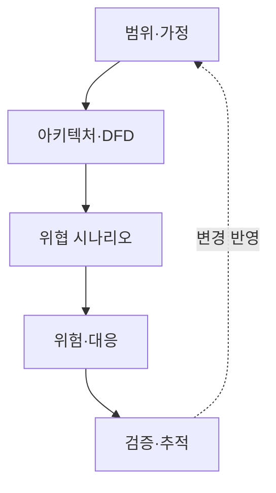
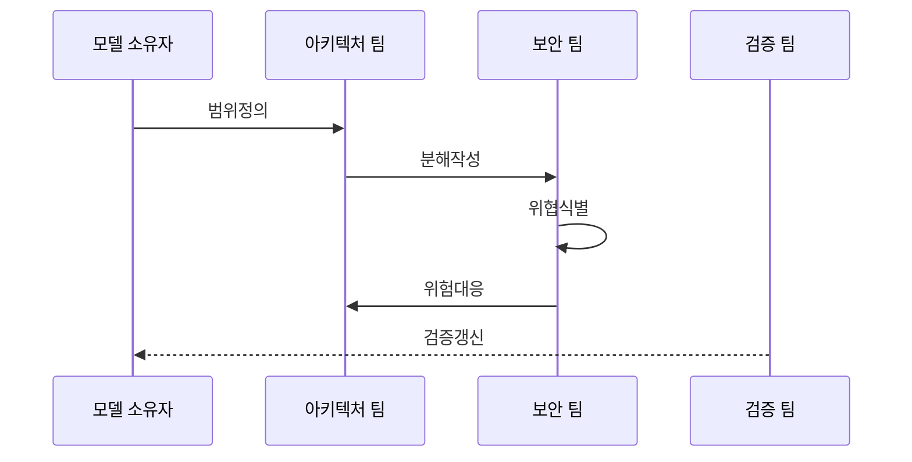

---
sidebar:
  order: 146
  label: "146. 위협 모델링 — STRIDE·DREAD (Threat Modeling STRIDE)"
  badge:
    text: "미출제 · 70%"
    variant: note
title: 위협 모델링 — STRIDE·DREAD (Threat Modeling STRIDE)
date: "2026-07-25T01:00:00+09:00"
tags:
  - notes-security
weight: 146
extra:
  question_no: "146"
  source_status: "미출제"
  source_history: ""
  priority: 70
  priority_note: "STRIDE 기반 설계 위협도출은 독립 방법론 가치가 큼"
---

## 미리 알고가기

- **위협 모델링**: 위협·대응·범위를 구조화해 설계 시 보안 결정을 지원함
- **데이터 흐름도(Data Flow Diagram, DFD)**: '디에프디'로 읽고 영문 머리글자로 데이터 흐름과 신뢰 경계를 표현한 도식을 표시
- **스트라이드(Spoofing, Tampering, Repudiation, Information Disclosure, Denial of Service, Elevation of Privilege, STRIDE)**: '스트라이드'로 읽고 여섯 위협의 영문 머리글자를 단어처럼 묶어 신원·무결성·부인·노출·가용성·권한 위협을 분류
- **Spoofing**: 타인·장치·서비스의 신원을 가장하는 위협임
- **Tampering**: 데이터·코드·메시지를 비인가 변경하는 위협임
- **Repudiation**: 행위자가 작업 사실을 부인해 책임 추적이 어려워지는 위협
- **Information Disclosure**: 권한 없는 주체에게 민감정보가 노출되는 위협
- **서비스 거부(Denial of Service, DoS)**: '도스'로 읽고 영문 머리글자로 자원 고갈·차단에 따른 가용성 위협을 표시
- **Elevation of Privilege**: 낮은 권한의 주체가 허용되지 않은 높은 권한을 얻는 위협
- **드레드(Damage, Reproducibility, Exploitability, Affected Users, Discoverability, DREAD)**: '드레드'로 읽고 다섯 평가축의 머리글자를 단어처럼 묶어 위험 점수화 기준을 표시
- **파스타(Process for Attack Simulation and Threat Analysis, PASTA)**: '파스타'로 읽고 영문 머리글자를 단어처럼 묶어 업무 영향 중심 공격 시뮬레이션 절차를 표시
- **완화(Mitigation)**: 가능성·영향·경로를 줄여 설계·통제·검증함

## Ⅰ. 개요

- 정의/개념: 설계 흐름에서 공격·영향·대응 도출
- **배경/필요성**: 신뢰 경계·권한 결함의 조기 발견

### 쉽게 이해하기 (학습용)

- 시스템 경계를 그린 뒤 공격 경로와 대응 근거를 설계 단계에서 연결한다

## Ⅱ. 특징

- 범위·자산·가정·신뢰 경계를 명시해 위협 논의의 기준을 맞춘다.
- STRIDE로 각 설계 요소의 위협을 질문한다.
- 위협을 공격자·사전조건·경로·영향이 있는 시나리오로 구체화한다.
- 대응을 요구·설계·테스트와 연결해 갱신한다.

### 쉽게 이해하기 (학습용)

- STRIDE 단어를 체크하는 데서 끝내지 않고 공격자가 어떤 조건에서 어떤 자산에 영향을 주는지 적어야 함

## Ⅲ. 아키텍처 및 구성요소

| 설계 요소 | 설명 |
|:---|:---|
| 범위·가정 | 대상 버전·환경·의존성·전제를 기록함 |
| 아키텍처·DFD | 엔터티·저장소·흐름·경계를 표현함 |
| 위협 시나리오 | 공격자·행위·영향과 증거를 정의함 |
| 위험·대응 | 통제·잔여 위험과 결정을 기록함 |
| 검증·추적 | 테스트·소유자·변경 이력을 연결함 |

> 요약: 범위부터 검증까지 위협 결정을 추적

### 쉽게 이해하기 (학습용)

- 그림만 남기지 말고 각 위협을 누가 언제 어떻게 고치고 무엇으로 확인할지 연결해야 함

## Ⅳ. 원리 및 절차 흐름도

| 절차 | 설명 |
|:---|:---|
| 범위정의 | 보호 자산·환경·가정을 설정함 |
| 분해작성 | DFD와 신뢰 경계·의존성을 작성함 |
| 위협식별 | STRIDE·공격지식으로 시나리오 도출함 |
| 위험대응 | 근거 기반 가능성·영향으로 대응 선정함 |
| 검증갱신 | 테스트·운영 관측을 모델에 반영함 |

> 요약: 설계 분해와 위협 대응을 검증으로 갱신

### 쉽게 이해하기 (학습용)

- 새 API나 데이터 흐름이 생기면 예전 그림에 결과만 붙이지 말고 경계와 위협을 다시 확인해야 함

## Ⅴ. 종류 및 비교

| 비교축 | STRIDE | DREAD | 공격 트리 |
|:---|:---|:---|:---|
| 핵심 특징 | 여섯 속성으로 위협 질문 | 다섯 축으로 위험 점수화 | 목표를 조건별 경로로 분해 |
| 적용 기준 | DFD별 위협 누락 감소 | 같은 기준의 처리 순서 | 다중 경로·전제조건 분석 |
| 주요 위험 | 우선순위·경로 누락 | 주관적 숫자 왜곡 | 경로의 과도한 증가 |

> 요약: 설계 시 위협 모델링으로 위험을 최소화함

### 쉽게 이해하기 (학습용)

- STRIDE는 무엇을 놓쳤는지, 공격 트리는 어떻게 도달하는지, DREAD는 무엇부터 볼지에 도움을 줌

## Ⅵ. 실무 사례

- DREAD는 척도·근거·평가자를 고정
- STRIDE는 자산·경로별 요구로 전환
- 내부·공급망·물리 위협은 별도 보완
- 설계 변경·위험 감소·검증 통과 측정

### 쉽게 이해하기 (학습용)

- DREAD는 항목 정의·척도·근거·평가자를 고정해 점수의 비교 가능성을 확보함
- STRIDE 대응은 범주 이름이 아니라 자산·경로별 보안 요구로 작성함
- 내부 오용·공급망·운영 실수·물리·프라이버시 위협은 추가 기법으로 보완함
- 모델 건수보다 설계 변경·테스트 통과·운영 사고 예측이 좋아졌는지 측정함

## Ⅶ. 결론

- STRIDE 위협을 대응·검증으로 추적

### 쉽게 이해하기 (학습용)

- 목표는 위협 목록을 많이 만드는 것이 아니라 설계를 바꾸고 남은 위험을 설명할 수 있게 하는 것임
