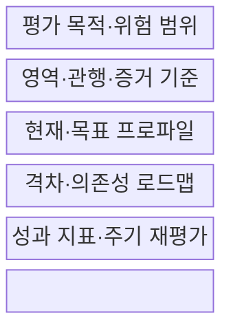
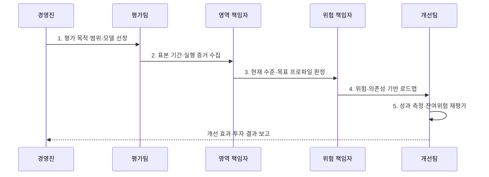

---
sidebar:
  order: 147
  label: "147. 보안 성숙도 모델 (Security Maturity Model)"
  badge:
    text: "미출제 · 50%"
    variant: note
title: 보안 성숙도 모델 (Security Maturity Model)
date: 2026-07-31T02:17:31+09:00
tags:
  - notes-security
weight: 147
extra:
  question_no: "147"
  source_status: "미출제"
  source_history: ""
  priority: 50
  priority_note: "SAMM·BSIMM·C2M2 비교와 개선로드맵이 독립적임"
---

## 미리 알고가기

- **보안 성숙도(Security Maturity)**: 보안 관행이 반복·측정·개선되는 조직 역량의 정도이다.
- **역량(Capability)**: 보안 목적을 달성하도록 사람·프로세스·기술이 함께 작동하는 능력이다.
- **성숙도 수준(Maturity Level)**: 관행의 제도화와 지속적 개선 정도를 나타낸 단계이다.
- **현재 프로파일(Current Profile)**: 평가 시점에 증거로 확인한 영역별 역량 상태이다.
- **목표 프로파일(Target Profile)**: 업무 위험과 의무에 맞춰 정한 영역별 목표 상태이다.
- **OWASP SAMM v2**: 5개 비즈니스 기능과 15개 보안 관행을 3개 성숙도 수준으로 평가하는 소프트웨어 보증 모델이다.
- **BSIMM(Building Security In Maturity Model)**: 여러 조직에서 관찰한 실제 소프트웨어 보안 활동을 비교하는 벤치마킹 모델이다.
- **DOE C2M2 v2.1**: 미국 에너지부의 10개 영역·3개 성숙도 지표 수준으로 IT·OT 사이버보안 역량을 평가하는 모델이다.
- **NIST CSF 2.0 조직 프로파일**: 현재·목표 사이버보안 결과를 기술하고 격차를 관리하는 구조이다.
- **NIST SP 1302**: NIST CSF 2.0 티어를 조직 프로파일과 함께 활용하도록 설명한 공식 지침이다.

## Ⅰ. 개요

- 정의/개념: 증거로 **현재·목표 보안 역량을 평가하는 체계**
- 배경/필요성: 도구 보유 수만으로는 **반복 역량·개선 효과 판단 불가**

### 쉽게 이해하기 (학습용)

- 도구 보유 여부보다 담당자가 바뀌어도 관행이 반복되고 결과로 개선되는지를 봄

## Ⅱ. 특징

- 영역·관행·수준·증거의 **구조화된 평가**
- 현재·목표 격차의 **위험 기반 우선순위화**
- 반복 평가·성과 지표의 **지속 개선 검증**

### 쉽게 이해하기 (학습용)

- 낮은 점수를 모두 먼저 고치지 않고 업무 위험과 의존성이 큰 격차부터 개선함

## Ⅲ. 구조 및 구성요소

| 구성요소 | 책임 |
|:---|:---|
| **평가 목적·위험 범위** | 자산·업무·법적 의무·**경계** |
| **영역·관행·증거 기준** | 행위·표본·**평가 척도** |
| **현재·목표 프로파일** | 현황·최소선·**목표 수준** |
| **격차·의존성 로드맵** | 위험·선후관계·**책임·일정** |
| **성과 지표·주기 재평가** | 효과·잔여위험·**목표 갱신** |

### 쉽게 이해하기 (학습용)

- 평가표·실행 증거·개선 책임·성과 지표가 연결돼야 조직 역량으로 반복됨

## Ⅳ. 흐름도

**동작 원리**

- **1. 평가 목적·범위·모델 선정**: 자산·업무·평가 단위 확정
- **2. 표본 기간·실행 증거 수집**: 기록·인터뷰·성과 표본 확인
- **3. 현재 수준·목표 프로파일 판정**: 증거 충족·위험 허용선 결정
- **4. 위험·의존성 기반 로드맵**: 과제·책임·일정·투자 배정
- **5. 성과 측정·잔여위험 재평가**: 효과 검증·목표 상태 갱신

### 쉽게 이해하기 (학습용)

- 인터뷰만 믿지 않고 정한 기간의 기록과 결과로 반복 수행 여부를 확인함

## Ⅴ. 종류 및 비교

| 성숙도 모델 | OWASP SAMM v2 | BSIMM | DOE C2M2 v2.1 |
|:---|:---|:---|:---|
| **적용 기준** | SW 보증 **로드맵 설계** | 실제 활동 **벤치마킹** | 전사 IT·OT **역량 개선** |
| **핵심 특징** | **5개 기능·15개 관행** | 관찰 기반 **활동 비교** | **10개 영역·3개 MIL** |
| **한계** | **맥락 없는 일률 목표** | **활동 수와 효과 불일치** | **점수와 위험의 분리** |

> 요약: 범위·목적에 맞는 모델로 증거 기반 격차를 개선함

### 쉽게 이해하기 (학습용)

- 모델별 범위와 척도가 달라 점수를 직접 비교하지 말고 평가 목적에 맞춰 선택함

## Ⅵ. 실무 고려사항 및 대책

| 고려사항 | 대책 | 효과 |
|:---|:---|:---|
| **SW 보증 역량 개선** | **OWASP SAMM v2 적용** | 관행별 **단계 로드맵** 확보 |
| **전사 IT·OT 역량 평가** | **DOE C2M2 v2.1 적용** | 10개 영역별 **격차 식별** |
| **위험관리 성숙도 표현** | **NIST CSF 2.0·SP 1302 적용** | **프로파일·티어 연계** |

### 쉽게 이해하기 (학습용)

- 금융사는 SAMM으로 개발보안을 평가하고 고위험 관행의 증거 격차부터 투자함

## Ⅶ. 결론

- SW 보증은 **SAMM**, 전사 IT·OT는 **C2M2**, 고위험 격차부터 투자

### 쉽게 이해하기 (학습용)

- 성숙도 점수는 성적표가 아니라 다음에 무엇을 왜 개선할지 합의하는 출발점임
