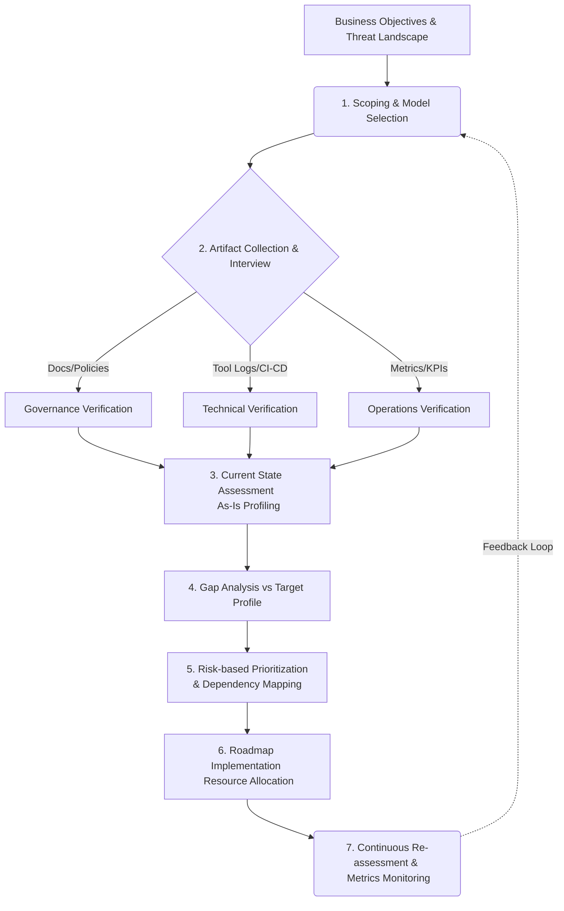

---
sidebar:
  order: 147
  label: "147. 보안 성숙도 모델 (Security Maturity Model)"
  badge:
    text: "미출 · 50%"
    variant: note
title: 보안 성숙도 모델 (Security Maturity Model)
date: "2026-08-13T22:56:00+09:00"
tags:
  - notes-security
weight: 147
extra:
  question_no: "147"
  source_status: "미출"
  source_history: ""
  priority: 50
  priority_note: "SAMM•BSIMM•C2M2 비교와 개선로드맵이 독립적임"
---

## Ⅰ. 개요

<details><summary>용어 설명</summary>

- **보안 성숙도(Security Maturity)**: 보안 관행(Practices)과 프로세스가 특정 조직 내에서 얼마나 제도화(Institutionalized)되고, 측정 가능하며, 지속적으로 개선되고 있는지를 나타내는 역량의 정도이다.
- **아티기반 증거(Artifact-based Evidence)**: 평가의 객관성을 확보하기 위해 인터뷰나 설문에 의존하지 않고, 실제 CI/CD 파이프라인 로그, 취약점 점검 결과서, 정적/동적 분석(SAST/DAST) 리포트 등의 산출물을 통해 보안 관행 수행 여부를 입증하는 방식이다.
- **목표 프로파일(Target Profile)**: 조직의 비즈니스 목표, 위협 모델, 법적 규제 의무를 바탕으로 설정한 이상적인 보안 역량 수준의 집합이다.

</details>

- 정의: **보안 성숙도 모델(Security Maturity Model)** 은 조직의 보안 관행이 체계적으로 반복, 측정, 개선되는 역량의 정도를 객관적 지표로 평가하여 지속적 개선을 위한 위험 기반 로드맵을 제공하는 **평가 체계**이다.
- 배경 및 필요성: 도입된 보안 솔루션의 갯수나 단편적인 정책 보유 여부만으로는 보안 조직의 실제 방어 역량과 프로세스 내재화 수준을 파악하기 어렵다. 이에 따라 현재 역량(As-Is)과 목표 역량(To-Be) 간의 갭(Gap)을 아티기반으로 정량화하고, 위험도에 기반하여 제한된 자원을 효율적으로 투자하기 위한 기준 프레임워크가 필요해졌다.

## Ⅱ. 특징

보안 성숙도 모델은 주관적 평가를 배제하고 실질적인 보안 내재화 상태를 측정하기 위해 다음과 같은 고도의 기술적·관리적 특징을 지닌다.

1. **아티기반 증거 수집 (Artifact-based Evidence Collection)**
   - 보안 관행의 수행 여부를 담당자의 구두 진술에 의존하지 않고, JIRA 티켓, SonarQube 스캔 결과, AWS CloudTrail 로그, IAM 정책 JSON 파일 등 명시적이고 검증 가능한 시스템 레벨의 증거(Artifact)로 확인한다.
   - 이를 통해 점수의 신뢰성을 확보하고 자동화된 보안 지표(Metrics) 추출 체계와의 연동을 도모한다.
2. **역량 수준(Capability)과 제도화 수준(Institutionalization)의 분리/결합 측정**
   - 모델에 따라 보안 목적 달성 능력(Capability Level)과 해당 능력이 조직의 표준 프로세스로 안착되어 반복·측정되는 정도(Maturity Indicator Level, MIL)를 입체적으로 분석한다.
3. **위험 기반 로드맵 우선순위화 (Risk-based Roadmap Prioritization)**
   - 성숙도 점수가 낮다고 무조건 개선 대상에 포함하는 것이 아니라, 해당 영역의 비즈니스 임팩트(Business Impact)와 프로세스 의존성(Dependencies)을 결합하여 고위험-고효율 영역에 선행 투자하는 로드맵을 수립한다.
4. **목표 프로파일링 및 벤치마킹 (Target Profiling & Benchmarking)**
   - 금융, 제조, IT 등 산업별 특성에 맞춘 동종 업계 벤치마킹 데이터를 활용(예: BSIMM)하거나, 자사의 위협 모델링 결과를 반영하여 무리한 일괄 최고 등급(예: Level 3) 달성이 아닌 현실적인 목표를 설정한다.

## Ⅲ. 구조 및 구성요소

일반적인 보안 성숙도 평가는 **역량 평가 매트릭스(Capability Assessment Matrix)** 와 **증거 수집 체계** 기반 구성되며, 이는 다시 평가, 식별, 계획, 측정의 순환 구조를 갖는다.

### 1. 보안 성숙도 평가 프레임워크 아키텍처

```text
Security Maturity Assessment Framework
├── 1. Assessment Scoping & Profiling (평가 범위 및 목표 설정)
│   ├── Business Impact Analysis (BIA) 연계
│   └── Target Profile 정의 (위험 허용선 기반)
├── 2. Capability Matrix & Domains (역량 매트릭스 및 평가 영역)
│   ├── Business Functions (Governance, Design, Implementation 등)
│   └── Security Practices & Activities (세부 보안 관행 및 활동)
├── 3. Artifact-based Evaluation (증거 기반 검증)
│   ├── Documentations (보안 정책서, 아키텍처 다이어그램)
│   ├── Tooling/Automation Logs (SAST/DAST/SCA 실행 파이프라인)
│   └── Execution Records (위험 수용 결재 내역, 침해대응 이력)
└── 4. Risk-based Roadmap (위험 기반 로드맵 수립)
    ├── Gap Analysis (As-Is vs To-Be 격차 분석)
    ├── Dependency & Cost-Benefit Analysis (의존성 및 투자 대비 효과 분석)
    └── Iterative Re-assessment (KPI/OKR 기반 주기적 재평가)
```

### 2. 세부 구성요소 설명

| 핵심 구성요소 | 기술적 상세 내용 및 적용 대상 | 실무적 의의 |
| :--- | :--- | :--- |
| **평가 매트릭스 (Assessment Matrix)** | SAMM의 5개 Business Function (Governance, Design, Implementation, Verification, Operations)과 15개 Security Practice, 각 Practice별 3단계 성숙도 레벨로 구성된 2차원 또는 3차원 그리드 | 주관적 해석을 방지하고 일관된 척도 제공 |
| **아티수집기 (Artifact Collector)** | GitLab CI/CD 파이프라인 YAML 파일, DefectDojo 취약점 관리 플랫폼의 API 응답(JSON), SIEM 로그, 펜테스트(Pentest) 산출물 | 평가의 감사 추적성(Auditability) 및 자동화 기반 마련 |
| **목표 프로파일 (Target Profile)** | NIST CSF의 Tiers나 C2M2의 MIL(Maturity Indicator Level) 기준을 바탕으로, 부서별/자산별로 다르게 설정된 목표 수준 템플릿 | 맹목적인 만점 추구를 방지하고 리소스 최적화 |
| **개선 로드맵 (Remediation Roadmap)** | 격차(Gap) 분석 후, 선행되어야 할 보안 인프라(예: IAM 통합)와 후행 기술(예: Zero Trust 정책)의 의존성(Dependency)을 모델링한 단계별 이행 계획 | 경영진 보고용 타당성(Justification) 및 예산 확보 근거 |

## Ⅳ. 흐름도

보안 성숙도 평가 및 개선 체계는 일회성 진단이 아닌 지속적 파이프라인(Continuous Pipeline) 형태로 동작한다.



### 상세 동작 원리

1. **평가 목적 및 모델 선정 (Scoping & Model Selection)**: 전사 IT/OT(C2M2), 소프트웨어 개발 생명주기(SAMM), 동종업계 벤치마킹(BSIMM) 중 조직 성격과 자산 중요도에 적합한 모델을 채택하고 스코프를 획정한다.
2. **실행 증거 검증 (Artifact Verification)**: 각 성숙도 관행 항목에 대해 시스템 스냅샷, CI/CD 스크립트, 취약점 DB 추출 데이터 등 구체적인 증거(Evidence)를 수집하여 평가 척도의 충족 여부를 확인한다.
3. **현재/목표 프로파일 매핑 (Profiling)**: 증거 기반으로 산출된 현재 수준(As-Is)과 위험 허용 범위(Risk Tolerance)에 맞춘 목표 수준(To-Be)을 대조하여 매트릭스에 맵핑한다.
4. **위험 및 의존성 기반 로드맵 수립 (Dependency Mapping)**: 발견된 격차(Gap)들 중 가장 높은 비즈니스 리스크를 초래하는 항목을 식별한다. 단, 선행 인프라 구축(예: 자산 식별)이 완료되어야 후속 고도화(예: 자산 기반 위협 헌팅)가 가능하므로, 기술적 선후관계(Dependency)를 고려해 타임라인을 편성한다.
5. **성과 측정 및 재평가 (Re-assessment)**: 구현된 보안 통제가 실제로 잔여 위험을 낮추었는지 정량적 지표(예: 취약점 평균 조치 시간, MTTR)로 측정하고 모델의 목표 상태를 지속적으로 갱신한다.

## Ⅴ. 종류 및 비교

현업에서 주로 사용되는 대표적인 보안 성숙도 모델은 다음과 같으며, 각각의 설계 철학과 적용 범위가 명확히 구분된다.

| 구분 | OWASP SAMM v2 | BSIMM (Building Security In Maturity Model) | DOE C2M2 (Cybersecurity Capability Maturity Model) |
| :--- | :--- | :--- | :--- |
| **정의 및 핵심 철학** | 소프트웨어 보증(Software Assurance)을 위한 포괄적이고 처방적인(Prescriptive) 오픈소스 성숙도 모델 | 전 세계 선도 기업들의 실제 관찰된(Observational) 보안 관행 데이터를 바탕으로 한 실증적 벤치마킹 프레임워크 | 미국 에너지부(DOE)가 제정한 전사적 사이버보안 및 IT/OT 통합 역량 성숙도 평가 프레임워크 |
| **구조 (Domains / Practices)** | 5 Business Functions <br> 15 Security Practices | 4 Domains <br> 12 Practices <br> 130+ Activities | 10 Domains <br> 300+ Practices |
| **성숙도 척도** | Level 1 ~ 3 (초기 이해 ~ 고도화 및 최적화) | 데이터 통계에 따른 벤치마킹 비교 (조직 간 백분위 활용) | MIL 0 ~ MIL 3 (Maturity Indicator Level: 미수행 ~ 제도화/측정됨) |
| **적용 대상 및 범위** | SDLC 전반 (DevSecOps 파이프라인 고도화 시 최적) | 엔터프라이즈급 S/W 개발 조직의 성과 비교 및 트렌드 파악 | 중요 인프라, 전사 IT 및 OT(운영기술) 네트워크, 공급망 보안 |
| **장단점** | **장점**: 벤더 중립적, 구체적 개선 로드맵 수립 용이 <br> **단점**: 조직 맥락이 결여될 시 기계적 목표 설정 위험 | **장점**: 타사 실제 성공 사례 기반의 현실적 가이드 <br> **단점**: 처방(How-to)이 아닌 관찰이므로 조직 고유 모델 생성은 어려움 | **장점**: 전사적 리스크 매니지먼트 및 OT 환경 포괄 <br> **단점**: 광범위하여 특정 소프트웨어 개발 프로세스 상세 평가는 부족 |

> **핵심 요약**: 소프트웨어 개발보안 내재화가 목표라면 **OWASP SAMM** , 동종 업계와의 성과 비교가 필요하다면 **BSIMM** , 전사 IT/OT 인프라와 거버넌스 전반의 역량을 진단하려면 **C2M2** 활용 선택하는 것이 바람직하다.

## Ⅵ. 실무 고려사항 및 대책

성숙도 모델을 실제 업무에 적용할 때 발생하는 한계점과 이를 극복하기 위한 아키텍처 및 관리적 대책은 다음과 같다.

1. **아티수집의 오버헤드 및 수동 평가의 비효율성**
   - **문제**: 평가 항목(Practice)마다 담당자에게 증거(문서, 로그 등)를 수동으로 요구하면, 평가 주기가 길어지고 피로도가 극증한다.
   - **대책 (보안 대책/기술적 구현)**: **보안 측정 자동화 아키텍처(Automated Security Metrics Architecture)** 구축.
     - CI/CD 파이프라인 내에서 SAST/DAST 스캔 실행 여부를 Webhook으로 받아 중앙 대시보드(예: DefectDojo, Splunk)에 지표화한다.
     - JIRA/ServiceNow API와 연동하여 취약점 SLA 준수율을 실시간으로 계산해 성숙도 레벨 평가에 반영한다.
2. **모든 영역에 대한 비현실적 최고 등급 목표 설정 (Over-engineering)**
   - **문제**: 전 영역 MIL 3(또는 Level 3) 달성을 목표로 삼을 경우, ROI가 나오지 않는 영역에 과도한 비용이 소모된다.
   - **대책**: **위험 기반 프로파일링(Risk-based Profiling)** 수행.
     - 내부 백오피스 시스템은 Level 1(기본 통제)을 유지하고, 고객 PII 처리 외부 대국민 서비스망은 Level 3(지속 측정 및 최적화)을 목표로 하는 등 시스템/업무 중요도에 따른 **차등적 목표(Target Profile)** 를 수립해야 한다.
     - NIST SP 1302 등 CSF 조직 프로파일 가이드를 차용하여 위험 허용선(Risk Appetite)과 목표 레벨을 정렬한다.
3. **평가 지표와 실제 위협 완화 간의 괴리 (Paper Security)**
   - **문제**: 성숙도 점수는 높으나 실제 모의해킹이나 침해사고 발생 시 무력화되는 현상(문서상으로만 존재하는 보안).
   - **대책**: **지속적 검증(Continuous Verification) 및 퍼플팀(Purple Team) 훈련 연계**.
     - 성숙도 모델의 Verification 도메인에 BAS(Breach and Attack Simulation) 도구 결과나 퍼플팀 훈련 결과를 아티강제 포함시켜, 방어 관행이 실제로 작동하는지(Effectiveness)를 검증 지표로 삼는다.

## Ⅶ. 결론

성숙도 평가는 단순한 현재 상태의 '성적표(Scorecard)'나 컴플라이언스 체크리스트가 아니다. **보안 성숙도 모델** 기반 조직이 직면한 위협을 식별하고, 제한된 리소스 하에서 어떤 보안 역량을 우선적으로 강화해야 하는지에 대한 **위험 기반 로드맵(Risk-based Roadmap)** 을 수립하기 위한 가장 전략적인 도구이다.

실무적으로 성공적인 성숙도 모델 정착을 위해서는 OWASP SAMM, BSIMM, C2M2 등 조직의 비즈니스 목적에 부합하는 모델을 정확히 **선택(Selection)** 하고, 주관적 설문이 아닌 시스템 데이터에 기반한 **아티철저한 검증(Artifact-based Verification)** 체계를 자동화해야 한다. 궁극적으로 주기적인 재평가 피드백 루프를 통해 개발, 운영, 거버넌스 전반의 보안 내재화(Security Built-in) 수준을 지속적으로 끌어올리는 것이 핵심이다.
