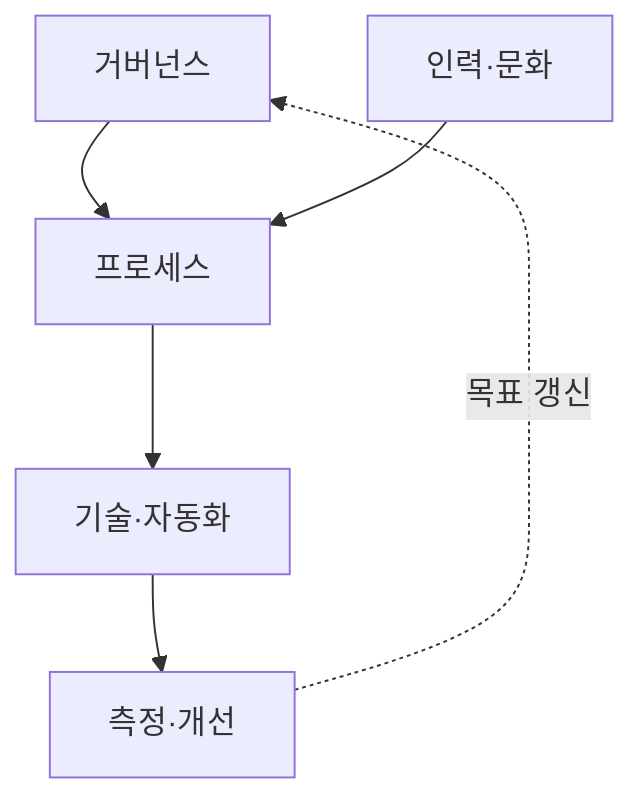
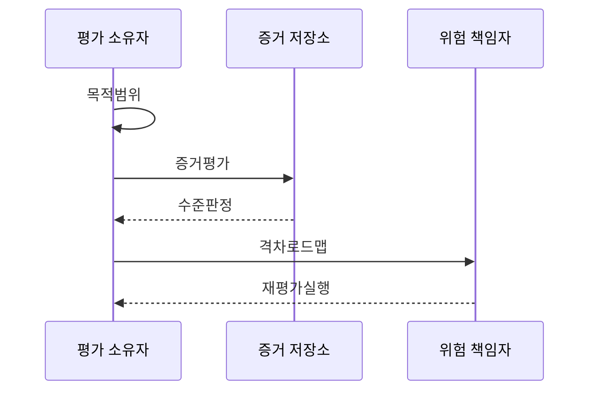

---
sidebar:
  order: 147
  label: "147. 보안 성숙도 모델 (Security Maturity Model)"
  badge:
    text: "미출제 · 50%"
    variant: note
title: 보안 성숙도 모델 (Security Maturity Model)
date: "2026-07-25T01:00:00+09:00"
tags:
  - notes-security
weight: 147
extra:
  question_no: "147"
  source_status: "미출제"
  source_history: ""
  priority: 50
  priority_note: "SAMM·BSIMM·C2M2 비교와 개선로드맵이 독립적임"
---

## 미리 알고가기

- **보안 성숙도 모델**: 조직 보안 역량을 단계와 영역으로 평가하는 틀임
- **역량(Capability)**: 보안 목적을 달성하도록 함께 작동하는 사람·프로세스·기술의 능력
- **성숙도 수준(Maturity Level)**: 역량이 제도화되고 일관되게 측정·개선되는 정도
- **목표 프로파일(Target Profile)**: 업무 위험·투자에 맞춘 영역별 목표 수준
- **소프트웨어 보증 성숙도 모델(Software Assurance Maturity Model, SAMM)**: '샘'으로 읽고 영문 머리글자를 단어처럼 묶어 개발·운영 보안 평가 모델을 표시
- **보안 내재화 성숙도 모델(Building Security In Maturity Model, BSIMM)**: '비심'으로 읽고 영문 머리글자를 단어처럼 묶어 실제 보안 활동의 관찰·비교 모델을 표시
- **사이버보안 역량 성숙도 모델(Cybersecurity Capability Maturity Model, C2M2)**: '시 투 엠 투'로 읽고 C와 M이 각각 두 번임을 숫자로 표시해 전사 역량 평가 모델을 구분
- **오픈 전 세계 응용 보안 프로젝트(Open Worldwide Application Security Project, OWASP)**: '오와스프'로 읽고 영문 머리글자를 단어처럼 묶어 SAMM을 관리하는 공개 보안 공동체를 표시
- **벤치마킹**: 다른 조직·기간의 관행과 비교해 상대적 위치와 개선 후보를 찾는 활동
- **표본 기간**: 반복 수행 여부를 확인하기 위해 증거를 수집하는 시작·종료 기간

## Ⅰ. 개요

- **정의/개념**: 현재·목표 역량의 개선 로드맵 도출
- **배경/필요성**: 실행 일관성·효과·지속 개선 평가

### 쉽게 이해하기 (학습용)

- 보안 기능이 있는지뿐 아니라 담당자가 바뀌어도 반복되고 결과를 측정해 고치는지를 봄

## Ⅱ. 특징

- 영역·관행·수준과 증거를 구조화한다.
- 현재·목표 수준 격차로 과제를 도출한다.
- 정책보다 실행·지속 개선을 평가한다.
- 재평가로 투자 결과를 갱신한다.

### 쉽게 이해하기 (학습용)

- 점수가 낮은 영역을 모두 먼저 고치지 않고 업무 위험과 의존성이 큰 격차부터 개선함

## Ⅲ. 아키텍처 및 구성요소

| 설계 요소 | 설명 |
|:---|:---|
| 거버넌스 | 목표·책임·정책·투자 의사결정함 |
| 인력·문화 | 역량·교육·책임추적 내재화함 |
| 프로세스 | 반복 절차·공급망·사고 흐름함 |
| 기술·자동화 | 통제·데이터·통합 효과 평가함 |
| 측정·개선 | 지표·감사·사고 학습·갱신함 |

> 요약: 조직 역량을 측정해 거버넌스 목표를 갱신

### 쉽게 이해하기 (학습용)

- 도구가 있어도 담당자·절차·지표와 연결되지 않으면 조직 역량으로 반복되기 어려움

## Ⅳ. 원리 및 절차 흐름도

| 절차 | 설명 |
|:---|:---|
| 목적범위 | 범위·사용 모델을 정함 |
| 증거평가 | 실제 수행 관행 확인함 |
| 수준판정 | 현황 판정·목표 정함 |
| 격차로드맵 | 우선순위·일정 계획함 |
| 재평가실행 | 이행·잔여 위험 갱신함 |

> 요약: 증거로 수준을 판정하고 위험 격차를 재평가

### 쉽게 이해하기 (학습용)

- 인터뷰 답변만 믿지 않고 실제 기록과 표본으로 반복 수행 여부를 확인해야 함

## Ⅴ. 종류 및 비교

| 비교축 | OWASP SAMM | BSIMM | C2M2 |
|:---|:---|:---|:---|
| 핵심 특징 | SW 수명주기 목표·관행 | 실제 SW 보안 활동 비교 | 전사 보안 도메인 역량 |
| 적용 기준 | 개발보안 로드맵을 설계할 때 | 동종 조직 활동과 비교할 때 | 전사 위험관리 역량을 개선할 때 |
| 주요 위험 | 맥락 없는 일률 목표 | 활동 수와 효과의 불일치 | 점수와 위험·증거 분리 |

> 요약: 증거 기반 역량 격차 개선 로드맵 수립함

### 쉽게 이해하기 (학습용)

- 모델마다 범위와 평가 방식이 달라 숫자를 직접 비교하기보다 목적에 맞는 모델을 선택해야 함

## Ⅵ. 실무 사례

- 행위·증거·표본 기준을 고정함
- 자산 위험·법적 의무별 목표를 차등화함
- 영역별 격차와 최소 기준을 함께 표시함
- 사고·복구·재발·우회 감소를 확인함

### 쉽게 이해하기 (학습용)

- 행위 정의·증거 기준·표본 기간을 고정해 평가자와 시점 간 편차를 줄임
- 최고 수준을 일률 목표로 삼지 않고 자산 위험·법적 의무별 목표를 정함
- 평균 점수와 함께 고위험 영역의 격차·최소 기준을 따로 표시함
- 활동량이 아니라 사고·복구·결함 재발·통제 우회 감소로 개선 효과를 확인함

## Ⅶ. 결론

- 증거 기반 역량·위험 격차로 개선 순서 결정

### 쉽게 이해하기 (학습용)

- 성숙도 점수는 성적표가 아니라 다음에 무엇을 왜 개선할지 합의하는 출발점임
