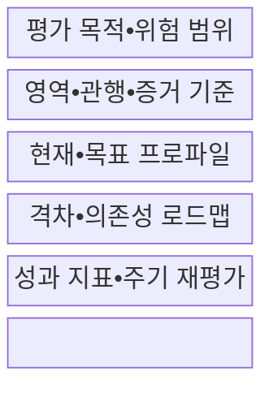
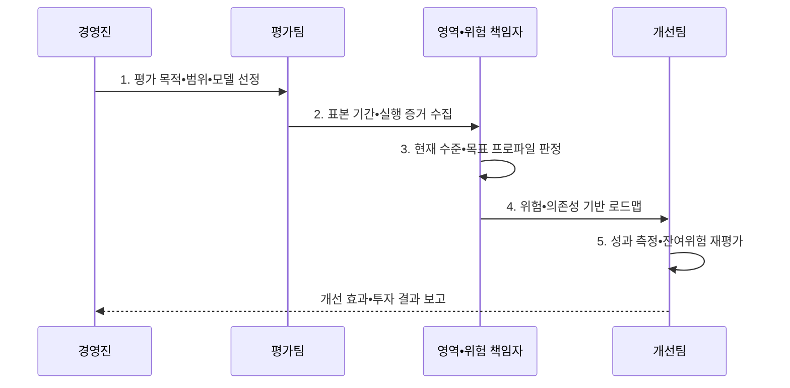

---
sidebar:
  order: 147
  label: "147. 보안 성숙도 모델 (Security Maturity Model)"
  badge:
    text: "미출제 • 50%"
    variant: note
title: 보안 성숙도 모델 (Security Maturity Model)
date: "2026-08-03T08:48:47+09:00"
tags:
  - notes-security
weight: 147
extra:
  question_no: "147"
  source_status: "미출제"
  source_history: ""
  priority: 50
  priority_note: "SAMM•BSIMM•C2M2 비교와 개선로드맵이 독립적임"
---

## Ⅰ. 개요

핵심 용어

- **보안 성숙도**: 보안 관행이 반복•측정•개선되는 조직 역량의 정도이다.
- **현재•목표 역량 평가**: 실행 증거로 현재 수준을 확인하고 업무 위험과 의무에 맞는 목표 수준을 정하는 평가 체계이다.

- 정의/개념: 증거로 **현재•목표 보안 역량을 평가하는 체계**
- 배경/필요성: 도구 보유 수만으로는 **보안 관행의 반복 역량과 개선 효과를 판단하기 어려움**

#### 한줄 요약

- 도구 보유 여부보다 담당자가 바뀌어도 관행이 반복되고 결과로 개선되는지를 봄

## Ⅱ. 특징

핵심 용어

- **역량•성숙도 수준**: 보안 목적을 달성하는 사람•프로세스•기술의 능력과 관행의 제도화 단계를 뜻한다.
- **위험 기반 우선순위화**: 단순히 점수가 낮은 항목보다 업무 영향과 의존성이 큰 역량 격차를 먼저 개선하는 방식이다.
- **지속 개선 검증**: 반복 평가와 성과 지표를 이용해 개선 활동이 실제 위험을 줄였는지 확인하는 과정이다.

- 영역•관행•수준•증거의 **구조화된 평가**
- 현재•목표 격차의 **위험 기반 우선순위화**
- 반복 평가•성과 지표의 **지속 개선 검증**

#### 한줄 요약

- 낮은 점수를 모두 먼저 고치지 않고 업무 위험과 의존성이 큰 격차부터 개선함

## Ⅲ. 구조 및 구성요소

핵심 용어

- **현재•목표 프로파일**: 증거로 확인한 현재 역량 상태와 업무 위험•의무에 맞춰 정한 목표 상태이다.
- **격차•의존성 로드맵**: 현재와 목표의 차이를 위험•선후관계에 따라 배열하고 책임자와 일정을 지정한 개선 계획이다.

| 구성요소 | 책임 |
|:---|:---|
| **평가 목적•위험 범위** | 자산•업무•법적 의무•**경계** |
| **영역•관행•증거 기준** | 행위•표본•**평가 척도** |
| **현재•목표 프로파일** | 현황•최소선•**목표 수준** |
| **격차•의존성 로드맵** | 위험•선후관계•**책임•일정** |
| **성과 지표•주기 재평가** | 효과•잔여위험•**목표 갱신** |

#### 한줄 요약

- 평가표•실행 증거•개선 책임•성과 지표가 연결돼야 조직 역량으로 반복됨

## Ⅳ. 흐름도

핵심 용어

- **증거 기반 평가**: 인터뷰뿐 아니라 실행 기록•성과 표본으로 관행의 반복 수행 여부를 확인하는 방식이다.
- **잔여위험 재평가**: 개선 조치를 수행한 뒤에도 남은 위험과 목표 수준의 적정성을 다시 판단하는 활동이다.

**동작 원리**

- **1. 평가 목적•범위•모델 선정**: 자산•업무•평가 단위 확정
- **2. 표본 기간•실행 증거 수집**: 기록•인터뷰•성과 표본 확인
- **3. 현재 수준•목표 프로파일 판정**: 증거 충족•위험 허용선 결정
- **4. 위험•의존성 기반 로드맵**: 과제•책임•일정•투자 배정
- **5. 성과 측정•잔여위험 재평가**: 효과 검증•목표 상태 갱신

#### 한줄 요약

- 인터뷰만 믿지 않고 정한 기간의 기록과 결과로 반복 수행 여부를 확인함

## Ⅴ. 종류 및 비교

핵심 용어

- **오픈 웹 애플리케이션 보안 프로젝트 소프트웨어 보증 성숙도 모델(Open Worldwide Application Security Project Software Assurance Maturity Model, OWASP SAMM)**: 소프트웨어 보증 관행의 현재 수준을 평가하고 단계별 개선 로드맵을 설계하는 모델이다.
- **소프트웨어 보안 구축 성숙도 모델(Building Security In Maturity Model, BSIMM)**: 여러 조직에서 관찰된 실제 소프트웨어 보안 활동을 비교•벤치마킹하는 모델이다.
- **미국 에너지부 사이버보안 역량 성숙도 모델(Department of Energy Cybersecurity Capability Maturity Model, DOE C2M2)**: 정보기술(Information Technology, IT)과 운영기술(Operational Technology, OT)을 포함한 전사 사이버보안 역량을 영역별로 개선하는 모델이다.

| 성숙도 모델 | OWASP SAMM v2 | BSIMM | DOE C2M2 v2.1 |
|:---|:---|:---|:---|
| **적용 기준** | SW 보증 **로드맵 설계** | 실제 활동 **벤치마킹** | 전사 IT•OT **역량 개선** |
| **핵심 특징** | **5개 기능•15개 관행** | 관찰 기반 **활동 비교** | **10개 영역•3개 MIL** |
| **한계** | **맥락 없는 일률 목표** | **활동 수와 효과 불일치** | **점수와 위험의 분리** |

> 요약: 범위•목적에 맞는 모델로 증거 기반 격차를 개선함

#### 한줄 요약

- 모델별 범위와 척도가 달라 점수를 직접 비교하지 말고 평가 목적에 맞춰 선택함

## Ⅵ. 실무 고려사항 및 대책

핵심 용어

- **미국 국립표준기술연구소 사이버보안 프레임워크(National Institute of Standards and Technology Cybersecurity Framework, NIST CSF)**: 조직 프로파일과 구현 티어를 이용해 현재•목표 보안 결과와 위험관리 수준을 표현하는 체계이다.
- **미국 국립표준기술연구소 특별간행물 1302(NIST Special Publication 1302, NIST SP 1302)**: NIST CSF 2.0 조직 프로파일을 작성하고 활용하는 지침이다.

| 문제 | 대책 | 효과 |
|:---|:---|:---|
| **SW 보증 역량 개선** | **OWASP SAMM v2 적용** | 관행별 **단계 로드맵** 확보 |
| **전사 IT•OT 역량 평가** | **DOE C2M2 v2.1 적용** | 10개 영역별 **격차 식별** |
| **위험관리 성숙도 표현** | **NIST CSF 2.0•SP 1302 적용** | **프로파일•티어 연계** |

#### 한줄 요약

- 금융사는 SAMM으로 개발보안을 평가하고 고위험 관행의 증거 격차부터 투자함

## Ⅶ. 결론

핵심 용어

- **위험 기반 로드맵**: 낮은 점수 전체가 아니라 업무 위험과 의존성이 큰 역량 격차부터 개선하는 계획이다.
- **모델 선택**: 소프트웨어 보증은 OWASP SAMM, 전사 IT•OT 역량은 DOE C2M2처럼 평가 범위와 목적에 맞는 성숙도 모델을 적용하는 결정이다.

- SW 보증은 **SAMM**, 전사 IT•OT는 **C2M2**, 고위험 격차부터 투자

#### 한줄 요약

- 성숙도 점수는 성적표가 아니라 다음에 무엇을 왜 개선할지 합의하는 출발점임
