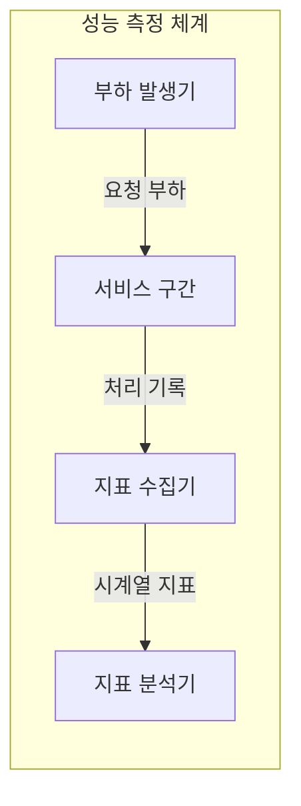
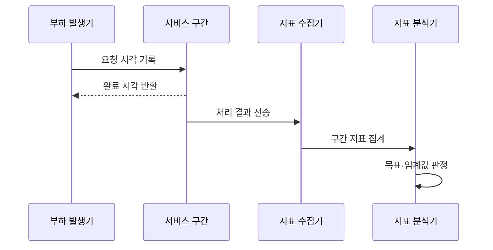

---
sidebar:
  order: 1
  label: "001. 시스템 성능 지표 - TPS·응답시간·처리량·가용성 (System KPI)"
  badge:
    text: "기출 · 70%"
    variant: note
title: "시스템 성능 지표 - TPS·응답시간·처리량·가용성 (System KPI)"
date: "2026-07-27T23:59:59+09:00"
tags:
  - "notes-evaluation"
weight: 1
extra:
  question_no: "001"
  source_status: "기출"
  source_history: "120회, 131회, 137회"
  priority: 70
  priority_note: "120·131·137회 반복, 성능 판단의 기본축"
---

## 미리 알고가기

- **핵심 성과 지표(Key Performance Indicator, KPI)**: 영문 머리글자를 딴 표기로 “케이피아이”로 읽으며, 서비스 목표 달성을 판정하는 수치
- **초당 트랜잭션 처리 건수(Transactions Per Second, TPS)**: 영문 머리글자를 딴 표기로 “티피에스”로 읽으며, 1초간 완료된 거래 수
- **초당 요청 처리 건수(Requests Per Second, RPS)**: 영문 머리글자를 딴 표기로 “알피에스”로 읽으며, 1초간 처리한 요청 수
- **응답시간(Response Time)**: 요청부터 응답까지 소요 시간
- **처리량(Throughput)**: 단위 시간 완료 작업량
- **가용성(Availability)**: 정상 제공 시간의 비율
- **백분위수(Percentile, p95·p99)**: “피구십오·피구십구”로 읽고 숫자는 해당 비율의 요청이 이 값 이하임을 나타내며, 꼬리 지연을 확인하는 지표
- **서비스 수준 목표(Service Level Objective, SLO)**: 영문 머리글자를 딴 표기로 “에스엘오”로 읽으며, 내부에서 정한 서비스 성능 목표
- **서비스 수준 협약(Service Level Agreement, SLA)**: 영문 머리글자를 딴 표기로 “에스엘에이”로 읽으며, 목표 위반 책임까지 정한 외부 약속
- **웹 애플리케이션 서버(Web Application Server, WAS)**: 영문 머리글자를 딴 표기로 “와스”로 읽으며, 업무 로직을 실행하는 서버
- **데이터베이스(Database, DB)**: 영문 머리글자를 딴 표기로 “디비”로 읽으며, 업무 데이터를 저장·조회하는 시스템
- **추적(Trace)**: 한 요청이 여러 구간을 지난 시간과 경로 기록입니다.

## Ⅰ. 개요

- 정의/개념: 용량·지연·가용성을 판정하는 측정 기준
- **배경/필요성**: 단일 평균값만으로 처리 한계·꼬리 지연·중단 구분 곤란

### 쉽게 이해하기 (학습용)
- 처리한 일의 양·대기 시간·중단 시간을 각각 숫자로 확인합니다.

## Ⅱ. 특징

- 처리량은 포화 후 정체돼 용량 한계를 드러낸다
- 응답시간은 부하 증가 시 큐 대기로 급증한다
- p95·p99와 가용성은 긴 지연과 서비스 중단을 구분한다

### 쉽게 이해하기 (학습용)
- 평균이 빨라도 일부 요청이 오래 기다리거나 서비스가 멈추면 다른 지표에서 드러납니다.

## Ⅲ. 아키텍처 및 구성요소

| 설계 요소 | 설명 |
|:---|:---|
| 부하 발생기 | 동시 사용자와 요청률을 재현함 |
| 서비스 구간 | 요청을 처리하고 구간 지연을 생성함 |
| 지표 수집기 | 완료 건수·지연·오류를 집계함 |
| 지표 분석기 | 측정값을 목표·임계값과 비교함 |

### 쉽게 이해하기 (학습용)
- 시험 요청을 보낸 뒤 각 구간의 처리 기록을 모아 목표 수치와 비교합니다.

## Ⅳ. 원리 및 절차 흐름도

| 절차 | 설명 |
|:---|:---|
| 요청 시각 기록 | 응답시간의 시작점을 저장함 |
| 완료 시각 반환 | 종료 시각과 성공 여부를 남김 |
| 처리 결과 전송 | 완료 건수·오류·구간 시간을 보냄 |
| 구간 지표 집계 | TPS·백분위수·가용성을 계산함 |
| 목표·임계값 판정 | 측정 결과의 충족 여부를 결정함 |

### 쉽게 이해하기 (학습용)
- 요청 시작과 완료 시각을 짝지어 지연을 구하고 완료 건수를 시간 단위로 합칩니다.

## Ⅴ. 시스템 성능 지표 비교

| 구분 | 처리량 | 응답시간 | 가용성 |
|:---|:---|:---|:---|
| 적용 기준 | 업무 거래 처리량 확인 | 사용자 체감 속도 측정 | 서비스 지속 여부 측정 |
| 핵심 특징 | 완료 건수로 처리 용량 판단 | 요청 시간으로 지연 판단 | 정상 시간으로 지속성 판단 |
| 한계 | 실패 건수 제외 | 평균의 꼬리 지연 은폐 | 짧은 측정 기간의 왜곡 |

> 요약: 처리량·지연·가용성은 서로 다른 한계를 측정

### 쉽게 이해하기 (학습용)
- 처리량은 시스템의 크기를, 응답시간은 사용자의 만족도를, 가용성은 서비스의 지속 여부를 대변합니다.

## Ⅵ. 실무 사례

1. 출시 전 부하 시험은 TPS·p99 지연 측정

### 쉽게 이해하기 (학습용)
- 출시 전에 가상 사용자를 늘리며 처리량과 느린 요청의 한계를 함께 찾습니다.

## Ⅶ. 결론

- 서비스 목표와 실제 처리 성능을 일관되게 판단하기 위해 **TPS·오류율·p95·p99 응답시간**을 함께 검토하고, 평균값이 숨기는 꼬리 지연까지 KPI로 관리해야 한다.

### 쉽게 이해하기 (학습용)
- 서비스의 목표 성능과 지연 한계치를 정의하고 이를 달성하기 위한 하드웨어 규모를 결정합니다.
