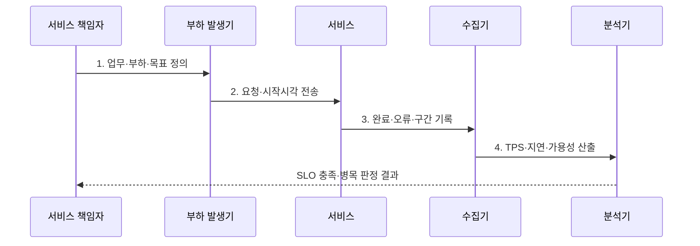

---
sidebar:
  order: 1
  label: "001. 시스템 성능 지표 - TPS·응답시간·처리량·가용성 (System KPI)"
  badge:
    text: "기출 · 70%"
    variant: note
title: "시스템 성능 지표 - TPS·응답시간·처리량·가용성 (System KPI)"
date: "2026-07-31T11:29:27+09:00"
tags:
  - "notes-evaluation"
weight: 1
extra:
  question_no: "001"
  source_status: "기출"
  source_history: "120회, 131회, 137회"
  priority: 70
  priority_note: "120·131·137회 반복, 성능 판단의 기본축"
---

## 미리 알고가기

- **핵심 성과 지표(Key Performance Indicator, KPI)**: 서비스 목표 달성 여부를 정량 판정하는 핵심 측정값이다.
- **서비스 수준 지표(Service Level Indicator, SLI)**: 가용성·지연처럼 서비스 수준을 직접 측정한 값이다.
- **초당 트랜잭션 처리 건수(Transactions Per Second, TPS)**: 1초에 성공적으로 완료한 업무 거래 수이다.
- **초당 요청 처리 건수(Requests Per Second, RPS)**: 1초에 처리한 개별 요청 수이다.
- **응답시간(Response Time)**: 요청을 보낸 시점부터 응답을 받을 때까지의 시간이다.
- **처리량(Throughput)**: 단위 시간에 완료한 작업량 또는 데이터량이다.
- **가용성(Availability)**: 합의한 시간 중 정상 서비스를 제공한 비율이다.
- **백분위수(Percentile, p95·p99)**: 요청의 95%·99%가 해당 값 이하에서 끝나는 꼬리 지연 지표이다.
- **서비스 수준 목표(Service Level Objective, SLO)**: SLI에 대해 내부적으로 달성해야 할 목표값이다.
- **서비스 수준 협약(Service Level Agreement, SLA)**: 측정 기준·목표·위반 책임을 고객과 합의한 계약이다.

## Ⅰ. 개요

- 정의/개념: 서비스 목표를 판정하는 **핵심 성과 지표(KPI)**
- 배경/필요성: 평균이 숨기는 **포화·꼬리 지연·중단 식별**

### 쉽게 이해하기 (학습용)

- 처리한 일의 양·기다린 시간·정상 제공 비율을 서로 다른 숫자로 확인함

## Ⅱ. 특징

- **측정 축**: 처리량·지연·오류의 다차원 성능 판단
- **분포 축**: 평균·p95·p99의 꼬리 지연 가시화
- **관리 축**: SLI·SLO·SLA의 목표·책임 추적

### 쉽게 이해하기 (학습용)

- 평균이 빨라도 일부 요청이 오래 기다리거나 실패하면 백분위수와 오류율에 드러남

## Ⅲ. 구조 및 구성요소

| 구성요소 | 책임 |
|:---|:---|
| 업무·측정 경계 | **거래·요청·기간·성공** 정의 |
| 처리량·성공·오류 | **TPS·RPS·오류율** 집계 |
| 평균·백분위 지연 | **평균·p95·p99** 분포 |
| 가용성·복구시간 | **정상 시간·중단·MTTR** 집계 |
| SLI·SLO·SLA | **측정값·목표·계약 책임** 연결 |

### 쉽게 이해하기 (학습용)

- 같은 거래·기간·성공 기준으로 측정해야 지표를 서로 비교할 수 있음

## Ⅳ. 흐름도

1. **업무·부하·목표 정의**: 거래·기간·성공·SLO 확정
2. **요청·시작시각 전송**: 동시성·요청률 재현
3. **완료·오류·구간 기록**: 종료시각·상태·추적 수집
4. **TPS·지연·가용성 산출**: 분모·백분위·중단 계산

### 쉽게 이해하기 (학습용)

- 요청 시작과 완료 기록을 짝지어 지연을 구하고 성공 건수를 시간 단위로 합침

## Ⅴ. 종류 및 비교

| 성능 지표 | 처리량 | 응답시간 | 가용성 |
|:---|:---|:---|:---|
| 적용 기준 | **업무 거래량** 확인 | **사용자 체감 속도** 측정 | **서비스 지속 여부** 측정 |
| 핵심 특징 | **완료 건수**로 처리 용량 판단 | **요청 시간**으로 지연 판단 | **정상 시간**으로 지속성 판단 |
| 한계 | **실패 건수** 제외 | 평균의 **꼬리 지연 은폐** | 짧은 **측정 기간 왜곡** |

> 요약: **처리량·지연·가용성**은 서로 다른 한계를 측정

### 쉽게 이해하기 (학습용)

- 처리량은 용량, 응답시간은 체감, 가용성은 지속성을 나타냄

## Ⅵ. 실무 고려사항 및 대책

| 고려사항 | 대책 | 효과 |
|:---|:---|:---|
| 거래·요청 경계 혼용으로 **TPS 과대 산정** | **업무 거래·성공·측정 기간**을 고정하고 RPS와 분리 | 처리량의 **분모·업무 의미 일관성** 확보 |
| 평균 응답시간이 일부 장기 지연을 숨기는 **꼬리 지연 은폐** | 평균과 **p95·p99·오류율** 병행 측정 | 사용자 체감 저하와 포화 구간 식별 |
| 정상 부하만 측정해 피크 용량을 오판하는 **부하 대표성 부족** | **피크 업무 비율·동시성·지속시간** 재현 | 목표 SLO를 만족하는 **실제 처리 용량** 검증 |

### 쉽게 이해하기 (학습용)

- 출시 전 부하를 늘리며 TPS가 멈추고 p99가 급증하는 포화점을 찾음

## Ⅶ. 결론

- 업무 경계별 **TPS·p99·가용성**을 SLO의 SLI로 채택

### 쉽게 이해하기 (학습용)

- 빠른 평균 하나가 아니라 용량·느린 요청·실패·중단을 함께 보고 규모를 결정함
