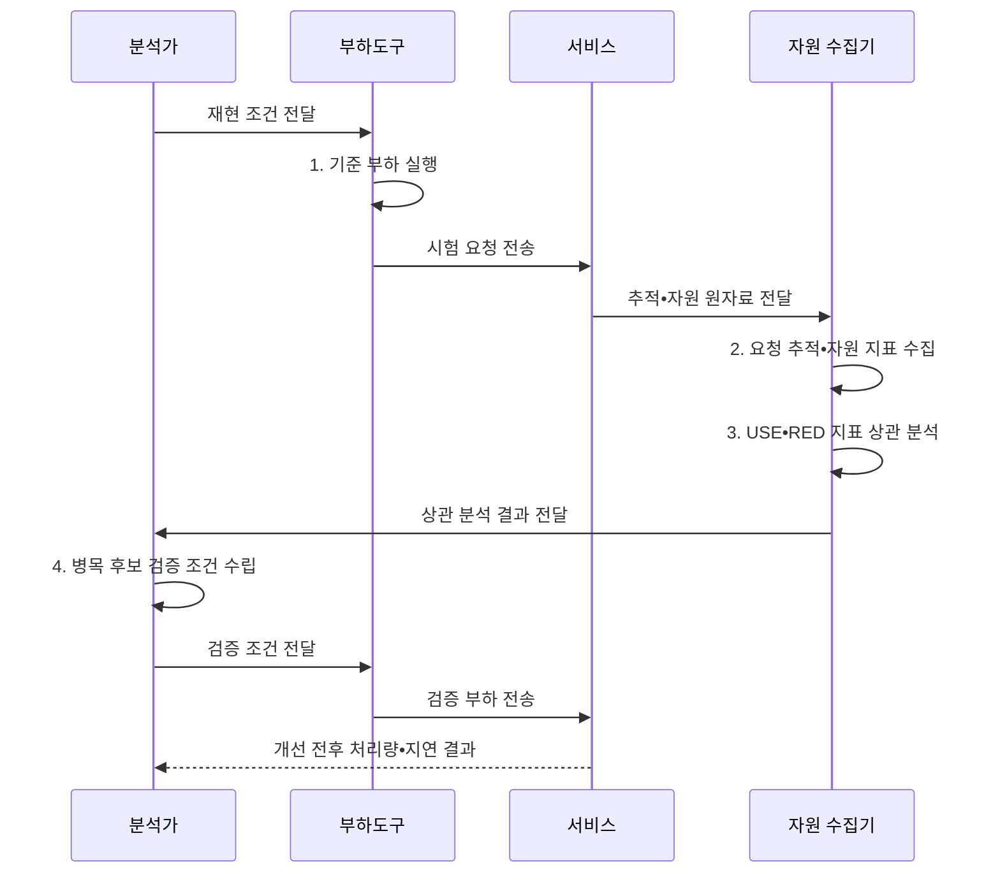

---
sidebar:
  order: 2
  label: "002. 병목 분석 (Bottleneck Analysis)"
  badge:
    text: "미출 • 50%"
    variant: note
title: "병목 분석 (Bottleneck Analysis)"
date: "2026-08-04T14:36:56+09:00"
tags:
  - "notes-evaluation"
weight: 2
extra:
  question_no: "002"
  source_status: "미출"
  source_history: ""
  priority: 50
  priority_note: "대기•자원 포화 원인을 찾는 핵심 진단법"
---

## Ⅰ. 개요

핵심 용어

- **병목**: 전체 처리량을 제한하거나 종단 응답시간을 지배하는 자원•구간이다.
- **임계 경로**: 여러 처리 구간 중 종단 응답시간을 결정하는 가장 긴 실행 경로이다.
- **병목 분석**: 처리량과 응답시간을 제한하는 자원•호출 경로•대기 구간을 측정해 임계 원인을 식별하는 성능 진단 활동이다.

- 정의/개념: **병목 분석** — 시스템의 처리량과 응답시간을 제한하는 자원•호출 경로•대기 구간을 측정하고 임계 원인을 식별하는 성능 진단 활동
- 배경/필요성: 평균 사용률만으로는 **대기•임계경로 원인 식별 불가**

#### 한줄 요약

- 여러 관 중 가장 좁은 관이 전체 유량을 정하듯 포화 구간이 성능을 제한함

## Ⅱ. 특징

핵심 용어

- **포화**: 자원이 즉시 처리하지 못한 작업이 대기열에 쌓인 상태이다.
- **상관 분석**: 요청 지연과 자원 포화를 같은 시간축에서 연결하여 원인 관계를 찾는 분석이다.
- **병목 이동 검증**: 한 구간을 개선한 뒤 부하곡선을 다시 측정해 다음 제한 자원과 전체 성능 변화를 확인하는 과정이다.

- **상관 축**: 요청 지연과 자원 포화를 동일 시간축으로 연결
- **진단 축**: USE•RED로 자원과 서비스를 양방향 분석
- **검증 축**: 개선 전후 부하곡선으로 병목 이동 확인

#### 한줄 요약
- 느린 시간대의 요청 경로와 자원 대기열을 겹쳐 실제로 막힌 지점을 찾습니다.

## Ⅲ. 구조 및 구성요소

핵심 용어

- **USE(Utilization, Saturation, Errors)**: 자원별 이용률•포화도•오류를 점검하는 방법론이다.
- **CPU(Central Processing Unit)**: 명령을 해석•실행하는 중앙처리장치이다.
- **RED(Requests, Errors, Duration)**: 서비스별 요청률•오류율•처리시간을 점검하는 방법론이다.
- **프로파일러**: 코드별 실행시간과 자원 사용량을 측정하는 도구이다.

| 구성요소 | 책임 |
|:---|:---|
| 업무 부하•기준선 | **요청률•동시성•정상 성능** 확정 |
| 서비스 RED 지표 | **요청률•오류율•처리시간** 집계 |
| 자원 USE 지표 | **이용률•포화도•오류** 집계 |
| 추적•프로파일 증거 | **임계경로•호출•핫스폿** 연결 |
| 개선•재측정 | **처리량•지연•병목 이동** 검증 |

#### 한줄 요약
- 자원 지표와 트랜잭션 추적 데이터를 결합하여 어떤 자원의 대기열이 성능을 제약하는지 판별합니다.

## Ⅳ. 흐름도

핵심 용어

- **분산 추적**: 하나의 요청이 여러 서비스에서 거친 구간과 시간을 연결한 기록이다.
- **핫스폿**: 실행시간이나 자원 사용이 집중되어 개선 효과가 큰 코드 구간이다.
- **재현 조건**: 병목 후보의 전후 결과를 비교할 수 있도록 요청률•데이터•환경을 동일하게 고정한 시험 조건이다.

**동작 원리**

1. **기준 부하 실행**: 요청률•데이터•환경 고정
2. **요청 추적•자원 지표 수집**: 종단 지연과 USE 지표 수집
3. **USE•RED 지표 상관 분석**: 서비스 지연과 자원 포화 연결
4. **병목 후보 검증 조건 수립**: 대기열•핫스폿 원인 검증 설계

#### 한줄 요약
- 지연이 발생한 시스템에서 자원 임계치를 확인하고, 포화도 검증을 거쳐 개선 효과를 재측정합니다.

## Ⅴ. 종류 및 비교

핵심 용어

- **자원 병목**: CPU•메모리•디스크•네트워크의 이용률과 대기 때문에 성능이 제한되는 상태이다.
- **DB(Database)**: 구조화 데이터를 저장•관리하는 데이터베이스이다.
- **구간 병목**: 특정 서비스•DB 호출이 종단 지연을 지배하는 상태이다.
- **자원•서비스 연계 분석**: 자원 중심 USE 방법론과 서비스 중심 RED 방법론을 함께 적용해 요청 지연의 내부 원인을 연결하는 방식이다.

| 병목 분석법 | USE 방법론 | RED 방법론 |
|:---|:---|:---|
| 적용 기준 | 서버 내부의 **자원 병목** 진단 | 마이크로서비스의 **구간 병목** 진단 |
| 핵심 특징 | 자원의 **이용률•포화도•오류** 분석 | 서비스의 **요청률•오류율•처리시간** 분석 |
| 한계 | **요청 경로 병목** 누락 | **내부 자원 원인** 누락 |

> 요약: 자원 중심의 **USE** 와 서비스 중심의 **RED** 연계

#### 한줄 요약
- 인프라 자원의 포화도를 측정하는 기법과 사용자 요청 상태를 분석하는 기법을 조합해 병목을 찾습니다.

## Ⅵ. 실무 고려사항 및 대책

핵심 용어

- **부하곡선**: 부하 증가에 따른 처리량•응답시간•오류•자원 사용 변화를 함께 나타낸 곡선이다.
- **병목 이동**: 한 자원을 개선한 뒤 다음으로 제한적인 자원이나 구간이 새 병목이 되는 현상이다.
- **ISO(International Organization for Standardization)**: 국제표준화기구이다.
- **IEC(International Electrotechnical Commission)**: 국제전기기술위원회이다.
- **ISO/IEC 25023**: 소프트웨어 제품 품질 측정 방법 표준이다.

| 문제 | 대책 | 효과 |
|:---|:---|:---|
| 사용률만 확인해 대기 원인을 놓치는 **포화 은폐** | **USE 방법론**으로 이용률•포화도•오류 측정 | 실제 **포화•오류 자원** 식별 |
| 평균 지연만 확인해 구간을 놓치는 **경로 은폐** | **RED 방법론**으로 요청률•오류율•시간 측정 | 비정상 **요청 경로** 식별 |
| 측정 정의가 달라 비교가 깨지는 **지표 불일치** | **ISO/IEC 25023:2016** 기준으로 지표 정렬 | 시간•자원 지표의 **비교 가능성** 확보 |

#### 한줄 요약
- 사용률만 보지 않고 대기열과 오류가 함께 늘어난 서버 자원을 찾습니다.

## Ⅶ. 결론

핵심 용어

- **가설 검증**: 관측값으로 병목 후보를 세우고 한 번에 한 요인을 변경하여 개선 전후를 비교하는 절차이다.
- **개선 우선순위**: 임계 경로에서 포화와 대기열이 처리량을 제한한다는 증거가 확인된 자원을 먼저 개선하는 결정이다.

- **임계경로의 포화•대기열** 이 처리량을 제한하면 해당 자원 우선 개선

#### 한줄 요약
- 가장 느린 구간과 가득 찬 자원을 파악해 전체 시스템의 처리 용량을 안전하게 늘립니다.
