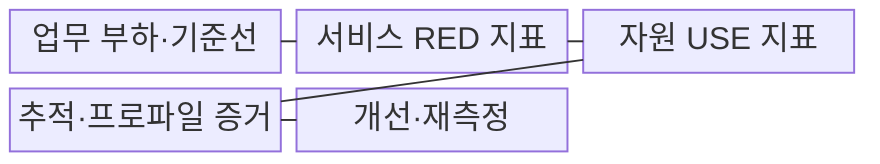
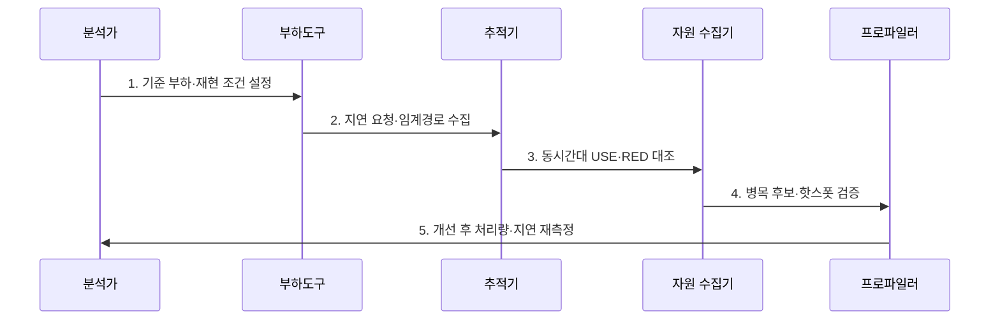

---
sidebar:
  order: 2
  label: "002. 병목 분석 (Bottleneck Analysis)"
  badge:
    text: "미출 · 50%"
    variant: note
title: "병목 분석 (Bottleneck Analysis)"
date: "2026-07-30T23:30:00+09:00"
tags:
  - "notes-evaluation"
weight: 2
extra:
  question_no: "002"
  source_status: "미출"
  source_history: ""
  priority: 50
  priority_note: "대기·자원 포화 원인을 찾는 핵심 진단법"
---

## 미리 알고가기

- **병목(Bottleneck)**: 전체 처리량을 제한하거나 응답시간을 지배하는 자원·구간이다.
- **USE 방법론(Utilization, Saturation, Errors)**: 자원별 이용률·포화도·오류를 점검하는 분석법이다.
- **RED 방법론(Rate, Errors, Duration)**: 서비스별 요청률·오류율·처리시간을 점검하는 분석법이다.
- **포화(Saturation)**: 자원이 즉시 처리하지 못해 작업이 대기열에 쌓인 상태이다.
- **임계 경로(Critical Path)**: 종단 응답시간을 직접 좌우하는 가장 긴 실행 경로이다.
- **프로파일러(Profiler)**: 코드별 실행시간과 자원 사용량을 측정하는 도구이다.
- **핫스폿(Hotspot)**: 실행시간이나 자원 사용이 집중된 코드 구간이다.
- **분산 추적(Distributed Tracing)**: 하나의 요청이 여러 서비스에서 거친 구간과 시간을 연결한 기록이다.
- **ISO/IEC 25023:2016**: 시간 동작·자원 이용 등 제품 품질 측정 방법을 제시한 국제표준이다.

## Ⅰ. 개요

- 정의/개념: 전체 성능을 제한하는 **자원·경로·대기 원인 식별**
- 배경/필요성: 근거 없는 증설을 막고 **제한 자원 개선**

### 쉽게 이해하기 (학습용)

- 여러 관 중 가장 좁은 관이 전체 유량을 정하듯 포화 구간이 성능을 제한함

## Ⅱ. 특징

- 요청 지연·자원 포화의 **동일 시간축 상관**
- USE·RED의 **자원·서비스 양방향 진단**
- 개선 전후 부하곡선의 **병목 이동 검증**

### 쉽게 이해하기 (학습용)
- 느린 시간대의 요청 경로와 자원 대기열을 겹쳐 실제로 막힌 지점을 찾습니다.

## Ⅲ. 구조 및 구성요소

| 구성요소 | 책임 |
|:---|:---|
| 업무 부하·기준선 | 요청률·동시성·정상 성능 |
| 서비스 RED 지표 | 요청률·오류율·처리시간 |
| 자원 USE 지표 | 이용률·포화도·오류 |
| 추적·프로파일 증거 | 임계경로·호출·핫스폿 |
| 개선·재측정 | 처리량·지연·병목 이동 |

### 쉽게 이해하기 (학습용)
- 자원 지표와 트랜잭션 추적 데이터를 결합하여 어떤 자원의 대기열이 성능을 제약하는지 판별합니다.

## Ⅳ. 흐름도

1. **기준 부하·재현 조건 설정**: 요청률·데이터·환경 고정
2. **지연 요청·임계경로 수집**: 종단·구간 지연 분해
3. **동시간대 USE·RED 대조**: 서비스·자원 포화 연결
4. **병목 후보·핫스폿 검증**: 대기열·코드 원인 확인
5. **개선 후 처리량·지연 재측정**: 효과·새 병목 판정

### 쉽게 이해하기 (학습용)
- 지연이 발생한 시스템에서 자원 임계치를 확인하고, 포화도 검증을 거쳐 개선 효과를 재측정합니다.

## Ⅴ. 종류 및 비교

| 병목 분석법 | USE 방법론 | RED 방법론 |
|:---|:---|:---|
| 적용 기준 | 서버 내부 자원 병목 진단 시 | 마이크로서비스 구간 병목 진단 시 |
| 핵심 특징 | 자원 이용률·포화도·오류 | 요청률·오류율·처리시간 |
| 한계 | 요청 경로 병목 누락 | 내부 자원 원인 누락 |

> 요약: 자원 중심의 USE와 서비스 중심의 RED를 연계 분석

### 쉽게 이해하기 (학습용)
- 인프라 자원의 포화도를 측정하는 기법과 사용자 요청 상태를 분석하는 기법을 조합해 병목을 찾습니다.

## Ⅵ. 실무 고려사항 및 대책

| 고려사항 | 대책 | 효과 |
|:---|:---|:---|
| 내부 자원 원인 탐색 | **USE 방법론 적용** | 포화·오류 자원 식별 |
| 서비스 체감 저하 탐색 | **RED 방법론 적용** | 요청 경로 이상 식별 |
| 측정 정의 불일치 | **ISO/IEC 25023:2016 참조** | 시간·자원 지표 정렬 |

### 쉽게 이해하기 (학습용)
- 사용률만 보지 않고 대기열과 오류가 함께 늘어난 서버 자원을 찾습니다.

## Ⅶ. 결론

- **임계경로·포화·대기열·처리량 변화**로 실제 병목을 판정한다.

### 쉽게 이해하기 (학습용)
- 가장 느린 구간과 가득 찬 자원을 파악해 전체 시스템의 처리 용량을 안전하게 늘립니다.
