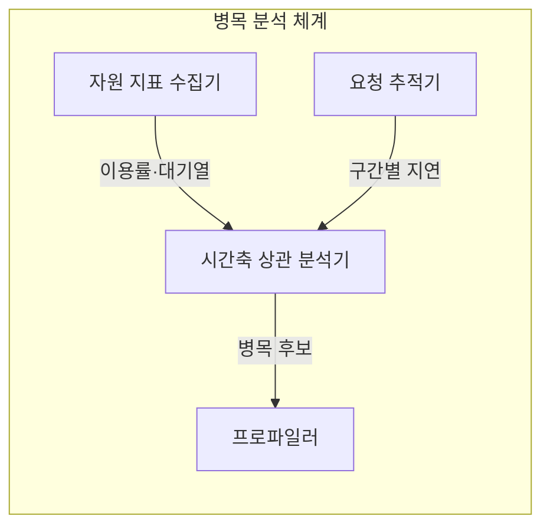
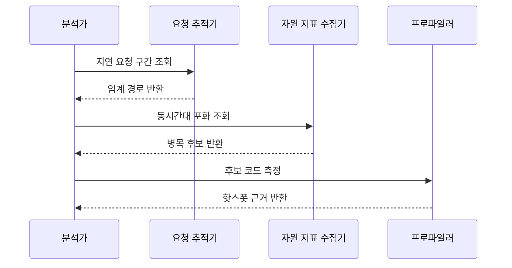

---
sidebar:
  order: 2
  label: "002. 병목 분석 (Bottleneck Analysis)"
  badge:
    text: "미출제 · 50%"
    variant: note
title: "병목 분석 (Bottleneck Analysis)"
date: "2026-07-25T01:10:00+09:00"
tags:
  - "notes-evaluation"
weight: 2
extra:
  question_no: "002"
  source_status: "미출제"
  source_history: ""
  priority: 50
  priority_note: "대기·자원 포화 원인을 찾는 핵심 진단법"
---

## 미리 알고가기

- **병목(Bottleneck)**: 전체 처리량을 제한하는 자원이나 구간입니다.
- **USE 방법론(Utilization, Saturation, Errors Method)**: 자원의 이용률·포화도·오류를 점검하는 분석법입니다.
- **RED 방법론(Rate, Errors, Duration Method)**: 서비스 요청률·오류율·처리시간을 점검하는 분석법입니다.
- **포화(Saturation)**: 자원이 즉시 처리하지 못해 요청이 대기하는 상태입니다.
- **임계 경로(Critical Path)**: 전체 응답시간을 직접 좌우하는 최장 처리 경로입니다.
- **중앙처리장치(Central Processing Unit, CPU)**: 명령을 실행하며 이용률과 대기열로 포화를 판단하는 자원입니다.
- **응용 프로그래밍 인터페이스(Application Programming Interface, API)**: 서비스가 요청과 응답을 주고받는 규약입니다.
- **초당 트랜잭션 처리 건수(Transactions Per Second, TPS)**: 1초에 완료한 거래 수입니다.
- **95백분위수(p95)**: 요청 95%가 이 값 이하에서 끝나는 지연 기준입니다.
- **프로파일러(Profiler)**: 코드별 실행시간과 자원 사용량을 측정하는 도구입니다.
- **핫스폿(Hotspot)**: 실행시간이나 자원 사용이 집중된 코드 구간입니다.

## Ⅰ. 개요

- 정의/개념: 전체 성능을 제한하는 포화 구간 식별
- **배경/필요성**: 비병목 증설은 전체 성능을 바꾸지 못함

### 쉽게 이해하기 (학습용)
- 여러 관을 연결해도 가장 좁은 관이 전체 유량을 정하듯 가장 먼저 포화되는 구간이 시스템 성능을 제한합니다.

## Ⅱ. 특징

- 구간 지연과 자원 포화를 시간축으로 연결한다
- 낮은 이용률도 긴 대기열과 함께 보면 포화다
- 병목 제거 후 다른 자원이 새 병목이 된다

### 쉽게 이해하기 (학습용)
- 느린 시간대의 요청 경로와 자원 대기열을 겹쳐 실제로 막힌 지점을 찾습니다.

## Ⅲ. 아키텍처 및 구성요소

| 설계 요소 | 설명 |
|:---|:---|
| 자원 지표 수집기 | 이용률·포화도·오류를 수집함 |
| 요청 추적기 | 요청별 구간 지연을 연결함 |
| 시간축 상관 분석기 | 지연과 자원 포화를 대조함 |
| 프로파일러 | 후보 구간의 코드 핫스폿을 찾음 |

### 쉽게 이해하기 (학습용)
- 자원 지표와 트랜잭션 추적 데이터를 결합하여 어떤 자원의 대기열이 성능을 제약하는지 판별합니다.

## Ⅳ. 원리 및 절차 흐름도

| 절차 | 설명 |
|:---|:---|
| 지연 요청 구간 조회 | 요청별 지연 구간을 분리함 |
| 임계 경로 반환 | 전체 지연을 좌우한 경로를 제시함 |
| 동시간대 포화 조회 | 같은 시간의 자원 대기를 찾음 |
| 병목 후보 반환 | 지연과 겹친 포화 자원을 제시함 |
| 후보 코드 측정 | 자원 사용이 집중된 코드를 측정함 |
| 핫스폿 근거 반환 | 병목을 일으킨 코드 구간을 확정함 |

### 쉽게 이해하기 (학습용)
- 지연이 발생한 시스템에서 자원 임계치를 확인하고, 포화도 검증을 거쳐 개선 효과를 재측정합니다.

## Ⅴ. 종류 및 비교

| 판단 기준 | USE 방법론 | RED 방법론 |
|:---|:---|:---|
| 핵심 특징 | 자원 이용률·포화도·오류 | 요청률·오류율·처리시간 |
| 적용 기준 | 서버 내부 자원 병목 진단 시 | 마이크로서비스 구간 병목 진단 시 |
| 주요 위험 | 요청 경로 병목 누락 | 내부 자원 원인 누락 |

> 요약: 자원 중심의 USE와 서비스 중심의 RED를 연계 분석

### 쉽게 이해하기 (학습용)
- 인프라 자원의 포화도를 측정하는 기법과 사용자 요청 상태를 분석하는 기법을 조합해 병목을 찾습니다.

## Ⅵ. 실무 사례

1. 서버 장애 분석은 USE로 포화 자원 식별
2. 서비스 지연 분석은 RED로 임계 경로 식별

### 쉽게 이해하기 (학습용)
- 사용률만 보지 않고 대기열과 오류가 함께 늘어난 서버 자원을 찾습니다.
- 요청이 지난 서비스마다 걸린 시간을 이어 가장 오래 잡아둔 구간을 찾습니다.

## Ⅶ. 결론

- 자원 포화·임계 경로를 겹쳐 병목 결정

### 쉽게 이해하기 (학습용)
- 가장 느린 구간과 가득 찬 자원을 파악해 전체 시스템의 처리 용량을 안전하게 늘립니다.
