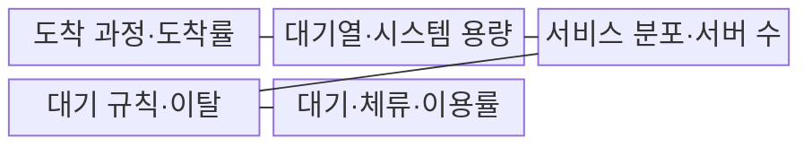
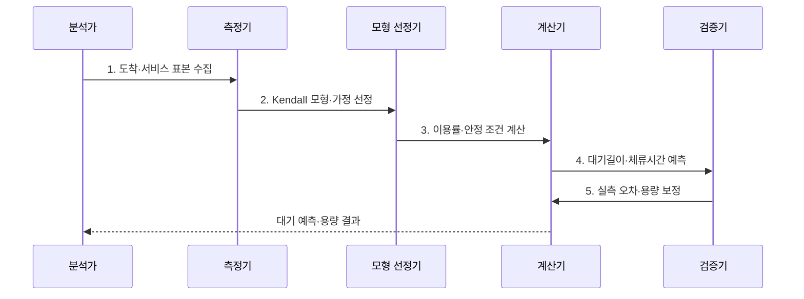

---
sidebar:
  order: 3
  label: "003. 큐잉 이론 - M/M/1·M/M/c (Queuing Theory)"
  badge:
    text: "기출 · 50%"
    variant: note
title: "큐잉 이론 - M/M/1·M/M/c (Queuing Theory)"
date: "2026-07-31T05:04:06+09:00"
tags:
  - "notes-evaluation"
weight: 3
extra:
  question_no: "003"
  source_status: "기출"
  source_history: "131회"
  priority: 50
  priority_note: "대기행렬 기반 용량·지연 계산의 고전 주제"
---

## 미리 알고가기

- **대기행렬 이론(Queueing Theory)**: 확률적 도착·서비스·대기 규칙으로 혼잡과 지연을 분석하는 이론이다.
- **도착률(Arrival Rate, $\lambda$)**: 단위 시간에 시스템으로 유입되는 평균 요청 수이다.
- **서비스율(Service Rate, $\mu$)**: 서버 하나가 단위 시간에 처리하는 평균 요청 수이다.
- **이용률(Utilization, $\rho$)**: 처리 능력 중 도착 부하가 차지하는 비율이다.
- **대기시간(Queueing Time, $W_q$)**: 요청이 서비스 시작 전 대기열에 머문 시간이다.
- **체류시간(System Time, $W$)**: 요청이 도착부터 처리 완료까지 시스템에 머문 시간이다.
- **Kendall 표기(A/S/c/K/N/D)**: 도착분포·서비스분포·서버 수·용량·모집단·규칙을 나타내는 대기행렬 표기법이다.
- **M/M/1**: 포아송 도착·지수 서비스·단일 서버를 가정한 모형이다.
- **M/M/c**: 포아송 도착·지수 서비스·병렬 서버 $c$개를 가정한 모형이다.
- **안정 조건(Stability Condition)**: 장기적으로 도착률이 총 서비스 능력보다 낮아 대기열이 발산하지 않는 조건이다.

## Ⅰ. 개요

- 정의/개념: 확률적 도착·서비스로 **대기길이·지연·용량 예측**
- 배경/필요성: 평균 부하만으로는 **포화 직전 대기 급증 예측 불가**

### 쉽게 이해하기 (학습용)

- 손님 도착 속도와 창구 처리 속도로 줄 길이와 대기시간을 계산함

## Ⅱ. 특징

- **혼잡 축**: 이용률이 포화에 접근하면 대기가 비선형 급증
- **용량 축**: 안정 조건으로 처리 용량과 서버 수 산정
- **가정 축**: 분포·용량·규칙 변화에 예측값 민감

### 쉽게 이해하기 (학습용)
- 처리 용량이 꽉 차기 직전에는 손님이 아주 조금만 더 와도 대기 줄이 걷잡을 수 없이 길어지는 성질이 있습니다.

## Ⅲ. 구조 및 구성요소

| 구성요소 | 책임 |
|:---|:---|
| 도착 과정·도착률 | **분포·평균·변동성** 측정 |
| 대기열·시스템 용량 | **대기 공간·차단 한계** 설정 |
| 서비스 분포·서버 수 | **처리시간·병렬 자원** 모델링 |
| 대기 규칙·이탈 | **FIFO·우선순위·포기** 규칙 정의 |
| 대기·체류·이용률 | **$L_q$·$W_q$·$W$·$\rho$** 산출 |

### 쉽게 이해하기 (학습용)
- 들어오는 부하와 이를 처리하는 서버 수, 그리고 서버의 처리 능력에 따라 대기실에 머무는 대기 시간이 결정됩니다.

## Ⅳ. 흐름도

1. **도착·서비스 표본 수집**: 평균·분포·변동성 측정
2. **Kendall 모형·가정 선정**: 서버·용량·규칙 명시
3. **이용률·안정 조건 계산**: $\lambda<c\mu$ 여부 확인
4. **대기길이·체류시간 예측**: $L_q$·$W_q$·$W$ 산출
5. **실측 오차·용량 보정**: 폭주·의존성 편차 반영

### 쉽게 이해하기 (학습용)
- 유입 트래픽과 처리 시간을 측정하여 큐잉 모델 공식을 적용하고, 이를 토대로 필요한 서버의 개수를 판별합니다.

## Ⅴ. 종류 및 비교

| 대기행렬 모형 | M/M/1 | M/M/c |
|:---|:---|:---|
| 적용 기준 | 단일 **DB·큐 병목** 분석 | **WAS·상담 풀** 용량 산정 |
| 핵심 특징 | **서버 1개** 순차 처리 | **서버 $c$개** 병렬 처리 |
| 한계 | **단일 서버 장애·포화** | **분배 불균형·공유 병목** |

> 요약: 단일 서버 **M/M/1**과 다중 서버 **M/M/c** 비교

### 쉽게 이해하기 (학습용)
- 단일 창구에서 차례를 기다리는 방식과 여러 창구가 하나의 대기선으로 연결된 방식의 효율성 차이를 분석합니다.

## Ⅵ. 실무 고려사항 및 대책

| 고려사항 | 대책 | 효과 |
|:---|:---|:---|
| 분포·용량을 생략해 결과가 달라지는 **가정 누락** | **Kendall A/S/c/K/N/D**를 명시 | 모형의 **해석·재현성** 확보 |
| 포화 모형을 정상 상태로 해석하는 **적용 오류** | **$\lambda<c\mu$ 안정 조건** 검증 | 대기열의 **장기 발산** 방지 |
| 독립·지수 가정과 실측이 다른 **분포 편차** | **실측·시뮬레이션**을 병행 | 용량의 **예측 오차** 감소 |

### 쉽게 이해하기 (학습용)
- 연결 여러 개가 함께 처리하는 요청 수와 기다리는 시간을 계산합니다.

## Ⅶ. 결론

- 단일 서버는 **M/M/1**, 병렬 풀은 **M/M/c**로 안정 서버 수 결정

### 쉽게 이해하기 (학습용)
- 손님이 오는 속도보다 처리 속도가 충분히 빠르도록 창구 수를 정합니다.
