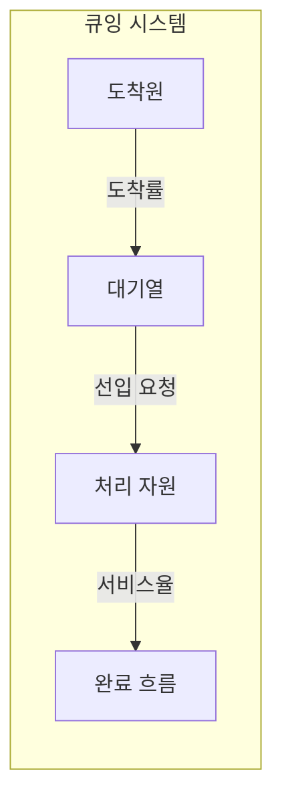
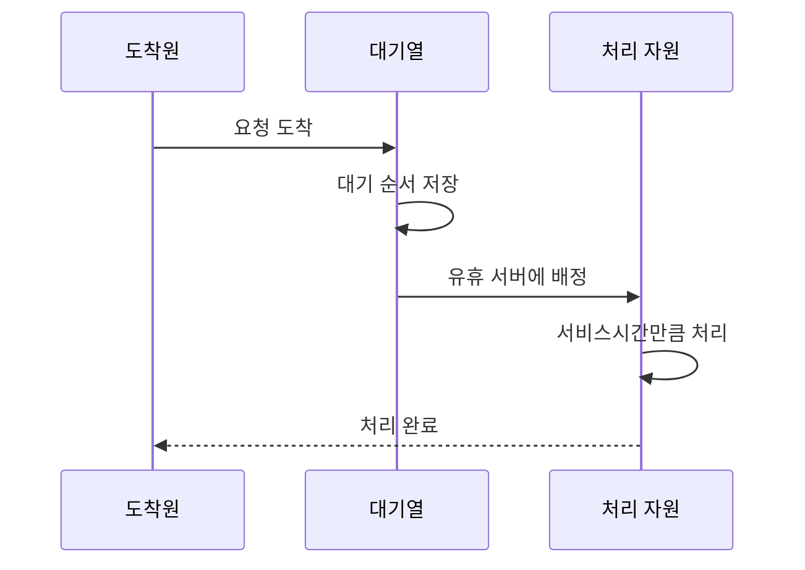

---
sidebar:
  order: 3
  label: "003. 큐잉 이론 - M/M/1·M/M/c (Queuing Theory)"
  badge:
    text: "기출 · 50%"
    variant: note
title: "큐잉 이론 - M/M/1·M/M/c (Queuing Theory)"
date: "2026-07-25T01:10:00+09:00"
tags:
  - "notes-evaluation"
weight: 3
extra:
  question_no: "003"
  source_status: "기출"
  source_history: "131회"
  priority: 50
  priority_note: "대기행렬 기반 용량·지연 계산의 고전 주제"
---

## 미리 알고가기

- **도착률(Arrival Rate, $\lambda$, 람다)**: 단위 시간에 유입되는 평균 요청 수입니다.
- **서비스율(Service Rate, $\mu$, 뮤)**: 서버 하나가 단위 시간에 처리하는 평균 요청 수입니다.
- **이용률(Utilization, $\rho$, 로)**: 처리 능력 중 도착 부하가 차지하는 비율입니다.
- **대기열(Queue)**: 처리 자리가 날 때까지 요청이 머무는 공간입니다.
- **체류시간(System Time, $W$)**: 요청이 대기부터 처리 완료까지 머문 시간입니다.
- **마르코프성(Markovian)**: 다음 사건이 현재 상태에만 의존하는 성질입니다.
- **M/M/1**: 포아송 도착·지수 서비스·서버 하나를 가정한 큐 모형입니다.
- **M/M/c**: 포아송 도착·지수 서비스·서버 $c$개를 가정한 큐 모형입니다.
- **포아송 도착(Poisson Arrival)**: 독립 요청이 일정 평균률로 도착하는 확률 모형입니다.
- **지수 서비스(Exponential Service)**: 처리시간이 지수분포를 따른다는 가정입니다.
- **웹 애플리케이션 서버(Web Application Server, WAS)**: 업무 로직을 실행하는 서버입니다.
- **데이터베이스(Database, DB)**: 데이터를 저장하고 질의를 처리하는 시스템입니다.
- **커넥션 풀(Connection Pool)**: 재사용할 데이터베이스 연결을 모아 둔 저장소입니다.

## Ⅰ. 개요

- **정의/개념**: 도착·처리 확률로 대기시간을 예측하는 이론
- **배경/필요성**: 포화 직전 대기 급증을 용량에 반영

### 쉽게 이해하기 (학습용)
- 은행 창구에 고객이 들어오는 속도와 창구 직원의 업무 처리 속도를 기반으로 고객이 얼마나 오래 대기할지 수학적으로 계산하는 이론입니다.

## Ⅱ. 특징

- 도착률이 서비스율에 가까우면 대기가 급증한다
- 안정 상태는 평균 도착률이 처리율보다 낮다
- 잘못된 분포 가정은 대기 예측을 왜곡한다

### 쉽게 이해하기 (학습용)
- 처리 용량이 꽉 차기 직전에는 손님이 아주 조금만 더 와도 대기 줄이 걷잡을 수 없이 길어지는 성질이 있습니다.

## Ⅲ. 아키텍처 및 구성요소

| 설계 요소 | 설명 |
|:---|:---|
| 도착원 | 확률분포에 따라 요청을 발생시킴 |
| 대기열 | 처리 전 요청과 대기 순서를 보관함 |
| 처리 자원 | 서버 수와 서비스율로 요청을 처리함 |
| 완료 흐름 | 처리된 요청이 시스템을 떠남 |

### 쉽게 이해하기 (학습용)
- 들어오는 부하와 이를 처리하는 서버 수, 그리고 서버의 처리 능력에 따라 대기실에 머무는 대기 시간이 결정됩니다.

## Ⅳ. 원리 및 절차 흐름도

| 절차 | 설명 |
|:---|:---|
| 요청 도착 | 도착률에 따라 요청이 유입됨 |
| 대기 순서 저장 | 모든 서버 사용 중이면 대기함 |
| 유휴 서버에 배정 | 빈 서버가 다음 요청을 가져감 |
| 서비스시간만큼 처리 | 서비스율에 따라 작업을 수행함 |
| 처리 완료 | 요청이 떠나고 다음 요청을 받음 |

### 쉽게 이해하기 (학습용)
- 유입 트래픽과 처리 시간을 측정하여 큐잉 모델 공식을 적용하고, 이를 토대로 필요한 서버의 개수를 판별합니다.

## Ⅴ. 종류 및 비교

| 판단 기준 | M/M/1 | M/M/c |
|:---|:---|:---|
| 핵심 특징 | 서버 1개 순차 처리 | 서버 $c$개 병렬 처리 |
| 적용 기준 | 단일 DB·큐 병목 분석 | WAS·상담 풀 용량 산정 |
| 주요 위험 | 단일 서버 장애·포화 | 분배 불균형·공유 병목 |

> 요약: 단일 서버 M/M/1과 다중 서버 M/M/c 동작 비교

### 쉽게 이해하기 (학습용)
- 단일 창구에서 차례를 기다리는 방식과 여러 창구가 하나의 대기선으로 연결된 방식의 효율성 차이를 분석합니다.

## Ⅵ. 실무 사례

1. WAS 커넥션 풀은 M/M/c로 대기시간 산정
2. 단일 DB 작업 큐는 M/M/1로 포화 예측

### 쉽게 이해하기 (학습용)
- 연결 여러 개가 함께 처리하는 요청 수와 기다리는 시간을 계산합니다.
- 한 번에 하나씩 처리하는 데이터베이스 작업의 대기 증가 시점을 예측합니다.

## Ⅶ. 결론

- 도착률·서비스율로 서버 수와 여유 용량 결정

### 쉽게 이해하기 (학습용)
- 손님이 오는 속도보다 처리 속도가 충분히 빠르도록 창구 수를 정합니다.
