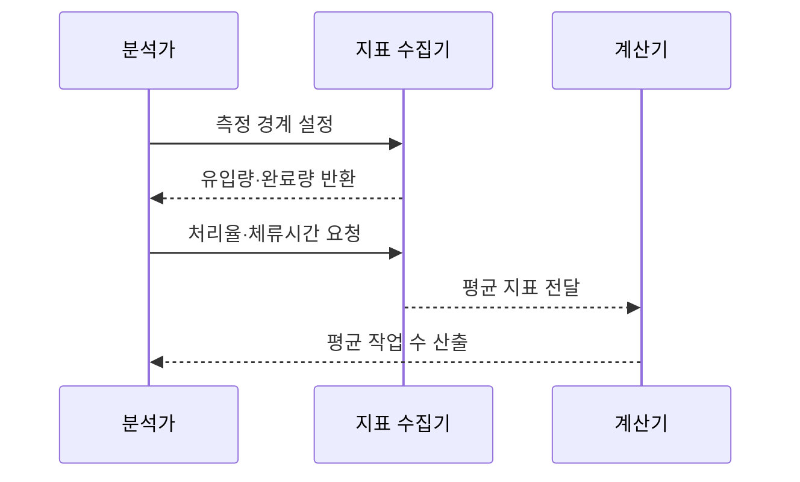

---
sidebar:
  order: 4
  label: "004. 리틀의 법칙 (Little's Law)"
  badge:
    text: "미출제 · 30%"
    variant: note
title: "리틀의 법칙 (Little's Law)"
date: "2026-07-25T01:10:00+09:00"
tags:
  - "notes-evaluation"
weight: 4
extra:
  question_no: "004"
  source_status: "미출제"
  source_history: ""
  priority: 30
  priority_note: "재공량·처리율·시간 관계를 잇는 실무 법칙"
---

## 미리 알고가기

- **평균 작업 수($L$, 엘)**: 시스템 안에 머무는 평균 작업 수입니다.
- **평균 처리율($\lambda$, 람다)**: 단위 시간에 완료되는 평균 작업 수입니다.
- **평균 체류시간($W$, 더블유)**: 작업이 유입부터 완료까지 머무는 평균 시간입니다.
- **안정 상태(Steady State)**: 장기간 유입량과 완료량이 같아 작업 수가 계속 늘지 않는 상태입니다.
- **생각시간(Think Time)**: 사용자가 응답을 받은 뒤 다음 요청까지 기다리는 시간입니다.
- **초당 트랜잭션 처리 건수(Transactions Per Second, TPS)**: 1초에 완료한 거래 수입니다.
- **99백분위수(p99)**: 요청 99%가 이 값 이하에서 끝나는 지연 기준입니다.
- **암달의 법칙(Amdahl's Law)**: 직렬 구간이 병렬화의 최대 성능 향상을 제한한다는 법칙입니다.
- **타임아웃(Timeout)**: 정한 시간 안에 응답이 없어 요청을 실패로 끝내는 처리입니다.

## Ⅰ. 개요

- 정의/개념: $L=\lambda W$로 평균 작업량 연결
- **배경/필요성**: 동시성·처리율·체류시간 상호 검산

### 쉽게 이해하기 (학습용)
- 맛집 안에 있는 손님 수는 매장 입구로 들어오는 손님 속도와 손님 한 명이 식사를 마치고 나갈 때까지 걸리는 시간을 곱한 것과 같다는 상식적인 규칙입니다.

## Ⅱ. 특징

- 세 평균값 중 두 값으로 나머지를 계산한다
- 작업 유형과 측정 경계를 동일하게 맞춘다
- 평균 관계라 순간 폭주·p99 지연은 숨겨진다
- 작업 수가 계속 늘면 안정 상태 가정이 깨진다

### 쉽게 이해하기 (학습용)
- 시스템을 뜯어보지 않고도 밖에서 측정한 처리량과 응답 시간만 있으면 시스템 내부에서 돌아가는 동시 처리 중인 작업량을 역산할 수 있습니다.

## Ⅲ. 아키텍처 및 구성요소

| 설계 요소 | 설명 |
|:---|:---|
| 평균 작업 수 $L$ | 시스템 경계 안의 평균 작업 수 |
| 평균 처리율 $\lambda$ | 경계를 떠난 단위 시간당 작업 수 |
| 평균 체류시간 $W$ | 경계 안에 머문 평균 시간 |
| 측정 경계 | 세 지표의 작업 유형·범위를 통일함 |

### 쉽게 이해하기 (학습용)
- 전체 처리 중인 작업의 개수는 유입되는 부하의 크기와 개별 작업이 머무는 시간의 상호작용으로 결정됩니다.

## Ⅳ. 원리 및 절차 흐름도

| 절차 | 설명 |
|:---|:---|
| 측정 경계 설정 | 같은 작업 유형과 시간 범위를 정함 |
| 유입량·완료량 반환 | 안정 상태 성립 여부를 확인함 |
| 처리율·체류시간 요청 | 완료율과 평균 체류시간을 구함 |
| 평균 지표 전달 | 단위가 맞는 두 값을 계산기에 보냄 |
| 평균 작업 수 산출 | $L=\lambda W$로 동시성을 계산함 |

### 쉽게 이해하기 (학습용)
- 시스템이 안정되어 큐가 계속 쌓이지 않는 상태를 확인한 후, 수집한 지표를 공식에 적용하여 용량 산정의 모순을 잡아냅니다.

## Ⅴ. 종류 및 비교

| 판단 기준 | 리틀의 법칙 | 암달의 법칙 |
|:---|:---|:---|
| 핵심 특징 | 평균 작업 수·처리율·시간 관계 | 직렬 구간·병렬 성능 관계 |
| 적용 기준 | 대기열 시스템의 용량 산정 시 | 시스템 병렬화 및 튜닝 효과 예측 시 |
| 주요 위험 | 불안정 상태에 적용 | 병렬 비율 추정 오류 |

> 요약: 리틀 법칙으로 동시성을 검산하고 암달 법칙으로 한계 예측

### 쉽게 이해하기 (학습용)
- 대기열 시스템의 정적 관계를 증명하는 물리적 법칙과 처리 흐름을 나누었을 때 도달하는 한계를 파악하는 성능 최적화 법칙을 비교합니다.

## Ⅵ. 실무 사례

1. 부하 시험은 TPS·응답시간으로 동시성 검산

### 쉽게 이해하기 (학습용)
- 시험에서 설정한 가상 사용자 수가 측정된 처리량과 지연에 맞는지 확인합니다.

## Ⅶ. 결론

- 안정 상태의 $L=\lambda W$로 동시성 검산

### 쉽게 이해하기 (학습용)
- 시스템 설계 시 처리량과 속도를 조합해 하드웨어 및 소프트웨어 커넥션의 최대 한도를 검증합니다.
