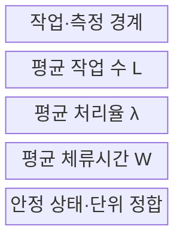
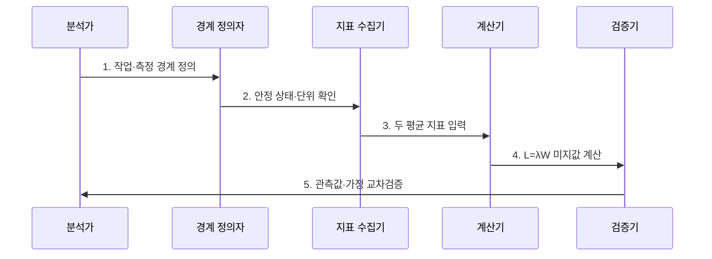

---
sidebar:
  order: 4
  label: "004. 리틀의 법칙 (Little's Law)"
  badge:
    text: "미출제 · 30%"
    variant: note
title: "리틀의 법칙 (Little's Law)"
date: "2026-07-25T01:10:00+09:00"
tags:
  - "notes-evaluation"
weight: 4
extra:
  question_no: "004"
  source_status: "미출제"
  source_history: ""
  priority: 30
  priority_note: "재공량·처리율·시간 관계를 잇는 실무 법칙"
---

## 미리 알고가기

- **리틀의 법칙(Little's Law)**: 안정 시스템에서 평균 작업 수·처리율·체류시간이 $L=\lambda W$를 만족한다는 법칙이다.
- **평균 작업 수($L$)**: 정한 시스템 경계 안에 존재하는 평균 작업 수이다.
- **평균 처리율($\lambda$)**: 같은 경계에서 단위 시간에 완료되는 평균 작업 수이다.
- **평균 체류시간($W$)**: 작업이 경계에 들어와 나갈 때까지 머무는 평균 시간이다.
- **안정 상태(Steady State)**: 장기 유입량과 완료량이 같아 작업 수가 계속 증가하지 않는 상태이다.
- **측정 경계(Measurement Boundary)**: 작업의 시작·종료·종류·관측 기간을 정한 범위이다.
- **John D. C. Little 1961 논문**: 정상 상태 대기행렬에서 $L=\lambda W$를 엄밀히 증명한 원전이다.

## Ⅰ. 개요

- 정의: $L=\lambda W$로 **평균 재공량·처리율·시간 연결**
- 목적: 동시성 산정과 **성능 지표 정합성 검산**

### 쉽게 이해하기 (학습)
- 맛집 안에 있는 손님 수는 매장 입구로 들어오는 손님 속도와 손님 한 명이 식사를 마치고 나갈 때까지 걸리는 시간을 곱한 것과 같다는 상식적인 규칙입니다.

## Ⅱ. 특징

- 세 평균값의 **단순·분포 독립 관계**
- 동일 작업·경계·기간의 **측정 정합성**
- 안정 상태 전제의 **평균값 검산 한계**

### 쉽게 이해하기 (학습)
- 시스템을 뜯어보지 않고도 밖에서 측정한 처리량과 응답 시간만 있으면 시스템 내부에서 돌아가는 동시 처리 중인 작업량을 역산할 수 있습니다.

## Ⅲ. 구조 및 구성요소

| 설계 요소 | 설명 |
|:---|:---|
| 작업·측정 경계 | 시작·종료·작업·기간 |
| 평균 작업 수 $L$ | 시스템 경계 안의 평균 작업 수 |
| 평균 처리율 $\lambda$ | 경계를 떠난 단위 시간당 작업 수 |
| 평균 체류시간 $W$ | 경계 안에 머문 평균 시간 |
| 안정 상태·단위 정합 | 유입·완료 수렴·시간 단위 |

### 쉽게 이해하기 (학습)
- 전체 처리 중인 작업의 개수는 유입되는 부하의 크기와 개별 작업이 머무는 시간의 상호작용으로 결정됩니다.

## Ⅳ. 흐름도

| 절차 | 설명 |
|:---|:---|
| 1. 작업·측정 경계 정의 | 시작·종료·작업 종류 확정 |
| 2. 안정 상태·단위 확인 | 유입·완료 수렴·단위 통일 |
| 3. 두 평균 지표 입력 | $L$·$\lambda$·$W$ 중 선택 |
| 4. L=λW 미지값 계산 | 동시성·처리율·시간 산출 |
| 5. 관측값·가정 교차검증 | 오차·폭주·타임아웃 점검 |

### 쉽게 이해하기 (학습)
- 시스템이 안정되어 큐가 계속 쌓이지 않는 상태를 확인한 후, 수집한 지표를 공식에 적용하여 용량 산정의 모순을 잡아냅니다.

## Ⅴ. 종류 및 비교

| 성능 법칙 | 리틀의 법칙 | 암달의 법칙 |
|:---|:---|:---|
| 적용 기준 | 대기열 시스템의 용량 산정 시 | 시스템 병렬화 및 튜닝 효과 예측 시 |
| 핵심 특징 | 평균 작업 수·처리율·시간 관계 | 직렬 구간·병렬 성능 관계 |
| 한계 | 불안정 상태에 적용 | 병렬 비율 추정 오류 |

> 요약: 리틀 법칙으로 동시성을 검산하고 암달 법칙으로 한계 예측

### 쉽게 이해하기 (학습)
- 대기열 시스템의 정적 관계를 증명하는 물리적 법칙과 처리 흐름을 나누었을 때 도달하는 한계를 파악하는 성능 최적화 법칙을 비교합니다.

## Ⅵ. 실무 고려사항 및 대책

| 고려사항 | 대책 | 효과 |
|:---|:---|:---|
| 공식의 원전·전제 | **Little 1961·안정 상태 명시** | 법칙 적용 타당성 확보 |
| 작업·기간 불일치 | **동일 측정 경계·단위 적용** | 지표 검산 오류 감소 |
| 평균의 순간 폭주 은폐 | **시계열·p99 병행 분석** | 꼬리 지연 보완 |

### 쉽게 이해하기 (학습)
- 시험에서 설정한 가상 사용자 수가 측정된 처리량과 지연에 맞는지 확인합니다.

## Ⅶ. 결론

- **안정 상태·동일 경계·단위·평균값**으로 $L=\lambda W$를 검산한다.

### 쉽게 이해하기 (학습)
- 시스템 설계 시 처리량과 속도를 조합해 하드웨어 및 소프트웨어 커넥션의 최대 한도를 검증합니다.
