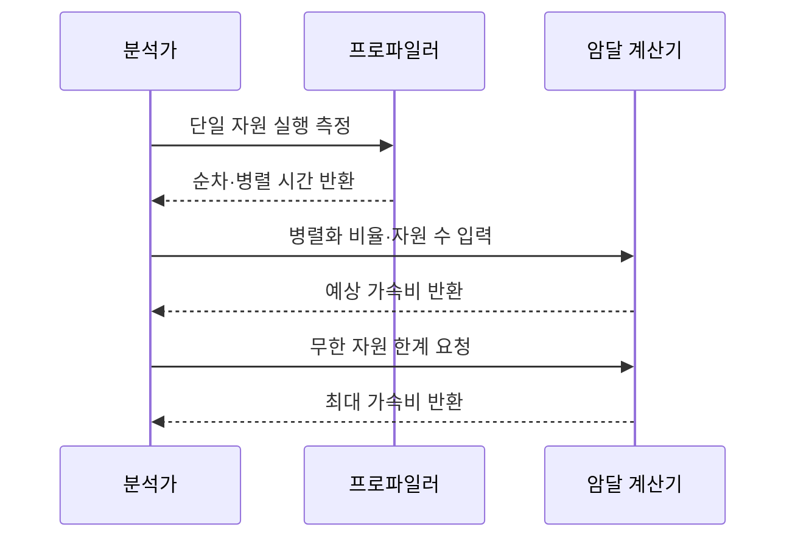

---
sidebar:
  order: 5
  label: "005. 암달의 법칙 - 병렬화 한계 (Amdahl's Law)"
  badge:
    text: "기출 · 50%"
    variant: note
title: "암달의 법칙 - 병렬화 한계 (Amdahl's Law)"
date: "2026-07-27T23:59:59+09:00"
tags:
  - "notes-evaluation"
weight: 5
extra:
  question_no: "005"
  source_status: "기출"
  source_history: "132회"
  priority: 50
  priority_note: "병렬화 한계와 투자 효율을 가르는 기출 공식"
---

## 미리 알고가기

- **병렬화 비율($P$, 피)**: Parallel의 첫 글자를 딴 기호로, 전체 실행시간 중 여러 자원으로 나눌 수 있는 비율
- **순차 비율($1-P$, 일 마이너스 피)**: 전체 비율 1에서 병렬화 비율을 뺀 값으로, 순차 처리해야 하는 비율
- **자원 수($N$, 엔)**: Number의 첫 글자를 딴 기호로, 병렬 처리에 투입한 코어나 작업자 수
- **가속비($S$, 에스)**: Speedup의 첫 글자를 딴 기호로, 단일 자원 실행시간을 병렬 실행시간으로 나눈 값
- **강한 확장성(Strong Scaling)**: 고정된 작업 크기에서 자원 증가 효과를 평가합니다.
- **구스타프슨의 법칙(Gustafson's Law)**: 자원과 함께 작업 크기도 늘릴 때의 가속비를 설명합니다.
- **락(Lock)**: 한 번에 한 실행 흐름만 공유 자원에 접근하게 하는 동기화 장치입니다.
- **입출력(Input/Output, I/O)**: 입력과 출력의 영문 첫 글자를 빗금으로 구분한 표기로 “아이오”로 읽으며, 저장장치나 네트워크와 데이터를 주고받는 처리
- **프로파일러(Profiler)**: 코드 구간별 실행시간과 자원 사용량을 측정하는 도구입니다.

## Ⅰ. 개요

- **정의/개념**: 순차 비율로 병렬 가속비 상한을 구하는 법칙
- **배경/필요성**: 코어 수만으로 순차 구간이 제한하는 성능 향상 상한 예측 곤란

### 쉽게 이해하기 (학습용)
- 아무리 일을 여러 사람이 나누어 처리해도, 혼자서 처리할 수밖에 없는 순서가 정해진 일의 분량이 전체 작업 시간을 결정한다는 법칙입니다.

## Ⅱ. 특징

- $S(N)$이 병렬 자원별 가속 효과를 계산한다
- 무한 자원도 순차 부분이 가속 상한을 정한다
- 순차 비율과 동기화·통신 비용이 실제 증설 이득을 낮춘다

### 쉽게 이해하기 (학습용)
- 컴퓨터 코어를 아무리 많이 늘려도 코드에 남아 있는 순차적인 연산 구간의 장벽 때문에 성능 속도가 무한정 빨라질 수 없습니다.

## Ⅲ. 아키텍처 및 구성요소

| 설계 요소 | 설명 |
|:---|:---|
| 순차 구간 $1-P$ | 자원 수와 무관하게 남는 실행시간 |
| 병렬 구간 $P$ | 자원 $N$개로 나눠 줄이는 실행시간 |
| 자원 수 $N$ | 병렬 구간을 분담하는 처리 자원 수 |
| 가속비 $S(N)$ | 단일 대비 병렬 실행시간의 감소 비율 |

### 쉽게 이해하기 (학습용)
- 일의 성격에 따라 나누어 처리할 수 있는 일과 순차적으로 기다려야 하는 대기 요인이 병렬 자원 수와 결합하여 가속 효과를 결정합니다.

## Ⅳ. 원리 및 절차 흐름도

| 절차 | 설명 |
|:---|:---|
| 단일 자원 실행 측정 | 기준 실행시간을 측정함 |
| 순차·병렬 시간 반환 | 나눌 수 없는 시간 비율을 구함 |
| 병렬화 비율·자원 수 입력 | $P$와 $N$을 산식에 넣음 |
| 예상 가속비 반환 | 자원 수별 실행시간 감소를 계산함 |
| 무한 자원 한계 요청 | 순차 구간만 남는 상태를 가정함 |
| 최대 가속비 반환 | $1/(1-P)$로 증설 한계를 제시함 |

### 쉽게 이해하기 (학습용)
- 소프트웨어 코드를 뜯어보고 병렬 처리가 불가능한 부분을 측정한 다음, 공식에 대입해 최대 성능 한계를 검토합니다.

## Ⅴ. 병렬 가속 법칙 비교

| 구분 | 암달의 법칙 | 구스타프슨 법칙 |
|:---|:---|:---|
| 적용 기준 | 실행시간 상한 분석 | 자원·작업 동시 확장 |
| 핵심 특징 | 고정 작업의 가속비 상한 | 확장 작업의 가속비 추정 |
| 한계 | 병렬 비율 추정 오류 | 작업 증가 가정 오류 |

> 요약: 작업 고정은 암달, 규모 확장은 구스타프슨

### 쉽게 이해하기 (학습용)
- 처리할 데이터양이 똑같이 묶여 있을 때와 자원이 늘어나면서 처리할 수 있는 데이터의 규모도 함께 커질 때를 나누어 적용합니다.

## Ⅵ. 실무 사례

1. 병렬 서버는 순차 락 비율로 증설 한계 계산
2. 연산 작업은 코어별 예상 가속비로 투자 비교

### 쉽게 이해하기 (학습용)
- 공유 자원 때문에 한 줄로 서는 시간이 많으면 서버를 늘려도 효과가 작습니다.
- 같은 계산을 여러 코어 수로 나눴을 때 줄어드는 시간을 먼저 계산합니다.

## Ⅶ. 결론

- 순차 비율로 병렬 자원 증설 한계 결정

### 쉽게 이해하기 (학습용)
- 자원 증설 효과를 정량적으로 계산하여 락을 제거하는 소프트웨어 튜닝과 인프라 확장 중 투자 효율성이 높은 결정을 내립니다.
