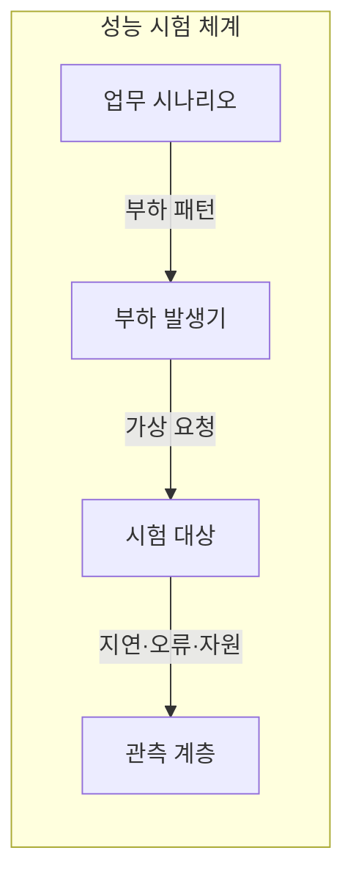
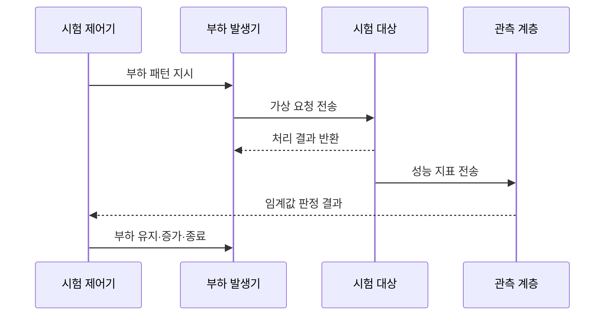

---
sidebar:
  order: 6
  label: "006. 성능 테스트 - 부하·스트레스·소크·스파이크 (Performance Testing Types)"
  badge:
    text: "기출 · 50%"
    variant: note
title: "성능 테스트 - 부하·스트레스·소크·스파이크 (Performance Testing Types)"
date: "2026-07-27T23:59:59+09:00"
tags:
  - "notes-evaluation"
weight: 6
extra:
  question_no: "006"
  source_status: "기출"
  source_history: "131회"
  priority: 50
  priority_note: "부하 유형별 실패점을 비교하는 반복 설계축"
---

## 미리 알고가기

- **부하 테스트(Load Test)**: 목표 부하에서 성능 기준 충족을 검증합니다.
- **스트레스 테스트(Stress Test)**: 한계 초과 부하에서 파괴점과 복구를 검증합니다.
- **소크 테스트(Soak Test)**: 장시간 부하에서 누수와 성능 저하를 검증합니다.
- **스파이크 테스트(Spike Test)**: 급격한 부하 변화에 대한 대응과 회복을 검증합니다.
- **초당 트랜잭션 처리 건수(Transactions Per Second, TPS)**: 시스템이 1초 동안 완료한 업무 거래 수를 나타내는 처리량 지표다.
- **응용 성능 관리(Application Performance Management, APM)**: 요청 경로와 자원 지표를 연계하여 성능 저하의 원인을 추적하는 관리 체계다.
- **자원 포화(Resource Saturation)**: 요청이 처리 능력을 넘어 대기열이 생긴 상태입니다.
- **가비지 컬렉션(Garbage Collection, GC)**: 더 이상 사용하지 않는 객체의 메모리를 자동으로 회수하는 처리다.
- **자바 가상 머신(Java Virtual Machine, JVM)**: 자바 바이트코드를 실행하고 힙 메모리와 런타임 자원을 관리하는 실행 환경이다.
- **힙(Heap)**: 실행 중 객체를 동적으로 저장하는 메모리 영역입니다.
- **자동 확장(Auto Scaling)**: 부하에 따라 실행 자원 수를 자동 조절합니다.

## Ⅰ. 개요

- 정의/개념: 부하 패턴별 성능·한계·회복 검증
- 기존 한계: 단일 목표 부하 시험만으로는 최대 처리 한계와 장기 실행에 따른 열화, 급격한 부하 이후의 복구 능력을 검증하기 어렵다.

### 쉽게 이해하기 (학습용)
- 시스템이 실제 운영 환경에서 겪을 수 있는 다양한 형태의 부하를 미리 가하여 시스템의 한계와 위험 요소를 검증합니다.

## Ⅱ. 특징

- 부하 크기·변화 속도·지속시간을 분리해 설계한다
- 실제 업무 비율과 데이터 편향을 재현한다
- 발생기 한계는 시험 대상 병목으로 오인될 수 있다

### 쉽게 이해하기 (학습용)
- 시스템의 처리 한계 속도뿐만 아니라 메모리 누수와 갑작스러운 사용자 폭주 시의 유연한 대처 능력까지 입체적으로 파악합니다.

## Ⅲ. 아키텍처 및 구성요소

| 설계 요소 | 설명 |
|:---|:---|
| 업무 시나리오 | 사용자 행동과 거래 비율을 정의함 |
| 부하 발생기 | 패턴에 따라 가상 요청을 생성함 |
| 시험 대상 | 요청을 처리하며 성능 상태를 노출함 |
| 관측 계층 | 지연·오류·자원 사용량을 수집함 |

### 쉽게 이해하기 (학습용)
- 가상의 사용자가 가하는 요청 시나리오를 바탕으로, 부하 발생기가 대상 시스템에 부하를 인가하고 이를 관측 모듈로 실시간 감시합니다.

## Ⅳ. 원리 및 절차 흐름도

| 절차 | 설명 |
|:---|:---|
| 부하 패턴 지시 | 크기·증가율·지속시간을 설정함 |
| 가상 요청 전송 | 업무 비율에 맞춰 요청을 보냄 |
| 처리 결과 반환 | 성공·오류·응답시간을 기록함 |
| 성능 지표 전송 | 자원 포화와 구간 지연을 보냄 |
| 임계값 판정 결과 | 목표 충족과 파괴점을 판단함 |
| 부하 유지·증가·종료 | 시험 유형의 다음 상태로 전환함 |

### 쉽게 이해하기 (학습용)
- 사전에 설정한 임계 목표를 토대로 실제 테스트 환경을 구축하고 부하 패턴을 입력하여 병목 원인을 진단합니다.

## Ⅴ. 성능 테스트 유형 비교

| 구분 | 부하 | 스트레스 | 소크 | 스파이크 |
|:---|:---|:---|:---|:---|
| 적용 기준 | 목표 성능 검증 | 파괴점·복구 검증 | 누수·열화 검증 | 급증 대응 검증 |
| 핵심 특징 | 목표 부하 유지 | 한계까지 증가 | 장시간 유지 | 부하 급증·감소 |
| 한계 | 업무 비율 왜곡 | 복구 불능 상태 | 시험시간 부족 | 증가율 재현 실패 |

> 요약: 부하 패턴별 운영 위험을 각각 검증하여 안정성 확보

### 쉽게 이해하기 (학습용)
- 시스템의 용량 한계와 파괴점을 찾는 기법, 시간 경과에 따른 자원 고갈을 찾는 기법, 순간적인 복구 성능을 확인하는 기법을 비교합니다.

## Ⅵ. 실무 사례

1. 행사 트래픽은 스파이크 시험으로 확장 지연 측정

### 쉽게 이해하기 (학습용)
- 대규모 할인 행사 등 특정 시점에 폭주하는 가상 사용자를 투입해 오토스케일링이 지연 없이 처리하는지 확인합니다.

## Ⅶ. 결론

- 운영 부하에서 성능 목표와 장애 한계를 검증하기 위해 **예상 사용자·부하 패턴·지속시간·한계점·복구 상태**를 검토하고, 목적에 맞게 부하·스트레스·내구·스파이크 시험을 활용해야 한다.

### 쉽게 이해하기 (학습용)
- 애플리케이션의 릴리즈 목적에 부합하는 위험 영역을 사전에 도출하고 그에 알맞은 부하 패턴 시나리오를 결정합니다.
