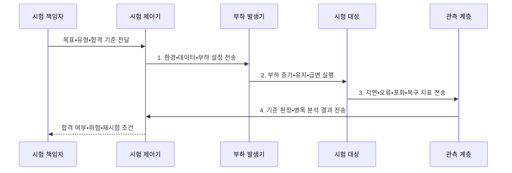

---
sidebar:
  order: 6
  label: "006. 성능 테스트 - 부하•스트레스•소크•스파이크 (Performance Testing Types)"
  badge:
    text: "기출 • 50%"
    variant: note
title: "성능 테스트 - 부하•스트레스•소크•스파이크 (Performance Testing Types)"
date: "2026-08-04T19:33:00+09:00"
tags:
  - "notes-evaluation"
weight: 6
extra:
  question_no: "006"
  source_status: "기출"
  source_history: "131회"
  priority: 50
  priority_note: "부하 유형별 실패점을 비교하는 반복 설계축"
---

## Ⅰ. 개요

핵심 용어

- **성능 테스트**: 운영 부하를 재현하여 처리량•지연•오류•자원 사용과 복구 특성을 검증하는 시험이다.
- **SLO(Service Level Objective)**: 서비스 수준 지표에 대해 달성할 목표값이다.
- **성능 테스트 유형**: 부하 패턴을 달리해 목표 성능•한계점•지속성•회복성을 구분하여 검증하는 시험 분류이다.

- 정의/개념: **성능 테스트 유형** — 부하•스트레스•스파이크•내구성 시험처럼 부하 패턴을 달리하여 목표 성능•한계점•지속성•회복성을 검증하는 시험 분류
- 배경/필요성: 단일 목표 부하로는 **장기 누수•급증 복구 검증 불가**

#### 한줄 요약
- 시스템이 실제 운영 환경에서 겪을 수 있는 다양한 형태의 부하를 미리 가하여 시스템의 한계와 위험 요소를 검증합니다.

## Ⅱ. 특징

핵심 용어

- **부하 패턴**: 사용자 수•요청률•증가율•지속시간을 조합한 시간대별 시험 부하 형태이다.
- **99백분위수(p99)**: 요청의 99%가 해당 값 이하에서 끝나는 꼬리 지연 지표이다.
- **자원 포화**: 요청이 처리 능력을 넘어 즉시 처리되지 못하고 대기열에 쌓인 상태이다.
- **회복성**: 급격한 부하나 장애가 해소된 뒤 지연•오류•자원 상태가 정상 수준으로 돌아오는 능력이다.

- **패턴 축**: 크기•증가율•지속시간에 따라 부하 유형 분리
- **재현 축**: 업무 비율•데이터•환경으로 운영 조건 재현
- **판정 축**: 처리량•지연•오류•복구를 함께 검증

#### 한줄 요약
- 시스템의 처리 한계 속도뿐만 아니라 메모리 누수와 갑작스러운 사용자 폭주 시의 유연한 대처 능력까지 입체적으로 파악합니다.

## Ⅲ. 구조 및 구성요소

핵심 용어

- **워크로드 모델**: 업무별 요청 비율•데이터•사용자 행동을 정의하여 운영 부하를 재현한 모형이다.
- **부하 생성기**: 정한 사용자 수나 요청률에 따라 시험 대상에 요청을 보내는 도구이다.
- **CPU(Central Processing Unit)**: 명령을 해석•실행하는 중앙처리장치이다.
- **I/O(Input/Output)**: 시스템과 외부 사이의 입출력이다.
- **모니터링**: 처리량•지연•CPU•메모리•I/O를 같은 시간축으로 수집한다.
- **판정 기준**: 파괴점•회복시간•합격선을 사전에 정해 시험 결과의 합격 여부를 일관되게 결정하는 기준이다.

| 구성요소 | 책임 |
|:---|:---|
| 목표•업무 시나리오 | **SLO•거래 비율•성공 기준** 정의 |
| 부하 패턴•프로파일 | **크기•증가율•지속시간** 설정 |
| 시험 환경•데이터 | **구성•초기 상태•데이터 편향** 통제 |
| 지연•오류•자원 지표 | **p99•실패율•포화도** 수집 |
| 중단•복구•판정 기준 | **파괴점•회복시간•합격선** 판정 |

#### 한줄 요약
- 가상의 사용자가 가하는 요청 시나리오를 바탕으로, 부하 발생기가 대상 시스템에 부하를 인가하고 이를 관측 모듈로 실시간 감시합니다.

## Ⅳ. 흐름도

핵심 용어

- **워밍업**: 캐시•연결•런타임이 안정되도록 본 측정 전에 부하를 미리 가하는 단계이다.
- **회복 검증**: 부하 감소나 장애 해소 뒤 응답시간•오류율•자원이 정상 상태로 돌아오는지 확인하는 절차이다.
- **시험 재현성**: 환경•데이터•부하 프로파일을 동일하게 통제해 개선 전후 결과를 비교할 수 있는 성질이다.

1. **환경•데이터•부하 설정 전송**: 운영 조건과 발생기 용량 검증
2. **부하 증가•유지•급변 실행**: 유형별 프로파일 재현
3. **지연•오류•포화•복구 지표 전송**: 시계열•추적•자원 수집
4. **기준 판정•병목 분석 결과 전송**: 합격선과 개선 조건 결정

#### 한줄 요약
- 사전에 설정한 임계 목표를 토대로 실제 테스트 환경을 구축하고 부하 패턴을 입력하여 병목 원인을 진단합니다.

## Ⅴ. 종류 및 비교

핵심 용어

- **부하 테스트**: 목표 부하에서 성능 기준 충족 여부를 검증하는 시험이다.
- **스트레스 테스트**: 한계 초과 부하에서 파괴점과 복구 능력을 검증하는 시험이다.
- **소크 테스트**: 장시간 부하에서 누수•열화를 검증하는 시험이다.
- **스파이크 테스트**: 급격한 부하 변화의 대응•회복을 검증하는 시험이다.
- **유형 선택**: 목표 성능은 부하, 파괴점과 복구는 스트레스, 장기 누수는 소크, 급증 대응은 스파이크 테스트로 검증하는 구분이다.

| 성능 테스트 | 부하 | 스트레스 | 소크 | 스파이크 |
|:---|:---|:---|:---|:---|
| 적용 기준 | **목표 성능** 검증 | **파괴점•복구** 검증 | **누수•열화** 검증 | **급증 대응** 검증 |
| 핵심 특징 | **목표 부하** 유지 | **한계 부하**까지 증가 | **장시간 부하** 유지 | 부하의 **급증•감소** |
| 한계 | **업무 비율** 왜곡 | **복구 불능 상태** 유발 | **시험시간 부족** | **증가율 재현** 실패 |

> 요약: **부하 패턴별 운영 위험** 을 분리해 안정성 검증

#### 한줄 요약
- 시스템의 용량 한계와 파괴점을 찾는 기법, 시간 경과에 따른 자원 고갈을 찾는 기법, 순간적인 복구 성능을 확인하는 기법을 비교합니다.

## Ⅵ. 실무 고려사항 및 대책

핵심 용어

- **TPS(Transactions Per Second)**: 1초 동안 성공적으로 완료한 업무 거래 수이다.
- **ISO(International Organization for Standardization)**: 국제표준화기구이다.
- **IEC(International Electrotechnical Commission)**: 국제전기기술위원회이다.
- **IEEE(Institute of Electrical and Electronics Engineers)**: 전기전자 기술표준을 개발하는 학회이다.
- **업무 비율**: 운영에서 각 거래 유형이 차지하는 빈도를 시험 부하에 반영한 비율이다.
- **시험 격리**: 성능 시험이 운영 서비스나 다른 시험의 자원과 데이터를 방해하지 않도록 환경을 분리하는 조치이다.
- **발생기 자체 포화**: 시험 대상보다 부하 생성기의 처리 능력이 먼저 한계에 도달해 대상의 병목으로 잘못 판단되는 상태이다.

| 문제 | 대책 | 효과 |
|:---|:---|:---|
| 계획•실행 조건이 달라지는 **시험 재현성 부족** | **ISO/IEC/IEEE 29119-2** 에 따라 증거 기록 | 계획•실행•완료의 **추적성** 확보 |
| 측정 정의가 달라지는 **판정 기준 불일치** | **ISO/IEC 25023:2016**으로 지표 정의 | 시간•자원•용량의 **정량 비교** |
| 부하 도구가 먼저 막히는 **발생기 자체 포화** | **발생기 여유 용량•분산 실행** 검증 | 대상의 **거짓 병목** 방지 |

#### 한줄 요약
- 대규모 할인 행사 등 특정 시점에 폭주하는 가상 사용자를 투입해 오토스케일링이 지연 없이 처리하는지 확인합니다.

## Ⅶ. 결론

핵심 용어

- **파괴점**: 부하 증가 시 성능 기준을 더 이상 만족하지 못하거나 오류가 급증하는 지점이다.
- **ISO/IEC/IEEE 29119-2**: 테스트 계획•설계•실행•완료 프로세스 표준이다.
- **시험 목적별 선택**: 용량•파괴점은 부하•스트레스, 누수•급증은 소크•스파이크 시험으로 확인하는 결정이다.

- **용량•파괴점** 은 부하•스트레스, **누수•급증** 은 소크•스파이크 선택

#### 한줄 요약
- 애플리케이션의 릴리즈 목적에 부합하는 위험 영역을 사전에 도출하고 그에 알맞은 부하 패턴 시나리오를 결정합니다.
