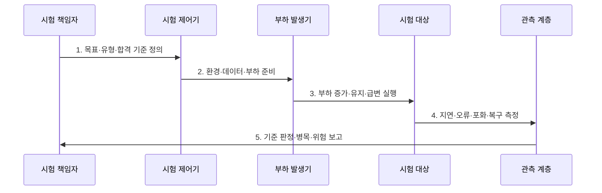

---
sidebar:
  order: 6
  label: "006. 성능 테스트 - 부하·스트레스·소크·스파이크 (Performance Testing Types)"
  badge:
    text: "기출 · 50%"
    variant: note
title: "성능 테스트 - 부하·스트레스·소크·스파이크 (Performance Testing Types)"
date: "2026-07-30T23:30:00+09:00"
tags:
  - "notes-evaluation"
weight: 6
extra:
  question_no: "006"
  source_status: "기출"
  source_history: "131회"
  priority: 50
  priority_note: "부하 유형별 실패점을 비교하는 반복 설계축"
---

## 미리 알고가기

- **부하 테스트(Load Test)**: 목표 부하에서 성능 기준 충족을 검증합니다.
- **스트레스 테스트(Stress Test)**: 한계 초과 부하에서 파괴점과 복구를 검증합니다.
- **소크 테스트(Soak Test)**: 장시간 부하에서 누수와 성능 저하를 검증합니다.
- **스파이크 테스트(Spike Test)**: 급격한 부하 변화에 대한 대응과 회복을 검증합니다.
- **초당 트랜잭션 처리 건수(Transactions Per Second, TPS)**: 시스템이 1초 동안 완료한 업무 거래 수를 나타내는 처리량 지표다.
- **응용 성능 관리(Application Performance Management, APM)**: 요청 경로와 자원 지표를 연계하여 성능 저하의 원인을 추적하는 관리 체계다.
- **자원 포화(Resource Saturation)**: 요청이 처리 능력을 넘어 대기열이 생긴 상태입니다.
- **가비지 컬렉션(Garbage Collection, GC)**: 더 이상 사용하지 않는 객체의 메모리를 자동으로 회수하는 처리다.
- **자바 가상 머신(Java Virtual Machine, JVM)**: 자바 바이트코드를 실행하고 힙 메모리와 런타임 자원을 관리하는 실행 환경이다.
- **힙(Heap)**: 실행 중 객체를 동적으로 저장하는 메모리 영역입니다.
- **자동 확장(Auto Scaling)**: 부하에 따라 실행 자원 수를 자동 조절합니다.
- **ISO/IEC/IEEE 29119-2:2021**: 테스트 계획·감시·설계·실행·완료 프로세스를 정의한 국제표준이다.
- **ISO/IEC 25023:2016**: 시간 동작·자원 이용·용량의 품질 측정 방법을 제시한 국제표준이다.

## Ⅰ. 개요

- 정의: 부하 패턴별 **성능 목표·파괴점·회복 검증**
- 목적: 운영 전 **포화·누수·폭주·복구 위험 식별**

### 쉽게 이해하기 (학습)
- 시스템이 실제 운영 환경에서 겪을 수 있는 다양한 형태의 부하를 미리 가하여 시스템의 한계와 위험 요소를 검증합니다.

## Ⅱ. 특징

- 크기·증가율·지속시간의 **부하 패턴 분리**
- 업무 비율·데이터·환경의 **운영 조건 재현**
- 처리량·지연·오류·복구의 **다중 판정**

### 쉽게 이해하기 (학습)
- 시스템의 처리 한계 속도뿐만 아니라 메모리 누수와 갑작스러운 사용자 폭주 시의 유연한 대처 능력까지 입체적으로 파악합니다.

## Ⅲ. 구조 및 구성요소

| 구성요소 | 책임 |
|:---|:---|
| 목표·업무 시나리오 | SLO·거래 비율·성공 기준 |
| 부하 패턴·프로파일 | 크기·증가율·지속시간 |
| 시험 환경·데이터 | 구성·초기상태·데이터 편향 |
| 지연·오류·자원 지표 | p99·실패율·포화도 |
| 중단·복구·판정 기준 | 파괴점·회복시간·합격선 |

### 쉽게 이해하기 (학습)
- 가상의 사용자가 가하는 요청 시나리오를 바탕으로, 부하 발생기가 대상 시스템에 부하를 인가하고 이를 관측 모듈로 실시간 감시합니다.

## Ⅳ. 흐름도

### 동작 원리

1. **목표·유형·합격 기준 정의**: SLO·파괴점·회복 목표 확정
2. **환경·데이터·부하 준비**: 운영 조건·발생기 용량 검증
3. **부하 증가·유지·급변 실행**: 유형별 프로파일 재현
4. **지연·오류·포화·복구 측정**: 시계열·추적·자원 수집
5. **기준 판정·병목·위험 보고**: 개선·재시험 조건 결정

### 쉽게 이해하기 (학습)
- 사전에 설정한 임계 목표를 토대로 실제 테스트 환경을 구축하고 부하 패턴을 입력하여 병목 원인을 진단합니다.

## Ⅴ. 종류 및 비교

| 성능 테스트 | 부하 | 스트레스 | 소크 | 스파이크 |
|:---|:---|:---|:---|:---|
| 적용 기준 | 목표 성능 검증 | 파괴점·복구 검증 | 누수·열화 검증 | 급증 대응 검증 |
| 핵심 특징 | 목표 부하 유지 | 한계까지 증가 | 장시간 유지 | 부하 급증·감소 |
| 한계 | 업무 비율 왜곡 | 복구 불능 상태 | 시험시간 부족 | 증가율 재현 실패 |

> 요약: 부하 패턴별 운영 위험을 각각 검증하여 안정성 확보

### 쉽게 이해하기 (학습)
- 시스템의 용량 한계와 파괴점을 찾는 기법, 시간 경과에 따른 자원 고갈을 찾는 기법, 순간적인 복구 성능을 확인하는 기법을 비교합니다.

## Ⅵ. 실무 고려사항 및 대책

| 고려사항 | 대책 | 효과 |
|:---|:---|:---|
| 시험 프로세스 재현성 | **ISO/IEC/IEEE 29119-2 적용** | 계획·실행·완료 증거 확보 |
| 성능 측정 기준 | **ISO/IEC 25023:2016 적용** | 시간·자원·용량 정량화 |
| 발생기 자체 포화 | **발생기 여유·분산 검증** | 거짓 병목 방지 |

### 쉽게 이해하기 (학습)
- 대규모 할인 행사 등 특정 시점에 폭주하는 가상 사용자를 투입해 오토스케일링이 지연 없이 처리하는지 확인합니다.

## Ⅶ. 결론

- **목표·부하 패턴·지속시간·파괴점·복구**로 시험 유형을 결정한다.

### 쉽게 이해하기 (학습)
- 애플리케이션의 릴리즈 목적에 부합하는 위험 영역을 사전에 도출하고 그에 알맞은 부하 패턴 시나리오를 결정합니다.
