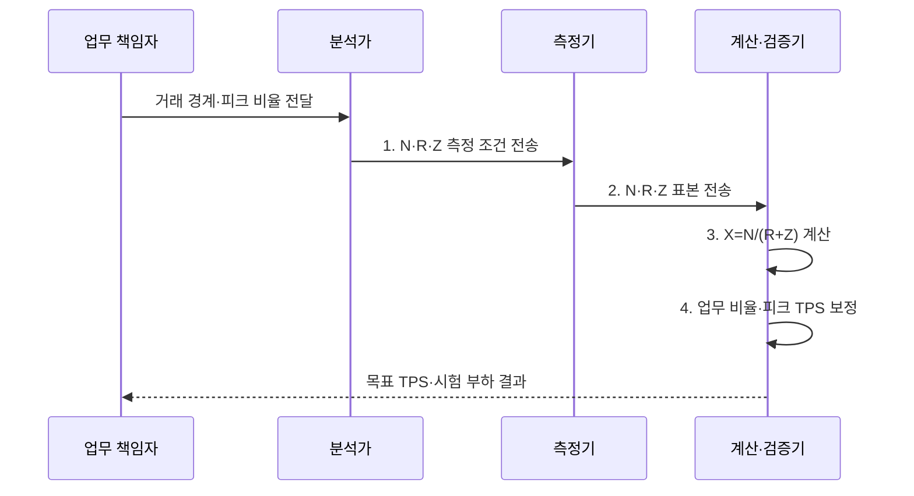

---
sidebar:
  order: 7
  label: "007. TPS 계산 - 동시 사용자·응답 시간 공식 (TPS Calculation)"
  badge:
    text: "기출 · 50%"
    variant: note
title: "TPS 계산 - 동시 사용자·응답 시간 공식 (TPS Calculation)"
date: "2026-08-02T12:07:00+09:00"
tags:
  - "notes-evaluation"
weight: 7
extra:
  question_no: "007"
  source_status: "기출"
  source_history: "131회"
  priority: 50
  priority_note: "동시 사용자와 응답시간으로 처리량을 산정"
---

## Ⅰ. 개요

핵심 용어

- **초당 트랜잭션 처리 건수(TPS)**: 시스템이 1초 동안 성공적으로 완료한 업무 거래 수이다.
- **폐쇄형 부하**: 고정된 사용자들이 요청·응답·생각시간의 주기를 반복하는 부하 모형이다.

- 정의/개념: **TPS 산정**은 폐쇄형 사용자 모델에서 동시 사용자 수 $N$을 응답시간 $R$과 생각시간 $Z$의 합으로 나눈 $X=N/(R+Z)$로 처리율을 구하는 계산 방식
- 배경/필요성: 가입자 수만으로는 **생각시간을 반영한 TPS 산출 불가**

#### 한줄 요약
- 시스템을 사용하는 가상 사용자 수와 사용자가 반응하는 시간, 그리고 서버가 처리하는 속도를 조합하여 1초에 서버가 몇 건의 요청을 처리해야 하는지 계산하는 기법입니다.

## Ⅱ. 특징

핵심 용어

- **대화형 응답시간 법칙**: 폐쇄형 부하에서 동시 사용자·처리량·응답시간·생각시간이 $N=X(R+Z)$를 만족하는 관계이다.
- **동시 사용자($N$)**: 같은 기간에 요청 주기를 반복하며 시스템과 상호작용하는 사용자 수이다.

- **관계 축**: $N=X(R+Z)$로 동시성과 처리량 연결
- **경계 축**: 업무 거래 TPS와 내부 요청 RPS 분리
- **보정 축**: 피크·업무 비율·생각시간으로 부하 현실화

#### 한줄 요약
- 사용자가 화면을 보고 대기하는 시간(Think Time)이 길어질수록 서버에 부하가 도달하는 주기가 길어져 1초당 트랜잭션 수가 줄어집니다.

## Ⅲ. 구조 및 구성요소

핵심 용어

- **응답시간($R$)**: 요청 전송부터 응답 수신까지 걸린 시간이다.
- **생각시간($Z$)**: 사용자가 응답을 받은 뒤 다음 요청을 보내기까지 기다리는 시간이다.
- **처리량($X$)**: 단위 시간에 완료한 업무 거래의 수이다.

| 구성요소 | 책임 |
|:---|:---|
| 업무 거래 경계 | TPS로 셀 **성공 업무 단위** 정의 |
| 동시 사용자 N | 요청 주기를 반복하는 **사용자 수 $N$** 측정 |
| 응답시간 R | 요청부터 응답까지 **응답시간 $R$** 측정 |
| 생각시간 Z | 다음 요청 전 **사용자 대기 $Z$** 측정 |
| 처리량 X·피크 보정 | **TPS·업무 비율·집중률** 산출 |

#### 한줄 요약
- 전체 처리 건수는 동시 사용자 수라는 입력값과, 서버의 응답 속도 및 사용자의 조작 대기 시간이라는 제약 요인에 의해 계산됩니다.

## Ⅳ. 흐름도

핵심 용어

- **사용자 요청 주기**: 한 사용자가 요청·응답·생각시간을 거쳐 다음 요청으로 돌아오는 반복 구간이다.
- **업무 혼합**: 여러 거래 유형을 운영 빈도에 맞게 조합한 부하 구성이다.

1. **N·R·Z 측정 조건 전송**: 성공 거래와 집중 시간 확정
2. **N·R·Z 표본 전송**: 사용자 수와 주기 분포 수집
3. **X=N/(R+Z) 계산**: 폐쇄형 평균 TPS 산출
4. **업무 비율·피크 TPS 보정**: 거래별 최대 부하 변환

#### 한줄 요약
- 서비스의 목표 시나리오를 정의하고 핵심 변수를 측정한 후, 폐쇄형 공식을 이용해 TPS를 도출하고 실제 측정값과 비교합니다.

## Ⅴ. 종류 및 비교

핵심 용어

- **폐쇄형 부하 모델**: 응답이 끝난 사용자가 생각시간 뒤 다음 요청을 보내도록 동시 사용자 수를 고정하는 모델이다.
- **개방형 부하 모델**: 응답 완료 여부와 무관하게 정한 요청률로 새 요청이 도착하는 모델이다.
- **초당 요청 처리 건수(RPS)**: 시스템이 1초 동안 처리한 개별 API·HTTP 요청 수이다.

| 부하 생성 모델 | 동시 사용자 모델 | 요청률 기반 모델 |
|:---|:---|:---|
| 적용 기준 | 웹의 **실제 사용자 행동** 모사 | API의 **기계적 요청 처리량** 산정 |
| 핵심 특징 | **사용자 요청 주기**로 부하 생성 | 정한 **요청률**로 부하 생성 |
| 한계 | **생각시간 설정** 왜곡 | 지연과 무관한 **과부하** 유발 |

> 요약: 사용자 행동은 **폐쇄형**, 기계 요청은 **요청률 기반** 적용

#### 한줄 요약
- 사람이 화면을 보며 동작하는 주기를 고려하는 계산법과 기계가 일정 속도로 요청을 쏟아붓는 방식의 처리량 계산법을 비교합니다.

## Ⅵ. 실무 고려사항 및 대책

핵심 용어

- **업무 거래와 내부 요청**: 사용자 목적 하나를 완료하는 거래와 이를 구성하는 여러 API 요청을 구분한 단위이다.
- **피크 계수**: 평균 처리량을 최대 예상 처리량으로 높이기 위해 적용하는 배수이다.

| 문제 | 대책 | 효과 |
|:---|:---|:---|
| 생각시간을 빼서 TPS가 커지는 **폐쇄형 부하 오류** | **$N=X(R+Z)$** 적용 | 동시성과 TPS의 **정합성** 확보 |
| 업무 거래와 내부 요청을 섞는 **경계 혼동** | **업무 TPS·호출 RPS** 분리 | 용량의 **과대·과소 산정** 방지 |
| 평균이 집중 시간대를 숨기는 **피크 은폐** | **집중률·업무 비율** 보정 | **최대 부하** 현실화 |

#### 한줄 요약
- 메인 페이지 로드라는 업무 단위 TPS와 그 과정에서 내부 마이크로서비스가 호출하는 각각의 요청당 초당 횟수를 구분합니다.

## Ⅶ. 결론

핵심 용어

- **부하 현실화**: 실제 동시 사용자·응답시간·생각시간·업무 비율을 공식과 시험 모델에 반영하는 작업이다.
- **과부하**: 요청 도착률이 시스템의 완료 능력을 넘어 대기와 오류가 계속 증가하는 상태이다.

- 사용자 행동은 **N/(R+Z)**, 기계 호출은 **RPS**로 목표 부하 산정

#### 한줄 요약
- 시스템 설계 시 사용자의 체감 응답 속도와 행동 주기를 반영한 현실적인 성능 목표를 계산합니다.
