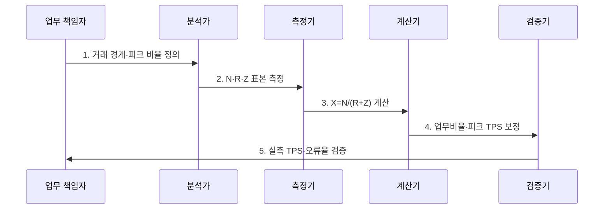

---
sidebar:
  order: 7
  label: "007. TPS 계산 - 동시 사용자·응답 시간 공식 (TPS Calculation)"
  badge:
    text: "기출 · 50%"
    variant: note
title: "TPS 계산 - 동시 사용자·응답 시간 공식 (TPS Calculation)"
date: "2026-07-30T23:30:00+09:00"
tags:
  - "notes-evaluation"
weight: 7
extra:
  question_no: "007"
  source_status: "기출"
  source_history: "131회"
  priority: 50
  priority_note: "동시 사용자와 응답시간으로 처리량을 산정"
---

## 미리 알고가기

- **초당 트랜잭션 처리 건수(Transactions Per Second, TPS)**: 시스템이 1초 동안 완료한 업무 거래 수를 나타내는 처리량 지표다.
- **동시 사용자(Concurrent Users, $N$, 엔)**: 같은 기간에 요청 주기를 반복하는 사용자 수입니다.
- **응답시간(Response Time, $R$, 알)**: 요청 전송부터 응답 수신까지 걸린 시간입니다.
- **생각시간(Think Time, $Z$, 제트)**: 응답을 받은 뒤 다음 요청까지 기다리는 시간입니다.
- **폐쇄형 부하(Closed Workload)**: 고정 사용자들이 요청·응답·대기를 반복하는 모형입니다.
- **초당 요청 처리 건수(Requests Per Second, RPS)**: 시스템이 1초 동안 처리한 개별 요청 수를 나타내는 처리량 지표다.
- **실사용자 모니터링(Real User Monitoring, RUM)**: 실제 사용자의 요청 경로와 체감 지연을 수집·분석하는 방식이다.
- **응용 프로그래밍 인터페이스(Application Programming Interface, API)**: 시스템 간 기능 호출과 데이터 교환을 위한 규격이다.
- **대화형 응답시간 법칙(Interactive Response Time Law)**: 폐쇄형 부하에서 $N=X(R+Z)$가 성립하는 관계이다.
- **리틀의 법칙(Little's Law)**: 안정 시스템의 평균 작업 수·처리율·체류시간을 연결하는 법칙이다.

## Ⅰ. 개요

- 정의: 폐쇄형 사용자 주기로 **$X=N/(R+Z)$ 산출**
- 목적: 동시 사용자를 **목표 TPS·시험 부하로 변환**

### 쉽게 이해하기 (학습)
- 시스템을 사용하는 가상 사용자 수와 사용자가 반응하는 시간, 그리고 서버가 처리하는 속도를 조합하여 1초에 서버가 몇 건의 요청을 처리해야 하는지 계산하는 기법입니다.

## Ⅱ. 특징

- $N=X(R+Z)$의 **동시성·처리량 관계**
- 거래·요청 경계의 **TPS·RPS 분리**
- 피크·업무비율·생각시간의 **부하 보정**

### 쉽게 이해하기 (학습)
- 사용자가 화면을 보고 대기하는 시간(Think Time)이 길어질수록 서버에 부하가 도달하는 주기가 길어져 1초당 트랜잭션 수가 줄어집니다.

## Ⅲ. 구조 및 구성요소

| 구성요소 | 책임 |
|:---|:---|
| 업무 거래 경계 | TPS로 셀 성공 업무 단위 |
| 동시 사용자 $N$ | 요청 주기를 반복하는 사용자 |
| 응답시간 $R$ | 요청부터 응답까지 시간 |
| 생각시간 $Z$ | 다음 요청 전 사용자 대기 |
| 처리량 $X$·피크 보정 | TPS·업무비율·집중률 |

### 쉽게 이해하기 (학습)
- 전체 처리 건수는 동시 사용자 수라는 입력값과, 서버의 응답 속도 및 사용자의 조작 대기 시간이라는 제약 요인에 의해 계산됩니다.

## Ⅳ. 흐름도

### 동작 원리

1. **거래 경계·피크 비율 정의**: 성공 거래·집중 시간 확정
2. **N·R·Z 표본 측정**: 사용자 수·주기 분포 수집
3. **X=N/(R+Z) 계산**: 폐쇄형 평균 TPS 산출
4. **업무비율·피크 TPS 보정**: 거래별·최대 부하 변환
5. **실측 TPS·오류율 검증**: 공식 가정·용량 재조정

### 쉽게 이해하기 (학습)
- 서비스의 목표 시나리오를 정의하고 핵심 변수를 측정한 후, 폐쇄형 공식을 이용해 TPS를 도출하고 실제 측정값과 비교합니다.

## Ⅴ. 종류 및 비교

| 부하 생성 모델 | 동시 사용자 모델 | 요청률 기반 모델 |
|:---|:---|:---|
| 적용 기준 | 웹 환경의 실제 사용자 행동 모사 시 | API 서버의 기계적 처리량 산정 시 |
| 핵심 특징 | 사용자 주기로 요청 생성 | 정한 요청률로 부하 생성 |
| 한계 | 생각시간 설정 왜곡 | 응답 지연과 무관한 과부하 |

> 요약: 사용자 행동은 폐쇄형, 기계 요청은 요청률

### 쉽게 이해하기 (학습)
- 사람이 화면을 보며 동작하는 주기를 고려하는 계산법과 기계가 일정 속도로 요청을 쏟아붓는 방식의 처리량 계산법을 비교합니다.

## Ⅵ. 실무 고려사항 및 대책

| 고려사항 | 대책 | 효과 |
|:---|:---|:---|
| 폐쇄형 사용자 부하 | **$N=X(R+Z)$ 적용** | 동시성·TPS 정합성 확보 |
| 거래·내부 호출 혼동 | **업무 TPS·호출 RPS 분리** | 용량 과대·과소 방지 |
| 평균의 피크 은폐 | **집중률·업무비율 보정** | 최대 부하 현실화 |

### 쉽게 이해하기 (학습)
- 메인 페이지 로드라는 업무 단위 TPS와 그 과정에서 내부 마이크로서비스가 호출하는 각각의 요청당 초당 횟수를 구분합니다.

## Ⅶ. 결론

- **거래 경계·N·R·Z·피크 집중률**로 목표 TPS를 결정한다.

### 쉽게 이해하기 (학습)
- 시스템 설계 시 사용자의 체감 응답 속도와 행동 주기를 반영한 현실적인 성능 목표를 계산합니다.
