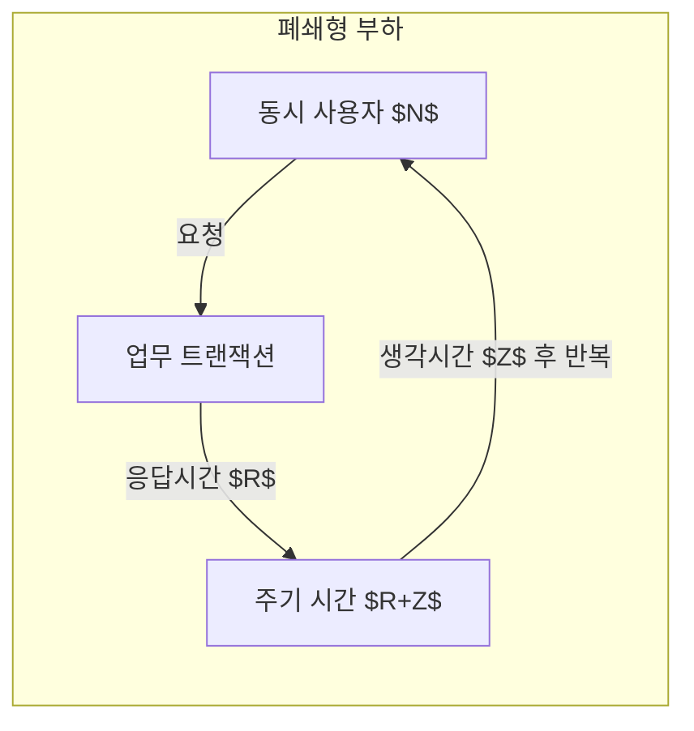
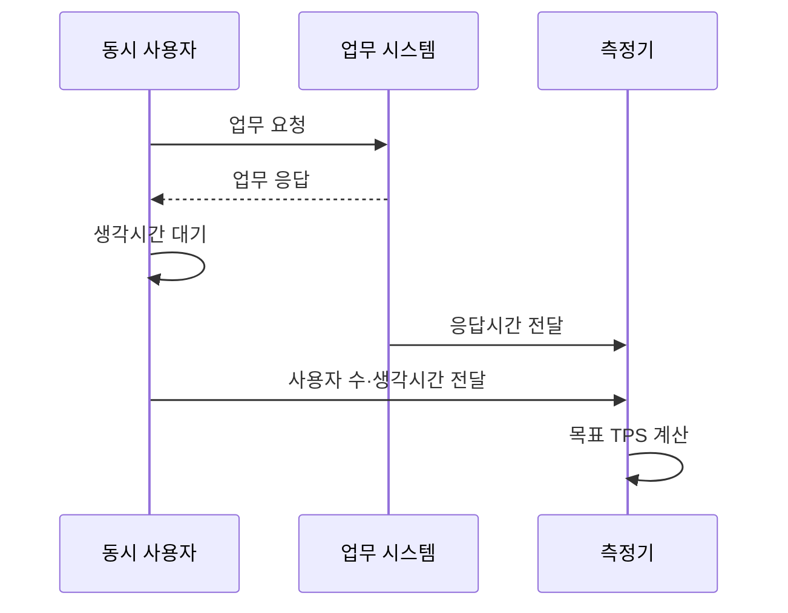

---
sidebar:
  order: 7
  label: "007. TPS 계산 - 동시 사용자·응답 시간 공식 (TPS Calculation)"
  badge:
    text: "기출 · 50%"
    variant: note
title: "TPS 계산 - 동시 사용자·응답 시간 공식 (TPS Calculation)"
date: "2026-07-27T23:59:59+09:00"
tags:
  - "notes-evaluation"
weight: 7
extra:
  question_no: "007"
  source_status: "기출"
  source_history: "131회"
  priority: 50
  priority_note: "동시 사용자와 응답시간으로 처리량을 산정"
---

## 미리 알고가기

- **초당 트랜잭션 처리 건수(Transactions Per Second, TPS)**: 시스템이 1초 동안 완료한 업무 거래 수를 나타내는 처리량 지표다.
- **동시 사용자(Concurrent Users, $N$, 엔)**: 같은 기간에 요청 주기를 반복하는 사용자 수입니다.
- **응답시간(Response Time, $R$, 알)**: 요청 전송부터 응답 수신까지 걸린 시간입니다.
- **생각시간(Think Time, $Z$, 제트)**: 응답을 받은 뒤 다음 요청까지 기다리는 시간입니다.
- **폐쇄형 부하(Closed Workload)**: 고정 사용자들이 요청·응답·대기를 반복하는 모형입니다.
- **초당 요청 처리 건수(Requests Per Second, RPS)**: 시스템이 1초 동안 처리한 개별 요청 수를 나타내는 처리량 지표다.
- **실사용자 모니터링(Real User Monitoring, RUM)**: 실제 사용자의 요청 경로와 체감 지연을 수집·분석하는 방식이다.
- **응용 프로그래밍 인터페이스(Application Programming Interface, API)**: 시스템 간 기능 호출과 데이터 교환을 위한 규격이다.

## Ⅰ. 개요

- 정의/개념: 사용자 주기로 초당 완료 거래를 계산함
- 기존 한계: 동시 사용자 수만으로는 응답시간과 사용자 생각시간에 따라 달라지는 실제 처리량을 계산하기 어렵다.

### 쉽게 이해하기 (학습용)
- 시스템을 사용하는 가상 사용자 수와 사용자가 반응하는 시간, 그리고 서버가 처리하는 속도를 조합하여 1초에 서버가 몇 건의 요청을 처리해야 하는지 계산하는 기법입니다.

## Ⅱ. 특징

- 폐쇄형 TPS는 사용자 주기로 계산한다
- 응답·생각시간이 길면 사용자당 요청률이 줄어든다
- 생각시간과 업무 비율 설정 오류는 실제 TPS를 왜곡한다

### 쉽게 이해하기 (학습용)
- 사용자가 화면을 보고 대기하는 시간(Think Time)이 길어질수록 서버에 부하가 도달하는 주기가 길어져 1초당 트랜잭션 수가 줄어집니다.

## Ⅲ. 아키텍처 및 구성요소

| 설계 요소 | 설명 |
|:---|:---|
| 동시 사용자 $N$ | 요청 주기를 반복하는 사용자 수 |
| 업무 트랜잭션 | TPS로 셀 업무 처리 단위 |
| 주기 시간 $R+Z$ | 한 사용자의 요청 반복 간격 |

### 쉽게 이해하기 (학습용)
- 전체 처리 건수는 동시 사용자 수라는 입력값과, 서버의 응답 속도 및 사용자의 조작 대기 시간이라는 제약 요인에 의해 계산됩니다.

## Ⅳ. 원리 및 절차 흐름도

| 절차 | 설명 |
|:---|:---|
| 업무 요청 | 사용자가 거래 처리를 시작함 |
| 업무 응답 | 시스템 처리 후 응답시간을 확정함 |
| 생각시간 대기 | 다음 요청까지 사용자 행동을 멈춤 |
| 응답시간 전달 | 측정한 $R$을 계산기에 보냄 |
| 사용자 수·생각시간 전달 | $N$과 $Z$를 계산기에 보냄 |
| 목표 TPS 계산 | $N/(R+Z)$로 부하를 산출함 |

### 쉽게 이해하기 (학습용)
- 서비스의 목표 시나리오를 정의하고 핵심 변수를 측정한 후, 폐쇄형 공식을 이용해 TPS를 도출하고 실제 측정값과 비교합니다.

## Ⅴ. 부하 생성 모델 비교

| 구분 | 동시 사용자 모델 | 요청률 기반 모델 |
|:---|:---|:---|
| 적용 기준 | 웹 환경의 실제 사용자 행동 모사 시 | API 서버의 기계적 처리량 산정 시 |
| 핵심 특징 | 사용자 주기로 요청 생성 | 정한 요청률로 부하 생성 |
| 한계 | 생각시간 설정 왜곡 | 응답 지연과 무관한 과부하 |

> 요약: 사용자 행동은 폐쇄형, 기계 요청은 요청률

### 쉽게 이해하기 (학습용)
- 사람이 화면을 보며 동작하는 주기를 고려하는 계산법과 기계가 일정 속도로 요청을 쏟아붓는 방식의 처리량 계산법을 비교합니다.

## Ⅵ. 실무 사례

1. 화면 거래 TPS와 내부 호출 RPS를 분리 측정

### 쉽게 이해하기 (학습용)
- 메인 페이지 로드라는 업무 단위 TPS와 그 과정에서 내부 마이크로서비스가 호출하는 각각의 요청당 초당 횟수를 구분합니다.

## Ⅶ. 결론

- 운영에 필요한 거래 처리량을 산정하기 위해 **동시 사용자·사용자당 거래 빈도·응답시간·피크 집중률·생각시간**을 검토하고, 업무 거래 경계에 맞춰 목표 TPS를 계산해야 한다.

### 쉽게 이해하기 (학습용)
- 시스템 설계 시 사용자의 체감 응답 속도와 행동 주기를 반영한 현실적인 성능 목표를 계산합니다.
