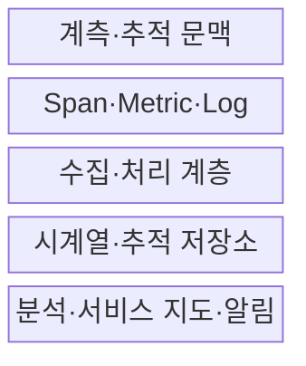
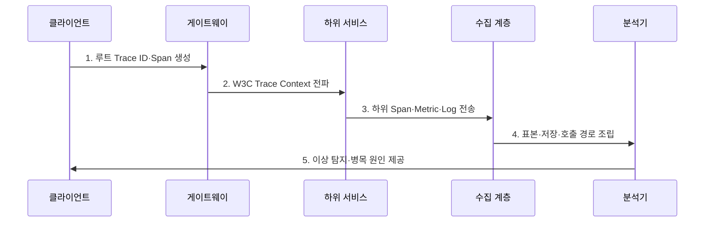

---
sidebar:
  order: 8
  label: "008. APM 애플리케이션 성능 관리 (Application Performance Management)"
  badge:
    text: "기출 · 50%"
    variant: note
title: "APM 애플리케이션 성능 관리 (Application Performance Management)"
date: "2026-07-30T23:30:00+09:00"
tags:
  - "notes-evaluation"
weight: 8
extra:
  question_no: "008"
  source_status: "기출"
  source_history: "137회"
  priority: 50
  priority_note: "137회 기출, 분산 추적 기반 병목 관리축"
---

## 미리 알고가기

- **애플리케이션 성능 관리(Application Performance Management, APM)**: 요청 경로와 자원 지표를 연계하여 지연과 오류의 원인을 추적하는 관리 체계다.
- **추적 식별자(Trace Identifier, Trace ID)**: 하나의 요청에서 파생된 서비스·데이터베이스 호출을 종단 간 연결하는 식별자다.
- **추적(Trace)**: 한 요청이 여러 서비스를 거친 전체 호출 기록입니다.
- **구간(Span)**: 추적 안에서 한 서비스 호출이 처리된 기록입니다.
- **메트릭(Metric)**: 일정 시간 단위로 집계한 성능 수치입니다.
- **표본 추출(Sampling)**: 일부 요청만 추적해 수집 부하를 줄이는 방식입니다.
- **마이크로서비스 아키텍처(Microservices Architecture, MSA)**: 서비스를 독립적으로 개발·배포할 수 있는 작은 단위로 분리한 구조다.
- **추적 문맥(Trace Context)**: 추적 식별자와 부모 구간 정보를 전달하는 값입니다.
- **응용 프로그래밍 인터페이스(Application Programming Interface, API)**: 서비스 간 기능 호출과 데이터 교환을 위한 규격이다.
- **W3C Trace Context Level 1**: traceparent·tracestate 헤더로 분산 추적 문맥 전파를 표준화한 W3C 권고안이다.
- **OpenTelemetry**: 추적·메트릭·로그의 생성·수집·전송을 위한 벤더 중립 관측성 체계이다.

## Ⅰ. 개요

- 정의: 요청 경로의 **지연·오류·자원 원인을 추적하는 관리**
- 목적: 집계 이상을 **서비스·코드·질의 원인으로 전환**

### 쉽게 이해하기 (학습)
- 한 요청이 여러 서비스를 지나는 전 과정을 영수증처럼 기록해 어디서 오래 걸렸는지 찾습니다.

## Ⅱ. 특징

- 추적 문맥의 **종단 간 호출 인과관계**
- 메트릭·추적·로그의 **상호 연계 진단**
- 표본률·오버헤드의 **관측 비용 통제**

### 쉽게 이해하기 (학습)
- 지표로 느려졌다는 사실을 발견하고 Trace로 어느 호출이 느렸는지 좁히는 방식으로 함께 사용합니다.

## Ⅲ. 구조 및 구성요소

| 구성요소 | 책임 |
|:---|:---|
| 계측·추적 문맥 | Trace ID·부모 관계 전파 |
| Span·Metric·Log | 구간·집계·사건 텔레메트리 |
| 수집·처리 계층 | 수신·표본·변환·전송 |
| 시계열·추적 저장소 | 지표·호출 관계 보관 |
| 분석·서비스 지도·알림 | 이상·병목·의존성 가시화 |

### 쉽게 이해하기 (학습)
- Trace ID로 흩어진 Span을 한 요청 경로로 연결하여 보여줍니다.

## Ⅳ. 흐름도

### 동작 원리

1. **루트 Trace ID·Span 생성**: 요청 전체 식별자·시작 기록
2. **W3C Trace Context 전파**: 부모 관계·벤더 상태 전달
3. **하위 Span·Metric·Log 전송**: 지연·오류·자원 사건 수집
4. **표본·저장·호출 경로 조립**: 같은 Trace ID 구간 연결
5. **이상 탐지·병목 원인 제공**: 서비스·질의·외부호출 판정

### 쉽게 이해하기 (학습)
- Trace ID와 Span 정보를 활용해 데이터베이스 쿼리나 외부 API 호출 중 느리거나 실패한 구간을 찾아냅니다.

## Ⅴ. 종류 및 비교

| 성능 관측 방식 | APM 추적 분석 | 메트릭 모니터링 |
|:---|:---|:---|
| 적용 기준 | 상세 병목 원인 진단 | 전체 이상 상태 탐지 |
| 핵심 특징 | 요청별 호출 경로 | 시간대별 집계 수치 |
| 한계 | 계측·저장 오버헤드 | 개별 호출 원인 누락 |

> 요약: 메트릭으로 탐지하고 APM으로 원인 추적

### 쉽게 이해하기 (학습)
- Metric은 집계 상태, Trace는 요청별 호출 경로를 보여 줍니다.

## Ⅵ. 실무 고려사항 및 대책

| 고려사항 | 대책 | 효과 |
|:---|:---|:---|
| 이기종 호출 문맥 단절 | **W3C Trace Context 적용** | 종단 경로 연속성 확보 |
| 벤더 종속 계측 | **OpenTelemetry 적용** | 수집·백엔드 교체성 향상 |
| 비용·개인정보 노출 | **동적 표본·속성 통제** | 비용·노출 위험 감소 |

### 쉽게 이해하기 (학습)
- 분산 서비스 환경에서 호출 간 식별자 유실로 분석 경로가 끊어지는 현상을 모니터링합니다.

## Ⅶ. 결론

- **추적 문맥·의존성·표본률·비용·정보등급**으로 APM을 설계한다.

### 쉽게 이해하기 (학습)
- 시스템 전체가 느리다는 경보를 실제 서비스·쿼리·외부 호출의 개선 과제로 바꾸어 줍니다.
