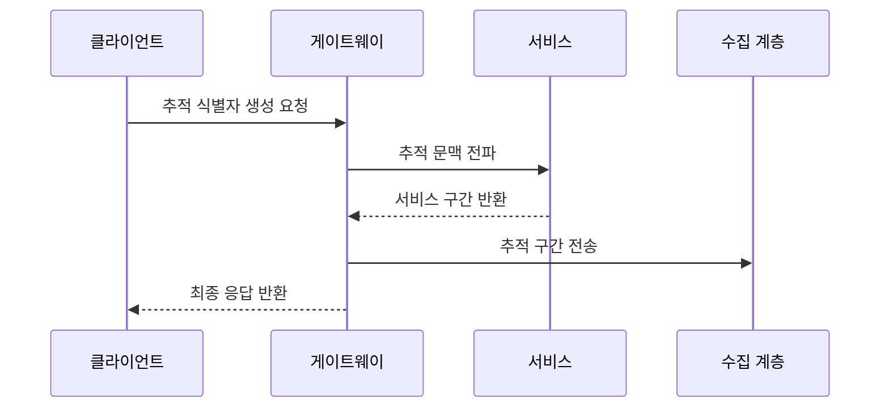

---
sidebar:
  order: 8
  label: "008. APM 애플리케이션 성능 관리 (Application Performance Management)"
  badge:
    text: "기출 · 50%"
    variant: note
title: "APM 애플리케이션 성능 관리 (Application Performance Management)"
date: "2026-07-27T23:59:59+09:00"
tags:
  - "notes-evaluation"
weight: 8
extra:
  question_no: "008"
  source_status: "기출"
  source_history: "137회"
  priority: 50
  priority_note: "137회 기출, 분산 추적 기반 병목 관리축"
---

## 미리 알고가기

- **애플리케이션 성능 관리(Application Performance Management, APM)**: 영문 머리글자를 딴 표기로 “에이피엠”으로 읽으며, 요청 경로의 지연과 오류 원인을 추적하는 체계
- **추적 식별자(Trace Identifier, Trace ID)**: Identifier를 ID로 줄여 “트레이스 아이디”로 읽으며, 한 요청에서 파생된 모든 호출을 연결하는 식별자
- **추적(Trace)**: 한 요청이 여러 서비스를 거친 전체 호출 기록입니다.
- **구간(Span)**: 추적 안에서 한 서비스 호출이 처리된 기록입니다.
- **메트릭(Metric)**: 일정 시간 단위로 집계한 성능 수치입니다.
- **표본 추출(Sampling)**: 일부 요청만 추적해 수집 부하를 줄이는 방식입니다.
- **마이크로서비스 아키텍처(Microservices Architecture, MSA)**: 영문 머리글자를 딴 표기로 “엠에스에이”로 읽으며, 서비스를 독립 배포 단위로 나눈 구조
- **추적 문맥(Trace Context)**: 추적 식별자와 부모 구간 정보를 전달하는 값입니다.
- **응용 프로그래밍 인터페이스(Application Programming Interface, API)**: 영문 머리글자를 딴 표기로 “에이피아이”로 읽으며, 서비스 간 요청과 응답 규약

## Ⅰ. 개요

- 정의/개념: 요청 경로별 지연·오류 원인을 추적하는 관리
- **배경/필요성**: 집계 지표만으로 분산 서비스의 지연 발생 구간 식별 곤란

### 쉽게 이해하기 (학습용)
- 한 요청이 여러 서비스를 지나는 전 과정을 영수증처럼 기록해 어디서 오래 걸렸는지 찾습니다.

## Ⅱ. 특징

- 추적 식별자로 분산 서비스 구간을 연결한다
- 메트릭 이상을 개별 요청 경로까지 좁힌다
- 표본률과 추적 문맥 단절이 수집 비용·호출 누락을 좌우한다

### 쉽게 이해하기 (학습용)
- 지표로 느려졌다는 사실을 발견하고 Trace로 어느 호출이 느렸는지 좁히는 방식으로 함께 사용합니다.

## Ⅲ. 아키텍처 및 구성요소

| 설계 요소 | 설명 |
|:---|:---|
| 계측 에이전트 | 추적 문맥·구간·메트릭을 수집함 |
| 수집 계층 | 추적 데이터를 필터링해 전달함 |
| 추적 저장소 | 호출 관계와 구간 지연을 보관함 |
| 분석 및 알림 | 경로 시각화와 임계 알림을 제공함 |

### 쉽게 이해하기 (학습용)
- Trace ID로 흩어진 Span을 한 요청 경로로 연결하여 보여줍니다.

## Ⅳ. 원리 및 절차 흐름도

| 절차 | 설명 |
|:---|:---|
| 추적 식별자 생성 요청 | 최초 요청에 추적 식별자를 부여함 |
| 추적 문맥 전파 | 하위 호출에 부모 구간을 전달함 |
| 서비스 구간 반환 | 처리시간·오류를 부모 호출에 연결함 |
| 추적 구간 전송 | 완성된 구간을 수집 계층에 보냄 |
| 최종 응답 반환 | 전체 요청의 종료 시각을 확정함 |

### 쉽게 이해하기 (학습용)
- Trace ID와 Span 정보를 활용해 데이터베이스 쿼리나 외부 API 호출 중 느리거나 실패한 구간을 찾아냅니다.

## Ⅴ. 성능 관측 방식 비교

| 구분 | APM 추적 분석 | 메트릭 모니터링 |
|:---|:---|:---|
| 적용 기준 | 상세 병목 원인 진단 | 전체 이상 상태 탐지 |
| 핵심 특징 | 요청별 호출 경로 | 시간대별 집계 수치 |
| 한계 | 계측·저장 오버헤드 | 개별 호출 원인 누락 |

> 요약: 메트릭으로 탐지하고 APM으로 원인 추적

### 쉽게 이해하기 (학습용)
- Metric은 집계 상태, Trace는 요청별 호출 경로를 보여 줍니다.

## Ⅵ. 실무 사례

1. MSA 호출은 추적 식별자로 지연 구간 연결

### 쉽게 이해하기 (학습용)
- 분산 서비스 환경에서 호출 간 식별자 유실로 분석 경로가 끊어지는 현상을 모니터링합니다.

## Ⅶ. 결론

- 병목 진단을 위해 추적 문맥·표본률을 검토하여 **APM** 활용

### 쉽게 이해하기 (학습용)
- 시스템 전체가 느리다는 경보를 실제 서비스·쿼리·외부 호출의 개선 과제로 바꾸어 줍니다.
