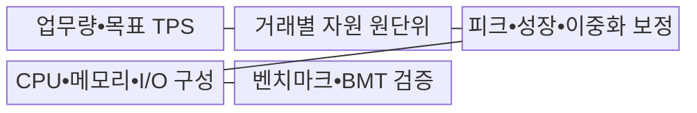
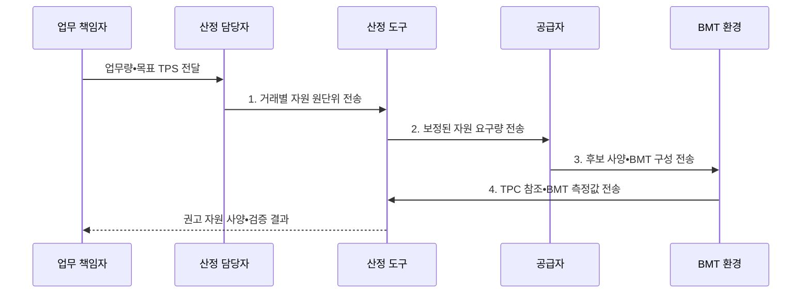

---
sidebar:
  order: 9
  label: "009. 하드웨어 규모 산정 지침 - TPS 기반 (HW Sizing TPS-based)"
  badge:
    text: "기출 • 70%"
    variant: note
title: "하드웨어 규모 산정 지침 - TPS 기반 (HW Sizing TPS-based)"
date: "2026-08-03T08:48:47+09:00"
tags:
  - "notes-evaluation"
weight: 9
extra:
  question_no: "009"
  source_status: "기출"
  source_history: "126회, 129회, 135회"
  priority: 70
  priority_note: "3회 기출, 용량 산정 문제의 반복 핵심축"
---

## Ⅰ. 개요

핵심 용어

- **하드웨어(Hardware, HW) 규모 산정**: 목표 부하를 중앙처리장치•메모리•저장장치•네트워크의 요구 용량으로 환산하는 작업이다.
- **초당 트랜잭션 처리 건수(Transactions Per Second, TPS)**: 시스템이 1초 동안 성공적으로 완료한 업무 거래 수이다.
- **용량 보정**: 거래별 자원 원단위에 피크•성장•이중화•여유 조건을 적용해 실제 요구량으로 조정하는 과정이다.

- 정의/개념: **초당 트랜잭션 처리 건수(Transactions Per Second, TPS) 기반 하드웨어 용량산정** — 목표 거래 처리량과 거래당 자원 사용량을 피크•여유율로 **용량 보정** 하여 중앙처리장치•메모리•입출력 요구량으로 변환하는 방식
- 배경/필요성: 평균 TPS만으로는 **피크•N-1 자원 부족 예측 불가**

#### 한줄 요약
- 예상 거래량과 업무 복잡도로 연산•메모리•저장•전송 용량을 각각 산정

## Ⅱ. 특징

핵심 용어

- **피크 계수**: 평균 부하를 최대 예상 부하로 높이기 위해 곱하는 배수이다.
- **여유 용량**: 성장•변동•장애 상황을 흡수하도록 정상 부하에서 사용하지 않고 남겨 둔 자원이다.
- **N-1 조건**: 자원 하나가 고장 나도 나머지 자원으로 목표 부하를 처리해야 하는 용량 조건이다.
- **단계 검증**: 계산 결과를 표준 벤치마크 자료와 실제 업무 기반 시험으로 차례로 확인하는 방식이다.

- **환산 축**: 거래별 자원 원단위로 TPS를 요구 용량으로 변환
- **보정 축**: 피크•성장•이중화 계수로 장애 여유 반영
- **검증 축**: 계산값을 TPC 자료와 실제 BMT로 단계 검증

#### 한줄 요약
- 업무 복잡도•피크•성장률•이중화 조건을 반영한 처리량 보정

## Ⅲ. 구조 및 구성요소

핵심 용어

- **자원 원단위**: 거래 한 건이 소비하는 중앙처리장치 시간•메모리•입출력•네트워크 양이다.
- **중앙처리장치(Central Processing Unit, CPU) 용량**: 목표 거래량의 연산을 목표 이용률 안에서 처리하기 위해 필요한 연산 자원이다.
- **입출력(Input/Output, I/O) 용량**: 저장장치와 네트워크가 목표 거래량의 읽기•쓰기•전송을 감당하는 능력이다.
- **헤드룸**: 성장•변동•장애 부하를 흡수하도록 정상 운용 시 남겨 두는 자원 여유분이다.
- **산정 변수**: $TPS_{base}$는 기준 처리량, $TPS_{target}$은 보정 후 목표 처리량, $F_{peak}$는 피크 계수, $g$는 연평균 성장률, $n$은 적용 연수이다.
- **중앙처리장치 산정 변수**: $t_{CPU}$는 거래당 중앙처리장치 시간, $U_{target}$은 목표 이용률, $CPU_{req}$는 필요한 중앙처리장치 코어 환산량이다.

| 구성요소 | 책임 |
|:---|:---|
| 업무량•목표 TPS | **거래량•비율•집중률** 확정 |
| 거래별 자원 원단위 | **CPU 시간•메모리•I/O** 산출 |
| 피크•성장•이중화 보정 | **증가율•헤드룸•장애 조건** 반영 |
| CPU•메모리•I/O 구성 | 요구량별 **후보 자원 사양** 구성 |
| 벤치마크•BMT 검증 | **TPC 자료•실부하 시험** 검증 |

- **목표 TPS**: $TPS_{target}=TPS_{base}\times F_{peak}\times(1+g)^n$
- **CPU 요구량**: $CPU_{req}=TPS_{target}\times t_{CPU}/U_{target}$
- **I/O•망•메모리**: 거래 원단위•동시 세션•작업 집합 합산

#### 한줄 요약
- 목표 부하 역산과 성장 여유를 반영한 최종 인프라 규격

## Ⅳ. 흐름도

핵심 용어

- **벤치마크 테스트(Benchmark Test, BMT)**: 동일한 부하와 측정 조건에서 후보 장비의 성능과 적합성을 비교하는 시험이다.
- **용량 보정**: 기종 차이•성장률•피크•이중화 조건을 계산 요구량에 반영하는 단계이다.
- **거래처리성능위원회(Transaction Processing Performance Council, TPC)**: 거래처리 시스템의 성능•가격을 비교할 수 있도록 표준 벤치마크와 결과 공개 규칙을 관리하는 단체이다.

1. **거래별 자원 원단위 전송**: CPU•메모리•I/O 요구량 계산
2. **보정된 자원 요구량 전송**: 피크•성장•N-1 헤드룸 반영
3. **후보 사양•BMT 구성 전송**: 제품 성능값으로 사양 변환
4. **TPC 참조•BMT 측정값 전송**: TPS•p99•포화 충족 확인

#### 한줄 요약
- 업무 부하별 중앙처리장치•메모리 요구량과 성장•이중화 여유 산출

## Ⅴ. 종류 및 비교

핵심 용어

- **중앙처리장치(Central Processing Unit, CPU) 기반 산정**: 거래별 연산량과 목표 이용률로 처리기 수와 성능을 계산하는 방식이다.
- **메모리 기반 산정**: 동시 세션•작업 집합•캐시 점유량으로 필요한 메모리 용량을 계산하는 방식이다.
- **입출력(Input/Output, I/O) 기반 산정**: 거래별 저장•전송량과 지연 목표로 디스크•네트워크 용량을 계산하는 방식이다.

| 산정 축 | 입력 원단위 | 필수 보정 |
|:---|:---|:---|
| 중앙처리장치(Central Processing Unit, CPU) | 거래별 **CPU 시간•연산량** | 기종 성능•목표 이용률•자원 하나 장애 조건 |
| 메모리 | 세션•작업 집합•**캐시 점유량** | 동시성•누수•회수 지연 |
| 디스크•네트워크 | 거래별 **입출력(Input/Output, I/O)•전송량** | 피크 처리량•대역폭•지연 |

> 요약: **CPU•메모리•I/O**별 원단위와 보정 지표 적용

#### 한줄 요약
- 연산•메모리•저장•전송 자원별 독립 지표 적용

## Ⅵ. 실무 고려사항 및 대책

핵심 용어

- **분당 C형 트랜잭션 처리 건수(Transactions per Minute C, tpmC)**: TPC-C 업무의 신규 주문 거래를 1분 동안 완료한 수로 나타내는 처리량 지표이다.
- **거래처리성능위원회 C형•E형 벤치마크(Transaction Processing Performance Council Benchmark C/E, TPC-C•TPC-E)**: 도매 공급업체와 증권사 업무를 각각 모사하는 온라인 거래처리 벤치마크이다.
- **99백분위수(p99)**: 요청의 99%가 해당 값 이하에서 완료되는 꼬리 지연 지표이다.

| 문제 | 대책 | 효과 |
|:---|:---|:---|
| 업무가 다른 수치로 생기는 **OLTP 비교 왜곡** | **TPC-C•TPC-E 결과** 참조 | 후보 성능의 **비교 근거** 보강 |
| 피크•장애 때 발생하는 **용량 부족** | **성장률•N-1 헤드룸** 적용 | 과부하와 **단일 장애** 대응 |
| 벤더 부하와 실제 업무의 **프로파일 차이** | **실제 업무 BMT** 수행 | 산정값의 **현장 적합성** 검증 |

#### 한줄 요약
- 하드웨어 도입 전 용량 산출 산식의 이론적 근거 검증

## Ⅶ. 결론

핵심 용어

- **온라인 트랜잭션 처리(Online Transaction Processing, OLTP)**: 다수의 짧은 업무 거래를 실시간으로 처리하는 방식이다.
- **실측 검증**: 계산으로 고른 후보 사양이 목표 TPS•p99•자원 한계를 만족하는지 BMT로 확인하는 절차이다.
- **사양 채택**: 원단위•피크•N-1 조건으로 후보를 산정한 뒤 목표 처리량과 꼬리 지연 시험을 통과한 구성을 선택하는 결정이다.

- **원단위•피크•N-1** 로 후보 산정 후 **TPS•p99 BMT** 통과 사양 채택

#### 한줄 요약
- 계산 후보와 실부하 시험을 결합한 과다 투자•용량 부족 방지
