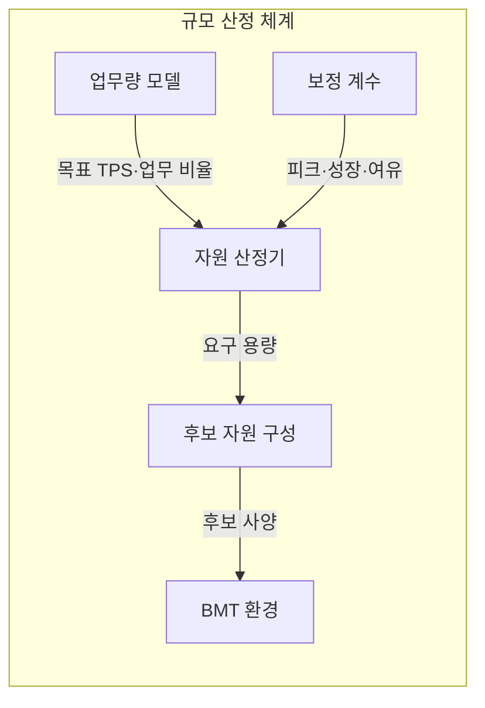
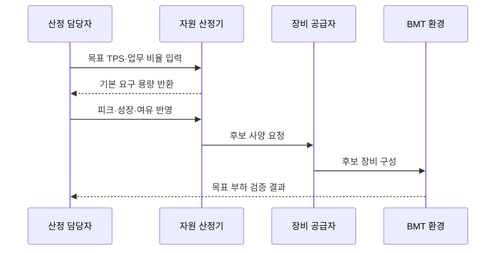

---
sidebar:
  order: 9
  label: "009. 하드웨어 규모 산정 지침 - TPS 기반 (HW Sizing TPS-based)"
  badge:
    text: "기출 · 70%"
    variant: note
title: "하드웨어 규모 산정 지침 - TPS 기반 (HW Sizing TPS-based)"
date: "2026-07-25T01:10:00+09:00"
tags:
  - "notes-evaluation"
weight: 9
extra:
  question_no: "009"
  source_status: "기출"
  source_history: "126회, 129회, 135회"
  priority: 70
  priority_note: "3회 기출, 용량 산정 문제의 반복 핵심축"
---

## 미리 알고가기

- **하드웨어(Hardware, HW)**: 연산·메모리·저장·전송을 제공하는 물리 자원입니다.
- **규모 산정(Sizing)**: 목표 부하를 자원별 요구 용량으로 환산하는 작업입니다.
- **초당 트랜잭션 처리 건수(Transactions Per Second, TPS)**: 1초에 완료한 업무 거래 수입니다.
- **피크 계수(Peak Factor)**: 평균 부하를 최대 예상 부하로 높이는 배수입니다.
- **여유 용량(Headroom)**: 성장·변동·장애를 흡수하도록 남겨 둔 자원입니다.
- **분당 C형 거래 처리 건수(transactions per minute C, tpmC)**: TPC-C 벤치마크가 측정하는 분당 신규 주문 거래 수입니다.
- **벤치마크 테스트(Benchmark Test, BMT)**: 같은 부하에서 후보 장비의 성능을 비교하는 시험입니다.
- **상주 집합 크기(Resident Set Size, RSS)**: 프로세스가 실제 물리 메모리에 점유한 크기입니다.
- **중앙처리장치(Central Processing Unit, CPU)**: 명령을 실행하는 연산 자원입니다.
- **자바 가상 머신(Java Virtual Machine, JVM)**: 자바 프로그램과 힙 메모리를 관리하는 실행 환경입니다.
- **왕복시간(Round Trip Time, RTT)**: 요청이 목적지까지 갔다가 돌아오는 시간입니다.

## Ⅰ. 개요

- **정의/개념**: 목표 TPS를 자원별 요구 용량으로 변환함
- **배경/필요성**: 과소 용량은 포화, 과대 용량은 비용 증가

### 쉽게 이해하기 (학습용)
- 예상 손님 수와 주문 복잡도로 계산대·좌석·창고·통로의 필요한 크기를 각각 정하는 것과 같습니다.

## Ⅱ. 특징

- 거래별 자원 소비량이 TPS를 용량으로 바꾼다
- 피크·성장·장애 여유가 산정값을 늘린다
- 계산값은 후보 장비의 BMT로 검증한다

### 쉽게 이해하기 (학습용)
- TPS 하나를 서버 사양으로 바로 바꾸지 않고 업무 복잡도·피크·성장률·이중화 조건으로 보정해야 합니다.

## Ⅲ. 아키텍처 및 구성요소

| 설계 요소 | 설명 |
|:---|:---|
| 업무량 모델 | 목표 TPS·거래 비율·데이터량 정의 |
| 자원 산정기 | 거래별 소비량으로 요구 용량 계산 |
| 보정 계수 | 피크·성장·장애 여유 반영 |
| 후보 자원 구성 | 요구량을 만족하는 장비 조합 |
| BMT 환경 | 후보 사양의 목표 부하 충족 검증 |

### 쉽게 이해하기 (학습용)
- 입력받은 목표 부하를 토대로 인프라 사양을 역산한 뒤, 시스템 성장 여유를 더해 최종 규격을 정의합니다.

## Ⅳ. 원리 및 절차 흐름도

| 절차 | 설명 |
|:---|:---|
| 목표 TPS·업무 비율 입력 | 거래별 목표 처리량을 산출함 |
| 기본 요구 용량 반환 | CPU·메모리·저장량을 계산함 |
| 피크·성장·여유 반영 | 변동과 장애 시 필요한 용량을 더함 |
| 후보 사양 요청 | 요구량 이상인 장비 조합을 요청함 |
| 후보 장비 구성 | 실제 시험할 하드웨어를 설치함 |
| 목표 부하 검증 결과 | TPS·지연 충족 여부를 반환함 |

### 쉽게 이해하기 (학습용)
- 업무 부하 분석에서 시작해 CPU와 메모리 사양을 산출하고, 미래 성장과 시스템 백업에 필요한 여유치를 더합니다.

## Ⅴ. 종류 및 비교

| 판단 기준 | CPU | 메모리 | 디스크·네트워크 |
|:---|:---|:---|:---|
| 핵심 특징 | 거래별 연산량 | 세션·캐시 점유량 | 데이터·전송량 |
| 적용 기준 | 연산 처리 용량 산정 | 동시 세션 용량 산정 | 저장·통신 용량 산정 |
| 주요 위험 | 기종별 성능 차이 | 누수·회수 지연 | 입출력 집중·증가량 오차 |

> 요약: 각 하드웨어 자원의 용도에 최적화된 보정 지표 적용

### 쉽게 이해하기 (학습용)
- CPU·메모리·저장·전송 장치는 데이터가 흘러가는 통로의 성격에 맞춰 독립적인 지표를 활용합니다.

## Ⅵ. 실무 사례

1. 서버 도입은 목표 TPS로 후보 산정 후 BMT
2. 클라우드는 확장 지연을 초기 여유 용량에 반영

### 쉽게 이해하기 (학습용)
- 하드웨어 도입 계약 전에 제안서의 용량 산출 산식이 어떤 이론적 근거를 바탕으로 계산되었는지 설명합니다.
- 가상 서버의 자동 확장이 완료되는 수 분의 시간 동안 시스템 다운 없이 버틸 수 있는 기본 임계치를 설정합니다.

## Ⅶ. 결론

- 피크·성장·BMT로 자원별 최종 용량 결정

### 쉽게 이해하기 (학습용)
- 계산으로 하드웨어 후보군을 정하고 실제 테스트로 확인하여 과다 비용 지출과 용량 부족을 동시에 막습니다.
