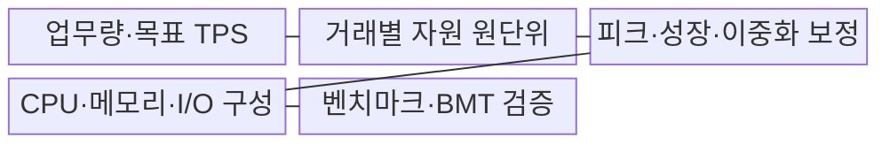
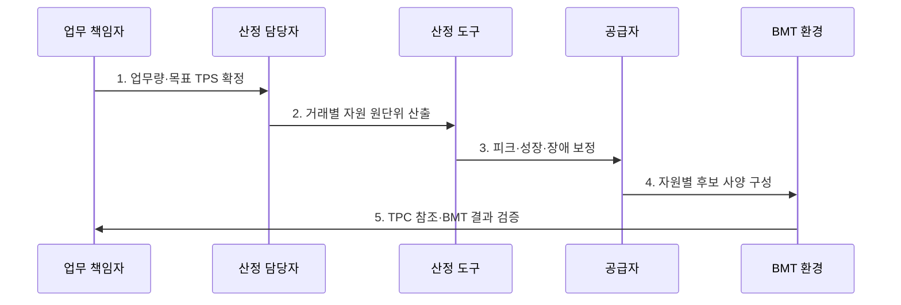

---
sidebar:
  order: 9
  label: "009. 하드웨어 규모 산정 지침 - TPS 기반 (HW Sizing TPS-based)"
  badge:
    text: "기출 · 70%"
    variant: note
title: "하드웨어 규모 산정 지침 - TPS 기반 (HW Sizing TPS-based)"
date: "2026-07-30T23:30:00+09:00"
tags:
  - "notes-evaluation"
weight: 9
extra:
  question_no: "009"
  source_status: "기출"
  source_history: "126회, 129회, 135회"
  priority: 70
  priority_note: "3회 기출, 용량 산정 문제의 반복 핵심축"
---

## 미리 알고가기

- **하드웨어(Hardware, HW)**: 연산·메모리·저장·전송 기능을 제공하는 물리 자원이다.
- **규모 산정(Sizing)**: 목표 부하를 자원별 요구 용량으로 환산하는 작업입니다.
- **초당 트랜잭션 처리 건수(Transactions Per Second, TPS)**: 시스템이 1초 동안 완료한 업무 거래 수를 나타내는 처리량 지표다.
- **피크 계수(Peak Factor)**: 평균 부하를 최대 예상 부하로 높이는 배수입니다.
- **여유 용량(Headroom)**: 성장·변동·장애를 흡수하도록 남겨 둔 자원입니다.
- **분당 C형 거래 처리 건수(transactions per minute C, tpmC)**: “티피엠시”로 읽고 C는 TPC-C 업무 유형을 나타내며, 분당 신규 주문 거래 수
- **벤치마크 테스트(Benchmark Test, BMT)**: 동일한 부하와 측정 조건에서 후보 장비의 성능과 적합성을 비교하는 시험이다.
- **상주 집합 크기(Resident Set Size, RSS)**: 프로세스가 현재 물리 메모리에 점유한 영역의 크기다.
- **중앙처리장치(Central Processing Unit, CPU)**: 프로그램 명령을 해석하고 연산을 수행하는 처리 장치다.
- **자바 가상 머신(Java Virtual Machine, JVM)**: 자바 바이트코드를 실행하고 힙 메모리와 런타임 자원을 관리하는 실행 환경이다.
- **왕복시간(Round Trip Time, RTT)**: 요청이 목적지에 도달하고 응답이 돌아오기까지 걸리는 전체 시간이다.
- **TPC-C**: 도매 공급업체 업무를 모사해 온라인 트랜잭션 처리 성능을 tpmC로 측정하는 TPC 벤치마크이다.
- **TPC-E**: 증권사 업무를 모사해 거래 처리량과 가격 대비 성능을 측정하는 TPC 벤치마크이다.

## Ⅰ. 개요

- 정의/개념: 목표 TPS를 **CPU·메모리·I/O 요구량으로 변환**
- 배경/필요성: 피크·성장·장애를 견딜 **적정 용량 확보**

### 쉽게 이해하기 (학습용)
- 예상 손님 수와 주문 복잡도로 계산대·좌석·창고·통로의 필요한 크기를 각각 정하는 것과 같습니다.

## Ⅱ. 특징

- 거래별 자원 원단위의 **TPS·용량 변환**
- 피크·성장·이중화의 **보정계수 적용**
- 계산·TPC 자료·BMT의 **단계 검증**

### 쉽게 이해하기 (학습용)
- TPS 하나를 서버 사양으로 바로 바꾸지 않고 업무 복잡도·피크·성장률·이중화 조건으로 보정해야 합니다.

## Ⅲ. 구조 및 구성요소

| 구성요소 | 책임 |
|:---|:---|
| 업무량·목표 TPS | 거래량·비율·집중률 |
| 거래별 자원 원단위 | CPU시간·메모리·I/O |
| 피크·성장·이중화 보정 | 증가율·여유·장애조건 |
| CPU·메모리·I/O 구성 | 요구량별 후보 사양 |
| 벤치마크·BMT 검증 | TPC 자료·실부하 시험 |

### 쉽게 이해하기 (학습용)
- 입력받은 목표 부하를 토대로 인프라 사양을 역산한 뒤, 시스템 성장 여유를 더해 최종 규격을 정의합니다.

## Ⅳ. 흐름도

1. **업무량·목표 TPS 확정**: 거래 비율·집중률·기간 정의
2. **거래별 자원 원단위 산출**: CPU·메모리·I/O 계산
3. **피크·성장·장애 보정**: 헤드룸·잔여 용량 반영
4. **자원별 후보 사양 구성**: 제품 성능값으로 사양 변환
5. **TPC 참조·BMT 결과 검증**: TPS·p99·포화 충족 확인

### 쉽게 이해하기 (학습용)
- 업무 부하 분석에서 시작해 CPU와 메모리 사양을 산출하고, 미래 성장과 시스템 백업에 필요한 여유치를 더합니다.

## Ⅴ. 종류 및 비교

| 하드웨어 자원 | CPU | 메모리 | 디스크·네트워크 |
|:---|:---|:---|:---|
| 적용 기준 | 연산 처리 용량 산정 | 동시 세션 용량 산정 | 저장·통신 용량 산정 |
| 핵심 특징 | 거래별 연산량 | 세션·캐시 점유량 | 데이터·전송량 |
| 한계 | 기종별 성능 차이 | 누수·회수 지연 | 입출력 집중·증가량 오차 |

> 요약: 각 하드웨어 자원의 용도에 최적화된 보정 지표 적용

### 쉽게 이해하기 (학습용)
- CPU·메모리·저장·전송 장치는 데이터가 흘러가는 통로의 성격에 맞춰 독립적인 지표를 활용합니다.

## Ⅵ. 실무 고려사항 및 대책

| 고려사항 | 대책 | 효과 |
|:---|:---|:---|
| OLTP 비교 기준 | **TPC-C·TPC-E 결과 참조** | 후보 성능 근거 보강 |
| 피크·장애 시 용량 부족 | **성장률·N-1 헤드룸 적용** | 과부하·단일장애 대응 |
| 벤더 수치의 업무 차이 | **실제 업무 BMT 수행** | 산정값 현장 검증 |

### 쉽게 이해하기 (학습용)
- 하드웨어 도입 계약 전에 제안서의 용량 산출 산식이 어떤 이론적 근거를 바탕으로 계산되었는지 설명합니다.

## Ⅶ. 결론

- **목표 TPS·원단위·피크·성장률·N-1**로 자원 용량을 결정한다.

### 쉽게 이해하기 (학습용)
- 계산으로 하드웨어 후보군을 정하고 실제 테스트로 확인하여 과다 비용 지출과 용량 부족을 동시에 막습니다.
