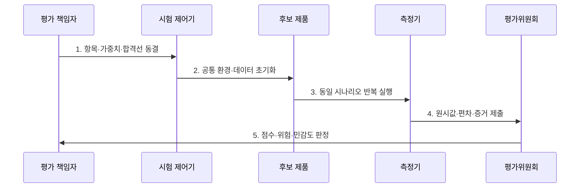

---
sidebar:
  order: 10
  label: "010. BMT 벤치마크 테스트 방법론 (BMT Methodology)"
  badge:
    text: "기출 · 70%"
    variant: note
title: "BMT 벤치마크 테스트 방법론 (BMT Methodology)"
date: "2026-07-30T23:30:00+09:00"
tags:
  - "notes-evaluation"
weight: 10
extra:
  question_no: "010"
  source_status: "기출"
  source_history: "123회, 129회, 138회"
  priority: 70
  priority_note: "3회 기출, 벤치마크 설계·검증의 핵심축"
---

## 미리 알고가기

- **벤치마크 테스트(Benchmark Test, BMT)**: 동일한 업무 부하와 측정 조건에서 도입 후보의 성능과 적합성을 비교하는 시험이다.
- **개념 증명(Proof of Concept, PoC)**: 제한된 범위의 구현과 실험으로 기술의 실현 가능성과 핵심 가정을 검증하는 활동이다.
- **평가 시나리오**: 모든 후보에 동일하게 적용하는 업무 흐름과 부하 조건입니다.
- **평가 항목**: 기능·성능·운영성을 판정할 독립 기준입니다.
- **원시 데이터(Raw Data)**: 집계나 점수화 전의 측정 원본입니다.
- **TPC(Transaction Processing Performance Council)**: 거래처리·데이터 시스템의 벤치마크 규격과 검증 결과를 공개하는 비영리 단체이다.
- **ISO/IEC/IEEE 29119-2:2021**: 테스트 계획·감시·설계·실행·완료 프로세스를 정의한 국제표준이다.

## Ⅰ. 개요

- 정의/개념: 동일 조건에서 **도입 후보를 비교하는 실증 시험**
- 배경/필요성: 제안 수치의 편향을 막고 **공정한 선정 근거 확보**

### 쉽게 이해하기 (학습용)
- 제품 설명서만 믿지 않고, 동일한 조건과 테스트 시나리오 하에서 후보 제품들의 실제 성능을 직접 비교하여 평가하는 검증 기법입니다.

## Ⅱ. 특징

- 환경·데이터·부하의 **후보별 동일 조건**
- 항목·가중치·합격선의 **사전 동결**
- 원시값·반복·편차의 **감사 가능 증거**

### 쉽게 이해하기 (학습용)
- 후보 업체마다 측정 조건을 다르게 적용하거나 사후에 가중치를 임의로 바꾸는 부정행위를 차단하기 위해 평가 기준을 먼저 공표합니다.

## Ⅲ. 구조 및 구성요소

| 구성요소 | 책임 |
|:---|:---|
| 요구사항·평가 항목 | 기능·성능·운영성 기준 |
| 공통 환경·데이터·부하 | 동일 구성·초기상태·시나리오 |
| 후보 제품·시험 순서 | 격리·무작위화·반복 |
| 원시값·반복·통계 | 로그·편차·신뢰구간 |
| 가중치·합격선·위험 | 사전 점수식·탈락조건 |

### 쉽게 이해하기 (학습용)
- 동일한 성능을 발휘하는 공통의 테스트 망에서 객관적인 시나리오를 바탕으로 여러 후보를 점검하여 최종 점수를 냅니다.

## Ⅳ. 흐름도

1. **항목·가중치·합격선 동결**: 변경 통제·탈락조건 확정
2. **공통 환경·데이터 초기화**: 후보별 시작 상태 통일
3. **동일 시나리오 반복 실행**: 순서효과·편차 측정
4. **원시값·편차·증거 제출**: 로그·설정·측정값 보존
5. **점수·위험·민감도 판정**: 가중치 변화·운영위험 검토

### 쉽게 이해하기 (학습용)
- 요구사항 수집에서 시작해 사전 평가표를 만들고, 환경 동일성을 확보한 상태에서 공통 부하를 가해 후보들의 결과를 분석합니다.

## Ⅴ. 종류 및 비교

| 도입 검증 방식 | BMT | PoC |
|:---|:---|:---|
| 적용 기준 | 다수 후보의 공정한 성능 대조 시 | 새로운 기술의 작동 여부 선행 확인 시 |
| 핵심 특징 | 여러 후보의 상대 비교 | 한 기술의 구현 가능성 확인 |
| 한계 | 환경·가중치 편향 | 제한 범위의 일반화 오류 |

> 요약: 후보 비교는 BMT, 구현 확인은 PoC

### 쉽게 이해하기 (학습용)
- 경쟁 구도에 있는 여러 대안의 성능 우위를 비교하는 기법과, 새로운 기술이 우리 시스템에 쓰일 수 있는지 먼저 확인하는 기법의 차이를 비교합니다.

## Ⅵ. 실무 고려사항 및 대책

| 고려사항 | 대책 | 효과 |
|:---|:---|:---|
| 시험 절차·증거 통제 | **ISO/IEC/IEEE 29119-2 적용** | 재현·감사 가능성 확보 |
| 공인 벤치마크 비교 | **TPC 규격·공개 결과 참조** | 벤더 수치 교차검증 |
| 가중치·환경 편향 | **사전 동결·민감도 분석** | 선정 공정성 향상 |

### 쉽게 이해하기 (학습용)
- 벤치마크 테스트 결과에 대한 공정성 시비를 방지하기 위해 가중치가 어떻게 적용되었는지 모든 원시 데이터를 기록합니다.

## Ⅶ. 결론

- **동일 환경·대표 부하·반복성·가중치·증거**로 후보를 결정한다.

### 쉽게 이해하기 (학습용)
- 같은 시험장과 채점표를 사용해야 후보의 차이를 공정하게 판단할 수 있습니다.
