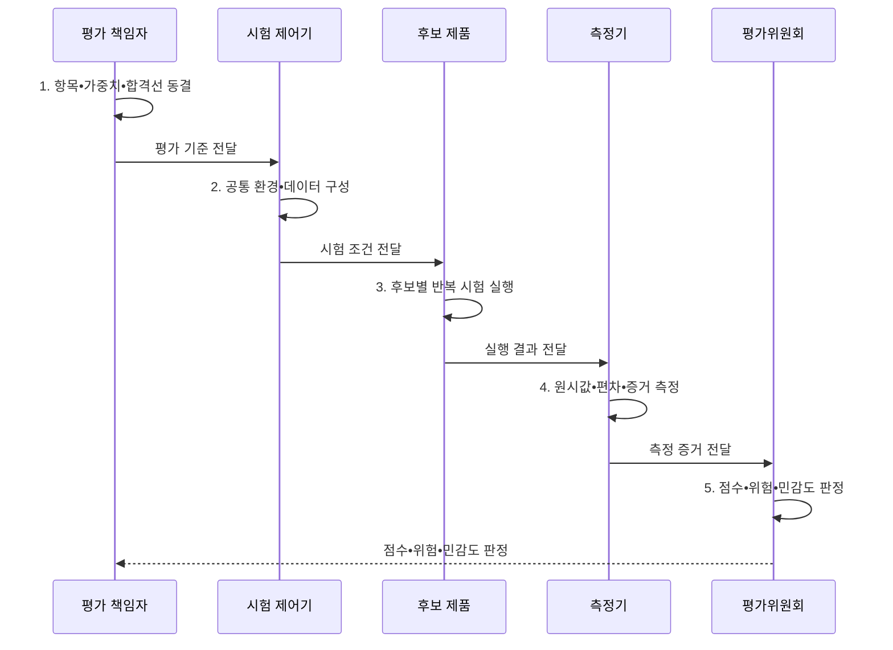

---
sidebar:
  order: 10
  label: "010. BMT 벤치마크 테스트 방법론 (BMT Methodology)"
  badge:
    text: "기출 • 70%"
    variant: note
title: "BMT 벤치마크 테스트 방법론 (BMT Methodology)"
date: "2026-08-04T14:39:49+09:00"
tags:
  - "notes-evaluation"
weight: 10
extra:
  question_no: "010"
  source_status: "기출"
  source_history: "123회, 129회, 138회"
  priority: 70
  priority_note: "3회 기출, 벤치마크 설계•검증의 핵심축"
---

## Ⅰ. 개요

핵심 용어

- **BMT(Benchmark Test)**: 동일 조건에서 도입 후보의 성능•적합성을 비교하는 시험이다.
- **공정 비교**: 모든 후보에 같은 환경•데이터•부하•측정 규칙을 적용하여 차이를 판정하는 원칙이다.

- 정의/개념: 동일한 환경•데이터•부하에서 **도입 후보의 성능•적합성** 을 비교하는 실증 시험
- 배경/필요성: 벤더 제안 수치는 환경•부하 차이로 **실제 도입 성능** 의 공정 비교 곤란

#### 한줄 요약
- 제품 설명서만 믿지 않고, 동일한 조건과 테스트 시나리오 하에서 후보 제품들의 실제 성능을 직접 비교하여 평가하는 검증 기법입니다.

## Ⅱ. 특징

핵심 용어

- **평가 시나리오**: 모든 후보에 동일하게 적용하는 업무 흐름•데이터•부하 조건이다.
- **평가 항목**: 기능•성능•운영성을 서로 중복 없이 판정하기 위한 독립 기준이다.
- **원시 데이터**: 집계•정규화•가중치•점수화를 적용하기 전의 측정 원본이다.
- **사전 동결**: 시험 실행 전에 평가 항목•가중치•합격선•제외 조건을 확정하고 변경을 통제하는 조치이다.
- **감사 가능 증거**: 최종 점수에서 원시값•실행 로그•환경 설정까지 역으로 확인할 수 있게 보존한 자료이다.

- 환경•데이터•부하의 **후보별 동일 조건**
- 항목•가중치•합격선의 **사전 동결**
- 원시값•반복•편차의 **감사 가능 증거**

#### 한줄 요약
- 후보 업체마다 측정 조건을 다르게 적용하거나 사후에 가중치를 임의로 바꾸는 부정행위를 차단하기 위해 평가 기준을 먼저 공표합니다.

## Ⅲ. 구조 및 구성요소

핵심 용어

- **평가 환경**: 후보 장비•소프트웨어•네트워크•데이터와 부하 생성기를 동일 조건으로 구성한 시험 환경이다.
- **평가 기준**: 지표별 단위•측정 구간•합격선•가중치•동률 처리 규칙을 명시한 판정 기준이다.
- **시험 순서 통제**: 후보별 환경 간섭과 순서 효과를 줄이도록 격리•무작위화•반복을 적용하는 방식이다.

| 구성요소 | 책임 |
|:---|:---|
| 요구사항•평가 항목 | 기능•성능•**운영성 기준** |
| 공통 환경•데이터•부하 | 동일 구성•초기 상태•**평가 시나리오** |
| 후보 제품•시험 순서 | **격리•무작위화•반복** |
| 원시값•반복•통계 | 로그•편차•**신뢰구간** |
| 가중치•합격선•위험 | 사전 점수식•**탈락 조건** |

#### 한줄 요약
- 동일한 성능을 발휘하는 공통의 테스트 망에서 객관적인 시나리오를 바탕으로 여러 후보를 점검하여 최종 점수를 냅니다.

## Ⅳ. 흐름도

핵심 용어

- **사전 합의**: 시험 전에 시나리오•환경•측정 방법•제외 조건을 모든 이해관계자가 확정하는 절차이다.
- **재현성**: 같은 조건으로 시험을 반복했을 때 허용 오차 안에서 같은 결과를 얻는 성질이다.
- **민감도 분석**: 가중치나 가정의 합리적 변화에도 후보 순위와 선정 결론이 안정적인지 확인하는 분석이다.

**동작 원리**

1. **항목•가중치•합격선 동결**: 변경 통제•탈락조건 확정
2. **공통 환경•데이터 구성**: 후보별 **시작 상태** 통일
3. **후보별 반복 시험 실행**: 순서 효과와 **측정 편차** 확인
4. **원시값•편차•증거 측정**: 로그•설정•**원시 데이터** 보존
5. **점수•위험•민감도 판정**: 가중치 변화에 따른 선정 안정성 검증

#### 한줄 요약
- 요구사항 수집에서 시작해 사전 평가표를 만들고, 환경 동일성을 확보한 상태에서 공통 부하를 가해 후보들의 결과를 분석합니다.

## Ⅴ. 종류 및 비교

핵심 용어

- **PoC(Proof of Concept)**: 제한된 구현으로 기술의 실현 가능성을 검증하는 활동이다.
- **상대 비교**: 동일 조건에서 여러 후보의 결과를 대조하여 우선순위를 정하는 방식이다.
- **검증 방식 선택**: 다수 후보의 공정한 성능 대조는 벤치마크 테스트, 한 기술의 구현 가능성 확인은 개념 증명을 적용하는 구분이다.

| 도입 검증 방식 | BMT | PoC |
|:---|:---|:---|
| 적용 기준 | 다수 후보의 **공정한 성능 대조** | 신기술의 **작동 여부 선행 확인** |
| 핵심 특징 | 여러 후보의 **상대 비교** | 한 기술의 **구현 가능성 확인** |
| 한계 | 환경•가중치의 **편향** | 제한 범위의 **일반화 오류** |

> 요약: 후보 비교는 **BMT**, 구현 확인은 **PoC**

#### 한줄 요약
- 경쟁 구도에 있는 여러 대안의 성능 우위를 비교하는 기법과, 새로운 기술이 우리 시스템에 쓰일 수 있는지 먼저 확인하는 기법의 차이를 비교합니다.

## Ⅵ. 실무 고려사항 및 대책

핵심 용어

- **가중치 편향**: 특정 평가 항목의 점수 비중이 실제 업무 중요도와 달라 최종 순위가 왜곡되는 문제이다.
- **블라인드 분석**: 후보 식별 정보를 숨긴 상태에서 원시 데이터와 계산 결과를 검토하는 방식이다.
- **감사 추적성**: 최종 점수에서 원시 데이터•실행 로그•환경 설정까지 역으로 확인할 수 있는 성질이다.
- **국제표준 시험 프로세스**: 계획•감시•설계•실행•완료 단계와 증거 통제를 표준화해 시험의 재현성과 감사 가능성을 확보하는 절차이다.
- **ISO(International Organization for Standardization)**: 국제표준화기구이다.
- **IEC(International Electrotechnical Commission)**: 국제전기기술위원회이다.
- **IEEE(Institute of Electrical and Electronics Engineers)**: 전기전자 기술표준을 개발하는 학회이다.
- **TPC(Transaction Processing Performance Council)**: 거래처리 벤치마크를 관리하는 위원회이다.

| 문제 | 대책 | 효과 |
|:---|:---|:---|
| **시험 절차•증거 통제** | **ISO/IEC/IEEE 29119-2:2021** 적용 | **재현•감사 가능성** 확보 |
| **공인 벤치마크 비교** | **TPC 규격•공개 결과** 참조 | 벤더 수치 **교차검증** |
| **가중치•환경 편향** | **사전 동결•민감도 분석** | 선정의 **공정성 향상** |

#### 한줄 요약
- 벤치마크 테스트 결과에 대한 공정성 시비를 방지하기 위해 가중치가 어떻게 적용되었는지 모든 원시 데이터를 기록합니다.

## Ⅶ. 결론

핵심 용어

- **ISO/IEC/IEEE 29119-2**: 테스트 계획•설계•실행•완료 프로세스 표준이다.
- **제품 선정**: 필수 조건을 충족한 후보 중 대표 부하의 반복 성능과 민감도 안정성이 높은 제품을 선택하는 결정이다.

- 필수 조건 충족 후보 중 **대표 부하 반복 성능** 과 **민감도 안정성** 이 높은 제품 선정

#### 한줄 요약
- 같은 시험장과 채점표를 사용해야 후보의 차이를 공정하게 판단할 수 있습니다.
