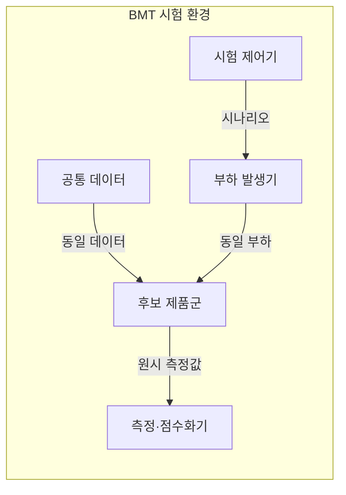
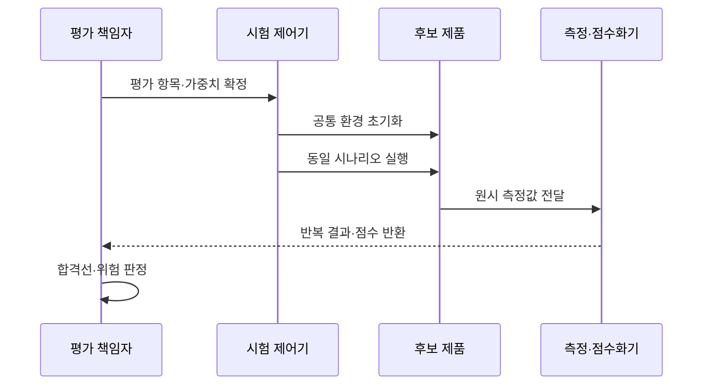

---
sidebar:
  order: 10
  label: "010. BMT 벤치마크 테스트 방법론 (BMT Methodology)"
  badge:
    text: "기출 · 70%"
    variant: note
title: "BMT 벤치마크 테스트 방법론 (BMT Methodology)"
date: "2026-07-27T23:59:59+09:00"
tags:
  - "notes-evaluation"
weight: 10
extra:
  question_no: "010"
  source_status: "기출"
  source_history: "123회, 129회, 138회"
  priority: 70
  priority_note: "3회 기출, 벤치마크 설계·검증의 핵심축"
---

## 미리 알고가기

- **벤치마크 테스트(Benchmark Test, BMT)**: 영문 머리글자를 딴 표기로 “비엠티”로 읽으며, 동일 조건에서 도입 후보의 성능과 적합성을 비교
- **개념 증명(Proof of Concept, PoC)**: 영문 머리글자를 딴 표기로 “피오시”로 읽으며, 제한된 범위에서 기술의 구현 가능성을 검증
- **평가 시나리오**: 모든 후보에 동일하게 적용하는 업무 흐름과 부하 조건입니다.
- **평가 항목**: 기능·성능·운영성을 판정할 독립 기준입니다.
- **원시 데이터(Raw Data)**: 집계나 점수화 전의 측정 원본입니다.

## Ⅰ. 개요

- 정의/개념: 동일 조건의 도입 후보 비교 실증 시험
- **배경/필요성**: 공급자별 제안 수치와 시험 조건만으로 후보 간 공정한 비교 곤란

### 쉽게 이해하기 (학습용)
- 제품 설명서만 믿지 않고, 동일한 조건과 테스트 시나리오 하에서 후보 제품들의 실제 성능을 직접 비교하여 평가하는 검증 기법입니다.

## Ⅱ. 특징

- 데이터·부하·측정 기준을 후보마다 통일한다
- 항목·가중치·합격선을 시험 전에 고정한다
- 반복 순서·환경·운영 조건 차이를 결과 해석에 반영한다

### 쉽게 이해하기 (학습용)
- 후보 업체마다 측정 조건을 다르게 적용하거나 사후에 가중치를 임의로 바꾸는 부정행위를 차단하기 위해 평가 기준을 먼저 공표합니다.

## Ⅲ. 아키텍처 및 구성요소

| 설계 요소 | 설명 |
|:---|:---|
| 시험 제어기 | 평가 항목·순서·반복 횟수를 통제함 |
| 부하 발생기 | 공통 시나리오의 요청을 생성함 |
| 공통 데이터 | 후보별 동일한 입력 상태를 제공함 |
| 후보 제품군 | 같은 환경에서 업무를 처리함 |
| 측정·점수화기 | 원시값을 수집해 사전 기준으로 채점함 |

### 쉽게 이해하기 (학습용)
- 동일한 성능을 발휘하는 공통의 테스트 망에서 객관적인 시나리오를 바탕으로 여러 후보를 점검하여 최종 점수를 냅니다.

## Ⅳ. 원리 및 절차 흐름도

| 절차 | 설명 |
|:---|:---|
| 평가 항목·가중치 확정 | 시험 전 판정 규칙을 고정함 |
| 공통 환경 초기화 | 데이터·사양·버전을 동일하게 맞춤 |
| 동일 시나리오 실행 | 후보마다 같은 부하를 반복함 |
| 원시 측정값 전달 | 가공 전 결과를 증적으로 보존함 |
| 반복 결과·점수 반환 | 반복 편차와 가중 점수를 제시함 |
| 합격선·위험 판정 | 기준 충족과 운영 차이를 결정함 |

### 쉽게 이해하기 (학습용)
- 요구사항 수집에서 시작해 사전 평가표를 만들고, 환경 동일성을 확보한 상태에서 공통 부하를 가해 후보들의 결과를 분석합니다.

## Ⅴ. 도입 검증 방식 비교

| 구분 | BMT | PoC |
|:---|:---|:---|
| 적용 기준 | 다수 후보의 공정한 성능 대조 시 | 새로운 기술의 작동 여부 선행 확인 시 |
| 핵심 특징 | 여러 후보의 상대 비교 | 한 기술의 구현 가능성 확인 |
| 한계 | 환경·가중치 편향 | 제한 범위의 일반화 오류 |

> 요약: 후보 비교는 BMT, 구현 확인은 PoC

### 쉽게 이해하기 (학습용)
- 경쟁 구도에 있는 여러 대안의 성능 우위를 비교하는 기법과, 새로운 기술이 우리 시스템에 쓰일 수 있는지 먼저 확인하는 기법의 차이를 비교합니다.

## Ⅵ. 실무 사례

1. 서버 도입은 동일 업무 부하로 후보 성능 비교
2. 데이터베이스 도입은 거래별 지연·비용 채점

### 쉽게 이해하기 (학습용)
- 벤치마크 테스트 결과에 대한 공정성 시비를 방지하기 위해 가중치가 어떻게 적용되었는지 모든 원시 데이터를 기록합니다.
- 가상 컴퓨팅 환경의 지리적 위치와 네트워크 구간별 단축 지연 시간, 그리고 실제 비용 효율성을 통합 평가합니다.

## Ⅶ. 결론

- 동일 환경·사전 가중치로 도입 후보 결정

### 쉽게 이해하기 (학습용)
- 같은 시험장과 채점표를 사용해야 후보의 차이를 공정하게 판단할 수 있습니다.
