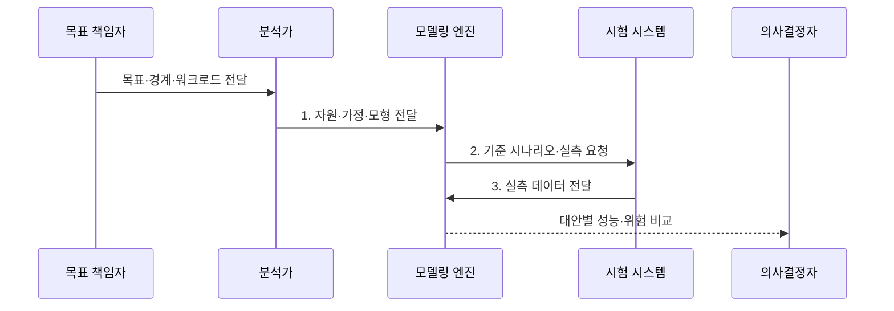

---
sidebar:
  order: 11
  label: "011. 성능 모델링 (Performance Modeling)"
  badge:
    text: "미출 · 30%"
    variant: note
title: "성능 모델링 (Performance Modeling)"
date: "2026-07-31T11:30:58+09:00"
tags:
  - "notes-evaluation"
weight: 11
extra:
  question_no: "011"
  source_status: "미출"
  source_history: ""
  priority: 30
  priority_note: "분석·시뮬레이션으로 성능 대안을 사전 비교"
---

## 미리 알고가기

- **도착률($\lambda$, 람다)**: 단위 시간에 시스템으로 유입되는 평균 요청 수입니다.
- **서비스율($\mu$, 뮤)**: 자원 하나가 단위 시간에 처리할 수 있는 평균 작업 수입니다.
- **가정 변화 분석(What-if Analysis)**: 자원·부하 값을 바꿔 예측 결과를 비교합니다.
- **보정(Calibration)**: 예측값과 실측값의 차이가 줄도록 모델 변수를 조정합니다.
- **워크로드(Workload)**: 시스템에 유입되는 요청의 양·종류·시간 분포입니다.
- **시뮬레이션(Simulation)**: 시간에 따른 사건과 상태 변화를 모사하는 방법입니다.
- **ISO/IEC 25010:2023**: 제품 품질의 성능 효율성을 시간 동작·자원 이용·용량 관점으로 분류한 국제표준이다.
- **ISO/IEC 25023:2016**: 성능 효율성 등 제품 품질 특성의 정량 측정 방법을 제시한 국제표준이다.

## Ⅰ. 개요

- 정의/개념: 구조·부하·자원 모형으로 **처리량·지연·포화**를 예측해 용량 대안을 비교하는 기법
- 배경/필요성: 실측 전에는 부하 증가에 따른 **병목과 투자별 개선 효과**를 판정하기 곤란

### 쉽게 이해하기 (학습용)
- 시스템을 실제로 만들기 전에 수학적 공식이나 컴퓨터 가상 시험을 통해 미래의 트래픽을 가했을 때 서버가 겪을 지연 시간을 미리 예측해 보는 활동입니다.

## Ⅱ. 특징

- **워크로드·자원·가정**의 명시적 추상화
- 분석식·**시뮬레이션·What-if**를 통한 대안 반복 비교
- 실측 **보정·민감도 분석**을 통한 오차 관리

### 쉽게 이해하기 (학습용)
- 실제 고가의 장비를 구매하기 전에 가상으로 인프라 사양을 늘려보며 어떤 부분에 투자해야 가성비가 가장 높을지 검증할 수 있습니다.

## Ⅲ. 구조 및 구성요소

| 구성요소 | 책임 |
|:---|:---|
| 워크로드·도착 모델 | **도착률·업무 비율·시간 분포** |
| 자원·서비스 모델 | **서비스율·서버 수·대역폭** |
| 가정·경계·제약 | 독립성·분포·**예측 범위** |
| 분석·시뮬레이션 엔진 | **지연·처리량·포화** 계산 |
| 실측 보정·민감도 | 오차·주요 변수·**신뢰구간** |

### 쉽게 이해하기 (학습용)
- 업무량·자원·현실을 단순화한 가정을 명시해야 예측값이 적용되는 범위와 한계를 설명할 수 있습니다.

## Ⅳ. 흐름도

1. **자원·가정·모형 전달**: 분석식·**시뮬레이션 모형** 제공
2. **기준 시나리오·실측 요청**: 예측 보정용 **기준값** 수집 요청
3. **실측 데이터 전달**: 보정과 민감도 분석용 **측정값** 제공

### 쉽게 이해하기 (학습용)
- 분석 목표를 세우고 모형을 작성한 다음, 소규모 실측 데이터로 계산 식의 오차를 바로잡아 신뢰성을 높이고 대안들을 비교 분석합니다.

## Ⅴ. 종류 및 비교

| 성능 모델 | 분석 모델 | 시뮬레이션 모델 |
|:---|:---|:---|
| 적용 기준 | 개념 설계와 **초기 용량 산정** | 복잡한 아키텍처의 **병목 검증** |
| 핵심 특징 | 수식 기반 **평균 상태 계산** | 사건별 **상태 변화 모사** |
| 한계 | 복잡한 **의존성 누락** | 구축 시간·**모형 오류** |

> 요약: 초기 산정은 **분석 모델**, 복잡한 검증은 **시뮬레이션 모델**

### 쉽게 이해하기 (학습용)
- 간단한 엑셀 수식으로 빠르게 한계를 계산하는 방법과, 트래픽의 시간 흐름을 시뮬레이터로 정밀하게 재현하여 문제점을 찾는 방법을 비교합니다.

## Ⅵ. 실무 고려사항 및 대책

| 고려사항 | 대책 | 효과 |
|:---|:---|:---|
| **성능 품질 관점 누락** | **ISO/IEC 25010:2023** 적용 | 시간·자원·**용량 정렬** |
| **측정식·단위 불일치** | **ISO/IEC 25023:2016** 적용 | 보정 데이터의 **일관성 확보** |
| **모델 과신·외삽 오류** | **실측 보정·민감도 분석** | 예측 범위·**위험 제시** |

### 쉽게 이해하기 (학습용)
- 시뮬레이션 모델에 가상 데이터를 무작정 넣지 않고, 개발계에서 직접 수집한 트래픽 패턴 지표를 입력해 결과의 정확도를 높입니다.

## Ⅶ. 결론

- 목표 충족 대안 중 **보정 오차**가 작고 부하 변화에 **민감도가 낮은 자원안** 선택

### 쉽게 이해하기 (학습용)
- 예측 오차가 줄어든 모델링 데이터를 기초 자료로 삼아 고비용 하드웨어의 도입 여부와 사양을 조율합니다.
