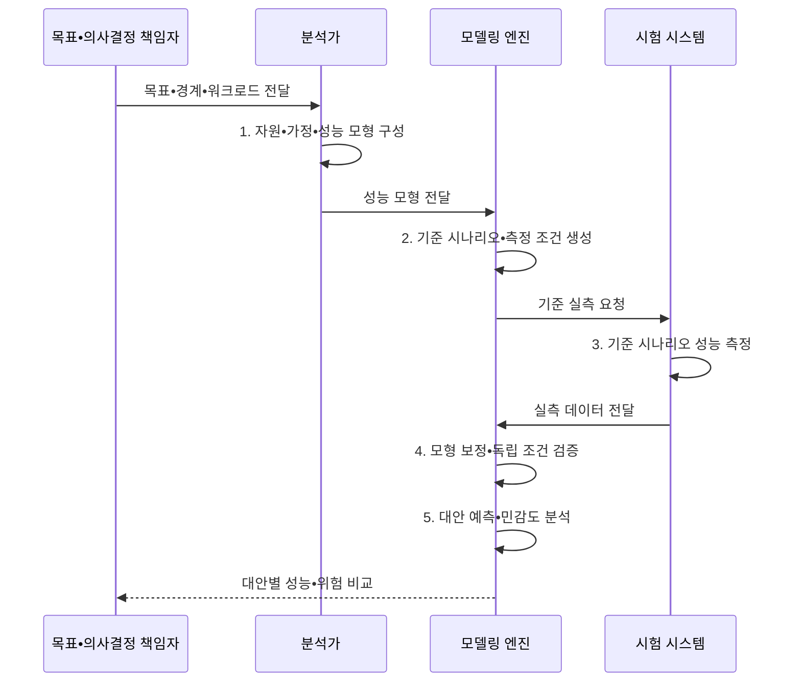

---
sidebar:
  order: 11
  label: "011. 성능 모델링 (Performance Modeling)"
  badge:
    text: "미출 • 30%"
    variant: note
title: "성능 모델링 (Performance Modeling)"
date: "2026-08-04T14:40:08+09:00"
tags:
  - "notes-evaluation"
weight: 11
extra:
  question_no: "011"
  source_status: "미출"
  source_history: ""
  priority: 30
  priority_note: "분석•시뮬레이션으로 성능 대안을 사전 비교"
---

## Ⅰ. 개요

핵심 용어

- **성능 모델링**: 시스템 구조•부하•자원을 추상화하여 처리량•지연•포화와 용량 대안을 예측하는 기법이다.
- **워크로드**: 시스템에 유입되는 요청의 양•종류•시간 분포이다.
- **용량 대안 비교**: 구조•부하•자원 모형의 값을 바꾸며 목표 성능을 만족하는 투자안을 사전에 비교하는 분석이다.

- 정의/개념: 구조•부하•자원 모형으로 **처리량•지연•포화** 를 예측해 용량 대안을 비교하는 기법
- 배경/필요성: 실측 전에는 부하 증가에 따른 **병목과 투자별 개선 효과** 를 판정하기 곤란

#### 한줄 요약
- 시스템을 실제로 만들기 전에 수학적 공식이나 컴퓨터 가상 시험을 통해 미래의 트래픽을 가했을 때 서버가 겪을 지연 시간을 미리 예측해 보는 활동입니다.

## Ⅱ. 특징

핵심 용어

- **가정**: 모델이 계산을 단순화하기 위해 고정한 도착분포•서비스분포•독립성 등의 조건이다.
- **가정 변화 분석**: 자원•부하•구조 값을 바꾸어 예측 결과가 어떻게 달라지는지 비교하는 분석이다.
- **민감도 분석**: 입력값 변화가 결과에 미치는 영향을 비교해 예측을 지배하는 변수와 위험 범위를 찾는 분석이다.

- **워크로드•자원•가정** 의 명시적 추상화
- 분석식•**시뮬레이션•What-if** 를 통한 대안 반복 비교
- 실측 **보정•민감도 분석** 을 통한 오차 관리

#### 한줄 요약
- 실제 고가의 장비를 구매하기 전에 가상으로 인프라 사양을 늘려보며 어떤 부분에 투자해야 가성비가 가장 높을지 검증할 수 있습니다.

## Ⅲ. 구조 및 구성요소

핵심 용어

- **도착률($\lambda$)**: 단위 시간에 시스템으로 유입되는 평균 요청 수이다.
- **서비스율($\mu$)**: 자원 하나가 단위 시간에 처리할 수 있는 평균 작업 수이다.
- **CPU(Central Processing Unit)**: 명령을 해석•실행하는 중앙처리장치이다.
- **I/O(Input/Output)**: 시스템과 외부 사이의 입출력이다.
- **용량 제약**: CPU•메모리•I/O 등 처리 자원의 상한이다.
- **예측 범위**: 명시한 구조•부하•가정이 유효해 모델 결과를 적용할 수 있는 조건과 경계이다.

| 구성요소 | 책임 |
|:---|:---|
| 워크로드•도착 모델 | **도착률•업무 비율•시간 분포** |
| 자원•서비스 모델 | **서비스율•서버 수•대역폭** |
| 가정•경계•제약 | 독립성•분포•**예측 범위** |
| 분석•시뮬레이션 엔진 | **지연•처리량•포화** 계산 |
| 실측 보정•민감도 | 오차•주요 변수•**신뢰구간** |

#### 한줄 요약
- 업무량•자원•현실을 단순화한 가정을 명시해야 예측값이 적용되는 범위와 한계를 설명할 수 있습니다.

## Ⅳ. 흐름도

핵심 용어

- **보정**: 모델 예측과 기준 실측의 차이가 줄어들도록 변수와 분포를 조정하는 과정이다.
- **검증**: 보정에 쓰지 않은 실측 조건에서도 모델이 허용 오차 안의 결과를 내는지 확인하는 과정이다.
- **기준 시나리오**: 모델 예측을 실측값과 보정•검증할 수 있도록 환경•부하•측정 기준을 고정한 시험 조건이다.

**동작 원리**

1. **자원•가정•성능 모형 구성**: 분석식•**시뮬레이션 모형** 작성
2. **기준 시나리오•측정 조건 생성**: 보정용 **기준값** 조건 고정
3. **기준 시나리오 성능 측정**: 보정•검증용 **측정값** 수집
4. **모형 보정•독립 조건 검증**: 예측 오차 조정과 일반화 확인
5. **대안 예측•민감도 분석**: 자원 대안별 성능•위험 비교

#### 한줄 요약
- 분석 목표를 세우고 모형을 작성한 다음, 소규모 실측 데이터로 계산 식의 오차를 바로잡아 신뢰성을 높이고 대안들을 비교 분석합니다.

## Ⅴ. 종류 및 비교

핵심 용어

- **분석적 모델**: 수식과 확률 관계로 시스템의 평균 상태와 성능을 계산하는 모델이다.
- **시뮬레이션**: 시간에 따른 도착•대기•서비스 같은 사건과 상태 변화를 모사하는 방법이다.
- **모델 선택**: 초기 용량을 빠르게 산정할 때는 분석 모델, 복잡한 의존성과 시간 변화를 검증할 때는 시뮬레이션 모델을 적용하는 구분이다.

| 성능 모델 | 분석 모델 | 시뮬레이션 모델 |
|:---|:---|:---|
| 적용 기준 | 개념 설계와 **초기 용량 산정** | 복잡한 아키텍처의 **병목 검증** |
| 핵심 특징 | 수식 기반 **평균 상태 계산** | 사건별 **상태 변화 모사** |
| 한계 | 복잡한 **의존성 누락** | 구축 시간•**모형 오류** |

> 요약: 초기 산정은 **분석 모델**, 복잡한 검증은 **시뮬레이션 모델**

#### 한줄 요약
- 간단한 엑셀 수식으로 빠르게 한계를 계산하는 방법과, 트래픽의 시간 흐름을 시뮬레이터로 정밀하게 재현하여 문제점을 찾는 방법을 비교합니다.

## Ⅵ. 실무 고려사항 및 대책

핵심 용어

- **모형 오류**: 실제 구조•의존성•분포를 잘못 추상화하여 예측이 체계적으로 빗나가는 문제이다.
- **민감도 분석**: 입력값을 일정 범위에서 바꾸며 결과에 가장 큰 영향을 주는 변수를 찾는 분석이다.
- **외삽 오류**: 보정•검증한 부하와 구조의 범위를 넘어 모델 결과를 적용해 예측이 크게 빗나가는 문제이다.
- **ISO(International Organization for Standardization)**: 국제표준화기구이다.
- **IEC(International Electrotechnical Commission)**: 국제전기기술위원회이다.

| 문제 | 대책 | 효과 |
|:---|:---|:---|
| **성능 품질 관점 누락** | **ISO/IEC 25010:2023** 적용 | 시간•자원•**용량 정렬** |
| **측정식•단위 불일치** | **ISO/IEC 25023:2016** 적용 | 보정 데이터의 **일관성 확보** |
| **모델 과신•외삽 오류** | **실측 보정•민감도 분석** | 예측 범위•**위험 제시** |

#### 한줄 요약
- 시뮬레이션 모델에 가상 데이터를 무작정 넣지 않고, 개발계에서 직접 수집한 트래픽 패턴 지표를 입력해 결과의 정확도를 높입니다.

## Ⅶ. 결론

핵심 용어

- **ISO/IEC 25010**: 성능 효율성을 시간•자원•용량으로 분류한 표준이다.
- **ISO/IEC 25023**: 제품 품질의 정량 측정 방법 표준이다.
- **자원안 선택**: 목표를 충족한 대안 중 보정 오차가 작고 부하 변화에 대한 민감도가 낮은 구성을 선택하는 결정이다.

- 목표 충족 대안 중 **보정 오차** 가 작고 부하 변화에 **민감도가 낮은 자원안** 선택

#### 한줄 요약
- 예측 오차가 줄어든 모델링 데이터를 기초 자료로 삼아 고비용 하드웨어의 도입 여부와 사양을 조율합니다.
