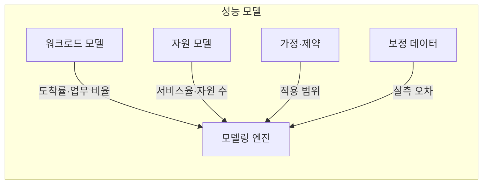
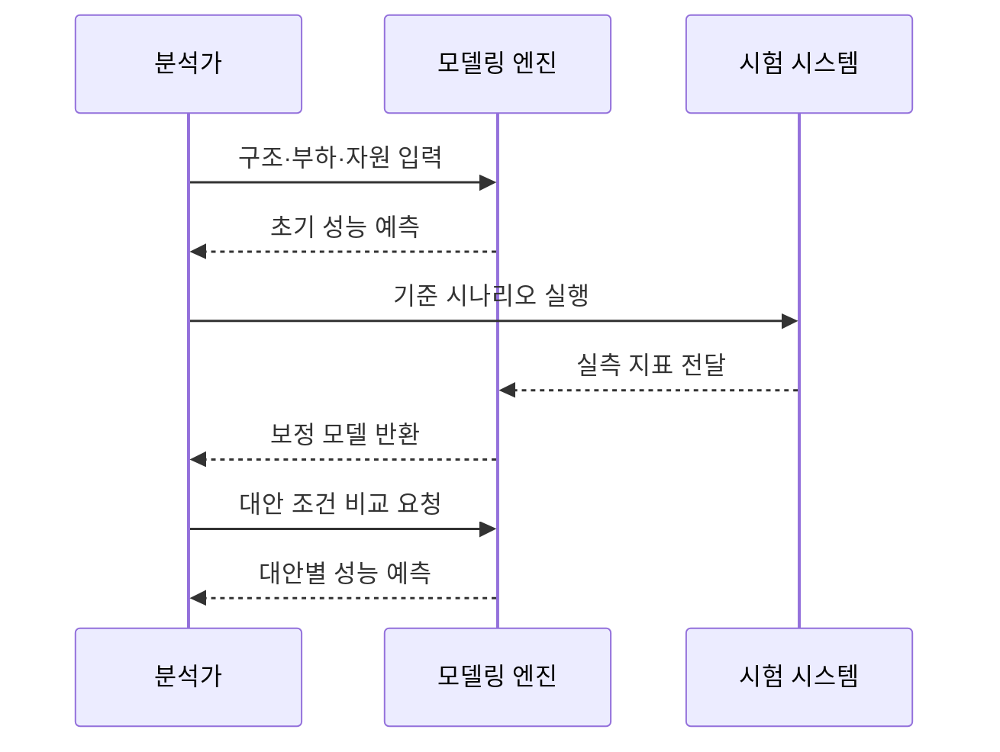

---
sidebar:
  order: 11
  label: "011. 성능 모델링 (Performance Modeling)"
  badge:
    text: "미출제 · 30%"
    variant: note
title: "성능 모델링 (Performance Modeling)"
date: "2026-07-25T01:10:00+09:00"
tags:
  - "notes-evaluation"
weight: 11
extra:
  question_no: "011"
  source_status: "미출제"
  source_history: ""
  priority: 30
  priority_note: "분석·시뮬레이션으로 성능 대안을 사전 비교"
---

## 미리 알고가기

- **도착률($\lambda$, 람다)**: 단위 시간에 시스템으로 유입되는 평균 요청 수입니다.
- **서비스율($\mu$, 뮤)**: 자원 하나가 단위 시간에 처리할 수 있는 평균 작업 수입니다.
- **가정 변화 분석(What-if Analysis)**: 자원·부하 값을 바꿔 예측 결과를 비교합니다.
- **보정(Calibration)**: 예측값과 실측값의 차이가 줄도록 모델 변수를 조정합니다.
- **워크로드(Workload)**: 시스템에 유입되는 요청의 양·종류·시간 분포입니다.
- **시뮬레이션(Simulation)**: 시간에 따른 사건과 상태 변화를 모사하는 방법입니다.
- **초당 트랜잭션 처리 건수(Transactions Per Second, TPS)**: 1초에 완료한 업무 거래 수입니다.
- **중앙처리장치(Central Processing Unit, CPU)**: 명령을 실행하는 연산 자원입니다.

## Ⅰ. 개요

- 정의/개념: 구조·부하·자원 모형으로 성능을 예측함
- **배경/필요성**: 구축 전에 용량·아키텍처 대안을 비교함

### 쉽게 이해하기 (학습용)
- 시스템을 실제로 만들기 전에 수학적 공식이나 컴퓨터 가상 시험을 통해 미래의 트래픽을 가했을 때 서버가 겪을 지연 시간을 미리 예측해 보는 활동입니다.

## Ⅱ. 특징

- 입력 부하와 단순화 가정이 예측 범위를 정한다
- 실측 전 결과는 상대 비교에만 적합하다
- 구조 대안을 실제 구축 없이 반복 평가한다

### 쉽게 이해하기 (학습용)
- 실제 고가의 장비를 구매하기 전에 가상으로 인프라 사양을 늘려보며 어떤 부분에 투자해야 가성비가 가장 높을지 검증할 수 있습니다.

## Ⅲ. 아키텍처 및 구성요소

| 설계 요소 | 설명 |
|:---|:---|
| 워크로드 모델 | 도착률·업무 비율·사용자 수 표현 |
| 자원 모델 | 서비스율·자원 수·대역폭 표현 |
| 가정·제약 | 단순화 조건과 예측 범위 명시 |
| 모델링 엔진 | 지연·처리량·자원 사용량 계산 |
| 보정 데이터 | 실측 오차로 모델 변수를 조정 |

### 쉽게 이해하기 (학습용)
- 업무량·자원·현실을 단순화한 가정을 명시해야 예측값이 적용되는 범위와 한계를 설명할 수 있습니다.

## Ⅳ. 원리 및 절차 흐름도

| 절차 | 설명 |
|:---|:---|
| 구조·부하·자원 입력 | 모델 경계와 변수를 설정함 |
| 초기 성능 예측 | 지연·처리량의 기준값을 계산함 |
| 기준 시나리오 실행 | 비교할 실측 데이터를 생성함 |
| 실측 지표 전달 | 예측 오차를 모델에 입력함 |
| 보정 모델 반환 | 오차가 줄도록 변수를 조정함 |
| 대안 조건 비교 요청 | 자원·부하·구조 값을 변경함 |
| 대안별 성능 예측 | 조건별 병목과 지연을 비교함 |

### 쉽게 이해하기 (학습용)
- 분석 목표를 세우고 모형을 작성한 다음, 소규모 실측 데이터로 계산 식의 오차를 바로잡아 신뢰성을 높이고 대안들을 비교 분석합니다.

## Ⅴ. 종류 및 비교

| 판단 기준 | 분석 모델 | 시뮬레이션 모델 |
|:---|:---|:---|
| 핵심 특징 | 수식으로 평균 상태 계산 | 사건별 상태 변화를 모사 |
| 적용 기준 | 개념 설계 및 초기 용량 산정 시 | 복잡한 아키텍처 병목 검증 시 |
| 주요 위험 | 복잡한 의존성 누락 | 구축 시간·모형 오류 |

> 요약: 초기 산정은 분석, 복잡한 검증은 시뮬레이션

### 쉽게 이해하기 (학습용)
- 간단한 엑셀 수식으로 빠르게 한계를 계산하는 방법과, 트래픽의 시간 흐름을 시뮬레이터로 정밀하게 재현하여 문제점을 찾는 방법을 비교합니다.

## Ⅵ. 실무 사례

1. 실측 프로파일링 데이터 기반으로 시뮬레이션 모델 오차 보정
2. 분산 트랜잭션 모델링 시 스레드 락 및 데이터 동기화 지연 반영

### 쉽게 이해하기 (학습용)
- 시뮬레이션 모델에 가상 데이터를 무작정 넣지 않고, 개발계에서 직접 수집한 트래픽 패턴 지표를 입력해 결과의 정확도를 높입니다.
- 다중 데이터베이스 환경에서 동기화 대기 시간과 네트워크 왕복 비용을 모델 변수에 반영하여 연산 결과를 구체화합니다.

## Ⅶ. 결론

- 실측 보정 오차로 아키텍처 대안 결정

### 쉽게 이해하기 (학습용)
- 예측 오차가 줄어든 모델링 데이터를 기초 자료로 삼아 고비용 하드웨어의 도입 여부와 사양을 조율합니다.
