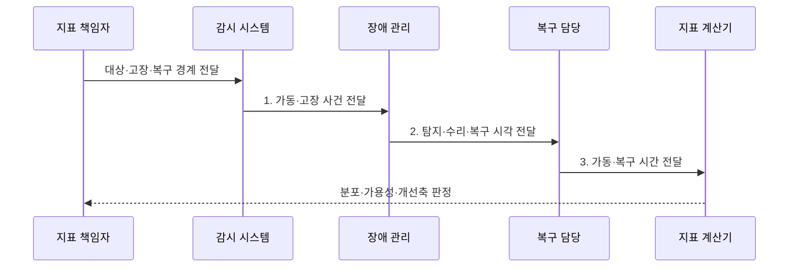

---
sidebar:
  order: 12
  label: "012. 시스템 신뢰성 지표 - MTBF·MTTR·MTTF (Reliability Metrics)"
  badge:
    text: "기출 · 50%"
    variant: note
title: "시스템 신뢰성 지표 - MTBF·MTTR·MTTF (Reliability Metrics)"
date: "2026-08-02T12:12:00+09:00"
tags:
  - "notes-evaluation"
weight: 12
extra:
  question_no: "012"
  source_status: "기출"
  source_history: "120회, 137회"
  priority: 50
  priority_note: "장애 간격·복구시간을 잇는 반복 기출 지표"
---

## Ⅰ. 개요

핵심 용어

- **평균 고장 간격(MTBF)**: 수리 가능한 시스템에서 한 장애 복구 후 다음 장애까지의 평균 가동시간이다.
- **평균 복구시간(MTTR)**: 장애 발생부터 정상 서비스 복구까지 걸린 평균 시간이다.
- **평균 고장시간(MTTF)**: 수리하지 않는 품목이 사용 시작 후 고장 날 때까지의 평균 시간이다.

- 정의/개념: 수리 시스템의 **MTBF·MTTR**과 비수리 품목의 **MTTF**를 측정하는 신뢰성 평균 지표
- 배경/필요성: 평균 고장 시간만으로는 **예방·복구·교체**의 개선 책임을 구분하기 곤란

### 쉽게 이해하기 (학습용)
- 시스템이 고장 없이 얼마나 오랫동안 돌아가는지, 고장이 났을 때 얼마나 빨리 복구되는지, 부품 수명은 언제 끝나는지 수치로 나타내는 방법입니다.

## Ⅱ. 특징

핵심 용어

- **수리 가능 시스템**: 고장 후 수리·복구하여 다시 운영할 수 있어 장애 사이 가동시간을 반복 측정하는 시스템이다.
- **비수리 품목**: 고장하면 교체하거나 폐기하므로 최초 고장까지의 수명을 측정하는 품목이다.

- **수리 가능 여부**에 따른 MTBF·MTTF 구분
- 장애·복구 경계에 따른 **MTTR 산정**
- 평균값 사용에 따른 **분포·꼬리값 은폐**

### 쉽게 이해하기 (학습용)
- 시스템 전체의 가용성을 높이기 위해서는 단순히 장비를 튼튼하게 만드는 것뿐만 아니라 고장 났을 때 신속하게 대처하는 복구 역량도 함께 확보해야 합니다.

## Ⅲ. 구조 및 구성요소

핵심 용어

- **장애 시작 시각**: 서비스가 정한 정상 기준을 벗어나 고장으로 판정된 시점이다.
- **복구 완료 시각**: 기능·성능·데이터 검증을 마치고 정상 서비스가 재개된 시점이다.
- **관측 기간**: 고장·가동·복구 시간을 집계하는 시작과 종료 범위이다.

| 구성요소 | 책임 |
|:---|:---|
| 대상·수리 가능성 | 시스템·부품의 **수리 여부** |
| 고장 사건·가동 구간 | 시작·종료와 **고장 정의** |
| 탐지·수리·복구 경계 | **MTTR 시작·종료 기준** |
| MTBF·MTTR·MTTF | 가동·복구·**수명 평균** |
| 가용성·분포·신뢰구간 | 평균 한계와 **꼬리값 보완** |

### 쉽게 이해하기 (학습용)
- 수리할 수 있는 대상의 가동 시간과 복구 시간을 연결한 흐름과, 한 번 고장 나면 폐기하는 소모품의 생애주기를 비교합니다.

## Ⅳ. 흐름도

핵심 용어

- **장애 간격**: 한 장애의 복구 완료부터 다음 장애 발생까지 이어진 정상 가동 구간이다.
- **복구 구간**: 장애 발생부터 탐지·진단·수리·검증을 거쳐 서비스가 정상화될 때까지의 구간이다.

1. **가동·고장 사건 전달**: 상태별 **시작·종료 기록** 제공
2. **탐지·수리·복구 시각 전달**: **MTTR 구간** 분해 자료 제공
3. **가동·복구 시간 전달**: 누적 시간과 **사건 수** 제공

### 쉽게 이해하기 (학습용)
- 하드웨어 대상을 구분하고 장애 로그에서 누락값을 제거한 후, 산식을 이용해 시스템의 실제 안정성을 검증합니다.

## Ⅴ. 종류 및 비교

핵심 용어

- **가용성**: 전체 관측시간 중 서비스를 정상 제공한 시간이 차지하는 비율이다.
- **신뢰성**: 정한 조건과 기간 동안 시스템이 고장 없이 요구 기능을 수행할 가능성이다.
- **유지보수성**: 고장 난 시스템을 정한 절차와 자원으로 복구하기 쉬운 정도이다.

| 신뢰성 지표 비교 | MTBF | MTTR | MTTF |
|:---|:---|:---|:---|
| 적용 기준 | 장애 예방과 **점검 주기 설정** | 복구 절차와 **SLA 준수 개선** | 소모성 장비의 **교체 시점 판단** |
| 핵심 특징 | 장애 사이 **평균 가동시간** | 장애 후 **평균 복구시간** | 고장 전 **평균 사용시간** |
| 한계 | 장애의 **정의 불일치** | 복구 종료의 **기준 불일치** | 수리 대상에 **오적용** |

> 요약: 가동은 **MTBF**, 복구는 **MTTR**, 수명은 MTTF

### 쉽게 이해하기 (학습용)
- 고쳐 쓸 수 있는 기계의 고장 간격, 수리에 걸리는 시간, 고쳐 쓸 수 없어 교체해야 하는 부품의 수명 차이를 비교합니다.

## Ⅵ. 실무 고려사항 및 대책

핵심 용어

- **장애 정의**: 어떤 기능·성능 저하를 고장으로 집계할지 정한 판정 기준이다.
- **복구 종료 기준**: 단순 프로세스 기동이 아니라 업무 처리·데이터 정합성까지 정상화되었는지 판단하는 기준이다.

| 문제 | 대책 | 효과 |
|:---|:---|:---|
| **용어·대상 혼용** | **IEC 60050-192:2015+AMD1:2016** 적용 | 수리성·신뢰성의 **정의 정렬** |
| **산식·시간 경계 불일치** | **IEC 61703:2016** 적용 | 지표의 **재현성 확보** |
| 평균에 따른 **꼬리 장애 은폐** | **분포·p95 복구시간** 병행 | 장기 장애의 **위험 식별** |

### 쉽게 이해하기 (학습용)
- 시스템 장애 복구에 대한 오차를 없애기 위해 모니터링 경보 시각과 백업 장비 가동 완료 시각을 엄격히 약속합니다.

## Ⅶ. 결론

핵심 용어

- **IEC 60050-192**: 신뢰성·가용성·유지보수성 등 신인성 용어를 정의한 국제전기기술용어 표준이다.
- **IEC 61703**: 신뢰성·가용성·유지보수성 지표의 수학적 표현을 제시한 국제표준이다.

- MTBF가 짧으면 **예방정비**, MTTR이 길면 **복구 개선**, MTTF 전 부품 교체

### 쉽게 이해하기 (학습용)
- 세 가지 신뢰성 핵심 수치를 바탕으로 장비의 사전 점검 일정과 전산실 유지보수 대행업체와의 계약 한도를 결정합니다.
